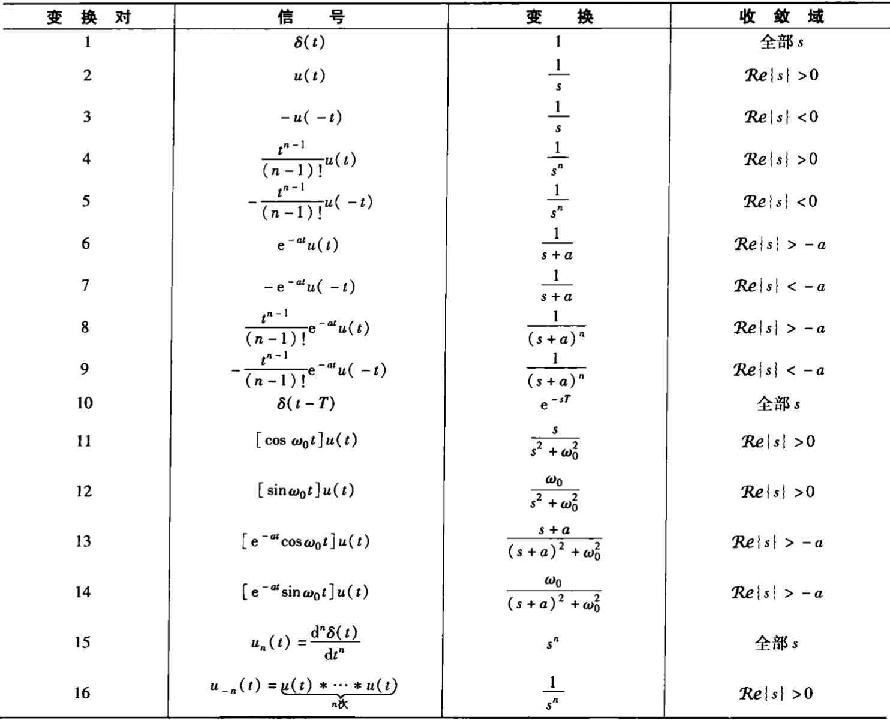
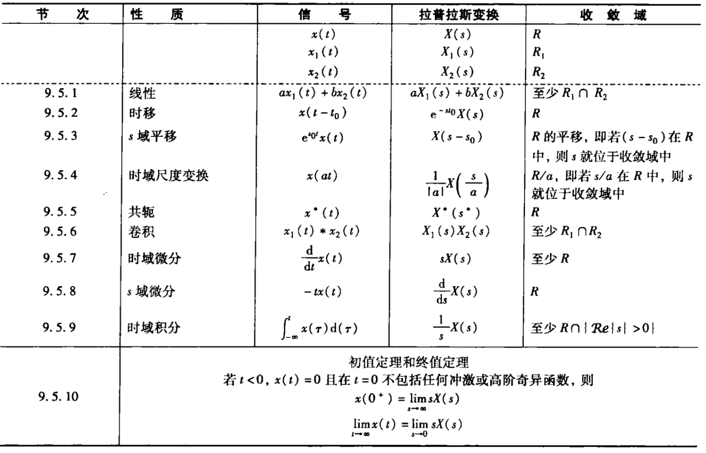
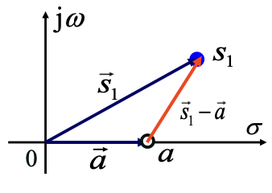
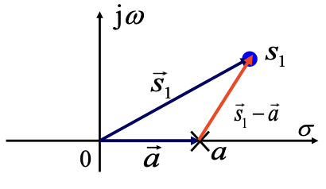

## 公式表

### 基本变换对

### 性质表

## 双边拉普拉斯变换

### 定义

$$
X(s)=\int_{-\infty}^{+\infty}x(t)e^{-st}dt
$$

称为 $x(t)$ 的拉普拉斯变换，后面简记为**LT**，其中 **$s=\sigma+j\omega$** 为复数。

若 $\sigma=0$ ，$s=j\omega$ 为纯虚数则为傅里叶变换，也就是说连续时间傅里叶变换是双边拉普拉斯变换在 $𝜎=0$ 或是在 $j\omega$ 轴上的**特例**，即 $X(s)|_{s=j\omega}=X(j\omega)$。

### LT 与 CTFT 的关系

$$
\begin{aligned}
X(s)&=\int_{-\infty}^{+\infty}x(t)e^{-\sigma t}e^{-j\omega t}dt\\
&=\int_{-\infty}^{+\infty}[x(t)e^{-\sigma t}]e^{-j\omega t}dt\\
&=\mathscr{F}\{x(t)e^{-\sigma t}\}
\end{aligned}
$$

所以 $x(t)$的 LT 就是 $x(t)e^{-\sigma t}$ 的 CTFT 。

:star: 当拉普拉斯变换的收敛域包含 $j\omega$ 时，拉普拉斯变换和傅里叶变换都存在，并且：

$$
X(j\omega)=X(s)|_{s=j\omega}
$$

### 零极点图

若 $X(s)$ 是有理函数：

$$
X(s)=\frac{N(s)}{D(s)}=M\frac{\prod_i(s-\beta_i)}{\prod_i(s-\alpha_i)}
$$

- **分子**多项式的根称为**零点**，画为圆圈 ⭕️
- **分母**多项式的根称为**极点**，画为交叉 ❌

将 $X(s)$ 的全部**零点**和**极点**表示在 $s$ 平面上，就构成了**零极点图**。

零极点图及其收敛域可以表示一个 $X(s)$ ，最多与真实的 $X(s)$ 相差一个常数因子 $𝑀$。

### ROC

:warning:不同的信号可能会有完全相同的拉普拉斯变换表达式，只是它们的**收敛域**不同。拉普拉斯变换的表达式只有连同相应的收敛域，才能和信号建立一一对应的关系。

!!! abstract
    常见的 $x(t)=e^{kt}u(at+b)$ 收敛域：

$$
X(s)=\int_{-\frac{b}{a}}^{+\infty}e^{(k-s)t}dt,\ \ \ a>0\\
X(s)=\int^{-\frac{b}{a}}_{-\infty}e^{(k-s)t}dt,\ \ \ a<0
$$

$t$ 积分到 $+\infty$ 时，$t$ 前的系数的实部需要小于零，该积分收敛域为 $\text{Re}\{k-s\}<0$；

$t$ 积分到 $-\infty$ 时，$t$ 前的系数的实部需要大于零，该积分收敛域为 $\text{Re}\{k-s\}>0$；

并非 $s$ 平面上的任何复数都能使拉普拉斯变换 $X(s)$ 收敛，也不是任何信号的拉普拉斯变换 $X(s)$ 都存在。

使拉普拉斯变换 $X(s)$ 收敛的复数 $s$ 的集合，称为拉普拉斯变换 (LT) 的**收敛域**（**ROC**，Region of Convergence）

若 $x(t)$ 可以写为若干部分的线性组合，各个部分分别进行 LT 有各自的收敛域，则 $X(s)$ 的收敛域是各个收敛域的**交集**。

- ROC 总是以平行于 $j\omega$ 轴的直线作为边界的
- ROC 的边界总是与 $X(s)$ 的分母的根 (极点) 相对应
- （因为）有理拉普拉斯变换在其 ROC 内无任何极点
- 绝对可积的时限信号其 ROC 是整个 $s$ 平面

按照 ROC 在 $s$ 平面上的分布可以分为：

- **右边信号**的 ROC 位于 $s$ 平面内一条平行于 $j\omega$ 轴的直线的右边
- **左边信号**的 ROC 位于 $s$ 平面内一条平行于 $j\omega$ 轴的直线的左边
- **双边信号**的 ROC 如果存在，一定是 $s$ 平面内平行于 $j\omega$ 轴的带形区域

## 拉普拉斯反变换

### 定义

利用 LT 和 CTFT 的关系、CTFT 的反变换可以得到 LT 的反变换。

（LT 和 CTFT 的关系：）

$$
\begin{aligned}
X(s)&=\int_{-\infty}^{+\infty}x(t)e^{-st}dt\\
X(\sigma+j\omega)&=\int_{-\infty}^{+\infty}x(t)e^{-\sigma t}e^{-j\omega t}dt\\
&=\mathscr{F}\{x(t)e^{-\sigma t}\}
\end{aligned}
$$

进而由 CTFT 的反变换有：

$$
\begin{aligned}
x(t)e^{-\sigma t}&=\frac{1}{2\pi}\int_{-\infty}^{+\infty}X(\sigma+j\omega)e^{j\omega t}d\omega\\
x(t)&=\frac{1}{2\pi}\int_{-\infty}^{+\infty}X(\sigma+j\omega)e^{\sigma t}e^{j\omega t}d\omega\\
x(t)&=\frac{1}{2\pi}\int_{-\infty}^{+\infty}X(s)e^{st}d\omega
\end{aligned}
$$

对 $s=\sigma+j\omega$ 两侧同时微分得到：$ds=jd\omega$ ；同时，当 $\omega$ 从 $-\infty\to+\infty$ 时，$s$ 从 $\sigma-j\infty\to\sigma+j\infty$ ，所以可得到拉普拉斯**反变换为**：

$$
x(t)=\frac{1}{2\pi j}\int_{\sigma-j\infty}^{\sigma+j\infty}X(s)e^{st}ds
$$

### 部分分式展开法

1. 将 $X(s)$ 展开为部分分式
2. 根据 $X(s)$ 的 ROC ，确定每一项的 ROC
3. 利用常用信号变换对与拉普拉斯变换性质，对每一项进行反变换

## LT 的几何求值

### 单零点

$$
X(s)=s-a
$$

有唯一一个零点：$s=a$。

称 $\vec{s_1}-\vec{a}$ 为**零点矢量**：

- 长度 $|\vec{s_1}-\vec{a}|$ 表示 $|X(s_1)|$；
- 幅角 $\angle\vec{s_1}-\vec{a}$ 表示 $\angle X(s_1)$；

### 单极点

$$
X(s)=\frac{1}{s-a}
$$

有唯一一个极点：$s=a$。

称 $\vec{s_1}-\vec{a}$ 为**极点矢量**：

- 长度 $|\vec{s_1}-\vec{a}|$ 表示 $\frac{1}{|X(s_1)|}$；
- 幅角 $\angle\vec{s_1}-\vec{a}$ 表示 $-\angle X(s_1)$；

### 一般情况

对有理函数形式的 $X(s)$：

$$
X(s)=\frac{N(s)}{D(s)}=M\frac{\prod_i(s-\beta_i)}{\prod_i(s-\alpha_i)}
$$

可得：

$$
\begin{aligned}
|X(s)|&=|M|\frac{\prod_i|\vec{s}-\vec{\beta_i}|}{\prod_i|\vec{s}-\vec{\alpha_i}|}\\
\angle X(s)&=\sum_i\angle(\vec{s}-\vec{\beta_i})-\sum_i\angle(\vec{s}-\vec{\alpha_i})
\end{aligned}
$$

从所有零点向 $s$ 点作零点矢量，从所有极点向 $s$ 点作极点矢量：

- 所有零点矢量的长度之积 (不存在则为 1 ) 除以所有极点矢量的长度之积即为 $|X(s)|$；
- 所有零点矢量的幅角之和 (不存在则为 0 ) 减去所有极点矢量的幅角之和即为 $\angle X(s)$；

当 $s$ 取为 $j\omega$ 轴上的点时，即为傅里叶变换的几何求值。考查 $s$ 在 $j\omega$ 轴上移动时所有零、极点矢量的长度和幅角的变化，即可得出 $X(j\omega)$ 的幅频特性和相频特性

### 全通系统

全通系统被广泛用于对系统进行相位均衡，它满足：

- 零点和极点分布关于 $j\omega$ 轴对称、成对分布；
- $|H(j\omega)|$ 在任何时候都等于 $1$；

一般还称具有 $n$ 对零点和极点的全通系统为 $n$ 阶全通系统。

## LT 性质

LT 具有很多与 FT 相似的重要性质，主要不同是这里需要考虑 ROC

### 线性

$$
x_1(t)\stackrel{LT}{\longleftrightarrow}X_1(s),\ \ \text{ROC}:R_1\\
x_2(t)\stackrel{LT}{\longleftrightarrow}X_2(s),\ \ \text{ROC}:R_2
\Rightarrow
ax_1(t)+bx_2(t)\stackrel{LT}{\longleftrightarrow}aX_1(s)+bX_2(s)
$$

后者的 ROC **至少**是 $R_1\cap R_2$ ，否则若 $R_1\cap R_2=\varnothing$ ，则 $ax_1(t)+bx_2(t)$ 的 LT 不存在。

ROC 也有可能扩大：$X_1(s)$ 与 $X_2(s)$ 线性组合时，若发生了零极点相抵消的现象，且当被抵消的极点恰好在 ROC 的边界上时，就会使 ROC 扩大。

### 时移特性

$$
x(t)\stackrel{LT}{\longleftrightarrow}X(s),\ \ \text{ROC}:R
\Rightarrow
x(t-t_0)\stackrel{LT}{\longleftrightarrow}X(s)e^{-st_0},\ \ \text{ROC}:R
$$

### s 域平移

$$
x(t)\stackrel{LT}{\longleftrightarrow}X(t),\ \ \text{ROC}:R
\Rightarrow
x(t)e^{s_o t}\stackrel{LT}{\longleftrightarrow}X(s-s_0),\ \ \text{ROC}:R+\text{Re}[s_0]
$$

:warning:这里 $R+\text{Re}[s_0]$ 的意思是将 $R$ 平移了一个 $\text{Re}[s_0]$:warning:，与时域平移不同，$s$ 域平移的时候收敛域 ROC 也发生了平移。

- 加法 ➕ 是 ROC 向右平移
- 剑法 ➖ 是 ROC 向左平移

### 时域尺度变换

若信号在时域尺度变换，其 LT 的 ROC 在 $s$ 平面上作相反的尺度变换。

$$
x(t)\stackrel{LT}{\longleftrightarrow}X(s),\ \ \text{ROC}:R
\Rightarrow
x(at)\stackrel{LT}{\longleftrightarrow}\frac{1}{|a|}X(\frac{s}{a}),\ \ \text{ROC}:aR
$$

ROC 的推导比较简单：$s\in R$ 时 $X(s)$ 收敛，所以 $s/a\in R$ 时 $X(\frac{s}{a})$ 收敛。

:warning:这里 $aR$ 的意思是将 $R$ 线性伸缩了 $a$ 倍:warning:

### 共轭对称性

$$
x(t)\stackrel{LT}{\longleftrightarrow}X(s),\ \ \text{ROC}:R
\Rightarrow
x^*(t)\stackrel{LT}{\longleftrightarrow}X^*(s^*),\ \ \text{ROC}:R
$$

!!! abstract
    这里可以结合 $|X(s)|=|X(s^*)|$ 理解，模相同意味着二者总是零点极点相同......

特别地，当 $x(t)$ 为**实信号**时，有：

$$
x^*(t)=x(t)\stackrel{LT}{\longleftrightarrow}
X^*(s^*)=X(s)=X^*(s)=X(s^*)
$$

> 这里 $X^*(s^*)=X(s)$ 等价于 $X^*(s)=X(s^*)$。

因此，如果 $x(t)$ 是实信号，且 $X(s)$ 在 $s_0$ 有极点(或零点)，则 $X(s)$ 一定在 $s_0^*$ 也有极点(或零点)。即实信号的拉普拉斯变换其**零、极点必共轭成对出现**。

### 卷积性质

$$
x_1(t)\stackrel{LT}{\longleftrightarrow}X_1(s),\ \ \text{ROC}:R_1\\
x_2(t)\stackrel{LT}{\longleftrightarrow}X_2(s),\ \ \text{ROC}:R_2
\Rightarrow
x_1(t)*x_2(t)\stackrel{LT}{\longleftrightarrow}X_1(s)X_2(s)
$$

类似线性性质中，后者的 ROC **包括** $R_1\cap R_2$ ，否则若 $R_1\cap R_2=\varnothing$ ，则 $x_1(t)*x_2(t)$ 的 LT 不存在。

ROC 也有可能扩大：$X_1(s)$ 与 $X_2(s)$ 相乘时，若发生了零极点相抵消的现象，且当被抵消的极点恰好在 ROC 的边界上时，就会使 ROC 扩大。

### 时域微分

$$
x(t)\stackrel{LT}{\longleftrightarrow}X(s),\ \ \text{ROC}:R
\Rightarrow
\frac{d}{dt}x(t)\stackrel{LT}{\longleftrightarrow}sX(s)
$$

后者的 ROC **包括** $R_1\cap R_2$ ，有可能扩大。

证明可由 LT 逆变换两侧同时对 $t$ 微分得到。

### s 域微分

$$
x(t)\stackrel{LT}{\longleftrightarrow}X(s),\ \ \text{ROC}:R
\Rightarrow
-tx(t)\stackrel{LT}{\longleftrightarrow}\frac{d}{ds}X(s),\ \ \text{ROC}:R\\
$$

### 时域积分

$$
x(t)\stackrel{LT}{\longleftrightarrow}X(s),\ \ \text{ROC}:R
\Rightarrow
\int_{-\infty}^{t}x(\tau)d\tau\stackrel{LT}{\longleftrightarrow}\frac{1}{s}X(s)
$$

后者的 ROC **包括** $R\cap\{s|\text{Re}[s]>0\}$ ，也就是包括 $R$ 在 $s$ 的 $j\omega$ 轴右侧的部分 ($s$ 平面的右半部分)。这是因为：

$$
\int_{-\infty}^{t}x(\tau)d\tau=x(t)*u(t)
$$

### 初值与终值定理

#### 初值定理

如果 $x(t)$ 是因果信号，且在 $t=0$ 不包含奇异函数，则有**初值定理**：

$$
x(0^+)=\lim_{s\to\infty}sX(s)
$$

---

证明

$t<0$ 时 $x(t)=0$ 且 $x=0$ 时不为奇异函数，则有： $x(t)=x(t)u(t)$

$$
\begin{aligned}
x(t)&=[x(0^+)+x'(0^+)t+x''(0^+)\frac{t^2}{2}+\cdots+x^{(n)}(0^+)\frac{t^n}{n!}]u(t)
\end{aligned}
$$

作 LT 可得：

$$
\begin{aligned}
X(s)&=[\frac{1}{s}x(0^+)+\frac{1}{s^2}x'(0^+)+\frac{1}{s^3}x''(0^+)+\cdots+\frac{1}{s^{n+1}}x^{(n)}(0^+)]u(t)\\
&=\sum_{n=0}^{+\infty}\frac{1}{s^{n+1}}\cdot x^{(n)}(0^+)
\end{aligned}
$$

那么：

$$
\begin{aligned}
sX(s)&=s\sum_{n=0}^{+\infty}\frac{1}{s^{n+1}}\cdot x^{(n)}(0^+)\\
&=x(0^+)+\sum_{n=1}^{+\infty}\frac{1}{s^{n}}\cdot x^{(n)}(0^+)\\
\lim_{s\to\infty}sX(s)&=x(0^+)
\end{aligned}
$$

#### 终值定理

如果 $x(t)$ 是因果信号，且在 $t=0$ 不包含奇异函数，$X(s)$ 除了在 $s=0$ 可以有单阶极点外，其余极点均在 $s$ 平面的左半边 ($\text{Re}[s]<0$​)

!!! abstract
    上述条件的目的在于保证**终值存在**。

则有**终值定理**：

$$
\lim_{t\to\infty}x(t)=\lim_{s\to0}sX(s)
$$

---

证明

$x(t)$ 是因果信号，且在 $t=0$ 不包含奇异函数，则有：

$$
\begin{aligned}
\int_{0^+}^{\infty}e^{-st}\frac{d}{dt}x(t)dt
&=x(t)e^{-st}\big|_{0^+}^{\infty}+s\int_{0^+}^{\infty}e^{-st}x(t)dt\\
&=x(t)e^{-st}\big|_{0^+}^{\infty}+sX(s)
\end{aligned}
$$

$X(s)$ 除了在 $s=0$ 可以有单阶极点外，其余极点均在 $s$ 平面的左半边 ($\text{Re}[s]<0$) ，所以 $sX(s)$ 的 ROC 中必包含正实数轴。

$$
x(t)e^{-st}\big|_{0^+}^{\infty}=-x(0^+)
$$

于是：

$$
\begin{aligned}
\int_{0^+}^{\infty}e^{-st}\frac{d}{dt}x(t)dt
&=-x(0^+)+sX(s)
\end{aligned}
$$

两侧同时令 $s\to0^+$ ，可得：

$$
\begin{aligned}
\lim_{s\to0^+}\int_{0^+}^{\infty}e^{-st}\frac{d}{dt}x(t)dt
&=-x(0^+)+\lim_{s\to0^+}sX(s)\\
\int_{0^+}^{\infty}\frac{d}{dt}x(t)dt
&=-x(0^+)+\lim_{s\to0^+}sX(s)\\
\int_{0^+}^{\infty}dx(t)
&=-x(0^+)+\lim_{s\to0^+}sX(s)\\
\lim_{t\to\infty}x(t)-x(0^+)
&=-x(0^+)+\lim_{s\to0^+}sX(s)\\
\lim_{t\to\infty}x(t)
&=\lim_{s\to0^+}sX(s)\\
\end{aligned}
$$

## LT 分析 LTI 系统

以卷积特性为基础，可建立 LTI 系统的拉普拉斯变换分析方法，即：

$$
Y(s)=X(s)\cdot H(s)
$$

其中 $H(s)$ 是 $h(t)$ 的拉普拉斯变换，称为**系统函数**或**转移函数**、**传递函数**。

!!! abstract
    这些方法成立的本质原因在于复指数函数 $e^{st}$ 是一切 LTI 系统的特征函数。

### 特征函数

$x(t)=e^{s_0t}$ 时，响应为：

$$
y(t)=H(s_0)e^{s_0t}
$$

### 因果性

- 如果 $t<0$ 时 $h(t)=0$，则系统是因果的；
- 如果 $t>0$ 时 $h(t)=0$，则系统是反因果的；

因果系统的 $h(t)$ 是右边信号，其 $H(s)$ 的 ROC 必是最右边极点的右边；当 $H(s)$ 是有理函数时，逆命题成立。

- :warning:但是当 $H(s)$ 不是有理函数时， $H(s)$ 的 ROC 是最右边极点的右边不能推出 $h(t)$ 不是因果的

反因果系统的 $h(t)$ 是左边信号，$H(s)$ 的 ROC 必是最左边极点的左边；当 $H(s)$ 是有理函数时，逆命题成立。

### 稳定性

LTI 系统稳定的充要条件是其 $H(s)$ 收敛域包括 $j\omega$ 轴。

**因果稳定**系统的 $H(s)$ 收敛域为包括 $j\omega$ 轴的 $s$ 右半平面。

### 线性常微分方程

> \*线性常系数微分方程

如果由线性常系数微分方程描述的系统满足初始松弛条件，则系统是**因果 LTI** 的，其 $H(s)$ 的 ROC 必是最右边极点的右边。

对于由线性常系数微分方程描述的 LTI 系统：

$$
\sum_{k=0}^{N}a_k\frac{d^ky(t)}{dt^k}=\sum_{k=0}^{M}b_k\frac{d^kx(t)}{dt^k}
$$

两边进行拉普拉斯变换，可得：

$$
H(s)={Y(s)\over X(s)}={\sum_{k=0}^{M}b_{k}s^{k}\over\sum_{k=0}^{N}a_{k}s^{k}}
$$

可得到 $H(s)$ 是一个**有理函数**。系统的单位冲激响应 $h(t)$ 可由 $H(s)$ 反变换获得。

## 单边拉普拉斯变换

> Unilateral Laplace Transform

单边拉普拉斯变换是仅考虑 $0^-$ 之后部分信号的双边拉普拉斯变换：

$$
\chi(s)=\int_{0^-}^{+\infty}x(t)e^{-st}dt
$$

单边拉普拉斯变换的反变换与同 ROC 的双边拉普拉斯变换的反变换相同：

$$
x(t)=\frac{1}{2\pi j}\int_{\sigma-j\infty}^{\sigma+j\infty}\chi(s)e^{st}ds
$$

$X(s)$ 与 $\chi(s)$ 不同，是因为 $x(t)$ 在 $t<0$ 的部分对 $X(s)$ 有作用，而对 $\chi(s)$ 没有任何作用所致。

由于单边拉普拉斯变换不存在类似双边拉普拉斯变换中与 ROC 相关的多义性，一般不再强调其 ROC ，任何单边拉普拉斯变换的收敛域总是某一右半平面。

单边拉普拉斯变换的 ROC 位于最右边极点右边。

**因果信号**的双边拉普拉斯变换和单边拉普拉斯变换完全相同。:star:从而可以利用双边 LT 的基本变换对。

### 性质

由于单边拉普拉斯变换是特殊的双边拉普拉斯变换，因此其大部分性质与双边拉普拉斯变换相同，但也有一些区别：

#### 共轭对称性

$$
x(t)\stackrel{ULT}{\longleftrightarrow}\chi(s)
\Rightarrow
x^*(t)\stackrel{ULT}{\longleftrightarrow}\chi^*(s)
$$

#### 时域尺度变换

$x(at)$ 中的 $a$ 需要满足 $a\gt0$。

$$
x(t)\stackrel{ULT}{\longleftrightarrow}\chi(s)
\Rightarrow
x(at)\stackrel{ULT}{\longleftrightarrow}\frac{1}{a}\chi(\frac{s}{a})
$$

#### 时域微分

$$
x(t)\stackrel{ULT}{\longleftrightarrow}\chi(s)
\Rightarrow
\frac{d}{dt}x(t)\stackrel{ULT}{\longleftrightarrow}s\chi(s)-x(0^-)\\
\frac{d^2}{dt^2}x(t)\stackrel{ULT}{\longleftrightarrow}s^2\chi(s)-sx(0^-)-\frac{d}{dt}x(0^-)\\
\frac{d^3}{dt^3}x(t)\stackrel{ULT}{\longleftrightarrow}s^3\chi(s)-s^2x(0^-)-s\frac{d}{dt}x(0^-)-\frac{d^2}{dt^2}x(0^-)\\
......\\
x^{(n)}(t)\stackrel{ULT}{\longleftrightarrow}s^{n}\chi(s)-s^{n-1}x(0^-)-s^{n-2}x'(0^-)-s^{n-3}x''(0^-)-\cdots-x^{(n-1)}(0^-)
$$

### 线性常微分方程

单边拉普拉斯变换特别适合于求解具有非零初始条件的线性常系数微分方程（增量线性系统）。

往往假定系统为**因果**系统。该条件下得到的结果在进行单边拉普拉斯反变换的时候可以确定为**右边信号**。

以二阶为例（最高二阶微分），将初始条件带入后，整理得到如下形式：

$$
\begin{aligned}
A\gamma(s)&=By(0^-)+Cy'(0^-)+D\chi(s)\\
\gamma(s)&=\frac{B}{A}y(0^-)+\frac{C}{A}y'(0^-)+\frac{D}{A}\chi(s)
\end{aligned}
$$

其中 $\frac{D}{A}\chi(s)$ 为**零状态响应**；$\frac{B}{A}y(0^-)+\frac{C}{A}y'(0^-)$ 为**零输入响应**；

$$
\begin{aligned}
\gamma(s)=k_0\frac{1}{s}+k_1\frac{1}{s+1}+k_2\frac{1}{s+2}+\cdots
\end{aligned}
$$

其中 $k_0\frac{1}{s}$ 为**强迫响应**，$k_0$ 为常数，也就是对应的单边拉普拉斯反变换为 $k_0u(t)$ 形式的才是强迫响应；；$k_1\frac{1}{s+1}+k_2\frac{1}{s+2}+\cdots$ 为**自然响应**；
