!!! abstract
    there are still some bugs rendering katex here...

LTI 系统对输入信号所起的作用包括两个方面:

- 改变输入信号各频率分量的幅度
- 改变输入信号各频率分量的相对相位

$$
\begin{aligned}
Y(j\omega)&=X(j\omega)H(j\omega)\\
|Y(j\omega)|&=|X(j\omega)|\cdot|H(j\omega)|\\
\angle Y(j\omega)&=\angle X(j\omega)+\angle H(j\omega)
\end{aligned}
$$

线性与非线性相位

信号在传输过程中，相位特性或幅度特性发生改变都可能引起信号波形的改变，即发生**失真**。

当相位特性仅仅是产生一个线性相移时，只引起信号在时间上的平移。如连续时间 LTI 系统，信号的**时移**会导致其频谱产生一个线性**相移**：

$$
x(t)\stackrel{F}{\longleftrightarrow}X(j\omega)
\Rightarrow
x(t-t_0)\stackrel{F}{\longleftrightarrow}X(j\omega)e^{-j\omega t_0}
$$

此时信号波形不发生改变，只是发生时间上的延迟，因此未丢失信号所携带的任何信息。

如果系统的相位特性是**非线性**的，由于不同频率分量所产生的时移不同，叠加起来会变成一个与原来信号不相同的信号波形。

系统响应与输入信号满足：

$$
y(t)=kx(t-t_0)\ \ \ y[n]=kx[n-n_0]
$$

也就是：

$$

$$

则可视为在传输中未发生失真

$$
|H(j\omega)|=k,\ \ \angle H(j\omega)=-\omega t_0
$$

在传输信号的带宽范围内

理想滤波器

- 是**非因果**系统，因而是物理**不可实现**的
- $h(t)$ 存在震荡

## 采样

### 采样的概念

在某些离散的时间点上提取连续时间信号值的过程就是**采样**（sampling）

与之相对应的，从离散时间信号等间隔地提取信号，则叫做**抽取**（decimation）

一般情况下，从连续时间信号采样所得到的样本序列不能唯一地代表原来的连续时间信号，决定是否能从采样结果恢复原信号的关键在于**采样定理**

### 采样的数学模型

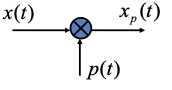

在时域：

$$
x_p(t)=x(t)\cdot p(t)
$$

在频域：

$$
X_p(j\omega)=\frac{1}{2\pi}X(j\omega)*P(j\omega)
$$

### 冲激串采样(理想采样)

以 $T$ 为采样间隔的脉冲采样信号为：

$$
p(t)=\sum_{n=-\infty}^{+\infty}\delta(t-nT)
$$

- $p(t)$ 是**采样函数**
- $p(t)$ 的基波周期 $T$ 为**采样周期**
- $p(t)$ 的基波频率 $\omega_s=\frac{2\pi}{T}$ 是**采样频率**

采样结果为：

$$
x_p(t)=x(t)\cdot p(t)=\sum_{n=-\infty}^{+\infty}x(nT)\delta(t-nT)
$$

这样的采样就是**理想采样**，也就是**冲激串采样**。

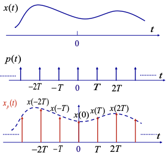

由 CTFT 在频域有：

$$
p(t)\stackrel{CTFT}{\longleftrightarrow}P(j\omega)=\frac{2\pi}{T}\sum_{n=-\infty}^{+\infty}\delta(\omega-\frac{2\pi}{T}k)
$$

从而可得到 $X_p(j\omega)$：

$$
\begin{aligned}
X_p(j\omega)
&=\frac{1}{2\pi}X(j\omega)*P(j\omega)\\
&=\frac{1}{2\pi}X(j\omega)*\frac{2\pi}{T}\sum_{n=-\infty}^{+\infty}\delta(\omega-\frac{2\pi}{T}k)\\
&=\frac{1}{T}\sum_{n=-\infty}^{+\infty}X(j(\omega-\frac{2\pi}{T}k))\\
&=\frac{1}{T}\sum_{n=-\infty}^{+\infty}X(j(\omega-k\omega_s))
\end{aligned}
$$

可见，在时域对连续时间信号进行理想采样，就相当于在频域将连续时间信号的频谱以 $\omega_s=\frac{2\pi}{T}$ 为周期进行延拓。

### 采样定理

要想使采样后的信号样本能完全代表原来的信号，就意味着要能够从 $X_𝑝(j\omega)$ 中**不失真地分离**出 $X(j\omega)$ 。这就要求 $X_𝑝(j\omega)$ 在周期性延拓时**不能发生频谱的混叠**，因此:

1. $x(t)$ 必须是**带限**的，设最高频率分量为 $\omega_M$；
2. 采样间隔（周期）不能是任意的，必须保持采样频率 $\omega_s=\frac{2\pi}{T}\gt 2\omega_M$；
3. 采样频率也不能过大，不能导致周期延拓后频谱发生混叠（补充）

采样频率的下限 $2\omega_M$ 也叫做奈奎斯特率（Nyquist rate）

在满足上述条件时，就可以通过理想低通滤波器从 $X_𝑝(j\omega)$ 中不失真地分离出 $X(j\omega)$ 。

#### 理想低通滤波器

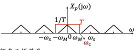

若要满足采样定理，低通滤波器截止频率 $\omega_c$ 必须满足：$\omega_M\lt\omega_c\lt\omega_s-\omega_M$。

为补偿采样导致的频谱幅度减小，滤波器在通带内应具有 $T$ 倍增益。

### Nyquist 采样定理

对带限于最高频率 $\omega_𝑀$ 的连续时间信号 $x(t)$ ，如果以 $\omega_s>2\omega_𝑀$ 的频率进行理想采样，则 $x(t)$ 可以唯一地由其样本 $x(nT)$ 来确定。

这里的 $T$ 也是采样周期，对应采样频率 $\omega_s$。

### 零阶保持采样

零阶保持采样相当于理想采样后，再级联一个零阶保持系统，是最简单的一种恢复重建采样前原信号的方法。

!!! abstract
    如果由零阶保持所给出的粗糙内插令人不够满意，则可以使用各种更为平滑的內插手段，其中的一些合起来统称为高阶保持 (higher order hold)

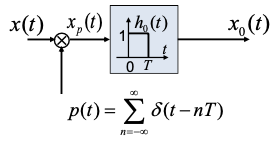

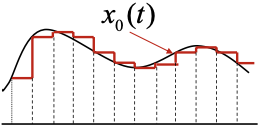

为了能从 $x_0(t)$ 恢复 $x(t)$ ，零阶保持后要再级（串，卷积）联一个系统 $H_𝑟(j\omega)$ ，使得：

$$
H_0(j\omega)H_r(j\omega)=H(j\omega)=
\begin{cases}
T,&|\omega|\lt\omega_c\\
0,&|\omega|\gt\omega_c
\end{cases}
$$

其中 $\omega_M\lt\omega_c\lt\omega_s-\omega_M$ ；图像如下：

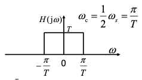

零阶保持系统的单位冲激响应 $h_0(t)$ 是矩形方波信号（经过了一定的时移），利用基本 CTFT 变换对和时移特性可得到：

$$
H_0(j\omega)=\frac{2}{\omega}\sin(\frac{\omega}{2}T)e^{-j\frac{\omega}{2}T}
$$

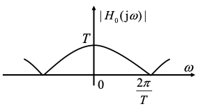

由 $H(j\omega)$ 和 $H_0(j\omega)$ 可得到 $H_𝑟(j\omega)$：

$$
H_𝑟(j\omega)=\frac{H(j\omega)}{H_0(j\omega)}=\frac{2}{\omega}\frac{H(j\omega)}{\sin(\frac{\omega}{2}T)}e^{j\frac{\omega}{2}T}
$$

| 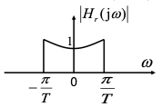 | 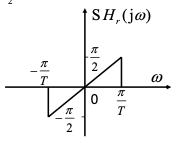 |
| -------------------------------------------------------------------------------- | ------------------------------------------------------------------------------------ |

## 内插

### 理想内插

也称为**时域带限内插**。

若 $h(t)$ 为理想低通滤波器的单位冲激响应，则

$$
\begin{aligned}
x_r(t)
&=x_𝑝(t)*h(t)\\
&=\sum_{n=-∞}^{+∞}x(nT)\delta(t-nT)*h(t)\\
&=\sum_{n=-∞}^{+∞}x(nT)h(t - nT)
\end{aligned}
$$

!!! abstract
    这里利用了单位冲激响应的卷积特性（定义）：

$$
x(h(g(t)))=x(h(t))*\delta(g(t))
$$

表明：理想内插以**理想低通滤波器**的单位冲激响应作为内插函数。

当理想低通滤波器的截止频率为 $\omega_c=\frac{1}{2}\omega_s=\frac{\pi}{T}$ 时有：

$$
\begin{aligned}
h(t)=T\frac{\sin \omega_c t}{\pit}\text{Sa}(\omega_ct)=\text{Sa}(\omega_ct)
\end{aligned}
$$

则有：

$$
x_r(t)=\sum_{n=-∞}^{+\infty}x(nT)\cdot Sa[\omega_c(t-nT)]
$$

按照这个过程，就得到了原始信号 $x(t)$ 的重建信号 $x_r(t)$。只要采样过程满足采样定理，那么这个重建就完全恢复了 $x(t)$。

## 调制与调解

Modulation & Demodulation

利用傅里叶变换的**相乘特性**：两个信号在时域相乘，可以看成是由一个信号控制另一个信号的幅度，这就是幅度调制。其中前者为**调制信号**，后者为**载波**

!!! abstract
    WIKI：[调制](https://en.wikipedia.org/wiki/Modulation)与[调解](https://en.wikipedia.org/wiki/Demodulation)

### 正弦幅度调制

正弦幅度调制等效于在频域将调制信号的频谱搬移到载频位置

调制信号 $s(t)\stackrel{CTFT}{\longleftrightarrow}S(j\omega)$：

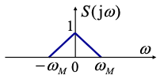

载波信号 $p(t)\stackrel{CTFT}{\longleftrightarrow}P(j\omega)$：

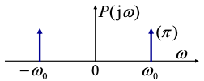

输入乘法器，输出调制后的信号：

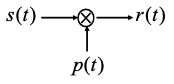

调制后的信号 $r(t)\stackrel{CTFT}{\longleftrightarrow}R(j\omega)$：

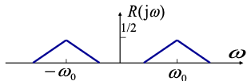

### 同步调解

必须要求调制和解调时所使用的载波不仅要**严格同频**，而且要**同相**。因此这种解调方法称为**同步**解调。

$$
\begin{aligned}
r(t)cos\omega_0t\stackrel{F}{\longleftrightarrow}
&\ \frac{1}{2\pi}R(j\omega)*\pi[\delta(\omega-\omega_0)+\delta(\omega+\omega_0)]\\
=&\ \frac{1}{2}S(j\omega)+\frac{1}{4}S[j(\omega-2\omega_0)]+\frac{1}{4}S[j(\omega+2\omega_0)]
\end{aligned}
$$

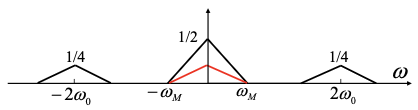
