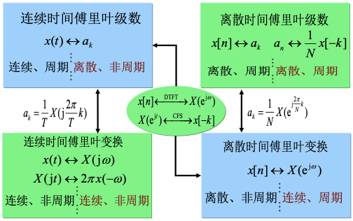

## 归纳总结

!!! abstract
    缩写：

- CTFS——连续时间傅里叶级数
- DTFS——离散时间傅里叶级数
- CTFT——连续时间傅里叶变换
- DTFT——离散时间傅里叶变换

一图归纳：

信号在时域的特性和在频域的特性之间存在以下对应关系：

- 时域的周期性——频域的离散性
- 时域的非周期性——频域的连续性
- 时域的离散性——频域的周期性
- 时域的连续性——频域的非周期性

## CTFT 的对偶

若 $x(t)\stackrel{CTFT}{\longleftrightarrow}X(j\omega)$ ，则有：

$$
\begin{aligned}
x(t)
&=\frac{1}{2\pi} \int_{-\infty}^{+\infty} X(j\omega) e^{j\omega t}d\omega\\
2\pi x(t)
&=\int_{-\infty}^{+\infty} X(j\omega) e^{j\omega t}d\omega\\
2\pi x(\omega)
&=\int_{-\infty}^{+\infty} X(jt) e^{j\omega t}dt\\
2\pi x(-\omega)
&=\int_{-\infty}^{+\infty} X(jt) e^{-j\omega t}dt\\
\end{aligned}
$$

可得到对偶关系：

$$
x(t)\stackrel{CTFT}{\longleftrightarrow}X(j\omega)\\\\
X(jt)\stackrel{CTFT}{\longleftrightarrow}2\pi x(-\omega)
$$

利用这一对偶关系，可以将 CTFT 时域的某些特性对偶到频域，或者反之。

## DFS 的对偶

$$
a_k=\frac{1}{N}\sum_{n=\langle N\rangle}x[n]e^{-j\frac{2\pi}{N}kn}
$$

$a_k$ 本身也是以 $N$ 为周期的序列，用 $-n$ 变量代换 $n$ ，则可以将 $a_k$ 写为离散时间傅里叶级数（DFS）的形式：

$$
a_k=\sum_{n=\langle N\rangle}\frac{1}{N}x[-n]\cdot e^{j\frac{2\pi}{N}kn}
$$

也就是（将 $k$ 和 $n$ 变量交换）：

$$
a_n=\sum_{k=\langle N\rangle}\frac{1}{N}x[-k]\cdot e^{j\frac{2\pi}{N}kn}
$$

可以得到对偶关系；

$$
\begin{aligned}
x[n]&\stackrel{DFS}{\longleftrightarrow}a_k\\\\
a_n&\stackrel{DFS}{\longleftrightarrow}\frac{1}{N}x[-k]
\end{aligned}
$$

利用这一对偶关系，可以将 DFS 在时域的性质推广至频域，或者反之。

## DTFT 与 CFS 间的对偶

$x[n]$ 的离散时间傅里叶正变换（DTFT）$X(e^{j\omega})$ 是以 $2\pi$ 为周期的连续函数。如果将其视为连续时间信号 $X(e^{jt})$ ，则可以表示为连续时间傅里叶级数（CFS）的形式：

$$
\begin{aligned}
X(e^{jt})
&=\sum_{n=-\infty}^{+\infty}x[n]\cdot e^{-jtn}\\
&=\sum_{k=-\infty}^{+\infty}x[-k]\cdot e^{jkt}
\end{aligned}
$$

于是就有对偶关系：

$$
\begin{aligned}
x[n]&\stackrel{DTFT}{\longleftrightarrow}X(e^{j\omega})\\\\
X(e^{jt})&\stackrel{DFS}{\longleftrightarrow}x[-k]
\end{aligned}
$$

利用这一对偶关系，可以将 DTFT 的若干特性对偶到 CFS 中去，或者反之。
