!!! info 
    Linear Time Invariant 线性时不变

!!! abstract
    **基本信号**应具有以下特点：

- 本身尽可能简单，并且用它们的线性组合能够表示尽可能广泛的信号
- LTI 系统对这种信号的响应易于计算且有利于对系统的深入理解

两类有用的基本信号：

- 复指数信号
- 单位冲激信号

本章主要考虑以单位冲激信号为基本信号进行信号与系统分析

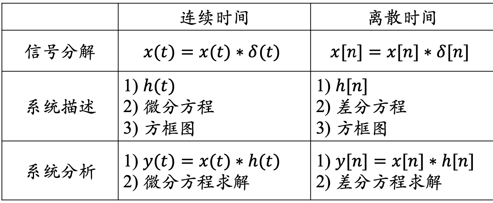

## 卷积和

### 定义

对于任意一个离散时间系统：

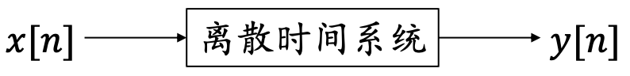

设离散时间系统为 LTI 的，定义**单位脉冲响应** $h[n]$ 为以单位冲激信号 $\delta[n]$ 为输入时的输出：

$$
\delta[n]\to h[n]
$$

由 LTI 时不变性有：

$$
\delta[n-k]\to h[n-k]
$$

由 LTI 线性有：

$$
x[n]=\sum_{k=-\infty}^{+\infty}x[k]\delta[n-k]\to y[n]=\sum_{k=-\infty}^{+\infty}x[k]h[n-k]
$$

这种求得系统响应的运算关系称为**卷积和**，即离散时间 LTI 系统的响应可以用卷积和表示为:

$$
y[n]=x[n]*h[n]=\sum_{k=-\infty}^{+\infty}x[k]h[n-k]
$$

:star:更一般的形式：

$$
x[n-n_0-n_1]=x[n-n_0]*h[n-n_1]
$$

:star:只要得到了 LTI 系统对 $\delta[n]$ 的 响 应 $h[n]$ ——单位脉冲响应，就可以得到 LTI 系统对任何输入信号 $x[n]$ 的响应。

换言之，一个 LTI 系统可以完全由它的单位脉冲响应 $h[n]$ 来表征。

### 特殊离散 LTI 系统

#### 延时器

$$
h[n]=\delta[n-n_0]
$$

具有该单位脉冲响应的系统一般情况下存在多种可能性，但是对应的 LTI 系统只有一个：

$$
y[n]=x[n-n_0]=x[n]*\delta[n-n_0]
$$

#### 累加器

$$
h[n]=\sum_{k=-\infty}^{n}\delta[k]=u[n]
$$

对应的 LTI 系统：

$$
y[n]=x[n]*u[n]=\sum_{k=-\infty}^{n}x[k]
$$

### 计算

选择 $n$ 值并固定，求和项视为 $k$ 的函数，步骤如下：

1. 将 $x[n]$ 与 $h[n]$ 变为 $x[k]$ 与 $h[k]$ ，以 $k$ 为求和变量
2. 将 $h[k]$ **翻转**变为 $h[-k]$；
3. 将 $h[-k]$ **平移** $n$，变为 $h[n - k]$；
4. 将 $x[k]$ 和 $h[n-k]$ 相乘；
5. 对乘积 $x[k]h[n-k]$ 在 $k\in \mathbb{Z}$ 取和；
   - 一般都转化为只对非 0 区间积分。注意非 0 区间上下限！！！
6. 改变 $n$ 值并重复 3–5 步，直到 $n$ 超过了 $x[n]$ **非零部分定义域**

!!! warning
    注意很多题目最后答案会加上一个 $u(n)$ ，是因为只求定义域在 $[0,+\infty)$ 的部分

## 卷积积分

### 定义

!!! abstract
    类似积分思想，转化为无限多的离散和的极限

用冲激信号表示连续时间信号：

将输入信号 $x(t)$ 近似表示为移位、放缩后的脉冲之和

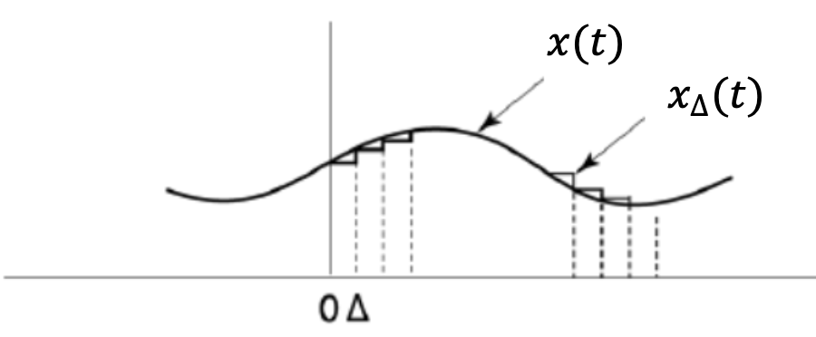

$$
x_{\Delta}(t)=x(k\Delta)\ ,\ k\Delta\lt t\lt(k+1)\Delta
$$

阶梯近似表达过程：

设连续时间系统为 LTI 的，定义（名字待补，与卷积和中的**单位脉冲响应**对应） $h_{\Delta}(n)$ 为以单位冲激信号 $\delta_{\Delta}(n)$ 为输入时的输出：

$$
\delta_{\Delta}(n)\to h_{\Delta}(n)
$$

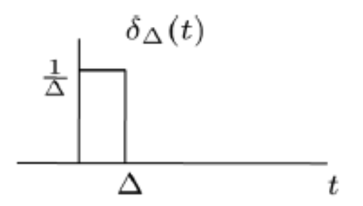

由 LTI 时不变性有：

$$
\delta_{\Delta}(n-k\Delta)\to h_{\Delta}(n-k\Delta)
$$

由 LTI 线性齐次性尺度调整：

$$
x(k\Delta)\delta_{\Delta}(n-k\Delta)\to x(k\Delta)h_{\Delta}(n-k\Delta)
$$

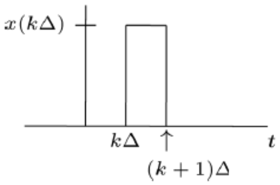

由 LTI 线性叠加性有：

$$
\sum_{k=-\infty}^{+\infty}x(k\Delta)\delta_{\Delta}(n-k\Delta)\Delta\to \sum_{k=-\infty}^{+\infty}x(k\Delta)h_{\Delta}(n-k\Delta)\Delta\\
x_{\Delta}(t)\to y_{\Delta}(t)
$$

当 Δ → 0 时 :

- $x_Δ(t) → x(t)$
- $y_Δ(t) → y(t)$
- $kΔ → \tau$
- $Δ → d\tau$
- $\delta_Δ(t - kΔ) → \delta(t - \tau)$
- $h_Δ(t - kΔ) → h(t - \tau)$
- $\sum\to\int$

从而得到：

$$
x(t)=\int_{-\infty}^{+\infty}x(\tau)\delta(t-\tau)d\tau=x(t)*\delta(t)\\
y(t)=\int_{-\infty}^{+\infty}x(\tau)h(t-\tau)d\tau=x(t)*h(t)
$$

- 其中第一个式子意义是：用位移的单位冲激信号表示任意的连续时间信号
- 其中第一个式子意义是：用卷积积分表示连续时间 LTI 系统的响应

阶梯近似图解过程：

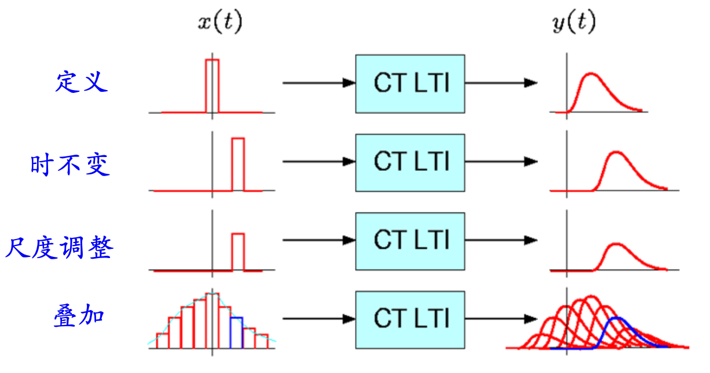

### 计算

求卷积积分 $x(t) * h(t) = \int_{-∞}^{+∞}x(\tau)h(t - \tau)d\tau$ 的过程与卷积和计算过程相似。卷积积分的计算步骤如下：

1. 将 $x(t)$ 与 $h(t)$ 变为 $x(\tau)$ 与 $h(\tau)$ ，以 $\tau$ 为积分变量；
2. 将 $h(\tau)$ **翻转**变为 $h(-\tau)$；
3. 将 $h(-\tau)$ **平移** $t$ ，变为 $h(t - \tau)$；
4. 将 $x(\tau)$ 和 $h(t-\tau)$ 相乘；
5. 求区间 $(-\infty,+\infty)$ 上乘积 $x(\tau)h(t-\tau)$ 下的面积；
   - 一般都转化为只对非 0 区间积分。注意非 0 区间上下限！！！
6. 改变 $t$ 值并重复 3–5 步。

### 特殊连续 LTI 系统

#### 积分器

单位冲激信号为输入下系统的响应为：

$$
h(t)=u(t)
$$

对任意激励信号 $x(t)$ ，系统响应为：

$$
y(t)=x(t)*h(t)=\int_{-\infty}^{+\infty}x(\tau)h(t-\tau)d\tau = \int_{-\infty}^{t}x(\tau)d\tau
$$

## 卷积和与卷积积分的性质

### 交换律

变量替换：

$$
x[n]*h[n]=\sum_{k=-\infty}^{+\infty}x[k]h[n-k]=\sum_{l=-\infty}^{+\infty}x[n-l]h[l]=h[n]*x[n]
$$

$$
x(n)*h(n)=\int_{-\infty}^{+\infty}x(\tau)h(t-\tau)d\tau=\int_{-\infty}^{+\infty}x(t-\tau')h(\tau')d\tau'=h(t)*x(t)
$$

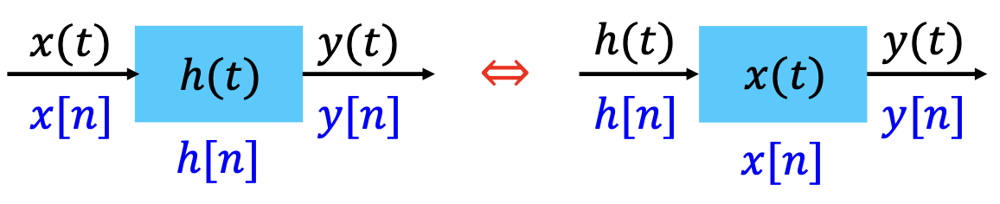

$$
s[n]=u[n]*h[n]=h[n]*u[n]=\sum_{k=-\infty}^{n}h[k]
$$

利用 $u[n]$ 是累加器的单位脉冲响应以及交换律可以得到：

该系统的单位脉冲响应是 $h[n]$ ， $u[n]$ 单位阶跃信号作为输入，则其单位阶跃响应 $s[n]$ 等价于 以 $h[n]$ 作为输入时，累加器的响应

### 分配律

$$
x[n] * (h_1[n] + h_2[n]) = x[n] * h_1[n] + x[n] * h_2[n]\\
x(t) * (h_1(t) + h_2(t)) = x(t) * h_1(t) + x(t) * h_2(t)
$$

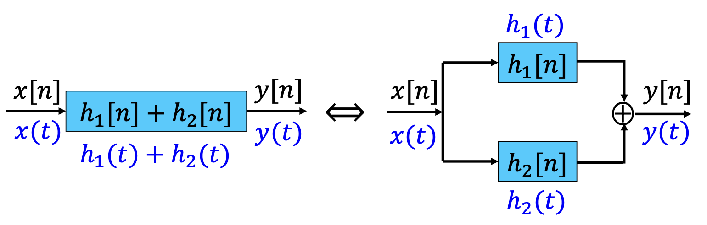

### 结合律

$$
(x[n] * h_1 [n] ) * h_2[n] = x[n] * (h_1 [n] * h_2[n])\\
(x(t) * h_1 (t) ) * h_2(t) = x(t) * (h_1(t)* h_2 (t))
$$

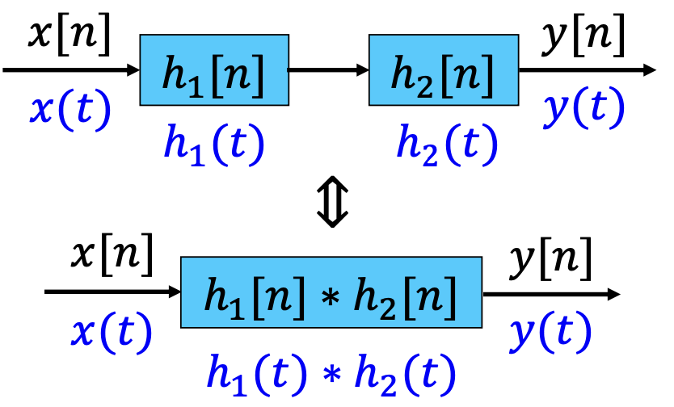

级联的 LTI 系统其总的单位冲激(脉冲)响应等于各子系统单位冲激(脉冲)响应的卷积

### 级联可交换

卷积运算满足结合律和交换律，因此，系统级联的先后次序可以调换。

$$
x[n] * h_1[n] * h_2[n] = x[n] * h_2[n] * h_1[n]\\
x(t) * h_1(t) * h_2(t) = x(t) * h_2(t) * h_1(t)
$$

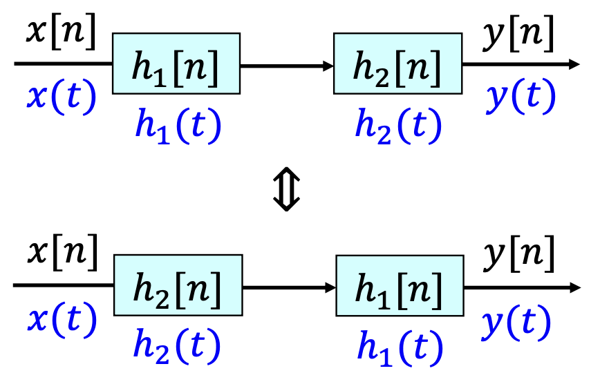

级联次序可交换的前提条件:

- 系统是 LTI 的
- 所有涉及到的卷积运算必须收敛

### 微分、积分及时移特性

卷积积分满足微分、积分及时移特性。若 $x(t)*h(t)=y(t)$，则：

#### 微分特性

$$
x'(t) * h(t) = x(t) * h'(t) = y'(t)
$$

$$
x^{(m)}(t) * h^{(n)}(t) = y^{(m+n)}(t)
$$

!!! warning
    对 $t$ 求导而不是对 $\tau$ 求导

#### 积分特性

$$
\begin{aligned}
\big(\int_{-\infty}^{t}x(\tau)d\tau\big)*h(t)&= \int_{-\infty}^{+\infty}\big(\int_{-\infty}^{\tau_1}x(\tau)d\tau\big)h(t-\tau_1)d\tau_1\\
&=x(t)*\big(\int_{-\infty}^{t}h(\tau)d\tau\big)\\
&=\int_{-\infty}^{t}y(\tau)d\tau
\end{aligned}
$$

#### 时移特性

$$
x(t - t_0) * h(t-t_1) = x(t-t_1) * h(t - t_0) = y(t - t_0-t_1)
$$

### 差分、求和及时移特性

卷积和满足差分、求和及时移特性。若 x[n] \* h[n] = y[n]，则：

#### 差分特性

$$
x[n]- x[n- 1] * h[n]= x[n]* (h[n]- h[n - 1])= y[n] - y[n - 1]
$$

#### 求和特性

$$
(\sum_{k=-∞}^{n}x[k] )* h[n] = x[n] * (\sum_{k=-∞}^{n}h[k] )=\sum_{k=-∞}^{n}y[k]
$$

#### 时移特性

$$
x[t - t_0] * h[t-t_1] = x[t-t_1]* h[t - t_0]= y[t - t_0-t_1]
$$

## LTI 系统的性质

### 记忆性

对于离散时间 LTI 系统：

$$
y[n]=\sum_{k=-\infty}^{+\infty}x[k]h[n-k]
$$

如果系统是无记忆的，则在任何时刻 $n$ ，$y[n]$ 都只能和 $n$ 时刻的输入有关，等式右边的和式中只能有 $k=n$ 时的一项非零，即必须有 $h[n-k]=0$，$k≠n$，也即：

$$
h[n] = 0 ,\ \ \ n\neq0
$$

所以，离散时间无记忆系统的单位脉冲响应为：

$$
h[n]=k\delta[n]
$$

即为离散时间系统**无记忆**的**充要条件**。

类似地，连续时间系统无记忆的充要条件为：

$$
h(t)=k\delta(t)
$$

当 $k=1$ 时系统是恒等系统。

### 可逆性

如果 LTI 系统是可逆的，则其逆系统也是 LTI 系统。

**互逆**的两个系统的满足（**充要条件**）**卷积和等于单位冲激信号**：

$$
\begin{aligned}
h(t) * g(t) =\delta(t)\\
h[n] * g[n] =\delta[n]
\end{aligned}
$$

从而有：

$$
\begin{aligned}
x(t)*h(t)*g(t)=x(t)*\delta(t)=x(t)\\
x[t]*h[n]*g[n]=x[t]*\delta[n]=x[t]
\end{aligned}
$$

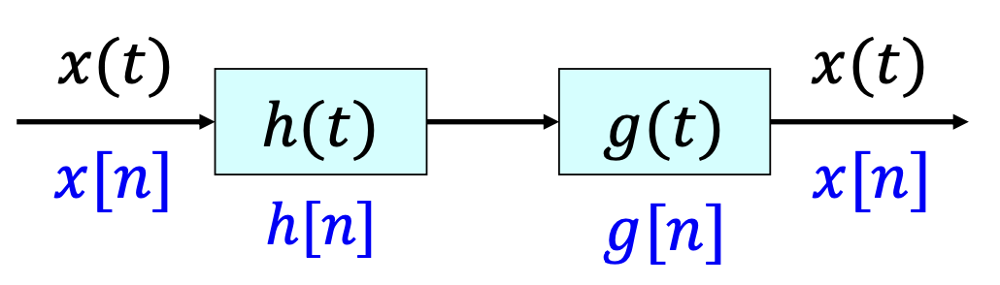

例如：延时器是可逆的 LTI 系统，h(t) = \delta(t - t0)，其逆系统是 g(t) = \delta(t + t0)，显然有：

$$
h(t) * g(t) = (t - t_0) * \delta(t + t_0) = \delta(t)
$$

又如：累加器是可逆的 LTI 系统，其 h[n] = u[n]，其逆系统是 g[n] = \delta[n] - \delta[n - 1]，显然也有：

$$
\begin{aligned}
h[n] * g[n] &= u[n] * (\delta[n] - \delta[n - 1])\\
&= u[n] - u[n - 1] = \delta[n]
\end{aligned}
$$

### 因果性

对于离散时间 LTI 系统：

$$
y[n]=\sum_{k=-\infty}^{+\infty}x[k]h[n-k]
$$

因果性意味着上式等号右边和式中所有 k > n 的项都必须为零，即 h[n - k] = 0，k > n，也即：

$$
h[n] = 0,\ \ \ n < 0
$$

同理对连续时间因果系统有：

$$
h(t) = 0, \ \ \ t < 0
$$

即为 LTI 系统具有因果性的**充要条件**

对于线性系统而言，因果性与初始松弛条件等价。所谓系统满足初始松弛条件是指该系统具有如下表现：对于任意时刻，只要该时刻之前系统的输入为 0，则该时刻之前系统的输出也必然为 0。

（参考教材习题 1.44(a)）

– 该等价性的前提是系统为线性的。否则不一定成立。例如 y n = 2x n + 3 是因果的，但显然不满足初始松弛条件。

### 稳定性

稳定性意味着有界输入必然产生有界输出。以离散时间 LTI 系统为例，设 |x[n]| 有界，| x[n - k]| ≤ A。有:

$$
|y[n]| = |\sum_{k=-∞}^{+∞}h[k]x[n - k]|
≤ \sum_{k=-∞}^{+∞} |h[k]| |x[n - k]| ≤ A \sum_{k=-∞}^{+∞}|h[k]|
$$

离散 LTI 系统稳定的**充分必要**条件为：

$$
\sum_{n=-\infty}^{+\infty}|h[n]|\lt +\infty
$$

类似地有连续 LTI 系统稳定的**充分必要**条件为：

$$
\int_{-\infty}^{+\infty}|h(t)|dt \lt +\infty
$$

### 单位阶跃响应

在工程实际中，也常用单位阶跃响应来描述 LTI 系统。单位阶跃响应就是系统对 u(t) 或 u[n] 所产生的响应，记为 s(t)或 s[n]。因此有:

$$
s[n] = u[n] * h[n] = \sum_{k=-∞}^n h[k]
$$

$$
h[n] = s[n] - s[n - 1]
$$

$$
s(t) = u(t) * h(t) = \int_{-\infty}^{t}h(\tau)d\tau
$$

$$
h(t) =\frac{ds(t)}{dt}= s'(t)
$$

## 用微分和差分方程描述的因果 LTI 系统

在工程实际中有相当普遍的一类系统，其数学模型可以用线性常系数微分方程或线性常系数差分方程来描述。

在时域内分析这类 LTI 系统，就是要求解线性常系数微分方程或差分方程。

### 线性常系数微分方程

一般情况 $N\geq M$ , N 阶非其次常系数微分方程的一般形式：

$$
\sum_{k=0}^{N}a_k\frac{d^ky(t)}{dt^k}=\sum_{k=0}^{M}b_k\frac{d^ky(t)}{dt^k}
$$

其中 a~k~, b~k~ 均为常数

求解该微分方程（求 y( t ) 的显式表达）的步骤：

1. 求出**齐次解**（**通解**）y~h~(t) ，也称为系统的**自然响应**、**自由响应**
   1. 建立特征方程求出特征根 𝜆~k~
   2. 根据特征根得到齐次解形式
   3. 根据附加条件确定齐次解形式中的待定常数 C~k~
2. 求**特解** y~𝑝~(t)，也称系统的**受迫响应**、**强迫响应**，其形式与输入信号有关
   1. 根据输入信号形式得到特解形式
   2. 将输入信号与特解代入微分方程确定特解形式中的待定常数
3. 得到完全解 y(t) = y~h~(t) + y~𝑝~(t)

!!! warning
    附加条件常给出为**初始松弛条件**，即 $t\lt 0$ 时若 $x(t)=0$ 则有 $y(t)=0$ ，或 $n\lt 0$ 时若 $x[n]=0$ 则有 $y[n]=0$

对于线性系统，初始松弛条件与满足因果性是等价的

解题时，可以直接认为就是有 $y(0)=0$ 或 $x[0]=0$

### 线性常系数差分方程

一般情况 $N\geq M$，$N$ 阶非其次常系数差分方程的**一般形式**：

$$
\sum_{k=0}^{N}a_k y[n-k]=\sum_{k=0}^{M}b_k x[n-k]
$$

其中 a~k~, b~k~ 均为常数

还可以将其改写为**(正向)递归形式**：

$$
y[n]=\frac{1}{a_0}(\sum_{k=0}^{M}b_k x[n-k]-\sum_{k=0}^{N}a_k y[n-k])
$$

还可将差分方程改写**反向递归求解形式**：

$$
y[n-N]=\frac{1}{a_N}(\sum_{k=0}^{M}b_k x[n-k]-\sum_{k=0}^{N-1}a_k y[n-k])
$$

当 $a_k =0,k\neq 0$ 时，差分方程变为一个卷积和的形式即**非递归方程**：

$$
y[n]=\sum_{k=0}^{M}\frac{b_k}{a_0}x[n-k]=\sum_{-\infty}^{+\infty}h[n]\ x[n-k]
$$

其中：

$$
h[n]=
\begin{cases}
\frac{b_n}{a_0},\ \ 0\leq n\leq M \\
0,\ \ \ \ \text{others}
\end{cases}
$$

- 由于 h[n] 是有限长的，当 $a_k =0,k\neq 0$ 时**非递归**方程描述的系统称为**有限脉冲响应**（ Finite Impulse Response，FIR）系统
- 而其他情况下**递归**方程描述的系统结合初始松弛条件具有无限长的单位脉冲响应，因而称为**无限脉冲响应**（Infinite Impulse Response，IIR）系统

- 与微分方程类似，差分方程的**齐次解**（**通解**）与输入信号的形式无关，称为系统的**自然响应**或**自由响应**
- **特解**具有与输入信号相同的函数形式，称为**受迫响应**或**强迫响应**

具有**非零起始状态**的线性常系数微分或差分方程对应**增量线性系统**，其响应由两部分组成：

- 零输入响应，与输入信号无关，属于自然响应
- 零状态响应，既与输入信号有关，也与系统特性有关，它包含了一部分受迫响应，也包含有一部分自然响应

## 方框图表示

### 差分方程描述系统

对于正向递归形式的 LTI 系统差分方程，其方程中包括三种基本运算：

- 移位（延迟）——对应延迟器
- 乘系数——对应数乘器
- 相加——对应加法器

令：

$$
w[n]=\sum_{k=0}^{M}b_k x[n-k]
$$

正向递归形式可写为：

$$
y[n]=\frac{1}{a_0}(w[n]-\sum_{k=0}^{N}a_k y[n-k])
$$

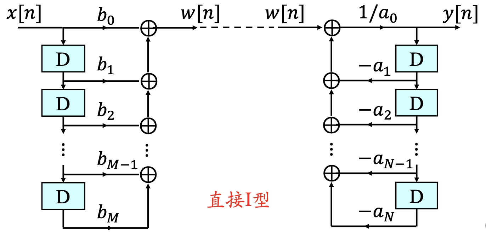

将其级联起来，就成为线性常系数差分方程描述的系统，它具有与差分方程完全相同的运算功能。可以调换级联次序，并将移位单元合并，于是得到**直接 II 型**

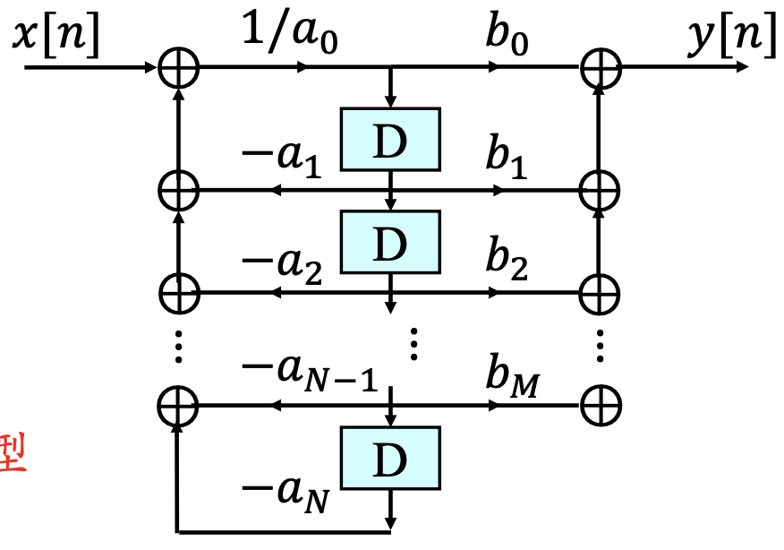

### 微分方程描述系统

微分方程也包括三种基本运算：

- 微分
- 乘系数
- 相加

但微分器不仅在工程实现上有困难，而且对误差及噪声极为敏感，因此，通常使用积分器而不用微分器

N 阶微分方程两边同时积分 N 次，即可得到对应 N 阶积分方程：

$$
\sum_{k=0}^{N}a_k\ y_{(N-k)}(t)=\sum_{k=0}^{M}b_k\ x_{(N-k)}(t)
$$

对此积分方程完全按照差分方程的办法有其递归方程：

$$
y(t)=\frac{1}{a_0}(\sum_{k=0}^{M}b_k x_{(N-k)}(t)-\sum_{k=0}^{N}a_k y_{(N-k)}(t))
$$

令：

$$
w(t)=\sum_{k=0}^{M}b_k x_{(N-k)}(t)
$$

可得：

$$
y(t)=\frac{1}{a_0}(w(t)-\sum_{k=0}^{N}a_k y_{(N-k)}(t))
$$

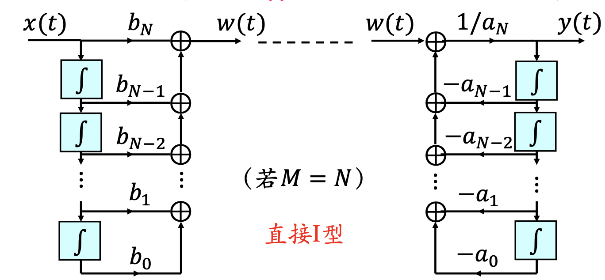

通过交换级联次序，合并积分器可得**直接 Ⅱ 型**：

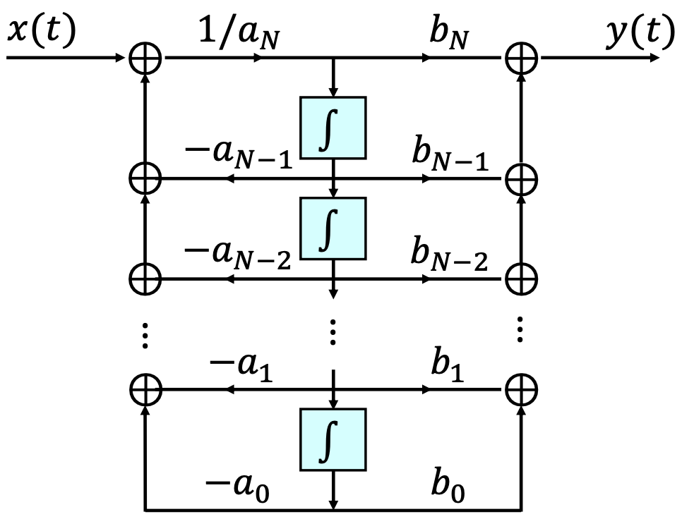

## 卷积定义奇异函数

### 单位冲激信号$u_0(t)$

!!! abstract
    $\delta(t)=\frac{d}{dt}u(t)$ 定义下的单位冲激。这是不严密的，因为 $u(t)$ 在 t=0 处不连续。

进而采用极限的观点，将 $\delta(t)$ 视为 $\delta_Δ (t)$在 $Δ → 0$ 时的极限。但这种定义或描述\delta(t)的方法在数学上仍然是不严格的，因为存在无穷多个不同的函数在 $Δ → 0$ 时都表现为与$\delta_Δ (t)$ 有相同的特性。

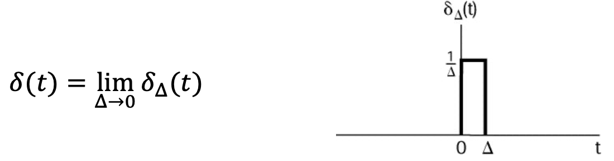

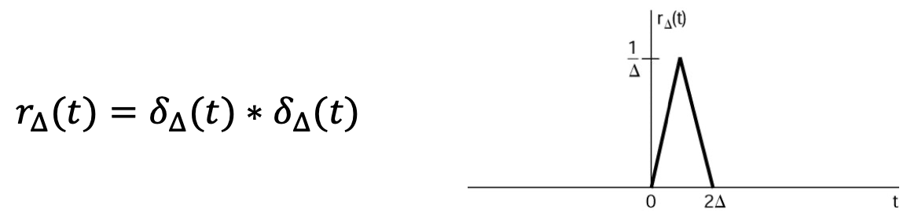

上述现象出现的原因在于\delta(t)是一个理想化的非常规函数，被称为奇异函数，通常采用卷积或积分运算下表现的特性来定义奇异函数

从系统的角度，将 $\delta(t)$ 定义为**恒等系统**的**单位冲激响应**，也就是通过卷积定义 $\delta(t)$ ，对任意 $x(t)$， $\delta(t)$ 应满足：

$$
x(t)=x(t)*\delta (t)
$$

::: primary
单位冲激函数相当于卷积运算系统的单位元
根据定义可以得出 $\delta(t)$ 的如下性质:

$$
1=1*\delta (t) = \int_{-\infty}^{+\infty}\delta(\tau)d\tau
$$

卷积定义还有一个等价版本——**积分定义**：

$$
g(t)=g(t)*\delta(t)=\int_{-\infty}^{+\infty}g(t-\tau)\delta(\tau)d\tau\\
g(0)=\int_{-\infty}^{+\infty}g(t)\delta(\tau)d\tau
$$

#### 偶函数

单位冲激信号 $\delta(t)$ 是偶函数：

$$
\delta(t)=\delta(-t)
$$

证明：

$$
\begin{aligned}
\int_{-\infty}^{+\infty}\delta(-t)f(t)dt &=\int_{-\infty}^{+\infty}\delta(\tau)f(-\tau)d(-\tau)\\
&=\int_{-\infty}^{+\infty}\delta(\tau)f(-\tau)d\tau\\
&=f(0)
\end{aligned}
$$

#### 时间尺度变换

$$
\delta(at)=\frac{1}{|a|}\delta(t)
$$

验证信号下方面积：

当 $a\gt 0$ 时 :

$$
\int_{-\infty}^{+\infty}\delta(a\tau)d\tau=\frac{1}{a}\int_{-\infty}^{+\infty}\delta(a\tau)d(a\tau)=\frac{1}{a}=\frac{1}{|a|}
$$

当 $a\lt 0$ 时 :

$$
\begin{aligned}
\int_{-\infty}^{+\infty}\delta(a\tau)d\tau
&= \frac{1}{a}\int_{-\infty}^{+\infty}\delta(a\tau)d(a\tau)\\
&= \frac{1}{a}\int_{+\infty}^{-\infty}\delta(t)dt \\
&= -\frac{1}{a}\int_{-\infty}^{+\infty}\delta(t)dt \\
&= -\frac{1}{a} \\
&= |\frac{1}{a}|
\end{aligned}
$$

### 单位冲激偶$u_1(t)$

系统角度定义为**理想微分器**的**单位冲激响应**，即 $\delta(t)$ 的微分：

$$
u_1(t)=\frac{d}{dt}\delta(t)
$$

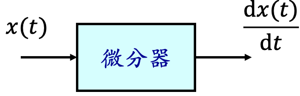

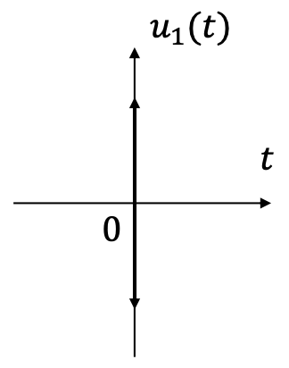

卷积定义，从 LTI 系统分析的角度有：

$$
x(t)*u_1
(t)=\frac{d}{dt}x(t)
$$

该信号可视为短脉冲求导的理想化结果。

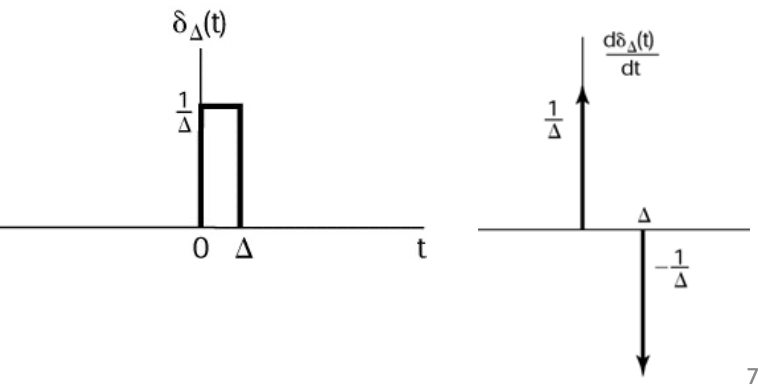

#### 积分性质

令输入 $x(t)=1$ 有：

$$
\int_{-\infty}^{+\infty}u_1(\tau)d\tau=\int_{-\infty}^{+\infty}x(t-\tau)u_1(\tau)d\tau=x(t)*u_1(t)=\frac{d}{dt}x(t)=0
$$

#### 积分意义下的定义

$$
\int_{-\infty}^{+\infty}g(\tau-t)u_1(\tau)d\tau=g(-t)*u_1(t)=-\frac{d}{dt}g(-t)
$$

令 $t=0$ 有：

$$
-g'(0)=\int_{-\infty}^{+\infty}g(\tau)u_1(\tau)d\tau
$$

该积分即可作为 $u_1(t)$ 在积分意义下的定义

### $\delta(t)$的积分$u_{-1}(t)$

从系统的角度，定义 $u_{-1}(t)$ 是**理想积分器**的**单位冲激响应**

$$
u_{-1}(t)=\int_{-\infty}^{t}\delta(\tau)d\tau=u(t)
$$

运算定义为：

$$
x(t)*u_{-1}(t)=\int_{-\infty}^{t}x(\tau)d\tau
$$

### 单位斜坡函数$u_{-2}(t)$

系统的角度，可以定义为：（卷积）

$$
u_{-2}(t)=u_{-1}(t)*u_{-1}(t)=\int_{-\infty}^{t}u(t)dt=tu(t)
$$

运算定义为二重积分：

$$
\begin{aligned}
x(t)*u_{-2}(t)
&= x(t)*u_{-2}(t)\\
&= x(t)*u_{-1}(t)*u_{-1}(t) \\
&= \big(\int_{-\infty}^{t}u(\sigma)d\sigma\large)*u_{-1}(t) \\
&= \int_{-\infty}^{t}\big(\int_{-\infty}^{\tau}u(\sigma)d\sigma\big)d\tau \\
&= \int_{-\infty}^{t}\int_{-\infty}^{\tau}u(\sigma)\ d\sigma d\tau
\end{aligned}
$$

### 卷积定义推广

例如 $u_2(t)$ 可以定义为：$u_2(t)=u_1(t)*u_1(t)$ :

$$
x(t)*u_2(t)=\frac{d^2}{dt^2}x(t)=x(t)*u_1(t)*u_1(t)
$$

以此类推：

$$
\begin{aligned}
u_2(t) &= u_1(t)*u_1(t) \\
u_2(t) &= u_1(t)*u_1(t)*u_1(t)\\
&......\\
u_k(t)\over &{=\over} {u_1(t)*u_1(t)*...*u_1(t)\over \text{k个}}
\end{aligned}
$$

单位阶跃函数的高阶积分推广:

$$
\begin{aligned}
u_{-3}(t) &= u_{-1}(t)*u_{-1}(t)*u_{-1}(t)=\frac{1}{2}t^2 u(t) \\
u_{-4}(t) &= u_{-1}(t)*u_{-1}(t)*u_{-1}(t)*u_{-1}(t)=\frac{1}{6}t^3 u(t)\\
&......\\
u_{-k}(t)\over &{=\over} {u_{-1}(t)*u_{-1}(t)*...*u_{-1}(t)\over \text{k个}}{=\over}{\frac{t^{k-1}}{(k-1)!}u(t)\over}
\end{aligned}
$$

!!! info 
    实际上， \delta(t)的各次积分已经是常规函数了
