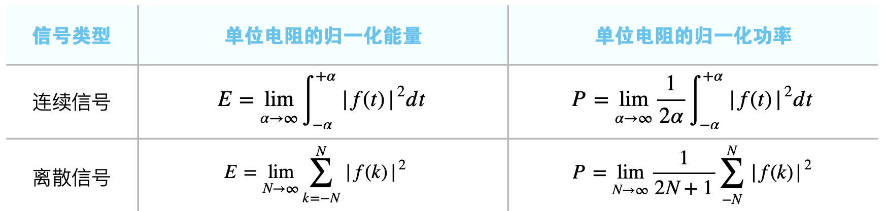

## 能量/功率 信号

### 能量信号

能量为一有界值，即 0 < _E_ < + ∞，此时 _P_ = 0

!!! info 
    有时求 P 不好求，但是 E 好求，可以证明 E 为有界的，从而得到 _P_ = 0

### 功率信号

功率为一有界值，即 0 < _P_ < + ∞ ，此时 _E_ = ∞

!!! info 
    有时求 E 不好求，但是 P 好求，可以证明 P 为有界的，从而得到 _E_ = ∞

## 信号的分解

### 偶部与奇部

$$
f(t)=f_e(t)+f_o(t)
$$

偶部：

$$
f_e(t)=\frac{1}{2}[f(t)+f(-t)]
$$

奇部：

$$
f_o(t)=\frac{1}{2}[f(t)-f(-t)]
$$

### 实部与虚部

针对复函数而言

$$
f(t)=Re\{f(t)\}+Im\{f(t)\}
$$

实部：

$$
Re\{f(t)\}
$$

虚部：

$$
Im\{f(t)\}
$$

## 连续/离散 (时间) 信号

!!! info 
    区分 模拟/数字 信号，模拟/数字 信号的划分是依据“值域”是否连续，而 连续/离散 时间信号的划分是依据定义域是否连续

连续时间信号 **包含** 模拟信号 和 数字(量化)信号

### 周期信号定义

- 连续周期信号 : $f(t+mT)=f(t)$ , _T_ 为周期 _m_ = 0,±1,±2,±3...
- 离散周期信号 : $f(k+mN) = f(k)$ , _N_ 为周期 _m_ = 0,±1,±2,±3...

当*T*或*N*趋于⽆无穷时，周期信号变为⾮非周期信号。

### 连续时间信号

定义域连续

在一定时间范围内，除若⼲不连续点之外，对任意时刻函数都有确定的函数值。 “连续”的含义指定义域连续，⽽连续信号中可以含有不连续点。

#### 普通连续信号

普通连续信号是指函数的定义域和值域**没有**不连续点(即跳变点)的信号。

##### (实)指数信号

$$
f (t) = Ke^{αt}
$$

指数函数求导、积分后仍为指数函数。

##### 正弦信号

利用正弦函数与余弦函数表示的信号**统称为正弦信号**，可表示为

$$
f(t)=A\cos(\omega t-\theta)
$$

正弦信号求导、积分后仍然为正弦信号。

指数信号可以转化为正弦信号:

$$
e^{j\omega t}=\cos\ \omega t+j\ \sin\ \omega t \\
e^{-j\omega t}=\cos\ \omega t-j\ \sin\ \omega t
$$

指数信号可以转化为正弦信号:

$$
\sin\ \omega t = \frac{1}{2j}( e^{j\omega t} - e^{-j\omega t})\\
\cos\ \omega t = \frac{1}{2}( e^{j\omega t} + e^{-j\omega t})
$$

##### 复指数信号

$$
f (t) = Ke^{st} = Ke^{(σ+j\omega)t} = Ke^{σt}(\cos\ ωt + j\ \sin\ ωt)，
$$

其中 $s=σ+j\omega_0$ 为复数

复指数信号中，$\sigma$ 决定增长衰减，$\omega_0$ 决定震荡快慢;

| $\sigma$ 的大小 | $\omega_0$ 的大小 | 最终结果           |
| --------------- | ----------------- | ------------------ |
| $\sigma=1$      | $\omega_0\neq0$   | 实部虚部等幅震荡   |
| $\sigma>1$      | $\omega_0\neq0$   | 实部虚部增⻓震荡   |
| $\sigma<1$      | $\omega_0\neq0$   | 实部虚部衰减震荡   |
| $\sigma≠0$      | $\omega_0=0$      | 实部虚部为指数信号 |
| $\sigma=0$      | $\omega_0=0$      | 为直流信号         |

###### 连续复指数信号的周期性

复指数信号是周期信号当且仅当 $\sigma$ = 1 且 $\omega_0\neq 0$

基波周期：$T=|\frac{2\pi}{\omega_0}|$

基波频率：$\omega_0$

###### 成谐波关系的连续复指数信号集

$$
\{\varphi_k(t) \}=\{ e^{jk\omega_0 t} \}\\
k=0,\pm1,\pm2......
$$

一般假设 $\omega_0 \gt 0$ ，该集合中的每个信号都是周期的，它们的基波频率分别为 $k\omega_0$ ，都是 $\omega_0$ 的整数倍，因而称它们是成**谐波关系**的。

各次谐波的基波周期分别为 $T_k =\frac{2\pi}{|k\omega_0|}$ ，它们的公共周期是 $T_0=\frac{2\pi}{\omega_0}$。

- $k=0$ 称为直流分量
- $k=\pm1$ 称为基波分量
- $k=\pm2$ 称为二次谐波分量
- ...等等...

###### 一般连续复指数信号

$$
f (t) = Ke^{st} = |K|e^{j\theta}e^{(σ+j\omega_0)t} = Ke^{σt}e^{j(\omega_0+\theta)}，
$$

其中 $s=σ+j\omega_0$， $K=|K|e^{j\theta}$ 为复数

该信号可看成是振幅按实指数信号规律变化的周期性复指数信号。它的实部与虚部都是振幅呈实指数规律变化的正弦振荡。

##### 抽样信号

$$
Sa(t)=\frac{\sin\ t}{t} \\
\lim_{t\to \infty}Sa(t)=0 \ \ ;\ \ \lim_{t\to 0}Sa(t)=1 \\
\int_{0}^{+\infty}Sa(t)\ d\ t=\frac{\pi}{2}\ \ ;\ \ \int_{-\infty}^{+\infty}Sa(t)\ d\ t=\pi
$$

##### 高斯函数“钟形信号”

即正态分布 PDF

$$
\varphi(t) = \frac{1}{\sigma\sqrt{2\pi}}e^{-\frac{(t-\mu)^2}{2\sigma^2}}
$$

#### 奇异信号

奇异信号是指函数本身或其导数与积分**有**不连续点(即跳变点)的信号。

##### 单位斜坡信号 (ramp)

$$
\begin{aligned}
r(t) =
\begin{cases}
    t &  t \geq 0  \\
    0 &  t \lt 0
\end{cases}
\end{aligned}
$$

##### 符号函数 (signal)

$$
\begin{aligned}
sig(t) =
\begin{cases}
    1 &  t \gt 0 \\
    0 &  t = 0 \\
    -1 & t \lt 0
\end{cases}
\end{aligned}
$$

##### 单位阶跃信号

$$
\begin{aligned}
u(t)=\varepsilon(t) =
\begin{cases}
    1 &  t \gt 0 \\
    \text{undifined} &  t = 0 \\
    0 &  t \lt 0
\end{cases}
\end{aligned}
$$

_t_ = 0 处函数无定义(部分教材规定 _t_ = 0 时取 $\frac{1}{2}$)

有的教材用 $u(t)$ 也有的教材用 $\varepsilon(t)$

###### 单位延迟阶跃信号

$$
\begin{aligned}
\varepsilon(t-t_0) =
\begin{cases}
    1 &  t \gt t_0 \\
    \text{undifined} &  t = t_0 \\
    0 &  t \lt t_0
\end{cases}
\end{aligned}
$$

###### 物理意义

- _ε_(_t_) 表示信号 _f_ (_t_) = 1 在 _t_ = 0 时刻接⼊系统。
- _f_ (_t_) _ε_(_t_) 表示信号 _f_ (_t_) 在 _t_ = 0 时刻接入系统。
- _f_ (_t_) _ε_(_t_ - _t~0~_ )表示信号 _f_ (_t_) 在 _t_ = _t~0~_ 时刻接⼊系统。

###### 与斜坡信号的关系

$$
r(t)=t\ \varepsilon(t)\\
\frac{d\ r(t)}{d\ t}=\varepsilon(t) \\
\int_{-\infty}^{t}\varepsilon(\tau)\ d\ \tau=r(t)
$$

##### (单位)冲激信号

###### 物理定义

$$
\delta(t)=\lim_{\tau\to 0}\frac{1}{\tau}[\varepsilon(t+\frac{\tau}{2})-\varepsilon(t-\frac{\tau}{2})] \\
\delta(t-t_0)=\lim_{\tau\to t_0}\frac{1}{\tau}[\varepsilon(t+\frac{\tau}{2}-t_0)-\varepsilon(t-\frac{\tau}{2}-t_0)]
$$

###### 狄拉克定义

$$
\delta (t)=
\begin{cases}
\int_{-\infty}^{+\infty}\delta (t)\ d\ t=1 \\
\delta (t)=0,t\neq 0
\end{cases}
$$

$$
\delta (t-t_0)=
\begin{cases}
\int_{-\infty}^{+\infty}\delta (t-t_0)\ d\ t=1 \\
\delta (t)=0,t\neq t_0
\end{cases}
$$

###### 广义函数定义

$$
\int_{-\infty}^{+\infty}\delta (t)\ \varphi(t)\ d\ t =\varphi (0) \\
\int_{-\infty}^{+\infty}\delta (t-t_0)\ \varphi(t)\ d\ t =\varphi (t_0)
$$

###### 取样性

即广义函数定义，注意在**有限区间**同样有取样性

###### 尺度变化特性

$$
\delta (a\ t)=\frac{1}{|a|}\delta (t) \\
\delta (a\ t-t_0)=\frac{1}{|a|}\delta (t-\frac{t_0}{a}) \\
\int_{-\infty}^{+\infty}f(t)\  \delta (a\ t-t_0)=\frac{1}{|a|}f(\frac{t_0}{a}) \\
a\neq 0
$$

###### 与普通函数相乘

$$
f(t)\ \delta(t)=f(0)\ \delta(t) \\
f(t)\ \delta(t-t_0)=f(t_0)\ \delta(t-t_0)
$$

###### 与阶跃信号的关系

$$
\frac{d}{d\ t}\varepsilon(t)=\delta(t)
$$

若信号的函数值有跳变，则信号在跳变点处的导数为冲激信号，其中冲击强度为信号在跳变点的跳跃值

##### (单位)冲激偶信号

###### 定义

单位冲激信号的“奇函数版本”，且是单位冲激信号的导函数

$$
\delta '(t)=\frac{d}{d\ t}\delta (t)
$$

!!! info 
    单位冲激信号是**偶函数**；单位冲激偶信号是**奇函数**！！

二者通过积分和求导可相互转化

###### 与普通函数相乘

$$
f(t)\delta'(t)=f(0)\delta'(t)-f'(0)\delta(t) \\
f(t)\delta'(t-t_0)=f(0)\delta'(t-t_0)-f'(0)\delta(t-t_0)
$$

###### 筛选特性

$$
\int_{-\infty}^{+\infty}f(t)\delta'(t)d\ t=-f'(0) \\
\int_{-\infty}^{+\infty}f(t)\delta'(t-t_0)d\ t=-f'(t_0)
$$

###### 尺度变化特性

$$
\delta'(a\ t)=\frac{1}{a|a|}\delta'(t) \\
a\neq 0
$$

### 离散时间信号

定义域离散

仅在一些离散时刻才有意义，⽽而在其他时刻⽆无定义。离散时间⼀一般为均匀间隔，“离散”是指信号的定义域是离散的。

#### 基本离散信号

##### 单位序列

单位序列列 _δ_(_k_) 亦称单位样值序列列，类似于连续时间信号中的 _δ_(_t_)

$$
\delta (k)=
\begin{cases}
1 & k=0 \\
0 & k\neq 0
\end{cases}
$$

$$
\delta (k-i)=
\begin{cases}
1 & k=i \\
0 & k\neq i
\end{cases}
$$

##### 单位阶跃序列

单位阶跃序列 _ε_(_k_) 类似于连续时间信号中的单位阶跃函数 _ε_(_t_)

$$
\varepsilon (k)=
\begin{cases}
1 & k \geq 0 \\
0 & k \lt 0
\end{cases}
$$

$$
\varepsilon (k-i)=
\begin{cases}
1 & k \geq i \\
0 & k \lt i
\end{cases}
$$

###### 单位序列 _δ_(_k_) 转化为单位阶跃序列 _ε_(_k_)

$$
\varepsilon (k)=\sum_{j=0}^{+\infty}\delta(k-j)
$$

###### 单位阶跃序列 _ε_(_k_)转化为单位序列 _δ_(_k_)

$$
\delta(k)=\varepsilon(k)-\varepsilon(k-1)
$$

##### 单边指数序列

$$
f (k) = \alpha^{k}\varepsilon(k)\ ,\ \ k \in z
$$

当|_α_| > 1 时，序列列发散，|_α_| < 1 时，序列列收敛;

当*α* > 0 时，序列列恒正， _α_ < 0 时，序列列正负交错。

##### 正弦序列

$$
f (k) = \cos\ \omega_0\ k\ ,\ \ k \in z
$$

$\omega_0$ 为数字角频率，其与连续正弦信号的⻆频率不同，详见数字信号处理

不是所有的正弦序列都是周期序列，因为**正弦序列为连续正弦信号的抽样**

###### 离散正弦序列的周期性

正弦序列是周期序列当且仅当

$$
\exist k\in z\ \ ,\ \  \omega_0 | 2k\pi
$$

##### 复指数序列

$$
f (k) = e^{(\alpha +j\omega_0)k} = e^{\alpha k}e^{j\omega_0 k}=e^{\alpha k}(\cos\ \omega_0k +j\ \sin\ \omega_0k)\\
k \in z
$$

| _α_ 的大小 | _ω~0~_ 的大小    | 最终结果               |
| ---------- | ---------------- | ---------------------- |
| _α_ = 0    | $\omega_0\neq 0$ | 实部虚部均等幅正弦序列 |
| _α_ > 0    | $\omega_0\neq 0$ | 实部虚部均增幅正弦序列 |
| _α_ < 0    | $\omega_0\neq 0$ | 实部虚部均减幅正弦序列 |
| _α_ ≠ 0    | $\omega_0 = 0$   | 为指数序列             |
| _α_ = 0    | $\omega_0 = 0$   | 为常数序列             |

###### 离散复指数序列的周期性

$\alpha=0$，$\omega_0\neq0$ 时实部虚部均等幅正弦序列，对应连续复指数信号是周期信号，离散复指数序列才有可能是周期序列，因为**离散复指数序列为连续复指数信号的抽样**

复指数序列是周期序列当且仅当

$$
\exist N,m\in z\\
\frac{2\pi}{\omega_0}=\frac{N}{m} \\
\lrArr e^{j\omega_0N} = 1\\
\lrArr e^{j\omega_0n} = e^{j\omega_0n}\cdot e^{j\omega_0N} = e^{j\omega_0(n+N)}  \\
\lrArr x[k]=x[k+N]
$$

也就是当且仅当 $\omega_0=q\pi$ 其中 $q$ 为有理数时复指数序列为周期序列。

当 $N$ 与 $m$ 互质（无公因子）时：

基波周期：$N=\frac{2π}{\omega_0}m$；

基波频率为：$\omega=\frac{2π}{N}=\frac{\omega_0}{m}$；

###### 成谐波关系的离散复指数信号集

$$
\{\varPhi_k[n] \}=\{ e^{j\frac{2\pi}{N}kn} \}\\
k=0,\pm1,\pm2......
$$

该信号集中的每一个信号都是以 $N$ 为公共周期的, 频率是 2π 的整数倍。

与连续时间情况不同，该信号集中的信号并不都是彼此独立的。显然有：

$$
\varPhi_{k+N}[n] = \varPhi_k[n]
$$

该信号集中**只有 N 个信号是独立**的。即当 k 取相连的 $N$ 个整数时所对应的各个谐波才是彼此独立的。

根据集合定义，那么实际上这个信号集的元素个数是 $N$ 个。

!!! info 
    这里 “相互独立” 的意思是互不相等

## 信号的基本运算

### 平移与反转

连续信号和离散信号的运算一致

- 沿横轴向左平移：$f(t) \to f(t+t_0)$
- 沿横轴向右平移：$f(t) \to f(t-t_0)$
- 沿纵轴镜像翻转：$f(t) \to f(-t)$

### 尺度变换

对于离散信号，⼀般不做尺度变换，因为可能丢失序列信息，只对连续信号尺度变换

$$
f(t) \to f(a\ t)
$$

横轴变为原来的 $\frac{1}{a}$ 倍

### 连续信号的求导与积分

### 离散信号的差分与求和

好离散信号的**前**向(一阶)差分

$$
\Delta f(k)=f(k+1)-f(k)
$$

好离散信号的**后**向(一阶)差分

$$
\nabla f(k)=f(k)-f(k-1)
$$

### 信号的运算的综合运⽤

平移、反折、压缩等各种运算均对独⽴、单一的变量*t*计算，⽽不是对 _at_ 或 _at_ + _b_ 整体计算

对于*f* (_t_) → _f_(_at_ + _b_) 先平移，后尺度(含反折)，即*f* (_t_) → _f_(_t_ + _b_) → _f_(_at_ + _b_)

对于*f* (_at_ + _b_) → _f_(_t_) 先尺度(含反折)，后平移，即*f* (_at_ + _b_) → _f_(_t_ + _b_) → _f_(_t_)
