## 系统的描述

### 连续/离散 时间系统

#### 连续时间系统

输入信号与输出响应都是连续时间信号的系统。

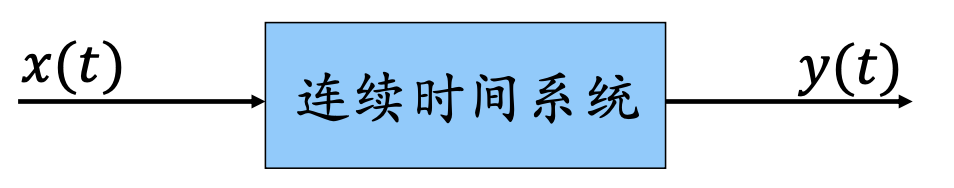

eg: 机械系统、电路系统

#### 离散时间系统

输入信号与输出响应都是离散时间信号的系统。

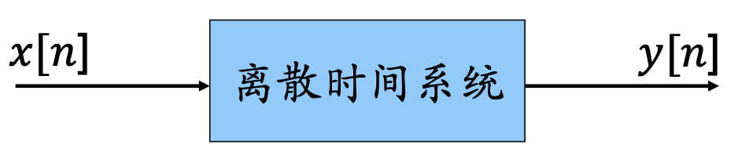

eg: 人口问题

### 两种描述方法

#### 输入输出描述法 (微分方程、差分⽅程)

着眼于系统输入与输出的关系，适⽤用于单输入—单输出系统。

#### 状态变量描述法 (状态⽅程、输出方程)

即可描述输入与输出的关系，还可以描述系统的内部状态 既可⽤用于单输入—单输出系统，⼜可⽤于多输⼊—多输出系统。

### 系统的互联

现实中的系统是各式各样的，其复杂程度也大相径庭。但许多系统都可以分解为若干个简单系统的组合。这一思想对**系统分析**和**系统综合**十分重要。

- 可以通过对简单系统（子系统）的分析并通过子系统互联而达到分析复杂系统的目的。
- 也可以通过将若干个简单子系统互联起来而实现一个相对复杂的系统。

#### 级联

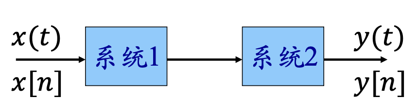

#### 并联

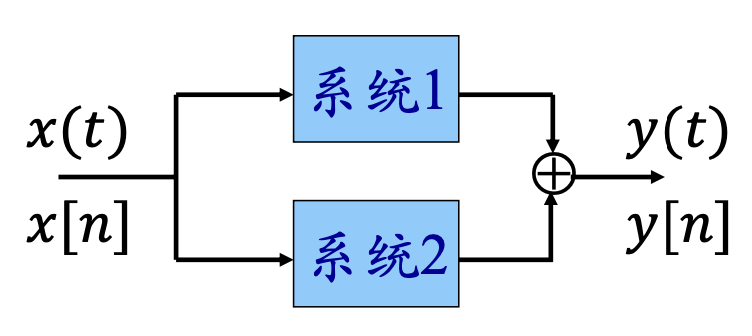

#### 反馈联结

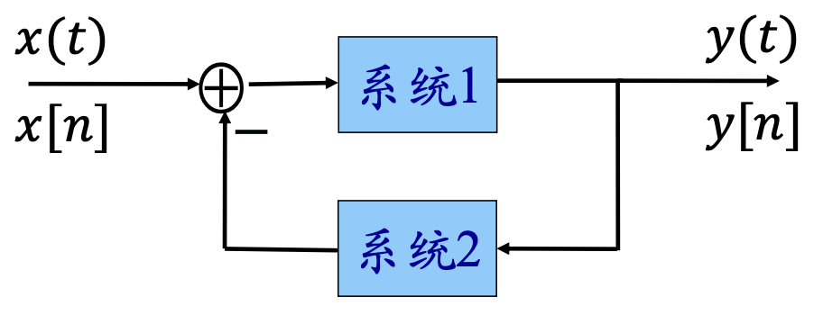

### 系统的组成

⼀个系统由若⼲个基本单元组成， 其中的基本组成单元包括:

#### 加法器

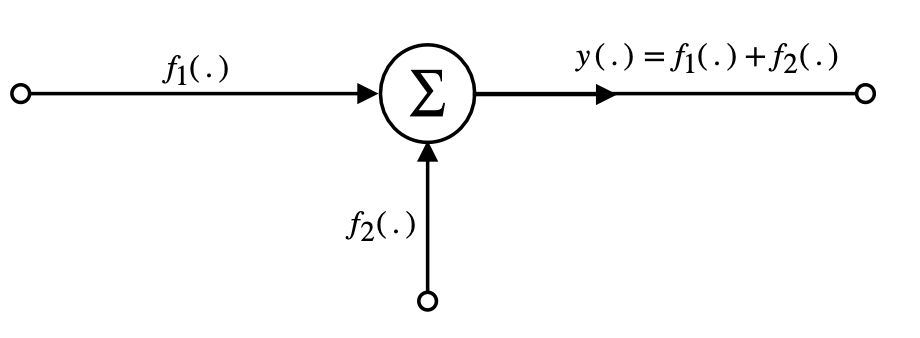

#### 数乘器

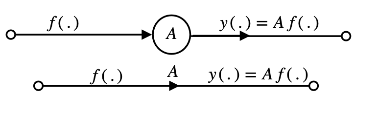

#### 积分器

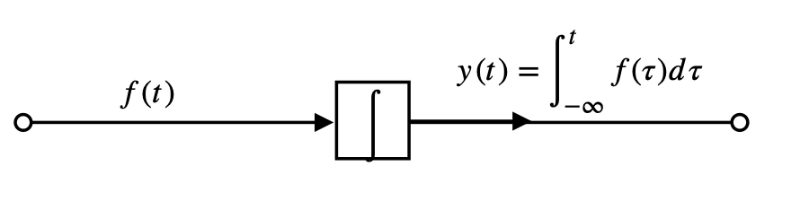

#### 单位延时器

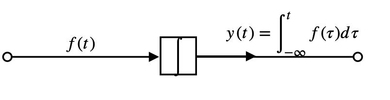

#### 延时器

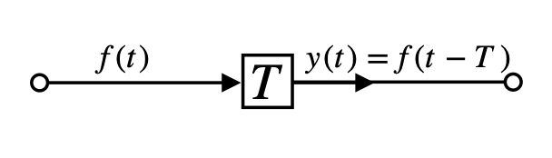

## 系统的基本性质

### 记忆性

在任何时刻，系统的**输出都只与当前时刻的输入有关**，而与该时刻以外的输入无关，则称该系统是**无记忆系统**，也叫**即时系统**。否则就是**记忆系统**，也叫**动态系统**。

!!! abstract
    注意一个特例——**恒等系统**：任何时刻系统的输出响应与输入信号都相同，即有 `y(t) = x(t) `或`y[n] = x[n]` 。

!!! info 
    包含积分器、微分器的系统就是记忆系统

### 可逆性

如果一个系统对任何不同的输入都能产生不同的输出，即**输入与输出是**一一对应**的**，则称该系统是**可逆系统**。反之，称为**不可逆系统**。

一个可逆系统与另一个系统级联后构成一个恒等系统，则称后者是前者的**逆系统** 。

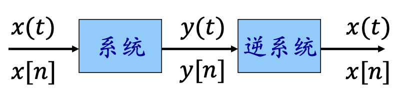

### 因果性

如果系统在**任何时刻的输出只与当前时刻及此前的输入有关**，而和此后的输入无关，就称该系统是**因果**的。否则就是**非因果**的。

一般说来，实时的物理系统都是因果的，因为时间是单向变化的，结果发生于原因之后。

但对非实时处理信号的离散时间系统，或信号的自变量并不具有时间概念的情况，因果性并不一定成为系统能否物理实现的先决条件。

- 因果系统：响应后于激励
- 非因果系统：响应先于激励

!!! info 
    由定义显然可见：非记忆性系统一定是因果的；非因果系统一定是记忆性的。

### 稳定性

如果一个系统**对任意有界输入都产生有界输出**，则该系统是**稳定系统**。否则，就是**不稳定系统**。

即当 $|e(.)|\lt\infty时$ ，$|y_{zs}(.)|\lt\infty$。

!!! info 
    工程实际中通常希望所设计的系统是稳定的。因此稳定性对系统设计来说是一个重要的考虑因素。

### 时不变性

时不变性质只对零状态响应 $y_{zs}( . )$ 讨论

!!! abstract
    $e(.)$ 或 $x(.)$ 表示输入信号，或者说激励

$y_{zs}(.)$ 表示零状态响应，zs 即 zero status 零状态

$y_{zi}(.)$ 表示零输入响应，zi 即 zero input 零输入

全响应 = 零状态响应 + 零输入响应：$y(.)=y_{zx}(.)+y_{zi}(.)$

当输入信号有一个时移时，系统的输出响应也产生相同时移，此外无其它变化，则称该系统是**时不变**的。否则就是**时变**的。

若对任意 $x(t) → y(t)$ 有 $x(t - t0) → y(t - t0)$ ，则系统是时不变的。

:star: 检验一个系统时不变性的步骤（以连续时间为例，离散时间可类推）

1. 令输入为 $x_1(t)$ ，根据系统描述确定对应输出 $y_1(t)$ ;
2. 将输入变为 $x_2(t) = x_1(t - t_0)$ ，再根据系统描述确定输出 $y_2(t)$ ;
3. 根据自变量变换，检验 $y_2(t)$ 是否等于 $y_1(t - t_0)$ 。

### 线性 linear

#### 定义

连续时间线性系统定义

对任意 $x1(t) → y1(t)$ ，$x2(t) → y2(t)$ ，总有 $ax_1(t) + bx_2(t) → ay_1(t) + by_2(t)$ ，其中 a 与 b 是任意常数。

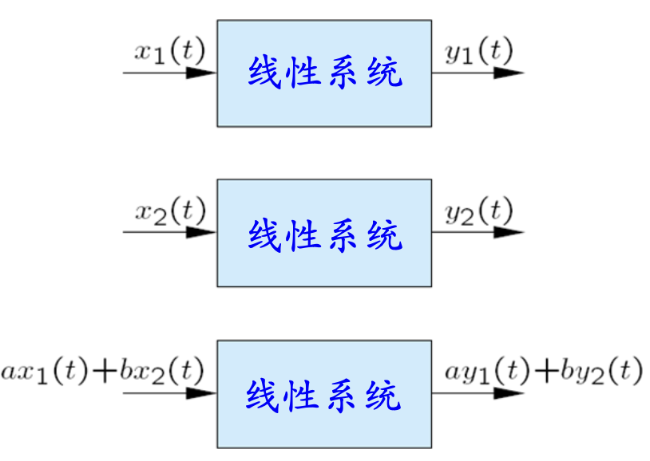

离散时间线性系统同理。

实际上线性等价于以下两个性质之和：

$x_1(t) + x_2(t) → y_1(t) + y_2(t)$（可加性 / 叠加性）

$ax_1(t) → ay_1(t)$（齐次性 / 均匀性）

#### 零输入—零输出特性

根据线性系统的齐次性，可得出：线性系统当输入为零（即没有输入）时，系统的输出响应也必然为零（即没有输出响应）。这就是所谓线性系统的**零输入—零输出特性**

#### 非线性系统举例

eg1 : 满足可加性，但不满足齐次性

$$
y(t) = Re\{x(t)\}
$$

eg2 : 满足齐次性但不满足可加性

$$
y(t) = \frac{[x'(t)]^2}{x(t)}
$$

#### 线性系统的分解特性

如果一个系统是线性的，则只要我们能够**把输入信号分解成若干个简单信号的线性组合**，且知道该系统对每一个简单信号的响应，就可以很方便地通过线性组合而得到系统对原输入信号的响应。即:

$$
\begin{cases}
x(t)=\sum_k a_k x_k (t)\\
x_k(t)\to y_k(t)
\end{cases}
\Rightarrow y(t)=\sum_k a_k y_k (t)
$$

这一思想是**信号与系统分析理论和方法的基础**。

## 特殊系统

### 增量线性系统

在工程实际中，有一类系统并不满足线性系统的要求。但是这类系统的**输出响应的增量与输入信号的增量之间满足线性特性**。这类系统称为**增量线性系统**。

eg：考虑系统 $y(t) = x(t) + 2$ ，由于：

$$
x_1(t) → y_1(t) = x_1(t) + 2\\
x_2(t) → y_2(t) = x_2(t) + 2
$$

该系统既不满足齐次性，也不满足可加性，但当考查输入的增量与输出的增量之间的关系时，有

$$
Δy(t) = y_1(t) - y_2(t) = x_1(t) - x_2(t) = Δx(t)
$$

可见输入的增量与输出的增量之间是满足线性关系的，它是一个增量线性系统。

增量线性系统可以等效为一个线性系统再加上一部分与输入无关的响应。

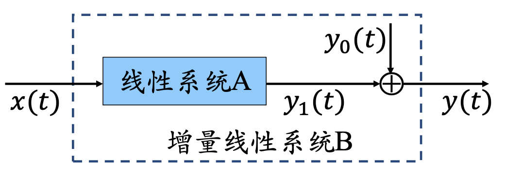

增量线性系统的响应包括：

- 零状态响应：当 $y_0(t) = 0$ 时，$y(t) = y_1(t)$ 。此时系统处于零初始状态，故将 $y_1(t)$ 称为系统的零状态响应。
- 零输入响应：当 $x(t) = 0$ 时，有 $y_1(t) = 0$ ，$y(t) = y_0(t)$ ，因此将 $y_0(t)$ 称为系统的零输入响应。

### 线性时不变系统（LTI）

线性 + 时不变性 = LTI

基本事实：如果知道线性时不变系统对某些输入信号的响应，则可以知道该系统对许多其它输入信号的响应。

!!! info 
    线性时不变（**LTI**）系统是本课程主要关注的系统

#### 线性性质

## 根据系统框图描述建立微分方程

### 对于连续系统

步骤如下

1. 首先判断其阶数，阶数=**积分器**个数
2. 设信号传递**最后一个积分器输出为 $x(t)$ ** ，则各积分器的输入输出均可确定
3. 对每个加法器列⽅程：输入和 = 输出和
4. 联立方程消去中间变量 $x(t)$ ，得到关于输出信号 _y_(_t_) 的微分方程

### 对于离散系统

步骤如下

1. 首先判断其阶数，阶数=**延时单元**个数
2. 设信号传递**第一个延时单元输入为 _x_(_k_)** ，则各延时单元的输入输出均可确定
3. 对每个加法器列⽅程：输入和 = 输出和
4. 联立方程消去中间变量 $x(t)$ ，得到关于输出信号 _y_(_t_) 的微分方程
