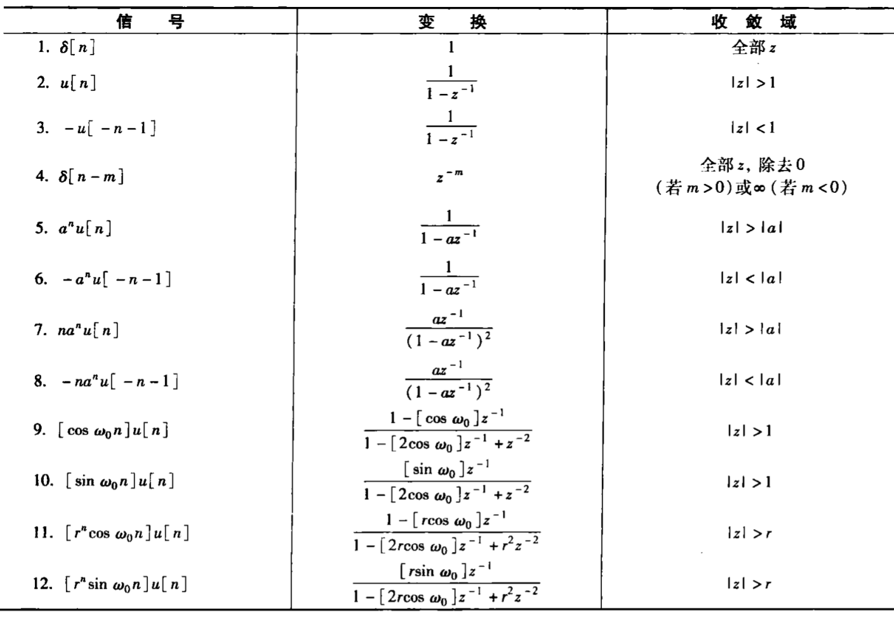
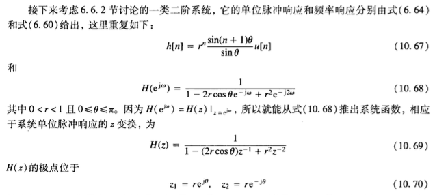
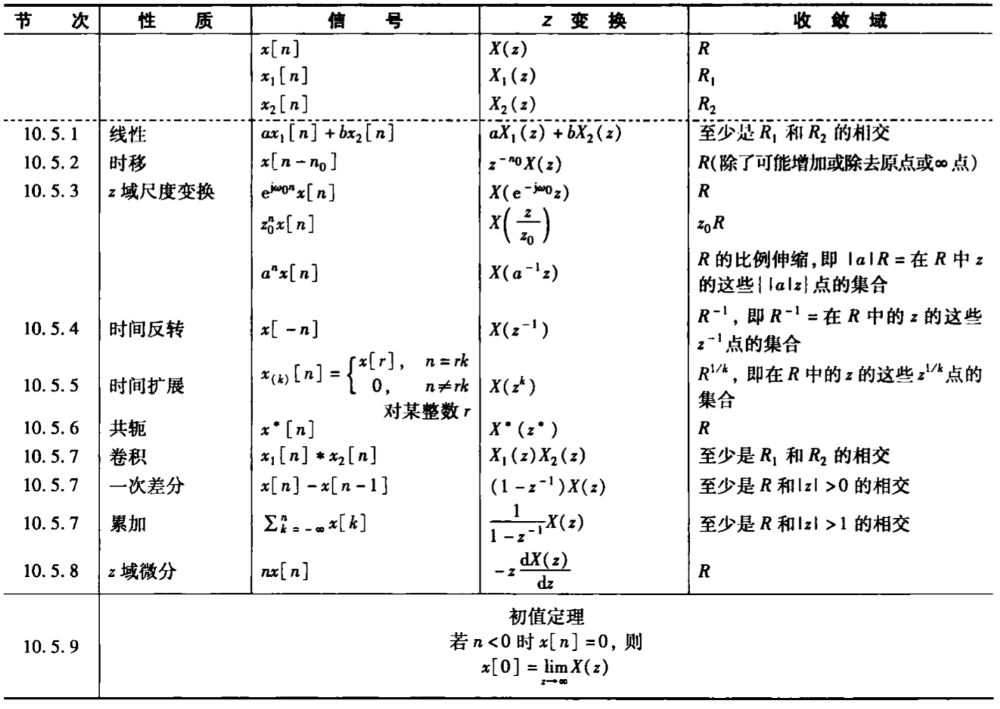
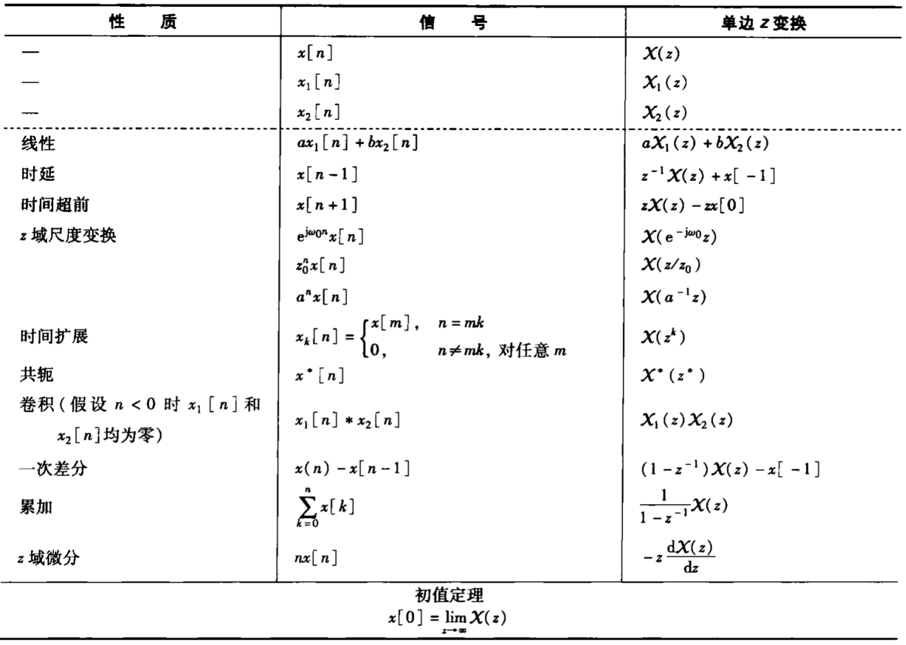
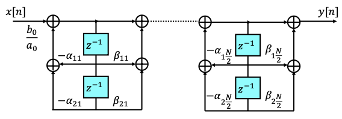
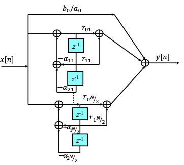

## 公式表

### 基本变换对

常用(双边) z 变换对：

### 二阶系统

### 性质表

双边 z 变换的性质：

单边 z 变换的性质：

## 双边 z 变换

### 定义

$$
X(z)=\sum_{n=-\infty}^{+\infty}x[n]z^{-n}
$$

称为 $x[n]$ 的 z 变换，后面简记为**zT**，其中 **$z=re^{j\omega}$** 为复数。

若 $r=1$ ，$z=e^{j\omega}$ 位于单位圆上，则为 DTFT（离散时间傅里叶变换），也就是说 DTFT 是双边 z 变换在 $r=1$ 或者说是在单位圆上的**特例**，即 $X(z)|_{r=1}=X(e^{j\omega})$。

### zT 与 DTFT 的关系

$$
\begin{aligned}
X(z)=X(re^{j\omega})&=\sum_{n=-\infty}^{+\infty}x[n]r^{-n}e^{-j\omega n}\\
&=\sum_{n=-\infty}^{+\infty}\big[x[n]r^{-n}\big]e^{-j\omega n}\\
&=\mathscr{F}\{x[n]r^{-n}\}
\end{aligned}
$$

所以 $x[n]$的 zT 就是 $x[n]r^{-n}$ 的 DTFT 。

### 零极点图

若 $X(z)$ 是有理函数：

$$
X(z)=\frac{N(z)}{D(z)}=M\frac{\prod_{i}(s-\beta_i)}{\prod_{i}(s-\alpha_i)}
$$

- **分子**多项式的根称为**零点**，画为圆圈 ⭕️
- **分母**多项式的根称为**极点**，画为交叉 ❌

将 $X(z)$ 的全部**零点**和**极点**表示在 $s$ 平面上，就构成了**零极点图**。

零极点图上标出收敛域，可以唯一确定一个 $X(z)$ ，最多与真实的 $X(z)$ 相差一个常数因子 $𝑀$。

### ROC

:warning:不同的信号可能会有完全相同的 z 变换表达式，只是它们的**收敛域**不同。z 变换的表达式只有连同相应的收敛域，才能和信号建立一一对应的关系。

并非 $z$ 平面上的任何复数都能使 z 变换 $X(z)$ 收敛，也不是任何信号的 z 变换都存在。

和拉普拉斯变换一样，使 z 变换收敛的复数 $z$ 的集合，称为 z 变换 (zT) 的**收敛域**（**ROC**，Region of Convergence）

若 $x[n]$ 可以写为若干部分的线性组合，各个部分分别进行 zT 有各自的收敛域，则 $X(z)$ 的收敛域是各个收敛域的**交集**。

- ROC 总是 z 平面上以原点为中心的环形区域
- ROC 的边界总是与 $X(z)$ 的分母的根 (极点) 相对应
- （因为）有理 z 变换在其 ROC 内无任何极点

:star:按照 ROC 在 $z$ 平面上的分布可以分为：

- **右边序列**的 ROC 是某个圆的外部，但可能不包括 $z=\infty$；
  - $x[n]$ 左边界 $\lt0$ 时，$|z|=\infty$ 不在 ROC 内
  - 当且仅当 $z=\infty$ 在 ROC 内时，$x[n]$ 在 $n\lt0$ 时总为 $0$，$x[n]$ 为**因果序列**。
- **左边序列**的 ROC 是某个圆的内部，但可能不包括 $z=0$；
  - $x[n]$ 右边界 $\gt0$ 时，$|z|=0$ 不在 ROC 内
  - 当且仅当 $z=0$ 在 ROC 内时，$x[n]$ 在 $n\gt0$ 时总为 $0$，$x[n]$ 为**反因果序列**。
- **双边序列**的 ROC 如果存在，一定是一个环形区域
- **有限长序列**的 ROC 是整个 z 平面
  - $x[n]$ 左边界 $\lt0$ 时，$|z|=\infty$ 不在 ROC 内
  - $x[n]$ 右边界 $\gt0$ 时，$|z|=0$ 不在 ROC 内

#### 有限长序列

设 $x[n]$ 是有限长序列，定义于 $[N_1,N_2]$ ，则有其 z 变换：

$$
X(z)=\sum_{n=N_1}^{N_2}x[n]z^{-n}
$$

此时既然是有限项求和，当 z 不等于零或无穷大时，和式中的每一项都是有限的，那么显然整个 z 平面上都是收敛的。

如果 $N_1\lt0$，那么 $x[n]$ 对 $n<0$ 一定会有非零值，和式中包括 z 的正幂次项。当 $|z|\to\infty$ 时，涉及 z 的正幂次的那些项就成为无界的，因此收敛域不包括 $|z|=\infty$。

如果 $N_2\gt0$，那么 $x[n]$ 对 $n>0$ 一定会有非零值，和式中包括 z 的负幂次项。当 $|z|\to0$ 时，涉及 z 的负幂次的那些项就成为无界的，因此收敛域不包括 $|z|=0$。

#### 右边序列

设 $x[n]$ 是右边序列，定义于 $[N_1,+\infty)$ ，则有其 z 变换：

$$
X(z)=\sum_{n=N_1}^{+\infty}x[n]z^{-n}
$$

若 $|z|=r_0\in\text{ROC}$ ，则有 $X(z)$ 收敛：

$$
\sum_{n=N_1}^{+\infty}|x[n]z^{-n}|=\sum_{n=N_1}^{+\infty}|x[n]r_0^{-n}|\lt\infty
$$

对任意 $r_1\gt r_0$ 有：

$$
\sum_{n=N_1}^{+\infty}|x[n]r_1^{-n}|=\sum_{n=N_1}^{+\infty}|x[n]r_0^{-n}|\cdot(\frac{r_0}{r_1})^n\leq\sum_{n=N_1}^{+\infty}|x[n]r_0^{-n}|\cdot(\frac{r_0}{r_1})^{N_1}\lt\infty
$$

如果 $N_1\lt0$，那么 $x[n]$ 对 $n<0$ 一定会有非零值，和式中包括 z 的正幂次项。当 $|z|\to\infty$ 时，涉及 z 的正幂次的那些项就成为无界的，因此收敛域不包括 $|z|=\infty$。

于是就可得：

- 若 $X(z)$ 为有理函数，则 ROC  必位于最外极点之外
- $N_1\lt0$ 时，$|z|=\infty$ 不在 ROC 内
- 当且仅当 $z=\infty$ 在 ROC 内时，$x[n]$ 为因果序列

#### 左边序列

设 $x[n]$ 是左边序列，定义于 $(-\infty,N_1]$ ，则有其 z 变换：

$$
X(z)=\sum_{n=-\infty}^{N_1}x[n]z^{-n}
$$

若 $|z|=r_0\in\text{ROC}$ ，则有 $X(z)$ 收敛：

$$
\sum_{n=-\infty}^{N_1}|x[n]z^{-n}|=\sum_{n=-\infty}^{N_1}|x[n]r_0^{-n}|\lt\infty
$$

对任意 $r_1\lt r_0$ 有：

$$
\sum_{n=-\infty}^{N_1}|x[n]r_1^{-n}|=\sum_{n=-\infty}^{N_1}|x[n]r_0^{-n}|\cdot(\frac{r_0}{r_1})^n\leq\sum_{n=-\infty}^{N_1}|x[n]r_0^{-n}|\cdot(\frac{r_0}{r_1})^{N_1}\lt\infty
$$

如果 $N_1\gt0$，那么 $x[n]$ 对 $n>0$ 一定会有非零值，和式中包括 z 的负幂次项。当 $|z|\to0$ 时，涉及 z 的负幂次的那些项就成为无界的，因此收敛域不包括 $|z|=0$。

于是就可得：

- 若 $X(z)$ 为有理函数，则 ROC  必位于最内极点之内内
- $N_1\gt0$ 时，$|z|=0$ 不在 ROC 内
- 当且仅当 $z=0$ 在 ROC 内时，$x[n]$ 为反因果序列

#### 双边序列

设 $x[n]$ 是双边序列，定义于 $(-\infty,+\infty)$ ，则有其 z 变换：

$$
X(z)=\sum_{n=\infty}^{+\infty}x[n]z^{-n}
$$

和有限长序列相反，此时收敛域不包括 $|z|=\infty$ 也不包括 $|z|=0$。此时的收敛域是 z 平面上的环形区域

!!! abstract
    $z^N=a^N$ 的解为：$z=ae^{j\frac{2\pi}{N}k}$。均匀分布在半径为 $a$ 的圆上

## z 反变换

### 定义

利用 zT 和 DTFT 的关系、DTFT 的反变换可以得到 zT 的反变换。

（zT 和 DTFT 的关系：）

$$
\begin{aligned}
X(z)&=\sum_{n=-\infty}^{+\infty}x[n]r^{-n}e^{-j\omega n}\\
X(re^{j\omega})&=\sum_{n=-\infty}^{+\infty}\big[x[n]r^{-n}\big]e^{-j\omega n}\\
&=\mathscr{F}\{x[n]r^{-n}\}
\end{aligned}
$$

进而由 DTFT 的反变换有：

$$
\begin{aligned}
x[n]r^{-n}&=\frac{1}{2\pi}\int_{2\pi}X(re^{j\omega})e^{j\omega n}d\omega\\
x[n]&=\frac{1}{2\pi}\int_{2\pi}X(re^{j\omega})r^ne^{j\omega n}d\omega\\
x[n]&=\frac{1}{2\pi}\int_{2\pi}X(z)z^{n}d\omega
\end{aligned}
$$

对 $z=re^{j\omega}$ 两侧同时微分得到：$dz=jre^{j\omega}d\omega=jzd\omega$ ；同时，当 $\omega$ 从 $0\to2\pi$ 时，$z$ 沿着 ROC 内半径为 $r$ 的圆积分一周 ，所以可得到 **z 反变换为**：

$$
x[n]=\frac{1}{2\pi j}\oint X(z)z^{n-1}dz
$$

式中 $\oint$ 记为在半径为 $r$，以原点为中心的封闭圆上沿逆时针方向环绕 一周的积分。$r$ 的值可选为使 $X(z)$ 收敛的任 何值也就是使 $|z|=r$ 的积分围线位于收敛域内的任何值。

### 部分分式展开法

1. 将 $X(z)$ 展开为部分分式
2. 根据 $X(z)$ 的 ROC ，确定每一项的 ROC
3. 利用常用信号变换对与拉普拉斯变换性质，对每一项进行反变换

### 幂级数展开法

由 $X(z)$ 的定义，将其展开为幂级数，有

$$
\begin{aligned}
X(z)=&\cdots+x[-n]z^n+\cdots+x[-2]z^{2}+x[-1]z\\
&+x[0]+\\
&x[1]z^{-1}+x[2]z^{-2}+\cdots+x[n]z^{-n}+\cdots
\end{aligned}
$$

展开式中 $z^{-n}$ 项的系数即为 $x[n]$。

泰勒级数展开法适合用来求解非有理函数形式 $X(z)$ 的反变换。

:star:当 $X(z)$ 是有理函数时，可以通过**长除**的方法将其展开为幂级数：（但可能不易获得闭式表达）

- **右边序列**的展开式中应包含无限个 $z$ 的负幂项，所以要按**降幂长除**。
- **左边序列**的展开式中应包含无限个 $z$ 的正幂项，要按**升幂长除**。
- 对**双边序列**，先要将其分成对应信号的右边和左边的两部分，再分别按上述原则长除。

## zT 的几何求值

> 其方法与拉普拉斯变换时完全类似

考查动点在单位圆上移动一周时，各极点矢量和零点矢量的长度与幅角变化的情况，即可反映频率特性。

### 一般情况

对有理函数形式的 $X(z)$：

$$
X(z)=\frac{N(z)}{D(z)}=M\frac{\prod_i(s-\beta_i)}{\prod_i(s-\alpha_i)}
$$

可得：

$$
\begin{aligned}
|X(z)|&=|M|\frac{\prod_i|\vec{s}-\vec{\beta_i}|}{\prod_i|\vec{s}-\vec{\alpha_i}|}\\
\angle X(z)&=\sum_i\angle(\vec{s}-\vec{\beta_i})-\sum_i\angle(\vec{s}-\vec{\alpha_i})
\end{aligned}
$$

从所有零点向 $s$ 点作零点矢量，从所有极点向 $s$ 点作极点矢量：

- 所有零点矢量的长度之积 (不存在则为 1 ) 除以所有极点矢量的长度之积即为 $|X(z)|$；
- 所有零点矢量的幅角之和 (不存在则为 0 ) 减去所有极点矢量的幅角之和即为 $\ang X(z)$；

当 $s$ 取为单位元上的点时，即为傅里叶变换的几何求值。考查 $s$ 在单位圆上移动时所有零、极点矢量的长度和幅角的变化，即可得出 $X(e^{j\omega})$ 的幅频特性和相频特性

:star: ROC 包括单位圆，则说明 $x[n]$ 对应的傅里叶变换存在:warning:

## zT 性质

> 与 s 变换类似，在讨论 z 变换的许多性质时我们都要考虑其 ROC 的变化。

### 线性

$$
x_1[n]\stackrel{zT}{\longleftrightarrow}X_1(z),\ \ \text{ROC}:R_1\\
x_2[n]\stackrel{zT}{\longleftrightarrow}X_2(z),\ \ \text{ROC}:R_2
\Rightarrow
ax_1[n]+bx_2[n]\stackrel{zT}{\longleftrightarrow}aX_1(z)+bX_2(z)
$$

后者的 ROC **至少**是 $R_1\cap R_2$ ，否则若 $R_1\cap R_2=\varnothing$ ，则 $ax_1[n]+bx_2[n]$ 的 LT 不存在。

ROC 也有可能扩大：$X_1(z)$ 与 $X_2(z)$ 线性组合时，若发生了零极点相抵消的现象，且当被抵消的极点恰好在 ROC 的边界上时，就会使 ROC 扩大。

### 时移特性

$$
x[n]\stackrel{zT}{\longleftrightarrow}X(z),\ \ \text{ROC}:R
\Rightarrow
x[n-n_0]\stackrel{zT}{\longleftrightarrow}X(z)z^{-n_0}
$$

后者的 ROC 为 $R$ ，但是在 $z=0$ 和 $z=∞$ 可能会有增删，这是由于 $x[n]$ 的平移可能改变其在 $x$ 轴正半轴、负半轴的取值情况，信号时移可能会改变其因果性。

### z 域尺度变换

$$
x[n]\stackrel{zT}{\longleftrightarrow}X[n],\ \ \text{ROC}:R
\Rightarrow
x[n]z_0^{n}\stackrel{zT}{\longleftrightarrow}X\big(\frac{z}{z_0}\big),\ \ \text{ROC}:|z_0|R
$$

:warning:这里 $|z_0|R$ 的意思是将 $R$ 的边界缩放为 $z_0$ 倍:warning:，也就是整体的模缩放为 $z_0$ 倍。实际上 ROC 还会有一个 $\omega_0$ 的角度偏移（$z_0=|z_0|e^{j\omega_0}$），所以零点和极点位置发生缩放和旋转。

特别地，当 $z_0=e^{j\omega_0}$ 时，有 $|z_0|R=R$，只有旋转没有缩放。在公式表中这一项被单独列出。

!!! abstract
    连续时间的时域尺度变换的概念不能直接推广到离散时间中，因为离散时间变量仅仅定义在整数值上。相对应的，z 变换有时域反转、时域扩展这两个性质

### 时域反转

若信号在时域尺度变换，其 LT 的 ROC 在 $s$ 平面上作相反的尺度变换。

$$
x[n]\stackrel{zT}{\longleftrightarrow}X(z),\ \ \text{ROC}:R
\Rightarrow
x[-n]\stackrel{zT}{\longleftrightarrow}X(z^{-1}),\ \ \text{ROC}:\frac{1}{R}
$$

:warning:这里 $\frac{1}{R}$ 的意思是 $R$ 收敛域边界倒置:warning:，零点、极点也将变为倒数。

### 时域扩展

定义在原有序列 $x[n]$ 的各连续值之间插入 $k-1$ 个零值序列：

$$
x_{(k)}[n]=\begin{cases}
x[\frac{n}{k}],&n\text{是}k\text{的整数倍}\\
0,&n\text{不是}k\text{的整数倍}
\end{cases}
$$

于是有：

$$
x[n]\stackrel{zT}{\longleftrightarrow}X(z),\ \ \text{ROC}:R
\Rightarrow
x_{(k)}[n]\stackrel{zT}{\longleftrightarrow}X(z^{k}),\ \ \text{ROC}:R^{\frac{1}{k}}
$$

:warning:这里 $R^{\frac{1}{k}}$ 的意思与前面相似...

### 共轭对称性

$$
x[n]\stackrel{zT}{\longleftrightarrow}X(z),\ \ \text{ROC}:R
\Rightarrow
x^*[n]\stackrel{zT}{\longleftrightarrow}X^*(z^*),\ \ \text{ROC}:R
$$

!!! abstract
    这里可以结合 $|X(z)|=|X(z^*)|$ 理解，模相同意味着二者总是零点极点相同......

特别地，当 $x[n]$ 为**实信号**时，有：

$$
x^*[n]=x[n]\stackrel{zT}{\longleftrightarrow}
X^*(z^*)=X(z)=X^*(z)=X(z^*)
$$

> 这里 $X^*(z^*)=X(z)$ 等价于 $X^*(z)=X(z^*)$。

因此，如果 $x[n]$ 是实信号，且 $X(z)$ 在 $z_0$ 有极点(或零点)，则 $X(z)$ 一定在 $z_0^*$ 也有极点(或零点)。即实信号的 z 变换其**零、极点必共轭成对出现**。

### 卷积性质

$$
x_1[n]\stackrel{zT}{\longleftrightarrow}X_1(z),\ \ \text{ROC}:R_1\\
x_2[n]\stackrel{zT}{\longleftrightarrow}X_2(z),\ \ \text{ROC}:R_2
\Rightarrow
x_1[n]*x_2[n]\stackrel{zT}{\longleftrightarrow}X_1(z)X_2(z)
$$

类似线性性质中，后者的 ROC **包括** $R_1\cap R_2$ ，否则若 $R_1\cap R_2=\varnothing$ ，则 $x_1[n]*x_2[n]$ 的 LT 不存在。

ROC 也有可能扩大：$X_1(z)$ 与 $X_2(z)$ 相乘时，若发生了零极点相抵消的现象，且当被抵消的极点恰好在 ROC 的边界上时，就会使 ROC 扩大。

### 时域差分

$$
y[n]=x[n]-x[n-1]=\big(\delta[n]-\delta[n-1]\big)*x[n]
$$

$y[n]$ 为 $x[n]$ 的的**一次差分**。可以认为是离散时间情况下的“微分”。

$$
x[n]\stackrel{zT}{\longleftrightarrow}X(z),\ \ \text{ROC}:R
\Rightarrow
x[n]-x[n-1]\stackrel{zT}{\longleftrightarrow}(1-z^{-1})X(z)
$$

后者的 ROC 至少是 $R$ 和 $|z|>0$ 的相交。

### z 域微分

$$
x[n]\stackrel{zT}{\longleftrightarrow}X(z),\ \ \text{ROC}:R
\Rightarrow
nx[n]\stackrel{zT}{\longleftrightarrow}-z\frac{d}{dz}X(z),\ \ \text{ROC}:R\\
$$

### 时域累加

$$
w[n]=\sum_{k=-\infty}^{n}x[k]=u[n]*x[n]
$$

$w[n]$ 为 $x[n]$ 的的**累加/求和**。可以认为是离散时间情况下的“积分”。

$$
x[n]\stackrel{zT}{\longleftrightarrow}X(z),\ \ \text{ROC}:R
\Rightarrow
\sum_{k=-\infty}^{n}x[k]\stackrel{zT}{\longleftrightarrow}\frac{1}{1-z^{-1}}X(z)
$$

后者的 ROC 至少是 $R$ 和 $|z|>1$ 的相交，也就是包括 $R$ 在单位圆外侧的部分。这是因为：

$$
\sum_{k=-\infty}^{n}x[k]=x[n]*u[n]
$$

### 初值与终值定理

#### 初值定理

如果 $x(t)$ 是因果信号，也就是 $n<0$ 时 $x[n]=0$，则有**初值定理**：

$$
x[0]=\lim_{z\to\infty}X(z)
$$

!!! abstract
    或者非因果信号可以用单边 z 变换表示：

$$
x[0]=\lim_{z\to\infty}\chi(z)
$$

---

证明

将 $X(z)$ 按照定义式展开有：

$$
\begin{aligned}
X(z)=x(0)+x(1)z^{-1}+x(2)z^{-2}+\cdots+x(n)z^{-n}+\cdots
\end{aligned}
$$

显然就有 $x[0]=\lim_{z\to\infty}X(z)$。

#### 终值定理

如果 $x[n]$ 是因果信号，$X(z)$ 除了在 $z=1$ 可以有单阶极点外，其余极点均在单位圆内

!!! abstract
    上述条件的目的在于保证**终值存在**。

则有**终值定理**：

$$
\lim_{n\to\infty}x[n]=\lim_{z\to1}(z-1)X(z)
$$

---

证明

$$
\begin{aligned}
\lim_{z\to1}(z-1)X(z)
&=\lim_{z\to1}\sum_{n=-1}^{\infty}\big(x[n+1]-x[n]\big)z^{-n}\\
&=\lim_{m\to\infty}\sum_{n=-1}^{m}\big(x[n+1]-x[n]\big)\\
&=\lim_{m\to\infty}\sum_{n=-1}^{m}\big(x[0]-x[-1]+x[1]-x[0]+\cdots+x[m+1]-x[m]\big)\\
&=\lim_{m\to\infty}x[m+1]\\
&=\lim_{n\to\infty}x[n]
\end{aligned}
$$

## zT 分析 LTI 系统

以卷积特性为基础，可建立 LTI 系统的 z 变换分析方法，即：

$$
Y(z)=X(z)\cdot H(z)
$$

设离散时间 LTI 系统的单位脉冲响应为 $h[n]$，则 $h[n]$ 的 z 变换 $H(z)$ 称为系统函数或转移函数，它描述了一个离散时间 LTI 系统并体现其系统特性。其中 $H(z)$ 是 $h[n]$ 的 z 变换，称为**系统函数**或**转移函数**、**传递函数**。

### 特征函数

$x[n]=e^{z_0t}$ 时，响应为：

$$
y[n]=H(z_0)e^{z_0t}
$$

### 因果性

- 系统是**因果**的当且仅当：如果 $n<0$ 时 $h[n]=0$，则 $H(z)$ 的 ROC 是最外部极点的外部，并且包括 $z=\infty$；
- 系统是**反因果**的当且仅当：如果 $n>0$ 时 $h[n]=0$，则 $H(z)$ 的 ROC 是最内部极点的内部，并且包括 $z=0$；

对于 $H(z)$ 表达式已知，判断因果性、反因果性与否可以直接看 $\lim_{z\to0}H(z)$ 或 $\lim_{z\to\infty}H(z)$ 是否收敛存在。

### 稳定性

LTI 系统若稳定，即 $\sum_{n=-\infty}^{\infty}|h[n]|\lt\infty$，也即 $h[n]$ 的 DTFT 存在，则 $H(z)$ 的 ROC 必包括单位圆；反之亦然。所以 LTI 系统稳定的充要条件是 ROC 包含单位圆。

对于**因果稳定**的 LTI 系统，其系统函数 $H(z)$ 如果存在极点，则全部极点必须位于单位圆内。

### 线性常微分方程

> \*线性常系数微分方程

如果由线性常系数微分方程描述的系统满足初始松弛条件，则系统是**因果 LTI** 的，其 $H(z)$ 的 ROC 必是最外侧极点的外部。

对于由线性常系数微分方程描述的 LTI 系统：

$$
\sum_{k=0}^{N}a_k\cdot y[n-k]=\sum_{k=0}^{M}b_k\cdot x[n-k]
$$

两边进行 z 变换，可得：

$$
\sum_{k=0}^{N}a_k\cdot z^{-k}\cdot Y(z)=\sum_{k=0}^{M}b_k\cdot z^{-k}\cdot X(z)\\
Y(z)\sum_{k=0}^{N}a_k\cdot z^{-k}=X(z)\sum_{k=0}^{M}b_k\cdot z^{-k}
$$

所以：

$$
H(z)={Y(z)\over X(z)}={\sum_{k=0}^{M}b_{k}z^{-k}\over\sum_{k=0}^{N}a_{k}z^{-k}}
$$

可得到 $H(z)$ 是一个**有理函数**。系统的单位冲激响应 $h[n]$ 可由 $H(z)$ 反变换获得。

## 因果 LTI 系统的方框图表示

- 级联
- 并联
- 反馈联接

### 直接型表示

### 级联型表示

将 $H(z)$ 因式分解，在无重阶极点时可得：

$$
H(z)={\sum_{k=0}^{M}b_{k}z^{-k}\over\sum_{k=0}^{N}a_{k}z^{-k}}
=\frac{b_0}{a_0}{\sum_{k=1}^{M}(1+\mu_k z^{-1})\over\sum_{k=1}^{N}(1+\eta_kz^{-k})}
$$

当 $M=N$ 为偶数时，可得：

$$
H(z)=\frac{b_0}{a_0}\sum_{k=1}^{\frac{N}{2}}{1+\beta_{1k} z^{-1}+\beta_{2k}z^{-2}\over1+\alpha_{1k}z^{-1}+\alpha_{2k}z^{-2}}
=\frac{b_0}{a_0}\sum_{k=1}^{\frac{N}{2}}H_k(z)
$$

其中 $H_k(z)$ 是二阶子系统。系统级联表示为 $\frac{N}{2}$ 个二阶子系统的级联如下：

### 并联型表示

将 $H(z)$ 展开为部分分式，在无重阶极点时可得：

$$
H(z)=\frac{b_0}{a_0}+\sum_{k=1}^{N}\frac{A_k}{1+\eta_kz^{-1}}
$$

当 $M=N$ 为偶数时，可得：

$$
H(z)=\frac{b_0}{a_0}+\sum_{k=1}^{\frac{N}{2}}{r_{0k}+r_{1k} z^{-1}\over1+\alpha_{1k}z^{-1}+\alpha_{2k}z^{-2}}
=\frac{b_0}{a_0}+\sum_{k=1}^{\frac{N}{2}}H_k'(z)
$$

其中 $H_k'(z)$ 是二阶子系统。系统级联表示为 $\frac{N}{2}$ 个二阶子系统的并联如下：

## 单边 z 变换

> Unilateral z Transform

单边 z 变换是仅考虑大于 $-1$ 之后部分信号的双边 z 变换，也就是 $x[n]\cdot u[n]$ 的双边 z 变换：

$$
\chi(z)=\sum_{n=0}^{+\infty}x[n]z^{-n}
$$

单边 z 变换的反变换与同 ROC 的双边 z 变换的反变换相同：

$$
x[n]=\frac{1}{2\pi j}\oint X(z)z^{n-1}dz,\ \ n\geq0
$$

$X(z)$ 与 $\chi(z)$ 不同，是因为 $x[n]$ 在 $n<0$ 的部分对 $X(z)$ 有作用，而对 $\chi(z)$ 没有任何作用所致。

由于单边拉普拉斯变换不存在类似双边拉普拉斯变换中与 ROC 相关的多义性，一般不再强调其 ROC ，任何单边 z 变换的 ROC 一定是最外侧极点的外部。

**因果信号**的双边 z 变换和单边 z 变换完全相同。:star:从而可以利用双边 LT 的基本变换对。

### 性质

由于单边拉普拉斯变换是特殊的双边拉普拉斯变换，因此其大部分性质与双边拉普拉斯变换相同，主要的不同是时移特性，分为：

- 时移特性
  - 时延
  - 时间超前

#### 时延

$$
x[n]\stackrel{UzT}{\longleftrightarrow}\chi(z)
\Rightarrow
\begin{aligned}
x[n-1]&\stackrel{UzT}{\longleftrightarrow}z^{-1}\chi(z)+x[-1]\\
x[n-2]&\stackrel{UzT}{\longleftrightarrow}z^{-2}\chi(z)+x[-1]z^{-1}+x[-2]\\
&......
\end{aligned}
$$

#### 时间超前

$$
x[n]\stackrel{UzT}{\longleftrightarrow}\chi(z)
\Rightarrow
x[n+1]\stackrel{UzT}{\longleftrightarrow}z\big(\chi(z)-x[0]\big)
$$

### 差分方程

利用单边 z 变换和**时延**性质来解具有非零初始条件的线性常系数差分方程，单边 z 变换在将线性常系数差分方程变换为 z 域代数方程时，可以自动将方程的初始条件引入，因而在解决增量线性系统问题时特别有用。

往往假定系统为**因果**系统。该条件下得到的结果在进行单边 z 反变换的时候可以确定为**右边信号**。

以二阶为例（最高二阶差分），将初始条件带入后，整理得到如下形式：

$$
\begin{aligned}
A\gamma(z)&=By[-1]+Cy[-2]+D\chi(z)\\
\gamma(z)&=\frac{B}{A}y[-1]+\frac{C}{A}y[-2]+\frac{D}{A}\chi(z)
\end{aligned}
$$

其中 $\frac{D}{A}\chi(z)$ 对应的单边 z 反变换为**零状态响应**；$\frac{B}{A}y[-1]+\frac{C}{A}y[-2]$ 对应的单边 z 反变换为**零输入响应**；

$$
\begin{aligned}
\gamma(z)=k_1\frac{1}{1-z^{-1}}+\cdots
\end{aligned}
$$

其中 $k_1\frac{1}{1-z^{-1}}$ 为**强迫响应**，$k_1$ 为常数，也就是对应的单边 z 反变换为 $k_1u[n]$ 形式的才是强迫响应；其他都是**自然响应**；
