## 群(Group)的定义

如果集合 G 及其二元运算 $\cdot$ 满足下面的性质，则称 $(G,\cdot )$ 是群：

- 二元运算 $\cdot$ 满足**结合律**：即 $∀a,b,c\in G$ 有 $(a\cdot b)\cdot c=a\cdot(b\cdot c)$；
- 有**单位元** $e$，即存在 $e\in G$，使得 $∀a\in G$ 有 $e\cdot a=a\cdot e=a$；
- $∀a\in G$ 关于 $\cdot$ 有**逆元** $a^{-1}$，即 $∀a\in G$，存在 $b\in G$，使得 $a\cdot b=b\cdot a=e$，记 $b$ 为 $a^{-1}$；

从代数系统角度说，群有三个运算：

- 二元运算 $\cdot$；
- 一元运算 $(-)^{-1}$；
- 零元运算 $e$；

其中二元运算占主导地位，在谈到群时经常只明确给出它的二元运算。进一步，在上下文能明确其运算时，人们通常直接称集合 $G$ 是群

如果集合 $S$ 有满足结合律的二元运算 $\cdot$ ，则称 $(S,\cdot)$ 是**半群(semi-group)**

如果 $\cdot$ 还有单位元 $e$，则称 $(S,\cdot,e)$ 是**独异点(monoid)**

### 常用群举例

#### 整数加群

整数集 Z 及整数加法运算构成群，称为整数加群

- 单位元是 $0$。
- 每个整数 $z$ 的逆元是 $-z$。

#### 模 m 剩余类加群 $\mathbb{Z}_m$

对整数 $m≥2$，记 $\mathbb{Z}_m=\{0,1,\cdots,m-1\}$，$\mathbb{Z}_m$ 及 模 $m$ 加 $\oplus_m$ 构成群，称为**模 $m$ 剩余类加群**

$0$ 是单位元，对每个整数 $z\in \mathbb Z_m$，它的逆元是 $((-z)+m)\bmod m$

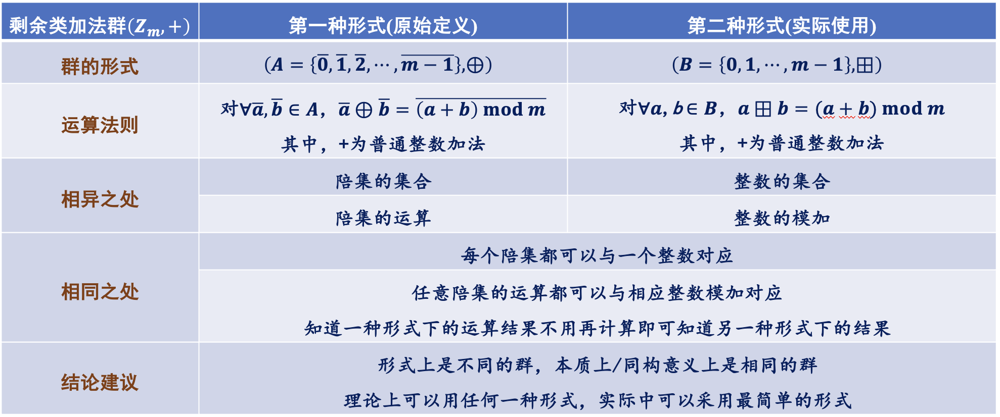

#### $\mathbb{Q^*}$ $\mathbb{R^*}$ $\mathbb{C^*}$乘法群

整数集 $\mathbb Z$ 关于整数乘法不构成群，但非零有理数集$\mathbb Q^*$、非零实数集 $\mathbb R^*$、非零复数集 $\mathbb C^*$ 关于数的乘法运算构成群

#### 实矩阵乘法群

记**实数域上的 n 阶方阵**构成的集合为 $M_n (\mathbb R)$，则它关于矩阵加法构成群；记**实数域上的 n 阶可逆方阵构**成的集合为 $GL_n (\mathbb R)$，则它关于矩阵乘法构成群

#### 双函数复合群

集合 S 上的所有双函数 $f:S→S$ 及复合构成群

- 恒等函数是单位元
- 逆函数给出逆元

#### 模 m 单位群 U(m)

$\mathbb Z_m$ 及 模 m 乘 $⊗_m$ 不构成群，但令$U(m)=\{a∣a\in Z_m \text{且a与m互质}\}$，则 U(m) 与$⊗_m$ 构成群，称为**模 m 单位群**

- 1 是单位元
- 对每个整数 $z\in U(m)$，它的逆元是同余方程 $xz≡1(\text{mod} m)$的解
  - 利用贝祖定理（即 $∀a,b\in \mathbb Z^+，\exists s, t\in \mathbb Z,gcd⁡(a,b)=as+bt$）可证明 U(m) 对 $⊗_m$ 封闭，以及上述同余方程解的存在性，也即逆元的存在性

当 p 是素数，则 U(p) 群也记为 $\mathbb Z_p^*$

模 m 单位群的阶：$|U(m)|=ϕ(m)$，这里 $ϕ(m)$ 是欧拉函数，即：

$$
|U(m)|=ϕ(m)=m\prod_{i=1}^{s}(1-\frac{1}{p_i} )
$$

这里 $p_1,⋯, p_s$ 是 m 的 s 个不同的素因子

### 具体群举例

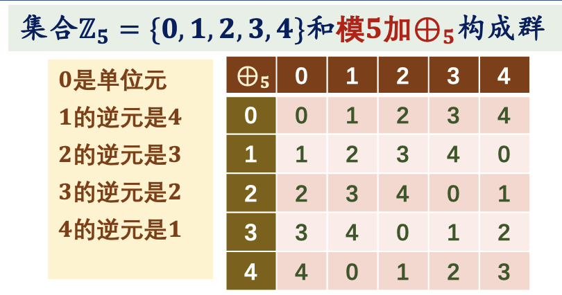

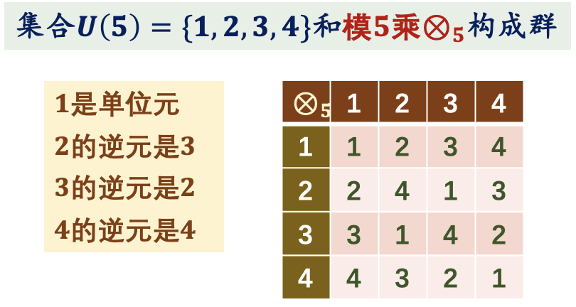

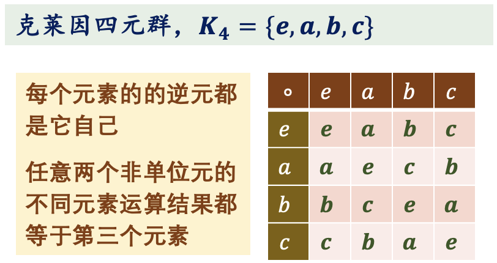

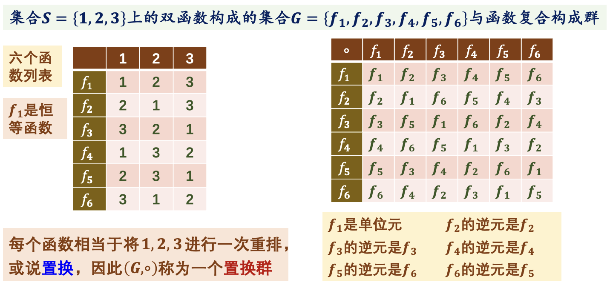

### 群的一些术语

#### 交换群

群的运算**不一定满足交换律**，满足交换律的群称为**交换群**，也称为**阿贝尔群**

#### 群的阶

群 G 的元素个数（准确地说 G 的基数）|G|称为群 G 的**阶(order)**，如果 G 是有穷集，则称为有穷群（有限群），否则称为无穷群（无限群）

#### 加群

当群称为**加群**时通常将它：

- 单位元记为 0
- 元素 a 的逆元记为-a
- 运算称为加法
- 运算的结果称为和
- 运算用加号 + 表示

!!! warning
    通常只有当群是交换群的时候，才使用加号'+'表示这个群的运算

#### 乘群

将不是加群的群称为**乘群**，并将：

- 乘群的单位元通常用 1 或 e 表示
- 元素 a 的逆元用$a^{-1}$表示
- 运算称为乘法
- 运算结果称为积
- 运算用 $\circ$ 或 $\cdot$ 或 \* 表示，但通常省略不写！

## 群的一些基本性质

群有单位元，因此**群不可能是空集**

群要求每个元素都有逆元，而运算的零元不可能有逆，因此**群没有零元（除平凡群 $(\{e\},\circ)$ 外）！**

### 逆运算基本性质

设 $G$ 是群，有：

$$
∀a\in G，(a^{-1})^{-1}= a
$$

$$
∀a, b\in G, (ab)^{-1}= b^{-1} a^{-1}
$$

---

证明

根据逆元的定义有 $a$ 和 $a^{-1}$ 互为逆元。

$$
(b^{-1} a^{-1})(ab)=b^{-1}(a^{-1}a)b=b^{-1}eb=b^{-1} b=e$
$$

类似地:

$$
ab(b^{-1}a^{-1})=e
$$

因此 $ab$ 与 $b^{-1}a^{-1}$ 互为逆元。

### 群满足消去律

群的二元运算**满足消去律**：

设 $G$ 是群，对任意 $a,b,c\in G$, $ab=ac$ 蕴涵 $b=c$ ，同样 $ba=ca$ 蕴涵 $b=c$。

---

证明

若 $ab=ac$，则有 $a^{-1}(ab)=a^{-1} (ac)$

而群运算满足结合律，因此 $(a^{-1} a)b=(a^{-1} a)c$

而$a^{-1} a=e$，$e$ 是单位元，从而有 $b=c$；

同理可证 $ba=ca$ 蕴涵 $b=c$。

### 群的充要条件 1

给定非空集 $G$ 及其上的二元运算（假定是乘法运算而省略其运算符号）。$G$ 关于该二元运算构成**群的充分必要条件**是：

- $G$ 的二元运算**满足结合律**
- $G$ 的二元运算**有左单位元**：即存在 $e\in G$ 使得对任意的 $a\in G$ 有 $ea=a$；
- $G$ 的每个元素**相对左单位元有左逆元**：即 $\forall a\in G$，存在 $a'\in G$ 使得 $a'a=e$；

!!! abstract
    “左”换成“右”也一样

证明：

$$
\forall a\in G,\ \ \exists a'\in G,\ \ a'a=e\\
aa'a=a\\
a(a'a)=a\\
ae=a
$$

所以 e 也是右单位元；

$$
\forall a\in G,\ \ \exists a'\in G,\ \ a'a=e\\
\exists a''\in G,\ \ a''a'=e \\
aa'=eaa'=a''a'aa'=a''(a'a)a'=a''ea'=a''a'=e
$$

所以 每个元素的左逆元也是右逆元。

### 群的充要条件 2

给定非空集 $G$ 及其二元运算，且该二元运算**满足结合律**。$G$ 构成群的充分必要条件是：

对任意的 $a,b\in G$，方程 $ax=b$ 与 $ya=b$ 在 $G$ 中都有解。

### 问题 5

给定非空集 $G$ 及其上的二元运算（假定是乘法运算而省略其运算符号）满足：

- 该运算有**左单位元** $e$ ，即 $∀a\in G$ 有 $ea=a$；
- 对关于该左单位元，每个元素有**右逆**，即任意 $a\in G$ ，存在 $b$ 使得 $ab=e$；

请问 $G$ 关于该运算是否一定构成群？

### 群的充要条件 3

给定非空有限集 $G$ 及其二元运算，该二元运算**满足结合律**且**满足消去律**，即对任意 $a, b, c\in G$ ，$ab = ac$ 蕴含 $b = c$ 以及 $ba = ca$ 蕴含 $b = c$ 。

证明 $G$ 关于该运算构成群。

## 群的幂运算

### 定义

设 $(G,\circ)$ 是群, 定义**群的幂运**算：$∀a\in G, ∀n\in Z$ ，定义 **$a$ 的 $n$ 次幂**，记为 $a^n$：

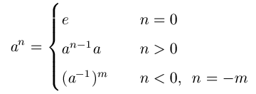

### 加群的幂运算

对于加群，元素的幂运算实际上是**倍数运算**。

- 例如对于整数加群 $(Z, +)$ ，整数 $z$ 的 $n$ 次幂实际上是 $nz$ 。这时有：
  - $0z=0$；
  - $(-nz)= n(-z)$；
  - $nz + mz = (n+m)z$；
  - $m(nz)= (mn)z$；

### 基本性质

设 $(G, \circ)$ 是群，对任意 $a\in G,\ \ m, n\in Z$ ，有：

$$
a^n\circ a^m= a^{n+m}\\(a^n )^m=a^{nm}
$$

---

证明

- 先对于 $m≥0$，对 $m$ 实施数学归纳法；
- 再对于 $m<0$ ，利用 $a^m=(a^{-1})^{-m}$。

### 常用性质

设 $a,b$ 是群 $G$ 的元素，容易得到：

$$
\forall n\in \mathbb Z\ ,\  (aba^{-1} )^n=ab^n a^{-1}
$$

## 群元素的阶

### 定义

群 $(G,∘)$ 元素 $a$ 的**阶(order)**，记为 **$|a|$** ，是指最小的正整数 $k$ 使得 $a^k=e$ ，若这样的正整数不存在，则称元素 $a$ 的阶**无穷**

### 任意幂的阶

设 $G$ 是群，$e$ 是其单位元，$a$ 是 $G$ 的任意元素，且 $|a|=n$：

- 对任意整数 $m$ ，$a^m=e$ 当且仅当 $n|m$；
- 特别的，$m=-1$ 时，$|a^{-1}|=n$；
- 对任意整数 $m$ : $|a^m| = \frac{n}{gcd(n, m)}$；

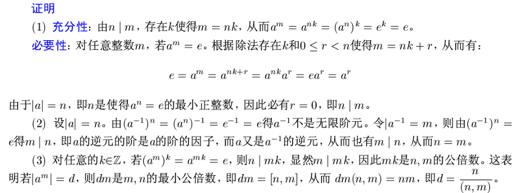

### 阶内运算可轮换

设 $a,b,c$ 是群 $G$ 的元素，证明：

- $|a|=|a^{-1}|=|cac^{-1}|$ ；
- $|ab|=|ba|$；
- $|abc|=|bca|=|cab|$；

---

(2) 因为 $ab = a(ba)a^{-1}$ ，所以由 (1) 可知：

$$
|ab|=|a(ba)a^{-1}|=|ba|
$$

---

(3) 因为:

- $abc=a(bc)$
- $bca=(bc)a$
- $cab=(ca)b$

因此由 (1) 可知：

$$
|abc|=|a(bc)|=|(bc)a|=|bca|=|b(ca)|=|(ca)b|=|cab|
$$

!!! abstract
    虽然 $|abc|=|bca|$ ，但是 $|abc|\neq|bac|$ ！这与置换群有关

## 子群

### 定义

设 $G$ 是群，$H$ 是 $G$ 的子集，如果 $H$ 关于 $G$ 的运算也构成群，则称 $H$ 是 $G$ 的子群，记为：

$$
H\leq G
$$

若 $H$ 是 $G$ 的子群，且 $H≠G$ ，则称 $H$ 是 $G$ 的**真子群**，记为：

$$
H\lt G
$$

显然 $H=\{e\}$ 是 $G$ 的子群，这里 $e$ 是 $G$ 的单位元，将 $\{e\}$ 和 $G$ 自己称为群 $G$ 的**平凡子群**，其他子群称为**非平凡子群**

!!! abstract
    从代数系统角度说，子群就是子代数，下面定理说明子群对群的三个运算都封闭！

### **子群判定定理 1**

给定 $G$ 是群，$H⊆G$ 关于 $G$ 的运算构成群，也就是 $H$ 是 $G$ 的子群当且仅当：

- $H$ 对 $G$ 的 (二元) 运算封闭
- $H$ 对零元运算封闭，即 $G$ 的单位元应属于 $H$；
- $H$ 对一元运算封闭，即 $\forall a\in H,\ \ a^{-1}\in H$；

### **子群判定定理 2**

群 G 的非空子集 H 是 G 的子群当且仅当：

- $e\in H$；
- $∀a, b\in H,\ \ \ ab\in H$；

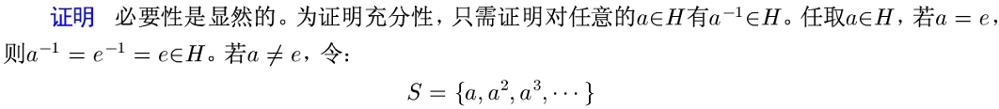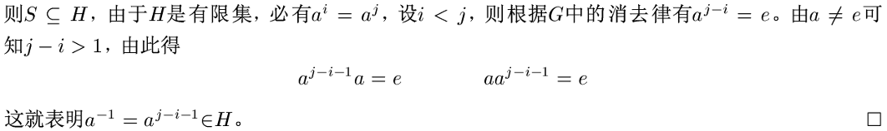

!!! abstract
    实际上是构造 $a^{|a|} = a^{j-i}$ ，其中 $|a|>0$ 为 $a$ 的阶

### **子群判定定理 3**

群 G 的非空子集 H 是 G 的子群当且仅当：

- $∀a, b\in H,\ \ \ ab^{-1}\in H$；
- 或 $∀a, b\in H,\ \ \ b^{-1}a\in H$；

### 群的中心

定义群 G 的**中心** ：

$$
C=\{a\in G∣∀x\in G, xa=ax\}
$$

即 C 是 G 中那些与 G 的任何元素都可交换的元素构成的集合.

证明：C 是 G 的子群 ( $C\leq G$ )

- 首先 C 是否是非空集？哪个元素一定属于 C？
- 其次，如何运用子群的判定定理证明 C 是 G 的子群？
  - 例如利用子群判定定理二，如何证明对任意 a, b\in C，都有 ab^-1^\in C ？
  - 或者利用子群判定定理一，证明对任意 a\in C 有 a^-1^\in C，以及对任意 a,b\in C 有 ab\in C ？

---

首先，由群的性质：$\forall x\in G,\ \ \ xe=ex=e$ ，所以 $e\in C$ ，因此 C **非空**。

对 $\forall a,b\in C$ ，为证明 $ab^{-1}\in C$ 只需证明它与 G 中所有元素都可交换即可。

$\forall x\in G$ ，有：

$$
\begin{aligned}
(ab^{-1})x &=ab^{-1}(x^{-1})^{-1}\\
&=a(x^{-1}b)^{-1}\\
&\overset{b\in C}{=}a(bx^{-1})^{-1}\\
&=a(xb^{-1})\\
&\overset{\text{结合律}}{=}(ax)b^{-1}\\
&\overset{a\in C}{=}(xa)b^{-1}\\
&\overset{\text{结合律}}{=}x(ab^{-1})
\end{aligned}
$$

### 交并与子群的关系

设 $G$ 是群，且 $H≤G$ , $K≤G$ ，证明：

- $ H\cap K≤G$（**交保持子群**，可推广）
- $ H∪K≤G$ 当且仅当 $H⊆K$ 或 $K⊆H$（**并保持子群的充要条件**）

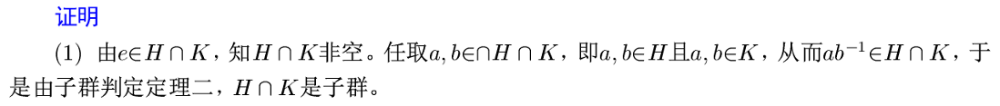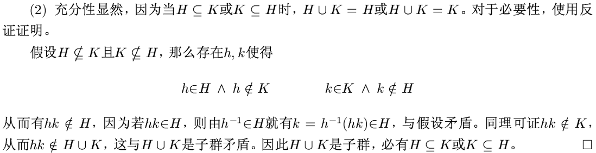

### 生成子群

简单地说，群 $G$ 的一个**子集的生成子群**就是**包含这个子集的最小的子群**。群 $G$ 的子集 $S$ 的生成子群记为：

$$
⟨S⟩
$$

两个子群的交总是子群这个命题可**推广**到任意多个子群的交也总是子群，从而对于群 $G$ 的某个子集 $S$ ，可给出包含 $S$ 的最小子群，这个子群就是 $S$ 的**生成子群** $⟨S⟩$ ，可由所有包含 $S$ 的子群的交给出，即：

$$
\text{<}S\text{>}=\cap\{H|S\subseteq H \land H\leq G\}
$$

- 如果 $S$ 为有限集 $S=\{a_1, a_2,\cdots,a_n\}$ ，将 $⟨S⟩$ 直接记为 $⟨a_1, a_2,\cdots,a_n ⟩$；
- 对于群 $G$ ，若存在 $a\in G$ ，使得 $G=⟨a⟩$ ，即 $G$ 是由元素 $a$ 生成的群，这时称 G 为**循环群**。

!!! abstract
    空集生成的子群是什么？

### 生成子群元素的表示

设 $G$ 是群，$S$ 是 $G$ 的非空子集，则：

$$
⟨S⟩=\cap\{a_{1}^{l_{1}}a_{2}^{l_{2}}...a_{k}^{l_{k}}|
a_{i}\in S,\ \ \ l_{i}=\pm 1,\ \ \ k\in\mathbb{N} \}
$$

即 $⟨S⟩$ 的任意元素可表示成有限个 S 的元素或其逆的乘积

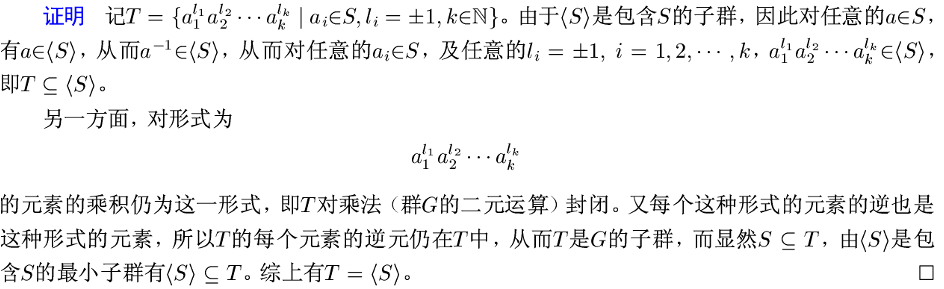

!!! abstract
    当 $S=\{a\}$ 时，即有 $⟨a⟩=\{a^r∣r\in Z\}$

## 循环群

设 $G$ 是群，如果存在 $a\in G$ 使得

$$
G=⟨a⟩=\{a^k | k\in Z\}
$$

则称 $G$ 是**循环群**(cyclic group)，并称 $a$ 为 $G$ 的一个**生成元**

- 当 $G$ 是无限集时称为**无限循环群**
- 当 $G$ 有 $n$ 个元素时，称为 **n 阶循环群**

### 性质(不考证明)

设 $G$ 是群，$e$ 是它的单位元

1. $⟨a^{-1}⟩= ⟨a⟩$；
2. 若 $G$ 是有限群，则 $G=⟨a⟩⟺|G|= |a|$；
3. 若 $G$ 是无限循环群，则
   - $G = \{e, a, a^{-1}, a^2, a^{-2}, ⋯, a^n, a^{-n}, ⋯\}$；
   - $\forall k, l\in Z,\ \ \ a^k= a^l⟺k= l$；
4. 若 $G$ 是 $n$ 阶循环群，则
   - $G = \{e, a, a^2, a^{3}, ⋯, a^{n-1}\}$；
   - $\forall k, l\in Z,\ \ \ a^k = a^l ⟺n | k-l$；

### 循环群举例

整数加群 $\mathbb Z$ 是无限循环群

显然 $\mathbb Z= ⟨1⟩= ⟨-1⟩$ ， 即 1 和 -1 是它的生成元

对任意 $d\in \mathbb Z$ ，若 $d≠±1$ ，显然有 $1\not\in⟨d⟩$ ，因此 1 和 -1 是 $\mathbb Z$ 的仅有的两个生成元。

---

模 $m$ 加群 $\mathbb Z_m$ 是 $m$ 阶循环群，显然 $\mathbb Z_m=⟨1⟩$。

---

$U(5)$ 是 4 阶循环群，$U(5)=⟨2⟩=⟨3⟩$；

当 $m$ 是素数时，$U(m)$ 是 $m-1$ 阶循环群（证明这个需要不少数论知识）

当 $m$ 不是素数时：

- $U(m)$ 可能是循环群（例如 $U(9)=\{1,2,4,5,7,8\}=⟨2⟩$ ）
- 也可能不是循环群（例如$U(15)=\{1,2,4,7,8,11,13,14\}$ ）

### 生成元的数量与结构

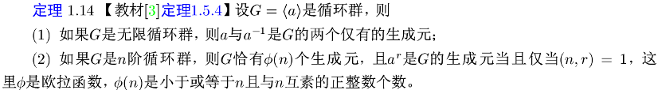

---

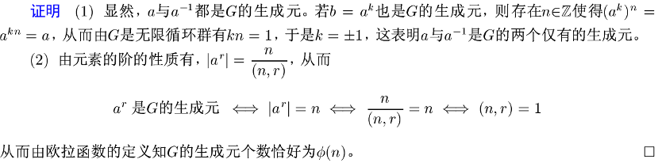

### 子群保持循环群

循环群的任意子群都是循环群

---

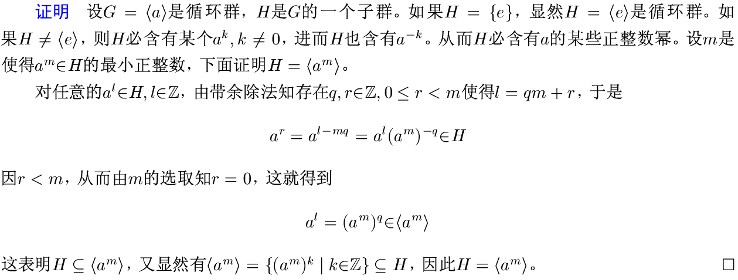

#### 问题

如果一个群的所有非平凡子群都是循环群，那么这个群一定是循环群吗？

**不一定**！

$U(12)=\{1,5,7,11\}$ 不是循环群，但它的每个非平凡子群都是循环群！

$|1|=1 , |5| = 2 , |7| = 2 , |11| = 2$ ，可见 $U(12)$ 的所有非平凡子群都是二阶群，不难证明**所有二阶群都是循环群**

### 生成元任意幂的生成子群

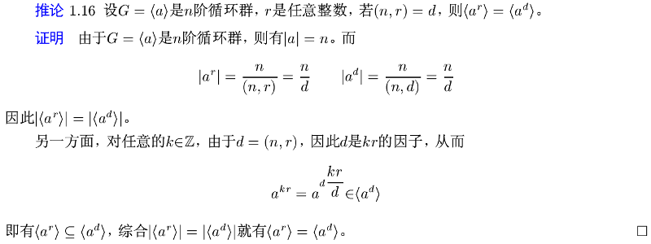

### 循环群的子群:star:

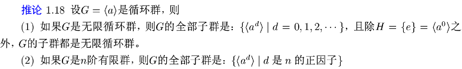

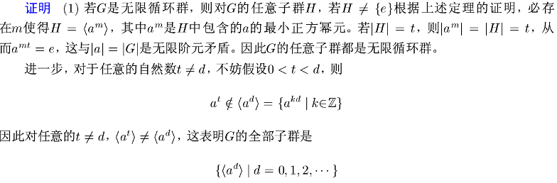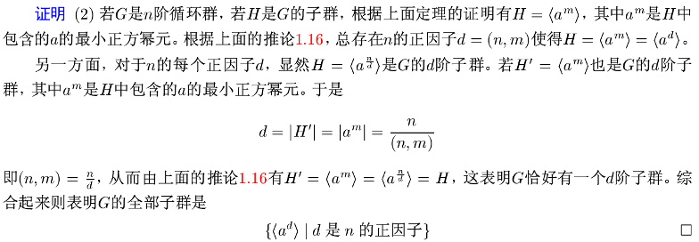

例题：

$\mathbb{Z}_{14}$ 加群的所有子群是：

- $⟨1⟩=\mathbb{Z}_{14}$、
- $⟨2⟩=\{0,2,4,6,8,10,12,14\}$、
- $⟨7⟩=\{0,7\}$、
- $⟨0⟩={0}$、

$U(14)$ 的所有子群是：

- $⟨3⟩$、
- $⟨3^2=9⟩$、
- $⟨3^3=13⟩$、
- $⟨3^6=1⟩$、
