## 群的同态

### 定义

设 $G$ 与 $G'$ 是两个群，函数 $φ:G→G'$如果满足：

$$
∀a,b\in G,\ \ φ(ab)= φ(a)φ(b)
$$

则 $φ$ 是群 $G$ 到 $G'$ 的**同态**(homomorphism)（一个函数）

!!! abstract
    $φ(a)φ(b)$ 是 $G'$ 中的运算，而 $ab$ 是 $G$ 中的运算

考察同态 $\varphi$ 作为函数的性质，可以将同态分为：

- 如果 $G=G'$ ，则称 $φ$ 为自同态(automorphism)；
- 如果同态 $φ:G→G'$ 是满函数，则称为**满同态**(epimorphism)，并称 $G$ 与 $G'$ 同态，记为$φ:G∼G'$；
- 如果同态 $φ:G→G'$ 是单函数，则称为**单同态**(monomorphism)；
- 如果同态 $φ:G→G'$ 是双函数，则称为**同构**(isomorphism)，并称群 $G$ 与 $G'$ 同构，记为 $φ:G≅G'$；

### 群同态的单位元

若 $e$ 是 $G$ 的单位元，则 $\varphi(e)$ 是 $G'$ 的单位元；

设 $G'$ 的单位元 $e'$ ，则:

$$
\varphi(e)\varphi(e)=\varphi(ee)=\varphi(e)=\varphi(e)e'
$$

从而由群的运算满足消去律得 $\varphi(e)=e'$ 。

### 群同态的逆元

群同态与求逆元操作可交换：

$$
\forall a\in G,\ \ (\varphi(a))^{-1}=\varphi(a^{-1})
$$

---

证明， 对任意的 $a\in G$ :

$$
\varphi(a^{-1})\varphi(a)=\varphi(a^{-1}a)=\varphi(e)=e'\\
\varphi(a)\varphi(a^{-1})=\varphi(aa^{-1})=\varphi(e)=e'
$$

这就表明在群 $G'$ 中，$\varphi(a)$ 的逆元是 $\varphi(a^{-1})$ ，即 $\varphi(a))^{-1}=\varphi(a^{-1})$ 。

### 群同态例子

设 $G,G'$ 是群，$e'$ 是 $G'$ 的单位元，函数 $φ:G→G'$ ，$∀a\in G,\ \ φ(a)=e'$ ，$\varphi$ 是同态，称为 $G$ 到 $G'$ 的**零同态**

---

对于整数加群 $(Z,+)$ 和模 n 加群 $(Z_n,⊕_n)$ ，函数 $φ:Z→Z_n$ ，$∀z\in Z, φ(z)= z \bmod n$， $\varphi$ 是**满同态**：

$$
\begin{aligned}
&∀z_1, z_2\in Z,\\
φ(z_1+z_2 )&=(z_1+z_2 )\bmod n\\
&= (z_1 \bmod n) ⊕_n (z_2 \bmod n)\\
&= φ(z_1 ) ⊕_n φ(z_2 )
\end{aligned}
$$

---

对于实数加群 $(\mathbb R,+)$ 和非零实数集关于乘法构成的群 $(\mathbb R^*, \cdot )$ ，固定某实数 $a\in \mathbb R(a≠0,1)$ ，定义 $φ:\mathbb R→\mathbb R^*,\ \ ∀r\in \mathbb R, φ(r)= a^r$ ，$\varphi$ 是**单同态**：

$$
\begin{aligned}
&∀r,r'\in \mathbb R,\\
φ(r+r')&=a^{r+r'}\\
&=a^r\cdot a^{r'}\\
&=φ(r)\cdot φ(r')
\end{aligned}
$$

## 群的同构

### 内自同构

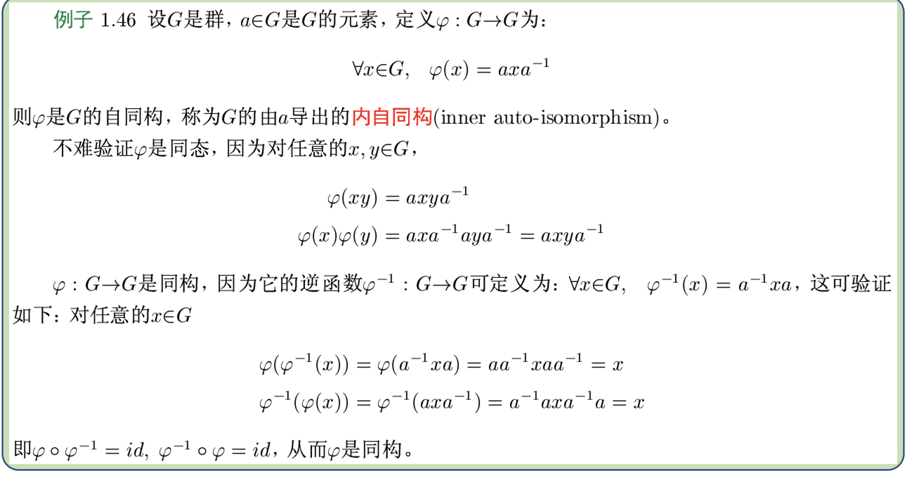

### 平移与正则表示

左平移、左正则表示的定义如下：

**置换群** $G_l$ 称为群 $G$ 的**左正则表示**(left regular representation)，**左乘置换** $φ_a$ 称为由元素 $a$ 确定的**左平移**(left translation)。

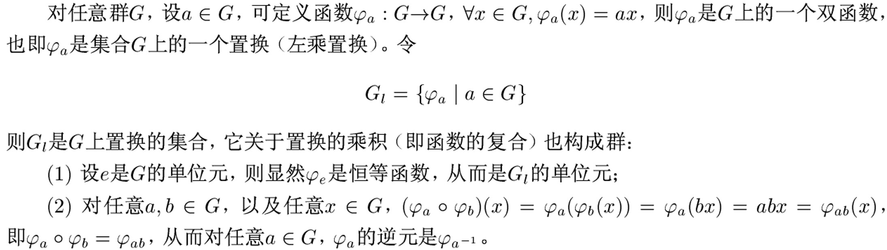

!!! abstract
    当然，类似的可以定义右平移、右正则表示

### 凯莱定理

每个群都同构与一个置换群（变换群）

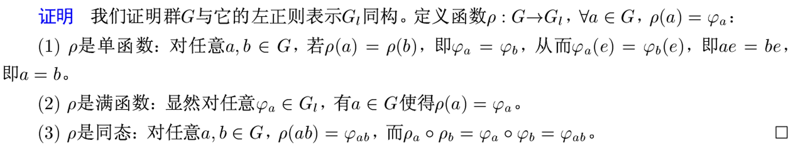

### 循环群的结构定理

1. $G=<a>$ 是无限循环群，则 $G\cong(\mathbb Z,+)$ ；
2. $G=<a>$ 是 $n$ 阶循环群，则 $G\cong(\mathbb Z_n,\oplus_n)$ ；

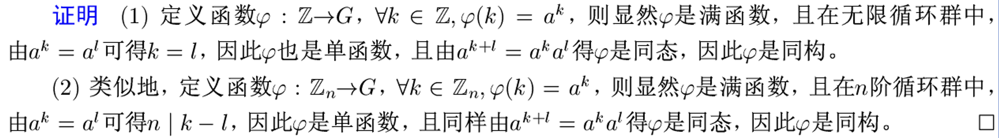

!!! abstract
    无限循环群中 $a^k=a^l$ 蕴涵 $k=l$ ；

在 $n$ 阶循环群中 $a^k=a^l$ 蕴涵 $n|k-l$ ；

## 群同态的基本性质

### 群同态与元素的阶

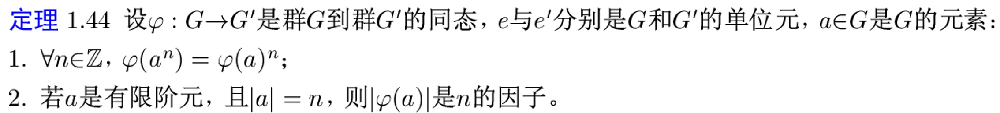

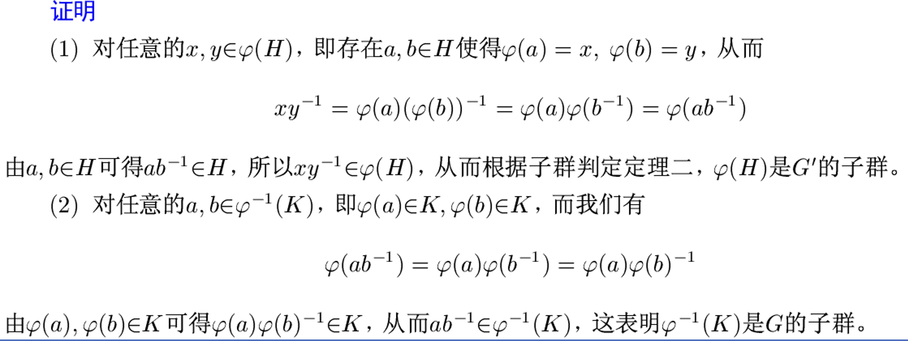

### 群同态与子群

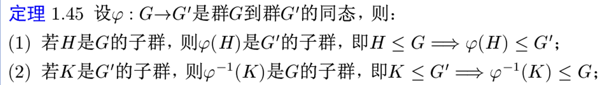

:star:特别地， $H=G$ 的时候这里就有：

$$
\varphi(G)\leq G'
$$

---

### 群同态与正规子群

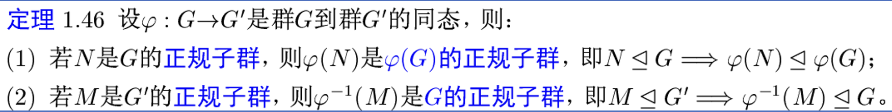

!!! abstract
    $\varphi(N)$ 不一定是 $G'$ 的正规子群！$\varphi^{-1}(M)$ 不一定是 $G$ 的正规子群！

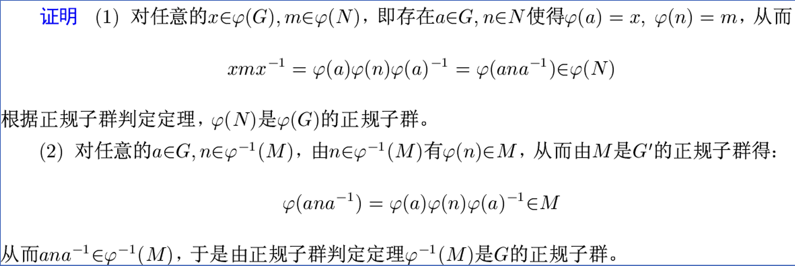

## 群的同态基本定理

### 群同态的核

#### 定义

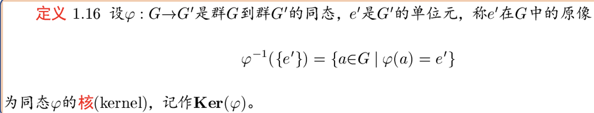

:: primary

所有同态映射结果为单位元的原像的集合

#### 核是正规子群

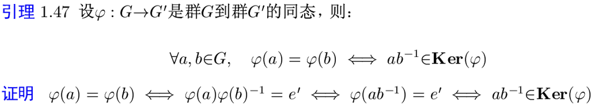

---

由上述引理可证：

设 $\varphi:G\to G'$ 是群 $G$ 到群 $G'$ 的同态，则 $\text{Ker}(\varphi)$ 是 $G$ 的**正规子群**，也就是 $\text{Ker}(\varphi)\leq G$ 。

### 群的同态基本定理

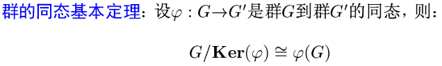

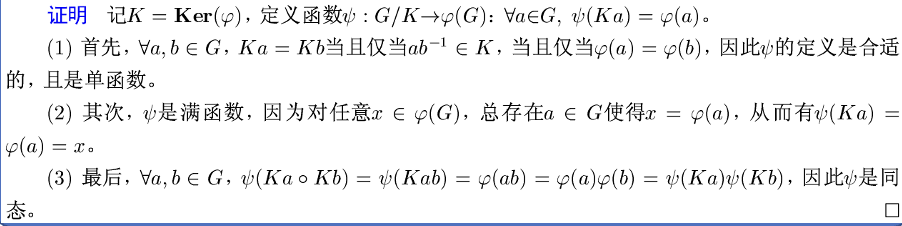

::: primaty

结合群同态与子群的关系，就有：商群 $G/\text{Ker}(\varphi)\cong\varphi(G)=G'\text{的某个子群}\leq G'$

### 正规子群与商群

由正规子群导出的商群的**自然映射**是**满同态**，且它的**核是该正规子群**，由群的同态基本定理有该正规子群与其导出的商群同构。

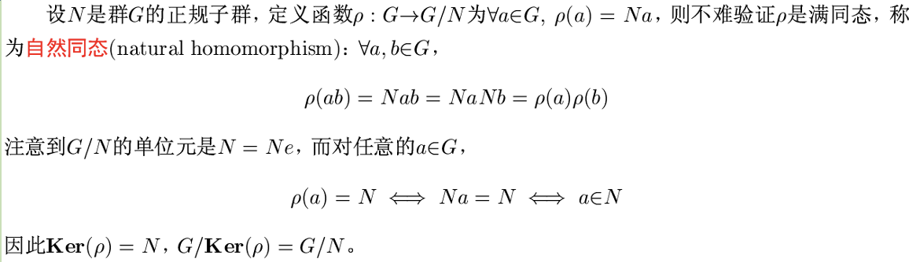

#### 应用举例

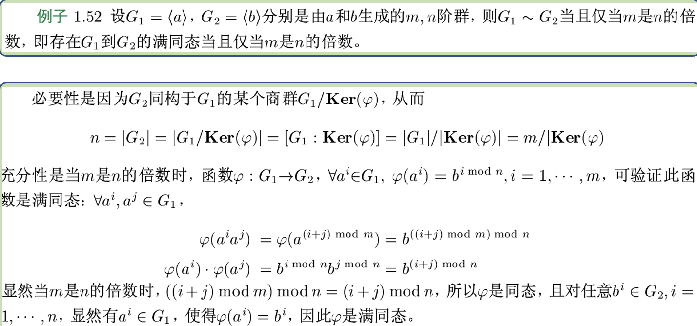

### 第二同构定理

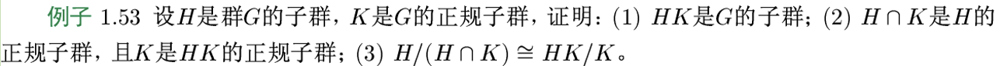

---

证明

(1) 利用子群判定定理证明：$∀h_1,h_2\in H,k_1,k_2\in K,\ \ (h_1k_1)(h_2k_2)^{-1}\in HK$。

(2) 利用正规子群判断定理证明：对任意 $h\in H, n\in H\cap K, hnh^{-1}\in H\cap K$；以及对 $\forall h_1\in H,\forall k_1\in K,\forall n\in K$ ，有：$(h_1k_1)n(h_1k_1)^{-1}\in HK$ 。

(3) 构造同态 $φ:H→ HK/K$ ，使得 $\text{Ker}(φ)=H\cap K$。

### 第三同构定理

## $\mathbb Z_m$到$\mathbb Z_n$的同态数

结论——所有 $\mathbb Z_m$ 到 $\mathbb Z_n$ 的同态映射如下：

$$
\{\varphi_a:\overline{x}\to a\overline{x}|a=0,\frac{\text{lcm}(m,n)}{m},2\frac{\text{lcm}(m,n)}{m},3\frac{\text{lcm}(m,n)}{m},\cdots,[\gcd(m,n)-1]\frac{\text{lcm}(m,n)}{m}=n-\frac{\text{lcm}(m,n)}{m}\}
$$

总共有 $\gcd(m,n)$ 个同态映射。

!!! abstract
    上面的两个 $\overline{x}$ ($\overline{x}\to a\overline{x}$) ，我们虽然使用了同一个记号，但它们代表的意义是不同的：

- 前一个表示的是 $\mathbb Z_m$ 中的剩余类 $\{x+mz|z\in\mathbb Z\}$；
- 后一个表示的是 $\mathbb Z_n$ 中的剩余类 $\{x+nz|z\in\mathbb Z\}$；

今后，在遇到此类情况时,我们都采用这样的记号，不再一一说明。读者应根据上下文，了解两个 $\overline{x}$ 的不同含义，以免混淆。

> 摘抄自《近世代数》(第二版, 韩士安, 林磊) 的参考答案。
