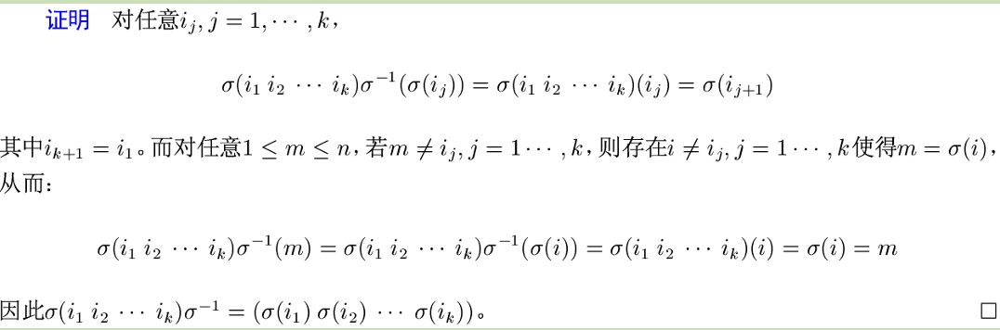
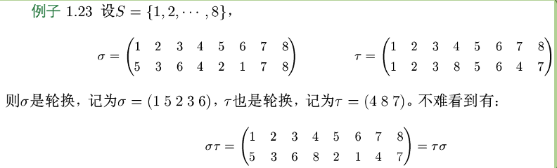
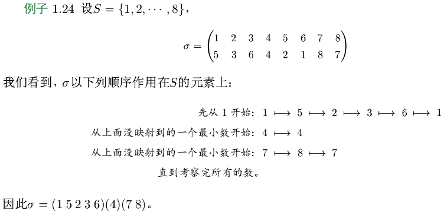
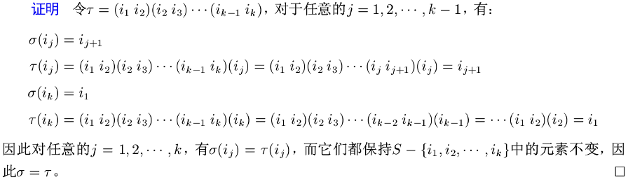
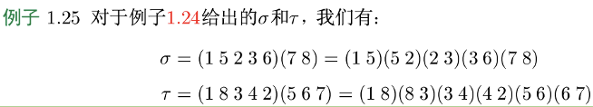
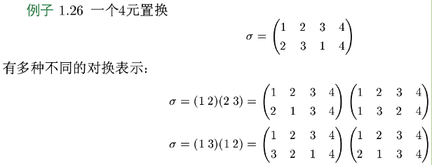
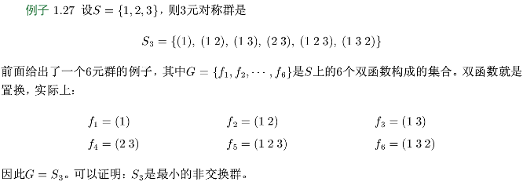

## 置换群的定义

设 $S=\{1,2,\cdots,n\}$ ； S 上的任意**双函数** $\sigma:S\to S$ 称为 S 上的一个 **n 元置换** (permutation)，记为：

$$
\sigma=
\begin{pmatrix}
1 & 2 & \cdots & n \\
\sigma(1) & \sigma(2) & \cdots & \sigma(n)
\end{pmatrix}
\quad
$$

## 置换群的构成

### 置换乘法

设 $\sigma,\tau$ 都是 S 上的 n 元置换，则 $\sigma,\tau$ 作为**函数的复合** $\sigma\circ\tau$ 和 $\tau\circ\sigma$ 也是 n 元置换，称为 $\sigma,\tau$ 的**乘积**，记为 **$\sigma\tau$** 和 **$\tau\sigma$**

- $στ(i)=σ(τ(i))$；
- $τσ(i)=τ(σ(i))$；

### 恒等置换

记为 e ，为 S 上的恒等函数。显然它是置换乘法的**单位元**。

### 逆置换

对于某个置换 $\sigma$：

$$
\sigma=
\begin{pmatrix}
1 & 2 & \cdots & n \\
\sigma(1) & \sigma(2) & \cdots & \sigma(n)
\end{pmatrix}
\quad
$$

$\sigma$​ 关于(置换)乘法的**逆置换**是：

$$
\sigma=
\begin{pmatrix}
\sigma(1) & \sigma(2) & \cdots & \sigma(n)\\
1 & 2 & \cdots & n
\end{pmatrix}
\quad
$$

### 对称群

$S$ 上的**所有 n 元置换关于置换乘法构成群**，这个群称 **n 元对称群**（symmetric group），并记为 $S_n$ , $S_n$ 的任意子群都称作 **n 元置换群**（permutation group）。

## 轮换

若 S 上的 n 元置换 $\sigma$ 满足：

$$
\sigma(i_1)=i_2,\ \ \ \sigma(i_2)=i_3,\ \cdots\ ,\ \sigma(i_{k-1})=i_k,\ \ \ \sigma(i_k)=i_1
$$

其中 $i_j\in S,\ \ \ j=1,\cdots,k$ ；且满足**其他元素不变**，则称 $\sigma$ 为 S 上的 k 阶轮换（cycle），记为：

$$
\sigma=(i_1\ i_2\ \cdots\ i_k)
$$

特别地有：

- 2 阶轮换也叫做**对换**
- 1 阶轮换 $(1)$ 就是恒等置换

$\sigma=(i_1\ i_2\ \cdots\ i_r)$ 和 $\tau=(j_1\ j_2\ \cdots\ j_s)$ 是两个轮换，如果对任意的 $k=1,2,\cdots,r$ 及任意的 $l=1,2,\cdots,s$ 都有 $i_k\neq j_l$ ，称 $\sigma$ 和 $\tau$ 是**两个不相交的轮换**， $\sigma$ 和 $\tau$ **不相交**

### 轮换性质 1

设 $σ\in S_n$ 是 n 阶置换，证明：$σ(i_1\ i_2\ \cdots\ i_k)σ^{-1}= (σ(i_1)\ σ(i_2 )\ \cdots\ σ(i_k ))$

### 轮换性质 2

**不相交轮换的可交换性**

任意两个不相交轮换的乘积可交换，即若 σ 和 τ 是两个不相交的轮换，则 $στ=τσ$

### 轮换性质 3

**置换的轮换表示**

每个置换都可表示为一些**不相交轮换的乘积**

!!! abstract
    通常省略轮换表示中的一阶轮换，例如这里可以直接记为：$σ=(1\ 5\ 2\ 3\ 6)(7\ 8)$

## 置换的对换表示

任意置换都可表示成对换的乘积，因为任意轮换都可表示成对换的乘积

设 $\sigma=(i_1\ i_2\ \cdots\ i_k)$ 是 $S=\{1,2,\cdots,n\}$ 上的 k 阶轮换，则：

$$
\sigma=(i_1\ i_2)(i_2\ i_3)\cdots(i_{k-1}\ i_k)
$$

!!! warning
    - 置换的**轮换表示**中的轮换是**不交**的，而**对换表示**式中的对换是**允许有交**的
- 轮换表示式在某种意义下（不考虑因子次序和 1 轮换个数）是惟一的，但**对换表示式**是**不惟一**的

!!! abstract
    :star:一般地，k 阶轮换 $(i_1\ i_2\ i_3\ \cdots i_k)$ 也等于 $(i_1\ i_k)(i_1\ i_{k-1} )\cdots(i_1\ i_2)$

### 奇偶性

一个置换表为对换的乘积，所用的对换个数的**奇偶性是惟一**的。

- 可表示成偶数个对换的乘积的置换称为偶置换(even permutation)
- 可表示成奇数个对换的乘积的置换称为奇置换(odd permutation)

- 任何两个偶置换的积是偶置换；
- 两个奇置换的积是偶置换；
- 一个偶置换与一个奇置换的积是奇置换；

- 一个偶置换的逆置换仍然是偶置换；
- 一个奇置换的逆仍然是奇置换；

当 $n>1$ 时，在全体 n 元置换中，奇置换与偶置换各有 $\frac{n!}{2}$ 个

## 交错群

在 n 元对称群 S_n 中，全体偶置换构成 S_n 的子群称这个子群称为 n 元交错群 (alternative group)。

|       | 1   | 2   | 3   |
| ----- | --- | --- | --- |
| $f_1$ | 1   | 2   | 3   |
| $f_2$ | 2   | 1   | 3   |
| $f_3$ | 3   | 2   | 1   |
| $f_4$ | 1   | 3   | 2   |
| $f_5$ | 2   | 3   | 1   |
| $f_6$ | 3   | 1   | 2   |

$S_3$ 中的偶置换包括 $(1)$（表示成 0 个对换的乘积）、$(1\ 2\ 3)=(1\ 2)(2\ 3)$ 和 $(1\ 3\ 2)=(1\ 3)(3\ 2)$ ，这些偶置换构成了 3 元交错群 $A_3 = \{(1), (1\ 2\ 3), (1\ 3\ 2)\} = \{f_1, f_5, f_6 \}$。
