## 环的相关定义

设 $R$ 是非空集合，如果在 $R$ 上定义了两个二元运算 “$+$”（称为加法）和 “ $\cdot$ ”（称为乘法），且满足：

- （1） $R$ 关于加法 $+$ 构成交换群（即加群）
- （2） $R$ 关于乘法 $\cdot$ 构成**半群**，即乘法满足结合律：$\forall a,b,c\in R,\ \ a\cdot(b\cdot c)=(a\cdot b)\cdot c$；
- （3） **乘法 $\cdot$ 对加法有左右分配律**：

$$
\forall a,b,c\in R\\
a\cdot(b+c)=a\cdot b+a\cdot c\\
(b+c)\cdot a=b\cdot a+c\cdot a
$$

则称代数 $(R,+,\ \cdot\ )$ 是环（ring）。在通过上下文能明确运算时，通常直接称 $R$ 为环。

!!! abstract
    有教材要求环乘法必须有单位元，也有教材要求环乘法必须满足交换律等

对环 $(R,+,\ \cdot\ )$ ，$(R\ ,+)$是交换群，称为环 $R$ 的加法群，其单位元通常用 0 表示，称为环 $R$ 的零元，元素 $a$ 的加法逆元记为 $-a$ ，称为 $a$ 的负元。

通过负元引入环的减法，即 $a-b$ 定义为 $a+(-b)$。

- 环乘法是否满足交换律
  - 若环 $R$ 的乘法也满足交换律，则称为交换环 (commutative ring)
- 是否有单位元
  - 若环 $R$ 的乘法有单位元，则称为有单位元环，环乘法的单位元通常记为 $e$ 或 $1$ ，并称为环 $R$ 的单位元
- 环乘法当环 $R$ 有单位元 $e$ 时，考虑环的元素是否有逆元
  - 若对 $a\in R$ ，存在 $b\in R$ ，使得 $ab=ba=e$ ，则称 $a$ 是可逆元，或称为环 $R$ 的**单位**(unit)，并称 $b$ 是 $a$ 的逆元。当然这时 $b$ 也是可逆元，且 $a$ 是 $b$ 的逆元
  - 所有可逆元关于环乘法构成群，称为 $R$ 的**单位群** (group of units)，记为 $U(R)$。
- 环乘法是否有零因子
  - 对环 $R$ 的两个非零元素 $a,b$ ，若 $a\cdot b=0$ ，则称 $a$ 是**左零因子** (left zero-divisor)，b 是**右零因子** (right zero-divisor)。左零因子和右零因子统称为**零因子**
  - 若环 $R$ 的所有非零元素都不是左零因子或右零因子，则称 $R$ 为无零因子环。

当集合 $R$ 只有一个元素 $0$ ，定义 $R$ 的加法运算和乘法运算：$0+0=0,\ 0\cdot 0=0$，则 $(\{0\},+,\ \cdot\ )$ 构成环，这个环称为**零环**。在这个环中，**零元也是单位元**，而**零元也是可逆元**。

零环过于简单，通常在对环进行讨论时都将零环排除在外。因此在提到环时，总是默认环至少有两个元素，这时零元不可能是单位元，也不可能是可逆元。

### 整环

- 有单位元
- 无零因子
- (乘法) 可交换

的环称为**整环** (integral **domain**)

---

证明一个环是整环：

$$
\forall a,b\in R,\ \ ab=0\Rightarrow a=0\or b=0
$$

### 除环

- 有单位元
- 至少有两个元素
- 每个非零元都可逆 (乘法)
- （无零因子，可逆元都不是零因子）

的环称为**除环** (division ring)

### 域

交换除环称为**域**(field) (比较常用)，也即需满足：

- 有单位元
- 至少有两个元素
- 每个非零元都可逆 (乘法)
- (乘法) 可交换
- （无零因子，可逆元都不是零因子）

> 可逆元都不是零因子（为什么？），因此域都是整环！

非交换除环也称**体** (skew field) (比较少用)

## 常用环

### 整数环及其子环

- 整数集 $\mathbb Z$ 关于普通加法 $+$ 和普通乘法 $\cdot$ 构成环，称为整数环

  - 整数环 $\mathbb Z$ 是**交换环**，(乘法) 零元是 0，单位元是 1

  - 只有 1 和 -1 是可逆元，因此整数环的单位群是 $(\{1, -1\},\ \cdot\ )$；

  - 整数环的每个非零整数都不是零因子，因此**整数环是整环**

- 固定整数 $d$ ，集合 $d\mathbb Z=\{kd|k\in \mathbb Z\}$ 关于普通加法 $+$ 和普通乘法 $\cdot$ 也构成交换环

  - 当 $d≠1$ 时，环 $d\mathbb Z$ 没有单位元。显然环 $d\mathbb Z$ 也是无零因子环

  - 具体来说，所有偶数构成的集合 $2\mathbb Z$ 关于普通加法和普通乘法构成无单位元、无零因子的交换环。

### 模 m 剩余类环及其子环

固定整数 $m≥2$ ，模 $m$ 剩余类 $\mathbb Z_m=\{\overline{0},\overline{1},\cdots,\overline{m-1}\}$ 关于模 $m$ 加 $⊕_m$ 和模 $m$ 乘 $⊗_m$ 构成环，称为模 $m$ 剩余类环 (residue class ring)

- $\overline 0$ 表示整除 $m$ 余 0 的所有整数构成的集合，$\mathbb Z_m$ 的元素是集合

- 模 $m$ 剩余类环 $\mathbb Z$ 是有单位元交换环，零元是 0，有单位元 1

- 对于 $a\in \mathbb Z_m$ ，如果 $a$ 与 $m$ 互质，则 $a$ 关于模 $m$ 乘有逆元，因此单位群是 $U(m)$ 群

- 当 $m$ 是质数 $p$ 时，$\mathbb Z_p=\{0\}\cup U(p)$ ，关于 $⊕_p$ 和 $⊗_p$ 构成有单位元、每个非零元都可逆的交换环，也即这时 $\mathbb Z_p$ 是域

- 当 $m$ 不是质数时，若 $m=kd(2≤k≤m,2≤k≤m)$ ，则 $k$ 和 $d$ 都是模 $m$ 剩余类环的零因子，这时就不是无零因子环，当然也不是整环

### 有理数域

有理数集 $Q$ 关于普通加法 $+$ 和普通乘法 $\cdot$ 构成环

- 有单位元 1，是交换环，而且每个非零有理数 $r$ 都有逆 $1/r$；

- 单位群是所有非零有理数集 $\mathbb Q^*$ 关于普通乘法构成的群 $(\mathbb Q^*,\ \cdot\ )$

- 因此通常直接称有理数集 $\mathbb Q$ 为有理数域

实数集 $\mathbb R$ 和复数集 $\mathbb C$ 关于普通加法 $+$ 和普通乘法 $\cdot$ 也都构成域，分别称为实数域 $\mathbb R$ 和复数域 $\mathbb C$：

- 单位群分别是所有非零实数集 $\mathbb R^*$ 和非零复数集 $\mathbb C^*$ 关于普通乘法构成的群

- 复数域 $\mathbb C$ 的零元是实数 0，单位元是实数 1，而复数乘法的逆为：$(a+bi)^{-1}=\frac{a-bi}{a^2+b^2}$。

### 高斯整环

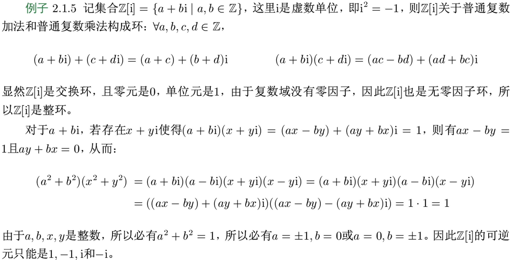

#### 类高斯整环

> 看起来和高斯整环很像，我乱起的名字，不是很重要

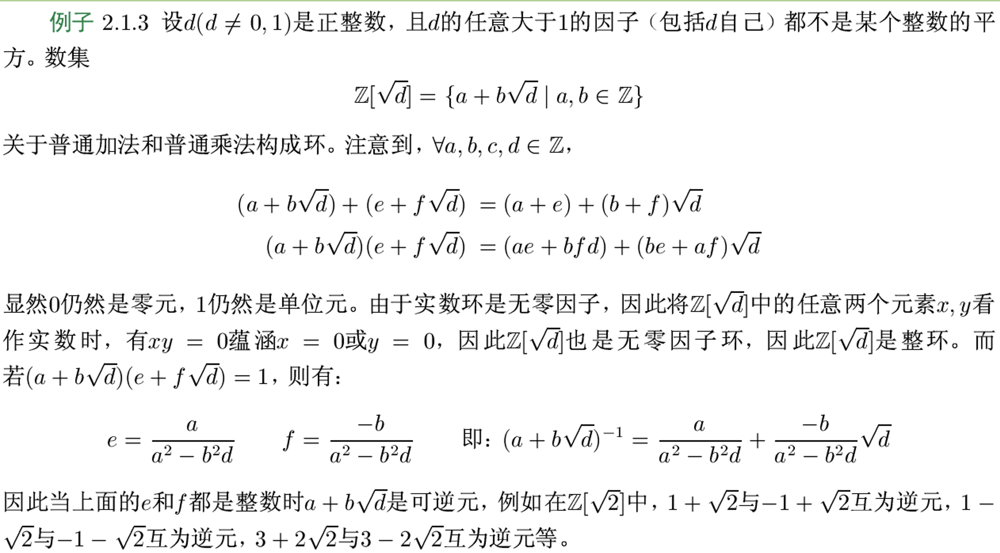

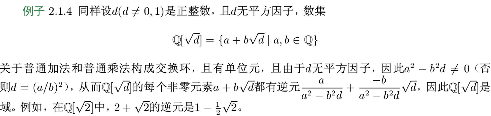

### 全矩阵环

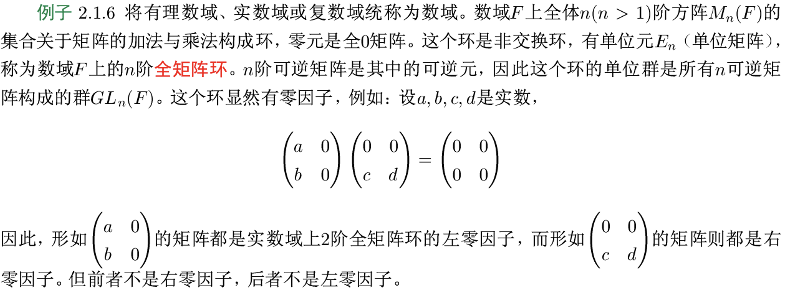

### 多项式环

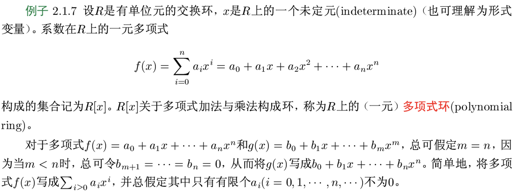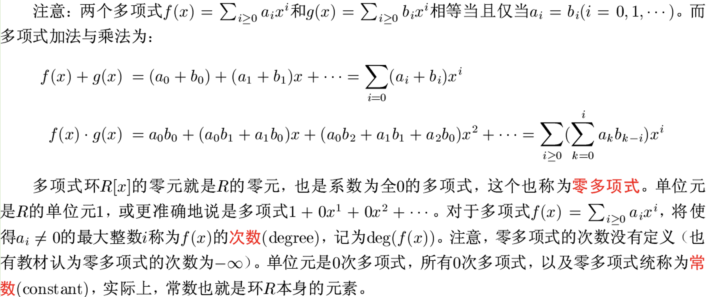

> 例子

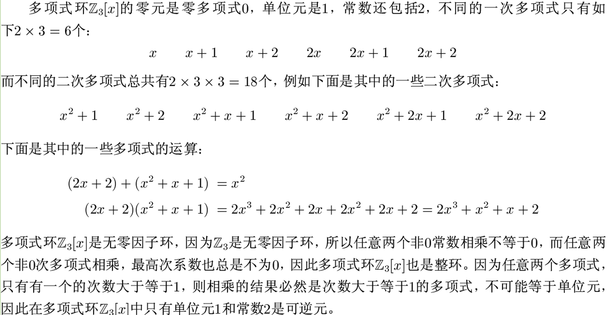

## 理想

### 定义

设 $R$ 是环，$I$ 是 $R$ 的非空子集。若 I 满足：

1. $\forall r_1,r_2\in I$，有 $r_1-r_2\in I$；
2. $\forall r\in I,\ \forall s\in R,\ \ rs,sr\in I$；

则称 $I$ 为环 $R$ 的**理想** (ideal)，记为 $I⊲R$，若 $I$ 是 $R$ 的真子集，则称 $I$ 是 $R$ 的**真理想** (proper ideal)。

理想是子环：显然如果 $I$ 是 $R$ 的理想，则 $I$ 必定是 $R$ 的子环；

!!! abstract
    :warning: 当然子环不一定是理想 :warning:

$R$ 的单个零元构成的集合 $\{0\}$（称为**零理想**）和 $R$ 本身都是 $R$ 的理想，这两个理想称为 $R$ 的**平凡理想**。因此 $R$ 的非平凡理想就是非零真理想

### 常用理想

整数环 $Z$ 的所有理想是 $dZ=\{dz|z\in Z\},\ d=0,1,\cdots$；

模 $m$ 剩余类环 $Z_m$ 的所有理想是 $dZ_m=\{dz|z\in Z_m\},\ d=0, 1, \cdots, m-1$；

---

**证明**

理想是子环，而 $Z$ 的每个子环都具有形式 $dZ$ ，而且对任意子环 $dZ$ ，对任意 $dz\in dZ$ ，以及 $s\in Z$ ，显然有 $dzs, sdz\in dZ$ ，因此每个子环 $dZ$ 都是 $Z$ 的理想

类似可得到模 $m$ 剩余类环 $Z_m$ 的所有理想是 $dZ_m, d=0, 1, \cdots, m-1$。

### 运算

#### 和

设 $R$ 是环，$I,J$ 都是 $R$ 的理想，$I+J$ 称为理想 $I$ 和 $J$ 的**和**：

$$
I+J=\{a+b\in R|a\in I, b\in J\}
$$

#### 交

$I\cap J$ 称为 $I$ 和 $J$ 的**交**：

$$
I\cap J=\{x\in R|x\in I,x\in J\}
$$

#### 积

$IJ$ 称为理想 $I$ 和 $J$ 的**积**：

$$
IJ=\{a_1b_1+a_2b_2+\cdots+a_nb_n|n\in\mathbb N^*,a_k\in I,b_k\in J\}
$$

#### 和交积保持理想

若 $I$ 和 $J$ 都是环 $R$ 的理想，则 $I+J$ ， $I\cap J$ ，$IJ$ 也是环 $R$ 的理想

环的任意有限多个理想的和仍是理想，而任意有限或无限多个理想的交仍是理想

### 主理想

#### 定义

设 $R$ 是环，$a$ 是 $R$ 的元素，记所有包含 $a$ 的理想构成的集合为：

$$
\sum=\{I\lhd R|a\in I\}
$$

至少有 $R\in\sum$ ，所以 $\sum$ 非空。令：

$$
\langle a\rangle=\bigcap_{I\in\sum}I
$$

则 $\langle a\rangle$ 是理想，而且是包含 $a$ 的最小理想。这个理想称由 $a$ 生成的**主理想**（principal ideal），$a$ 为其**生成元**。

#### 定理结论

环 $R$ 的由 $a$ 生成的主理想满足：

$$
\langle a\rangle=\big\{
\big(\sum_{i=1}^{n}x_iay_i\big)
+xa+ay+ma\big|x_i,y_i,x,y\in R,n\in\mathbb Z^+,m\in\mathbb Z
\big\}
$$

若 $R$ **有单位元**，则：

$$
\langle a\rangle=\big\{
\big(\sum_{i=1}^{n}x_iay_i\big)
\big|x_i,y_i\in R
\big\}\
$$

若 $R$ 是**交换环**，则：

$$
\langle a\rangle=\big\{
xa+ma\big|x\in R,m\in\mathbb Z
\big\}
$$

:star:若 $R$ 是**有单位元的交换环**，则：

$$
\langle a\rangle=aR=\big\{
ar\big|r\in R
\big\}
$$

#### 常用理想的主理想

- 整数环 $\mathbb Z$ 的每个理想 $d\mathbb Z$ 都是主理想，即是 $\langle d\rangle$ ；
- 模 $m$ 剩余类环 $\mathbb Z_m$ 的每个理想 $d\mathbb Z_m$ 也都是主理想，即也是 $\langle d\rangle$ ；

设 $R$ 是环，$a_1,a_2,\cdots,a_n\in R$，则：

$$
\langle a_1,a_2,\cdots,a_n\rangle=\langle a_1\rangle+\langle a_2\rangle+\cdots+\langle a_n\rangle
$$

也是 $R$ 的理想，并且是包含 $a_1,a_2,\cdots,a_n$ 的最小理想！称为由 $a_1,a_2,\cdots,a_n$ 生成的理想。

整数环 $\mathbb Z$ 由 $a_1,a_2$ 生成的理想是$\langle\gcd(a_1,a_2)\rangle$；

## 商环

> 环关于理想的商环

### 定义

设 $R$ 是环，$I$ 是 $(R,+,\ \cdot\ )$ 的一个理想，则 $(I,+)$ 是 $(R,+)$ 的正规子群，它所有（关于加群）的陪集构成集合 $R/I＝\{x+I|x\in R\}$ 、记**陪集 $x+I$ 为 $\overline x$** 。

#### 运算的定义

##### 加法

在集合 $R/I$ 上可定义加法 $+$：

$$
\forall \overline x,\overline y\in R/I,\\
\overline{x}+\overline{y}=\overline{x+y}\Longleftrightarrow (x+I)+(y+I)=(x+y)+I
$$

这里 $\overline{x}+\overline{y}$ 中的 $+$ 是要定义的加法，即后面所说商环中的加法，而 $\overline{x+y}$ 中的 $+$ 是环 $R$ 中的加法。

根据正规子群的性质，该定义是合适的。

##### 乘法

在集合 $R/I$ 上可定义乘法 $\times$：

$$
\forall \overline x,\overline y\in R/I,\\
\overline{x}\cdot\overline{y}=\overline{x\cdot y}\Longleftrightarrow (x+I)\cdot(y+I)=(x\cdot y)+I
$$

这里 $\overline{x}\cdot\overline{y}$ 中的 $\cdot $ 是要定义的乘法，即后面所说商环中的乘法，而 $\overline{x\cdot y}$ 中的 $\cdot $ 是环 $R$ 中的乘法。

---

由于这定义在等价类（陪集）上，因此需要证明该定义是合适的，即与选择的代表无关，即：

$$
\overline{x_1}=\overline{x_2}\ \land\overline{y_1}=\overline{y_2}
\Rightarrow
\overline{x_1\cdot y_1}=\overline{x_2\cdot y_2}
$$

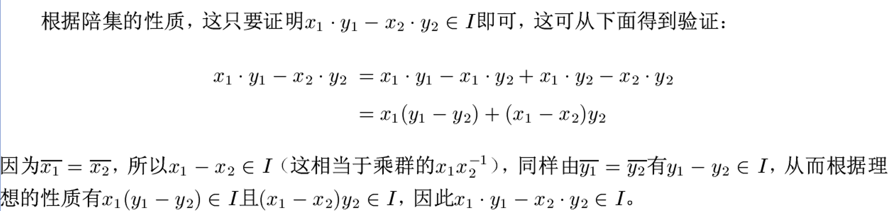

#### 构成环

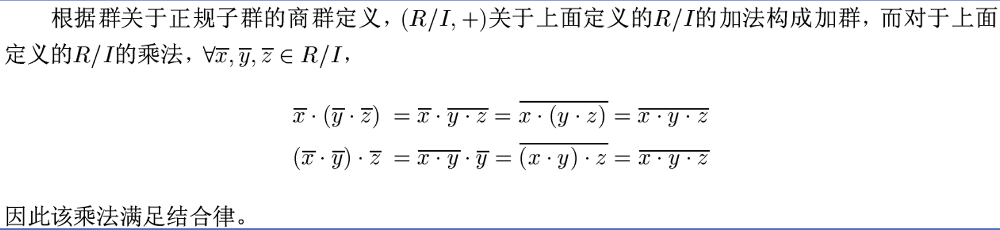

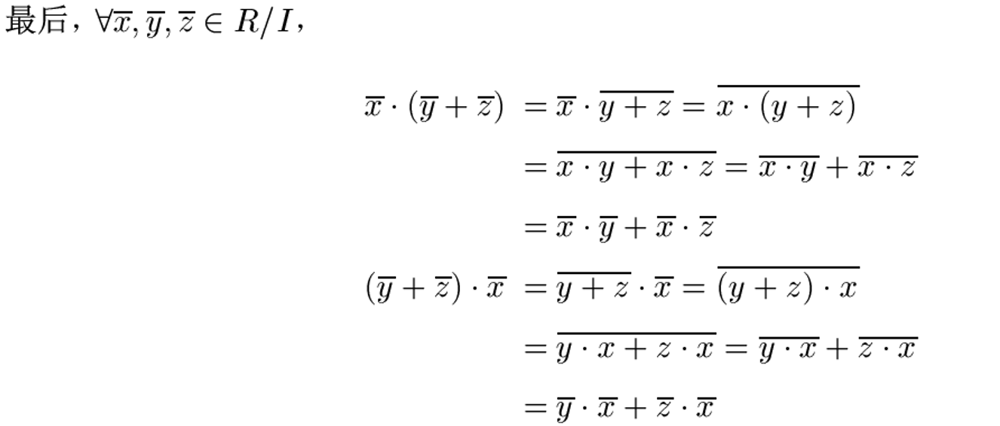

#### 商环定义

设 $R$ 是环，$I$ 是理想，则**环的加群**关于**理想的商群** $R/I$ 也**构成环**（基于上面定义的加法和乘法），称为环 $R$ **关于理想 $I$ 的商环**（quotient ring），仍记为 $R/I$ 。

$$
R/I=\{x+I|x\in R\}
$$

基本性质：

- $\overline{a}=a+I$；
- 商环的（加法）零元：$\overline{0}=0+I$；
- 商环的（加法）单位元：$\overline{e}=e+I$；

## 环同态

!!! abstract
    环的同态就是与环的加法与乘法都可交换的函数

设 $(R,+,\cdot)$ 和 $(R',\oplus,\otimes)$ 是环，$\varphi:R\to R'$ 是 $R$ 到 $R'$ 的函数，若对 $\forall a,b\in R$ 有：

$$
\varphi(a+b)=\varphi(a)\oplus\varphi(b)\\
\varphi(a\cdot b)=\varphi(a)\otimes\varphi(b)
$$

则称 $\varphi$ 是 $R$ 到 $R'$ 的**同态**。

- $\varphi$ 是单函数，则称为**单同态**
- $\varphi$ 是满函数，则称为**满同态**
- $\varphi$ 是双函数，则称为**同构**，记为：$R\cong R'$。

设 $R$ 和 $R'$ 是两个环，定义函数 $φ:R→R^′$：$∀a\in R,φ(a)= 0$，这里 0 是 $R'$ 的零元，则容易验证 $φ$ 是同态，这个同态称为**零同态** (zero homomorphism)

设 $R$ 是环，$I$ 是 $R$ 的理想，则很自然地有同态 $ρ:R→R/I$ ，$∀a\in R,ρ(a)=\overline a$，这里 $\overline a$ 是 $a$ 所在的等价类，即 $a+I$ 。这个同态称为商环 $R/I$ 的**自然同态** (natural morphism)

零同态、自然同态都是满同态。

自然同态一个例子：

- 整数环 $\mathbb Z$ 到模 $m$ 剩余类环 $\mathbb Z_m$ 有很自然的满同态 $φ:\mathbb Z→\mathbb Z_m$，$∀z\in \mathbb Z, φ(z)=z\bmod m$

!!! abstract
    零同态全部映射到零元，单同态给出子代数，满同态给出商代数

环同态保持：

- 加法单位元
- 子环

不保持：

- 理想

### $\mathbb{Z}_m$到$\mathbb{Z}_n$的同态

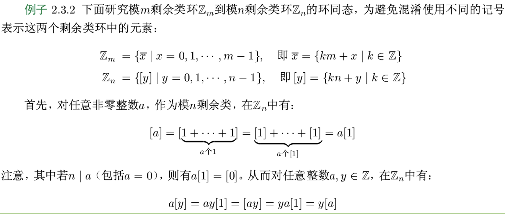

$\varphi:\mathbb{Z}_m\to\mathbb{Z}_n$ 是 $\mathbb{Z}_m$ 到 $\mathbb{Z}_n$ 的同态，当且仅当：

- $\varphi(\overline1)=[a]$；（环同态由该值决定）
- $\varphi(\overline{x})=x[a]$；（乘法陪集）
- $m[a]=[0]$；
- $[a]^2=[a]$；（$[a]$ 是 $\mathbb{Z}_m$ 的幂等元）

## 环扩张

环的扩张定理，也称为挖补定理

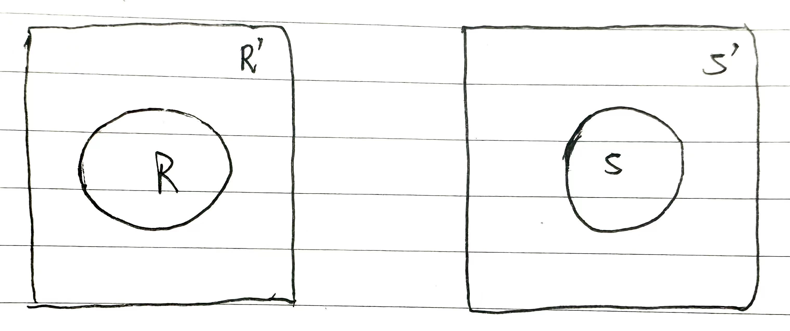

如图，$R$ 和 $S'$ 是 2 个没有公共元素的环，存在 $R$ 到 $S'$ 的单同态：

$$
\psi:R\to S'
$$

并且：$\psi(R)=S$。

那么 $R$ 可以扩张为 $R'$ ，满足：

- $R'-R=S'-S$；
- $S'\cong R'$；

设 $R$ 是一个没有单位元的环，则存在一个有单位元的环 $R'$ ，使得 $R$ 是 $R'$ 的子环。

## 特征

设 $R$ 是环。若存在最小正整数 $n$ 使得对所有 $a\in R$ 有 $na=0$ ，则称 $n$ 为环 $R$ 的**特征**。如果不存在这样的正整数，则称 $R$ 的特征为 0。环 R 的特征记为 **Char $R$**。

数域 $\mathbb Z, \mathbb Q, \mathbb R, \mathbb C$ 的特征都是 0，而模 $m$ 剩余类环 $\mathbb Z_m$ 的特征是 $m$。

【定理】设 $R$ 是有单位元 $e$ 的环。若 $e$ 关于加法的阶为无穷大，则 Char $R=0$，否则 Char $R=|e|$，这里 $|e|$ 在环的加群中的阶。

证明 若 $e$ 的加法的阶为无穷大，则不存在正整数 $n$ 使得 $ne=0$ ，从而 Char $R= 0$，否则，若 $|e|=n$ ，则 $ne=0$ ，从而对任意 $a\in R$ ，$na=n(ea)=(ne)a=0$。

整环的特征是 0 或是一个素数，进而域的特征也只能是 0 或是素数。

> 根据 $R$ 的特征构造 $\mathbb Z$ 到 $R$ 的同态

【定理】设 $R$ 是有单位元 $e$ 的环，定义函数 $φ:\mathbb Z→R$，$∀n\in \mathbb Z, φ(n)=ne$，则 $φ$ 是环 $\mathbb Z$ 到 $R$ 的同态。

【推论】设 $R$ 是有单位元 $e$ 的环。

1. 如果 $R$ 的特征为 $n>0$，则 $R$ 包含一个与 $\mathbb Z_n$ 同构的子环；

2. 如果 $R$ 的特征为 0 ，则 $R$ 包含一个与 $\mathbb Z$ 同构的子环。
   - 所以特征为 0 的环一定是无穷环

:star:每个有限域的阶必为素数的幂，即有限域的阶可表示为 $p^n$ ( $p$ 是素数、$n$ 是正整数)，该有限域通常称为 Galois 域 (Galois Fields)，记为 $GF(p^n)$。

【推论】设 $F$ 是域。

1.如果 $F$ 的特征为 0 ，则 $F$ 包含一个与有理数域同构的子域；

2.如果 $R$ 的特征是素数 $p$ ，则 $F$ 包含一个与模 $p$ 剩余类环 $\mathbb Z_p$ 同构的子域。

## 素域

若域 $F$ 不包含任何真子域，则称 F 是素域 (prime field)。

特征为素数 $p$ 的**交换环**中：

$$
(a\pm b)^{p^n}=a^{p^n}+b^{p^n}
$$

---

证明思路

交换环中也有二项式定理，以此证明 $(a\pm b)^{p}=a^{p}+b^{p}$ ，然后数学归纳法即可。
