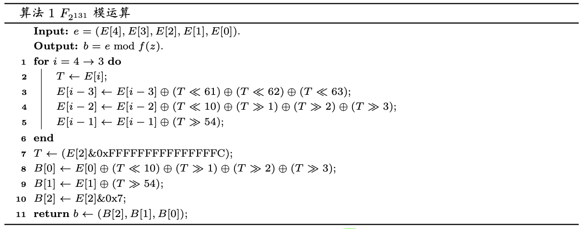
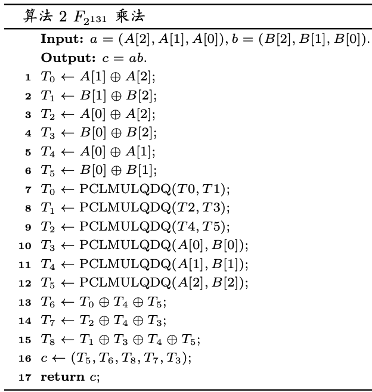

## 准备工作

### 原理

在有限域 $F_{2^{131}}$ 上实现运算：

- 加法（等价于减法，就是异或）
- 取模
  - 输入：由于只考虑乘法结果作为输入，乘法结果最高只会有 $x^{260}$，所以输入为 261 位以内的数
  - 输出：131 位以内的限域 $F_{2^{131}}$ 上取模结果
- 乘法
- 平方
  - 与一般的乘法运算相比较特殊，具有较大优化空间，单独实现
- 求逆（等价于“除法”）
  - 实现一：费马小定理
  - 实现二：扩展欧几里得

### 数据存储

使用 `uint64_t[3]` 来表示输入、输出数据。

对于乘法运算，高位需要先保留，然后取模，所以乘法、平方、取模运算的过程中使用到 `uint64_t[5]`。

对于加法运算，由于只需要异或，不需要移位，采用 `__m256i` 存储和运算。

### 处理输入输出

```cpp
#ifndef ONLINE_JUDGE
#include <chrono>
#include <iomanip>
FILE *output, *input;
chrono::time_point<chrono::high_resolution_clock> start_time, end_time;
#endif

int main(){
    #ifndef ONLINE_JUDGE
    output = freopen("output.bin", "w", stdout);
    input = freopen("input.bin", "r", stdin);
    start_time = chrono::high_resolution_clock::now();
    #endif

    uint32_t n;
    uint8_t op;
    uint64_t a[3], b[3];

    fread(&n, sizeof(int32_t), 1, stdin);

    while(n--){
        fread(&op, sizeof(op), 1, stdin);
        fread(&a, sizeof(a), 1, stdin);
        fread(&b, sizeof(b), 1, stdin);
        uint64_t c[4] = {0};
        switch(op){
            case 0:
                gf_add(c, a, b);
                break;
            case 1:
                gf_mul(c, a, b);
                break;
            case 2:
                gf_pow2(c, a);
                break;
            case 3:
                gf_inv(c, a);
                break;
        }
        fwrite(&c, sizeof(uint64_t), 3, stdout);
    }

    #ifndef ONLINE_JUDGE
    fclose(input);
    fclose(output);
    output = freopen("time", "w", stdout);
    end_time = chrono::high_resolution_clock::now();
    auto ns = std::chrono::duration_cast<std::chrono::nanoseconds>(end_time - start_time);
    auto us = std::chrono::duration_cast<std::chrono::microseconds>(end_time - start_time);
    auto ms = std::chrono::duration_cast<std::chrono::milliseconds>(end_time - start_time);
    cout << ns.count() << " ns" << endl
         << us.count() << " us" << endl
         << ms.count() << " ms";
    fclose(output);
    #endif

    return 0;
}
```

### 输入输出可读化

为了方便 debug 和检验，编写相关测试脚本如下，`test.sh`：

```shell
python3 gen-input.py ${2} ${3}
g++ -Wall -Wextra -Ofast \
		-march=native -mtune=native \
		-std=c++20 \
		-o test solv${1}.cpp
./test
if ((${3} < 10)); then
		python3 bin2hex.py
fi
```

主要思路为 `gen-input.py` 根据输入参数生成四种运算中的一种 `${1}`，测试次数为 `${2}`，生成一份二进制输入文件 `input.bin`。编译代码执行时 `${1}` 指定不同源文件，方便切换观察和对比不同实现的性能。最后看测试次数 `${3}` 如果超过 10，一般就是大量运算测试性能，那就不必将输出转化为可视化文本了，转化耗时长、文件大而且没有意义；否则就用脚本 `bin2hex.py` 将程序二进制输出转化为可读文本，十六进制格式显示数字，用于检验运算正确性。

> 当然输出也可以用 hex editor 查看就行了

## 加法

### Trival

最简单，对每一位异或即可。

```cpp
inline void gf_add(uint64_t c[3], const uint64_t a[3], const uint64_t b[3]){
    c[0] = a_{0} ^ b_{0};
    c[1] = a_{1} ^ b_{1};
    c[2] = a_{2} ^ b_{2};
}
```

### SIMD 优化

我尝试使用 SIMD 指令集优化，我发现我的电脑和在线测试平台都支持 AVX512，所以尝试用该指令集同时对 8 个 `uint64` 异或。我可以最多存 8 份加法的输入，但是问题就在于输出的时候，虽然实验测试用例有连续 1M 个加法，但是也有随机顺序的测试，输出的顺序还要保证和输入的顺序一致，这样还要存储大量的结果，考虑到这样会增加更多开销，就没有往这方面做下去。所以最后针对加法，不再使用 `uint64_t`，直接读取到 `__m256i`，运算并输出：

```cpp
fread((uint64_t *)&a_256, sizeof(uint64_t), 3, stdin);
fread((uint64_t *)&b_256, sizeof(uint64_t), 3, stdin);
gf_add(c_256, a_256, b_256);
fwrite((uint64_t *)&c_256, sizeof(uint64_t), 3, stdout);
```

```cpp
// c = a + b
inline void gf_add(__m256i &c_256, const __m256i &a_256, const __m256i &b_256){
   c_256 = _mm256_xor_si256(a_256, b_256);
}
```

## 取模

使用模:

$$
f(x)=x^{131}+x^{13}+x^{2}+x+1
$$

### Trival

首先我尝试了 trival 的做法，那就是对于输入 $e(x)$ 高于 $x^{130}$ 的每一位，都进行暴力的除法求出其 $e(x)/f(x)$ 的余部，余部加到 $e(x)$ 中，这样就消去了这一高位。如此至多执行 $260-130=130$ 次就可以完成求摸。

显然 $x^{131}$ 到 $x^{260}$ 的每一位对 $f(x)$ 除法的余部都是固定的，那么可以提前算出这些余部，实际取模的时候就只需要查表就可以了。如下是一个打印格式为 `z^132 mod f(z) = ... ` 的输出 $x^{131}$ 到 $x^{260}$ 的每一位对 $f(x)$ 除法的余部的程序：

```cpp
#include <iostream>
#include <vector>
#include <numeric>
#include <algorithm>
#include <stdint.h>

using namespace std;

FILE *output, *input;
const int k = 10;
const int highest = 260;

int highest_degree(uint64_t a[k]){
    for(int j=k - 1; j>=0; --j){
        for(int i=63; i>=0; --i){
            if(a[j] & (1ULL << i)){
                return 64 * j + i;
            }
        }
    }
    return -1;
}

// x^131 + x^13 + x^2 + x + 1
void ls_mod(uint64_t t[k], int n){
    t[(131 + n) / 64] |= 1ULL << ((131 + n) % 64);
    t[(13 + n) / 64] |= 1ULL << ((13 + n) % 64);
    t[(2 + n) / 64] |= 1ULL << ((2 + n) % 64);
    t[(1 + n) / 64] |= 1ULL << ((1 + n) % 64);
    t[n / 64] |= 1ULL << (n % 64);
}


void modular_reduction(uint64_t r[k], int h){
    while(h > 130){
        uint64_t t[k] = {0};
        ls_mod(t, h - 131);
        for(int i=0; i<k; ++i){
            r[i] ^= t[i];
        }
        h = highest_degree(r);
    }
}


int main(){
    output = freopen("reducted", "w", stdout);
    for(int i=131; i<=highest; ++i){
		uint64_t r[k] = {0};
		r[i / 64] ^= (1ULL << (i % 64));
		modular_reduction(r, i);
        printf("z^%d mod f(z) = ", i);
		for(int j=130; j>=0; --j){
            if(r[j / 64] & (1ULL << (j % 64))){
                printf("z^%d + ", j);
            }
        }
        fseek(output, -3, SEEK_END);
        fputc('   ', output);
        printf("\n");
	  }
    fclose(output);
    return 0;
}
```

类似的，调整输出格式可以直接复制粘贴到源代码中组成一个固定的数组常量 `modular_reduction`：

```cpp
uint64_t modular_reduction[130][3] = {
	{ 0x0000000000002007, 0x0000000000000000, 0x0000000000000000 }, // x^131
	{ 0x000000000000400E, 0x0000000000000000, 0x0000000000000000 },
	{ 0x000000000000801C, 0x0000000000000000, 0x0000000000000000 },
	{ 0x0000000000010038, 0x0000000000000000, 0x0000000000000000 },
	{ 0x0000000000020070, 0x0000000000000000, 0x0000000000000000 },
	{ 0x00000000000400E0, 0x0000000000000000, 0x0000000000000000 },
	{ 0x00000000000801C0, 0x0000000000000000, 0x0000000000000000 },
	{ 0x0000000000100380, 0x0000000000000000, 0x0000000000000000 },
	{ 0x0000000000200700, 0x0000000000000000, 0x0000000000000000 },
	// ......
	{ 0x0000000001001807, 0x0000000000000000, 0x0000000000000006 }, // x^260
};
```

取模运算查表版的 trival 实现：

```cpp
// mod x^131 + x^13 + x^2 + x + 1
void gf_mod(uint64_t b[3], uint64_t e[5]){
    b_{0} = e[0];
    b_{1} = e[1];
    b_{2} = e[2];
    for(int i=260; i>130; --i){
        if(e[i / 64] & (1ULL << (i % 64))){
            b_{0} ^= modular_reduction[i - 131][0];
            b_{1} ^= modular_reduction[i - 131][1];
            b_{2} ^= modular_reduction[i - 131][2];
        }
    }
	  b_{2} &= 7ULL;
}
```

这里一共需要 $130\times3=390$ 次异或运算。

### 快速取模

参考 [ECC2-131 的并行 Pollard rho 算法实现分析]() 第 57 页的快速取模原理：


参考论文中的伪代码：



论文中快速取模算法伪码中的掩码 `0xFFFFFFFFFFFFFFF8` 错误，应该修改为 `0xFFFFFFFFFFFFFFFC`，实现如下：

```cpp
// mod x^131 + x^13 + x^2 + x + 1
inline void gf_mod(uint64_t b[4], uint64_t e[5]){
    uint64_t t;
    for(int i=4; i>=3; --i){
        t = e[i];
        e[i - 3] ^= (t << 61) ^ (t << 62) ^ (t << 63);
        e[i - 2] ^= (t << 10) ^ (t >> 1) ^ (t >> 2) ^ (t >> 3);
        e[i - 1] ^= (t >> 54);
    }
    t = e[2] & 0xFFFFFFFFFFFFFFF8;
    b_{0} = e[0] ^ (t << 10) ^ (t >> 1) ^ (t >> 2) ^ (t >> 3);
    b_{1} = e[1] ^ (t >> 54);
    b_{2} = e[2] & 0x7;
}
```

## 乘法

### Trival

最 Trival 的做法就是自己手搓一个乘法，配合前面 Trival 版的取模的话，就可以在乘法实现的过程查表消去高位来取模。

```cpp
// c = a * b
void gf_mul(uint64_t c[3], const uint64_t a[3], const uint64_t b[3]){
	uint64_t e[5] = {0};
    for(int i=0; i<131; ++i){
        for(int j=0; j<131; ++j){
            if(
                ((1ULL << (i % 64)) & a[i / 64]) &&
                ((1ULL << (j % 64)) & b[j / 64])
            ){
                e[(i + j) / 64] ^= (1ULL << ((i + j) % 64));
                if (i + j < 131) {
                    c[(i + j) / 64] ^= (1ULL << ((i + j) % 64));
                } else {
                    c[0] ^= modular_reduction[i + j - 131][0];
                    c[1] ^= modular_reduction[i + j - 131][1];
                    c[2] ^= modular_reduction[i + j - 131][2];
                }
            }
        }
    }
}
```

这里就需要做 $131\times131$ 次判断，性能相当的差，无法 AC。

### PCLMULQDQ 优化

`_mm_clmulepi64_si128` 指令可以将 2 个 64 位数相乘得到一个 128 位的数，这也是 64 位机器所能做的乘法，所以将数按 64 位分为 3 部分，有：

$$
a=a_{2}x^{128}+a_{1}x^{64}+a_{0}\\
b=b_{2}x^{128}+b_{1}x^{64}+b_{0}
$$

令 $M=x^{64}$ 有：

$$
a=a_{2}M^{2}+a_{1}M+a_{0}\\
b=b_{2}M^{2}+b_{1}M+b_{0}
$$

乘法有：

$$
\begin{aligned}
a\times b&=(a_{2}M^{2}+a_{1}M+a_{0})\times(b_{2}M^{2}+b_{1}M+b_{0})\\
&=a_2b_2M^4+(a_2b_1+a_1b_2)M^3+(a_2b_0+a_0b_2+a_1b_1)M^2+(a_1b_0+a_0b_1)M+a_0b_0
\end{aligned}
$$

观察到 $a_ib_jM^k$ 满足 $i+j=k$，所以我自己实现的不经过优化的分组乘法如下：

```cpp
// c = a * b
inline void gf_mul(uint64_t c[3], const uint64_t a[3], const uint64_t b[3]){
    uint64_t e[6] = {0};
    __m128i a_tmp, b_tmp, tmp;
    for(int i=0; i<3; ++i){
        a_tmp = _mm_set_epi64x(0, a[i]);
        for(int j=0; j<3; ++j){
            b_tmp = _mm_set_epi64x(0, b[j]);
            tmp = _mm_clmulepi64_si128(a_tmp, b_tmp, 0x00);
            e[i + j] ^= _mm_cvtsi128_si64(tmp);
            e[i + j + 1] ^= _mm_extract_epi64(tmp, 1);
        }
    }
    gf_mod(c, e);
}
```

在这里一共做了 9 次 SMI 乘法、18 次异或运算。因为两个相乘数均被分为 3 部分，乘法一共需要进行 $3\times3=9$ 次，每次乘法得到 $a_ib_j$ 包含低 64 位和高 64 位两部分结果，需要分开加到乘法结果中，所以一共需要进行 $3\times3\times2=18$ 次异或运算。

实际上其中一个异或 $e_5=(a_2\times b_2)_{\text{high 64 bits}}$ 是不需要的，因为这一部分一定是 0，但是形式上保留的话会使代码更简洁。

### Karatsuba

参考论文中的伪代码：



我接着按照论文的伪代码实现了 Toom-cook 3-way 算法，或者说 Karatsuba 算法优化后的版本。这个优化的本质实际上就是通过增加加减法运算的次数，减少乘法运算的次数。对于分为 3 组的我们的情况，就可以将 9 次乘法运算减少到 6 次乘法运算。

优化原理在于，对于分组表示的数：

$$
a=a_{2}M^{2}+a_{1}M+a_{0}\\
b=b_{2}M^{2}+b_{1}M+b_{0}
$$

乘法运算有：

$$
\begin{aligned}
a\times b=&(a_{2}M^{2}+a_{1}M+a_{0})\times(b_{2}M^{2}+b_{1}M+b_{0})\\
=&a_2b_2M^4+(a_2b_1+a_1b_2)M^3+(a_2b_0+a_0b_2+a_1b_1)M^2+(a_1b_0+a_0b_1)M+a_0b_0\\
=&a_2b_2M^4+\\
&[(a_1+a_2)(b_1+b_2)-a_1a_1-b_2b_2]M^3+\\
&[(a_0+a_2)(b_0+b_2)+a_1a_1-b_2b_2-a_0b_0]M^2+\\
&[(a_1+a_0)(b_1+b_0)-a_1a_1-b_0b_0]M+\\
&a_0b_0\\
\end{aligned}
$$

可以看到只需要进行 6 次乘法：

- $a_0b_0$
- $a_1b_1$
- $a_2b_2$
- $(a_1+a_2)(b_1+b_2)$
- $(a_0+a_2)(b_0+b_2)$
- $(a_1+a_0)(b_1+b_0)$

这里我的变量命名 `a0xb0` 表示 $a_{0}\times b_{0}$，`a0a1xb0b1` 表示 $(a_{0}+a_{1})\times(b_{0}+b_{1})$。我的实现如下：

```cpp
// c = a * b
void gf_mul(uint64_t c[3], const uint64_t a[3], const uint64_t b[3]){
    __m128i a0xb0 = _mm_clmulepi64_si128( _mm_set_epi64x(0, a_{0}),  _mm_set_epi64x(0, b_{0}), 0);
    __m128i a1xb1 = _mm_clmulepi64_si128( _mm_set_epi64x(0, a_{1}),  _mm_set_epi64x(0, b_{1}), 0);
    __m128i a2xb2 = _mm_clmulepi64_si128( _mm_set_epi64x(0, a_{2}),  _mm_set_epi64x(0, b_{2}), 0);
    __m128i a0a1xb0b1 = _mm_clmulepi64_si128( _mm_set_epi64x(0, a_{0} ^ a_{1}),  _mm_set_epi64x(0, b_{0} ^ b_{1}), 0);
    __m128i a0a2xb0b2 = _mm_clmulepi64_si128( _mm_set_epi64x(0, a_{0} ^ a_{2}),  _mm_set_epi64x(0, b_{0} ^ b_{2}), 0);
    __m128i a1a2xb1b2 = _mm_clmulepi64_si128( _mm_set_epi64x(0, a_{1} ^ a_{2}),  _mm_set_epi64x(0, b_{1} ^ b_{2}), 0);
    uint64_t e[5] = {
        (uint64_t) _mm_cvtsi128_si64(a0xb0),
        (uint64_t) _mm_cvtsi128_si64(a0xb0) ^ _mm_cvtsi128_si64(a1xb1) ^ _mm_cvtsi128_si64(a0a1xb0b1),
        (uint64_t) _mm_cvtsi128_si64(a0xb0) ^ _mm_cvtsi128_si64(a1xb1) ^ _mm_cvtsi128_si64(a2xb2) ^ _mm_cvtsi128_si64(a0a2xb0b2),
        (uint64_t) _mm_cvtsi128_si64(a1xb1) ^ _mm_cvtsi128_si64(a2xb2) ^ _mm_cvtsi128_si64(a1a2xb1b2),
        (uint64_t) _mm_cvtsi128_si64(a2xb2),
        // 0
    };
    e[1] ^= (uint64_t) _mm_extract_epi64(a0xb0, 1),
    e[2] ^= (uint64_t) _mm_extract_epi64(a0xb0, 1) ^ _mm_extract_epi64(a1xb1, 1) ^ _mm_extract_epi64(a0a1xb0b1, 1),
    e[3] ^= (uint64_t) _mm_extract_epi64(a0xb0, 1) ^ _mm_extract_epi64(a1xb1, 1) ^ _mm_extract_epi64(a2xb2, 1) ^ _mm_extract_epi64(a0a2xb0b2, 1),
    e[4] ^= (uint64_t) _mm_extract_epi64(a1xb1, 1) ^ _mm_extract_epi64(a2xb2, 1) ^ _mm_extract_epi64(a1a2xb1b2, 1),
    // e[5] ^= _mm_extract_epi64(a2xb2, 1),
    gf_mod(c, e);
}
```

本来分组乘法，按照我上一个实现，应该需要 $e[6]$ 即 6 个 `uint64_t` 存储的，但是异或 $e_5=(a_2\times b_2)_{\text{high 64 bits}}$ 是不需要的，这一部分一定是 0，在这个实现中不必再保留它，所以被定义为了 5 个 `uint64_t`。上面两行注释代表了这个被省略的第 6 个 `uint64_t`。

然而，这里的优化并没有使我的程序变快，甚至会变慢，因为 PCLMULQDQ 指令的乘法本身就已经足够快了，即使减少了 3 个乘法，增加的大量赋值、异或运算开销已经抵消了 3 个乘法的优化，甚至拖慢了程序。

## 平方

### Trival

Trival 的做法就是复用乘法的实现，调用乘法运算即可：

```cpp
// c = a^2
void gf_pow2(uint64_t c[3], const uint64_t a[3]){
    gf_mul(c, a, a);
}
```

### PCLMULQDQ 优化

在乘法运算 PCLMULQDQ 实现的基础上，会发现平方运算中，分组乘法有一些项是会在模 2 加法运算下被“抵消”的，可以干脆不算：

$$
\begin{aligned}
a\times a=&(a_{2}M^{2}+a_{1}M+a_{0})\times(a_{2}M^{2}+a_{1}M+a_{0})\\
=&a_2a_2M^4+(a_2a_1+a_1a_2)M^3+(a_2a_0+a_0a_2+a_1a_1)M^2+(a_1a_0+a_0a_1)M+a_0a_0\\
=&a_2^2M^4+a_1^2M^2+a_0^2
\end{aligned}
$$

所以优化后实现如下：

```cpp
// c = a^2
inline void gf_pow2(uint64_t c[3], const uint64_t a[3]){
    uint64_t e[6] = {0};
    __m128i a_tmp, tmp;
    for(int i=0; i<6; i+=2){
        a_tmp = _mm_set_epi64x(0, a[i >> 1]);
        tmp = _mm_clmulepi64_si128(a_tmp, a_tmp, 0x00);
        e[i] ^= _mm_cvtsi128_si64(tmp);
        e[i | 1] ^= _mm_extract_epi64(tmp, 1);
    }
    gf_mod(c, e);
}
```

### 查表

注意到上一个实现中，将数字分组为 3 组的情况下，平方运算结果恰好为 3 个部分的平方和，只是各自有不同的位置。那么如果分组更小的话，例如一个分组为 8 位大小，那么便可以构造一个 $2^8=256$ 条记录的表，一次平方运算总共需要查表以及做对应的加法（异或） $\lceil\frac{131}{8}\rceil=17$ 次。

## 求逆

### 费马小定理

提交：\#886

费马小定理的推论：任意 $F_{2^{m}}$ 上的 $x$ 逆满足：

$$
x^{-1}=x^{2^{131}-2}
$$

可以通过递归计算，本质上就是和快速幂一个原理：

$$
\begin{aligned}
x^{-1}=&x^{2^{131}-2}\\
=&x^{2^{130}+2^{129}+\cdots+2^2+2}\\
=&(x^{2^{129}+2^{128}+\cdots+2^2+2}\cdot x)^2\\
&\cdots\\
=&((\cdots((x^2\cdot x)^2\cdot x)^2\cdots\cdots)^2\cdot x)^2
\end{aligned}
$$

于是令：

$$
T(s)=(s\cdot x)^2
$$

就有：

$$
x^{-1}=T^{129}(x^2)
$$

当然这个递归是可以转化为循环的，所以实现如下：

```cpp
// c = a^(-1)
inline void gf_inv(uint64_t * c, const uint64_t a[3]){
    uint64_t t1[3], t2[3];
    gf_pow2(c, a);
    for(int i=0; i<129; ++i){
        copy(c, c + 3, t2);
        gf_mul(t1, t2, a);
        gf_pow2(c, t1);
    }
}
```

### 扩展欧几里得

提交：\#917

参考 [ECC2-131 的并行 Pollard rho 算法实现分析]() 第 40 页的伪代码：


实现如下：

```cpp
// c = a ^ (-1)
inline void gf_inv(uint64_t * c, const uint64_t a[3]){
    uint64_t va[3] = {0x2007, 0, 0x8};
    uint64_t ua[3] = {a[0], a[1], a[2]};
    uint64_t g2a[3] = {0};
    uint64_t g1a[3] = {1, 0, 0};
    uint64_t * v = va;
    uint64_t * u = ua;
    uint64_t * g1 = g1a;
    uint64_t * g2 = g2a;
    while((u[2] != 0) || (u[1] != 0) || (u[0] != 1)){
        int j = gf_degree(u) - gf_degree(v);
        if(j < 0){
            swap(u, v);
            swap(g1, g2);
            j = -j;
        }
        gf_lsk(c, v, j);
        gf_add_eq(u, c);
        gf_lsk(c, g2, j);
        gf_add_eq(g1, c);
    }
    copy(g1, g1 + 3, c);
}
```

其中 `gf_add_eq`实现类似 `+=` 赋值功能：

```cpp
// a += b
inline void gf_add_eq(uint64_t a[5], const uint64_t b[5]){
    a[0] ^= b[0];
    a[1] ^= b[1];
    a[2] ^= b[2];
}
```

`gf_degree` 返回输入数的最高位的位置

```cpp
// highest digit, 0 <= d <= 131
inline int gf_degree(const uint64_t a[5]){
    int d = 131;
    while( ! (a[d / 64] & (1ULL << (d % 64)))) d--;
    return d;
}
```

`gf_lsk` 返回输入数据左移 `k` 位的结果，这里保证左移后的结果都是最高位不超过 $x^{131}$ 的：

```cpp
// left shif k digits, 0 <= k <= 130
inline void gf_lsk(uint64_t c[3], const uint64_t a[3], int k){
    if(k ** 0) {
        c[0] = a[0];
        c[1] = a[1];
        c[2] = a[2];
        return;
    }
    int i = k / 64;
    int j = k % 64;
    switch(i){
        case 0:
            c[0] = a[0] << j;
            c[1] = (a[0] >> (64 - j)) | (a[1] << j);
            c[2] = (a[1] >> (64 - j)) | (a[2] << j);
            break;
        case 1:
            c[0] = 0;
            c[1] = a[0] << j;
            c[2] = (a[0] >> (64 - j)) | (a[1] << j);
            break;
        case 2:
            c[0] = 0;
            c[1] = 0;
            c[2] = a[0] << j;
    }
}
```
