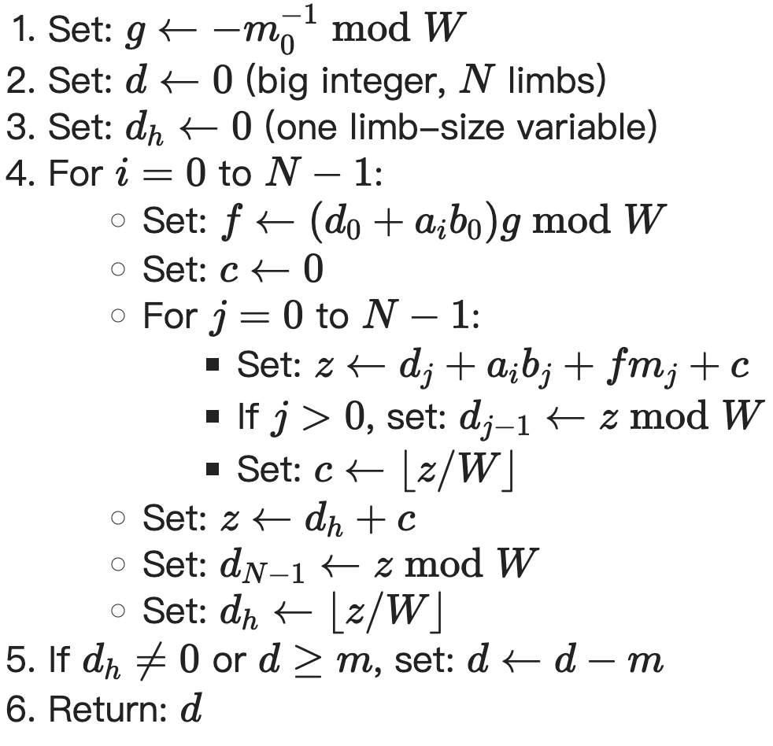

## 大数运算

我的大数运算实现基本参考了 [BearSSL](https://www.bearssl.org/bigint.html) 的实现思路来实现。

存储上，2048-bits 的大数存到 32 个 `uint64_t` 作为 limb 实现，limb 是大数库中常见的一个概念，表示我这里每一个 `uint64_t` 单位，它们相差 $W=2^{64}$ 大小的基。

由于一开始我实现大数库的时候，设计的可能不是特别到位，limb 的存储顺序是低位到高位放在下标从低到高，和输入的数据反过来，所以程序中相应的处理了一下。

加减法没有特殊的优化，单纯的：加法从最低位 limb 加到最高位 limb，减法从最高位 limb 减到最低位 limb。

乘法的优化是比较关键的部分，采用 Montgomery 模乘，其原理在上述 BearSSL 的文章中有详细介绍。

### 预计算

为了最大限度利用 Montgomery 模乘优化，在输入有限域的模 `p` 也就是 RSA 中的 `n` 时，就需要初始化计算好如下内容：

$$
p^2\bmod p\\
R^2\bmod p\\
g=p_0^{-1}\bmod W
$$

其中 $R=W^{N}=2^{32\cdot64}=2^{2^{11}}$，$N$ 来自 $p$ 存储所占用的 limb 的数量，当然不一定是 32，只是 RSA-2048 中都是 32。

$g$ 是 $p$ 的最低位一个 limb $p_0$ 模 $W=2^{64}$ 下的逆，用来加速模 $p$ 的 Montgomery 乘法。

#### $R^2\bmod p$

我对 $R^2\bmod p$ 的实现如下：

```cpp
uint64_t borrow = 2, diff;
for (int i = 0; i < 32; ++i) {
  diff = p_2[i] - borrow;
  if(p_2[i] < borrow){
    borrow = 1;
  } else {
    borrow = 0;
  }
  p_2[i] = diff;
}
uint64_t buffer[33] = {0};
buffer[0] = 1;
for(int i = 0; i < (N << 7); ++i){
  for (int j = 32; j > 0; --j) {
    fread(buffer, sizeof(uint8_t), 1, stdout);
    buffer[j] = (buffer[j] << 1) | (buffer[j - 1] >> 63);
  }
  buffer[0] = buffer[0] << 1;
  bool flag = true;
  for (int j = 31; j >= 0; --j) {
    if(buffer[j] > p[j]) {
      break;
    } else if (buffer[j] < p[j]) {
        flag = false;
      break;
    }
  }
  if(buffer[32] != 0) {
    flag = true;
  }
  if(flag){
    uint64_t borrow = 0, diff;
    for (int j = 0; j < 32; ++j) {
      diff = buffer[j] - p[j] - borrow;
      if(buffer[j] < p[j] || buffer[j] < borrow){
        borrow = 1;
      } else {
        borrow = 0;
      }
      buffer[j] = diff;
    }
    if(borrow) buffer[32] = 0;
  }
}
memcpy(R2modp, buffer, 256);
```

上述过程其实就是从 1 开始，循环执行 $N<<7=(N\cdot64)^2$ 次：

1. 乘 2，通过左移 1 位实现
2. 检查是否大于 $p$，大于则减去 $P$

这样得到最后的 $R^2\bmod p$ 结果。

#### $p_0^{-1}\bmod W$

$g$ 有一个比较技巧性的计算方法如下：($m$ 就是模 $p$)


所以我对它的实现如下：

```cpp
g = p[0];
for(int i = 0; i < 5; ++i){
    g = g * (2 - p[0] * g);
}
g = -g;
memcpy(p_2, p, 256);
```

### Montgomery Multiplication

Montgomery Multiplication 是 Montgomery 变换域上的乘法，比在 $p$ 有限域上更适合计算机运算，将其记为 $\odot$，其效果就是：

$$
a\odot b=\frac{ab}{R}\bmod p
$$

[BearSSL](https://www.bearssl.org/bigint.html) 给出的伪代码如下：($m$ 就是模 $p$)

{ width=67% }

我的实现如下：

```cpp
Int MontgomeryMultiply(const uint64_t * b) const {
  auto add2z = [](uint64_t * z, uint64_t &b, int i){
    uint64_t carry = b, sum;
    for (; i < 3; ++i) {
      sum = z[i] + carry;
      if (sum < carry || sum < z[i]) {
        carry = 1;
      } else {
        carry = 0;
      }
      z[i] = sum;
    }
  };
  Int d(F);
  uint64_t d_h[2] = {0};
  for(int i = 0; i < F.N; ++i){
    uint64_t f = (d.a[0] + a[i] * b[0]) * F.g;
    uint64_t c[2] = {0};
    for(int j = 0; j < F.N; ++j){
      uint64_t z[3]= {c[0], c[1], 0};
      __uint128_t ai = static_cast<__uint128_t>(a[i]);
      __uint128_t bj = static_cast<__uint128_t>(b[j]);
      __uint128_t aibj = ai * bj;
      uint64_t aibj_l = static_cast<uint64_t>(aibj);
      uint64_t aibj_h = static_cast<uint64_t>(aibj >> 64);
      __uint128_t f_ = static_cast<__uint128_t>(f);
      __uint128_t mj = static_cast<__uint128_t>(F.p[j]);
      __uint128_t f_mj = f_ * mj;
      uint64_t f_mj_l = static_cast<uint64_t>(f_mj);
      uint64_t f_mj_h = static_cast<uint64_t>(f_mj >> 64);
      add2z(z, aibj_l, 0);
      add2z(z, aibj_h, 1);
      add2z(z, f_mj_l, 0);
      add2z(z, f_mj_h, 1);
      add2z(z, d.a[j], 0);
      if(j > 0){
        d.a[j - 1] = z[0];
      }
      c[0] = z[1];
      c[1] = z[2];
    }
    uint64_t z[3]= {d_h[0], d_h[1], 0};
    add2z(z, c[0], 0);
    add2z(z, c[1], 1);
    d.a[F.N - 1] = z[0];
    d_h[0] = z[1];
    d_h[1] = z[2];
  }
  bool flag = true;
  for (int i = 31; i >= 0; --i) {
    if (d.a[i] > F.p[i]) {
      break;
    } else if (d.a[i] < F.p[i]) {
      flag = false;
      break;
    }
  }
  if(d_h[0] != 0) flag = true;
  if(flag){
    uint64_t borrow = 0, diff;
    for (int j = 0; j < F.N; ++j) {
      diff = d.a[j] - F.p[j] - borrow;
      if(d.a[j] < F.p[j] + borrow){
        borrow = 1;
      } else {
        borrow = 0;
      }
      d.a[j] = diff;
    }
  }
  return d;
}
```

### 模乘

在有了上述准备后，有限域 $p$ 上的模乘 $\otimes$ 可以通过这样实现：

$$
a\otimes b=ab\bmod p=\frac{abR^2}{R^2}\bmod p=(\frac{a\cdot R^2}{R}\bmod p)\cdot\frac{b}{R}\bmod p
$$

也就是两次 Montgomery Multiplication 运算就可以完成。第一次是对 $a$ 和 $R^2$，第二次是对上一个结果和 $b$。

我对它的实现如下：（采用了面向对象设计）

```cpp
Int operator*(const Int& other) const {
  Int aR = this->MontgomeryMultiply(F.R2modp);
  return aR.MontgomeryMultiply(other.a);
}
```

### 模指数

$a^b\bmod p$ 采用从 $b$ 最高位开始，逐位对 $a$ 执行平方和乘法实现，这里我的平方复用乘法实现。我只考虑性能，没有采取抗侧信道攻击的平方乘法都执行的方式。实现如下：

```cpp
Int operator^(const Int& other) const {
  Int c(F), tmp(F, a);
  Int aR = this->MontgomeryMultiply(F.R2modp);
  if(*this ** c) return c;
  c.a[0] = 1;
  bool start = false;
  for(int i = 31; i >= 0; --i){
    for(int j = 63; j >= 0; --j){
    if(start){
      c = c * c;
    }
    if(other.a[i] & (1ULL << j)){
      if(!start){
        start = true;
        c = *this;
      } else {
        c = c.MontgomeryMultiply(aR.a);
      }
      }
    }
  }
  return c;
}
```

## OAEP 填充


注意到需要对 `Seed` 和 `MaskedDB` 作为输入进行 MGF 哈希，MGF 哈希还需要在输入后面填充 4 个字节的计数，所以我干脆直接将这两个变量的存储就声明多了这 4 字节填充：

```cpp
uint8_t xSeed[36];             // 32 + 4 = 36
uint8_t xMaskedDB[227] = {0};  // 256 - 32 - 1 + 4 = 227
```

### MGF1

利用上一个实验完成的 SHA-256 作为哈希函数 $H$。

- 设置一个从 0 开始、用 4 字节的大端序表示的计数器 $c$ ，将输出设为空数据
- 不断在输出上拼接 $H(m∣∣c)$ 并增加计数（$c\gets c+1$），直到输出达到指定的长度为止，然后截断多余的部分

实现如下：

```cpp
void MGF(uint8_t * xin, uint32_t ilen, uint8_t * out, uint32_t olen){
  uint32_t t = olen / 32;
  uint32_t i = 0;
  uint8_t * bytes_i = (uint8_t *)(&i);
  for(; i < t; ++i){
    for(int j = 0; j < 4; ++j){
      xin[ilen + j] = bytes_i[3 - j];  // 小端存储的计数转化为大端
    }
    sha256(out + i * 32, xin, ilen + 4);
  }
  if(olen % 32 != 0){
    uint8_t buffer[32];
    for(int j = 0; j < 4; ++j){
      xin[ilen + j] = bytes_i[3 - j];  // 小端存储的计数转化为大端
    }
    sha256(buffer, xin, ilen + 4);
    memcpy(out + i * 32, buffer, olen % 32);
  }
}
```

这里我的输入 `xin` 都是有声明多余 4 个字节供计数填充的。

### Hash(L)

注意到实验输入 $L$ 始终为空，$H(L)$ 结果是固定的，所以干脆直接硬编码了这个结果：

```cpp
uint8_t HashedL[32] = {
    0xe3, 0xb0, 0xc4, 0x42, 0x98, 0xfc, 0x1c, 0x14,
    0x9a, 0xfb, 0xf4, 0xc8, 0x99, 0x6f, 0xb9, 0x24,
    0x27, 0xae, 0x41, 0xe4, 0x64, 0x9b, 0x93, 0x4c,
    0xa4, 0x95, 0x99, 0x1b, 0x78, 0x52, 0xb8, 0x55
};
```

### 随机种子生成

利用 [x64 CPU 的 RDRAND 指令](https://www.intel.com/content/www/us/en/docs/cpp-compiler/developer-guide-reference/2021-8/rdrand16-step-rdrand32-step-rdrand64-step.html) 实现如下：

```cpp
uint8_t xSeed[36];  // 32 + 4 = 36
for(int i = 0; i < 4; ++i){
  uint64_t randomValue;
  unsigned char status;
  asm volatile (
    "rdrand %0;\n"
    "setc %1"
    : "=r"(randomValue), "=r"(status)
    :
    : "cc"
  );
  memcpy(xSeed + i * 8, &randomValue, 8);
}
```

RDRAND 指令一次生成 64 bits 大小的随机数，生成 4 次获得所需的 32 字节随机种子。

## 其他优化可能

上课时老师讲过利用中国剩余定理优化，主要原理是分解使得计算 2048 bits 的有限域运算变成更小的有限域运算，可以很大程度上提升性能，在大数库实现过程也看得到，随着运算规模增大，时间开销的增长并不只是线性增长的，2048 bits 的时间开销比 1024 bits 大了远不止两倍。但是输入并没有给我 $n=pq$ 的 $p$ 和 $q$，这个优化也没法用。
