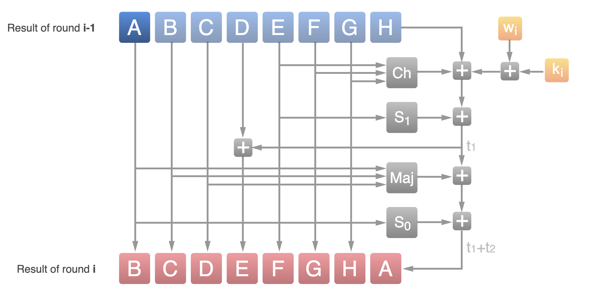

## 算法流程

### 扩展对齐

给定输入都是按字节对齐的，也就是 8bits 的倍数，但不一定是 SHA-256 要求的 512bits 的倍数，需要补位或者扩展。

补位对齐的工作不是在一开始做好的，因为输入数据量可能很大，一次性将所有数据读入程序内存空间是不合适的，而 SHA-256 工作本身就是分组迭代，所以 512bits = 64B 为单位（块）读入，每次处理完 64B 再读取下一个块的数据。只有在读最后一个块的时候，需要视情况补位扩展：

- 最后一个块大小小于等于 56 个字节，那么最后 8 个字节填入 64bits 无符号编码的原始数据字节为单位的长度，其余字节补 `0x80`
- 否则当前块剩余字节补 `0x80`（当然如果刚好最后一个块是 512bits 就不补，但后面的工作还要做），然后处理完当前块之后再补一个块，这一块最后 8 个字节填入 64bits 无符号编码的原始数据字节为单位的长度，其余字节补 `0x80`

综上，再考虑处理一个读入数据的时候还不知道这一块是不是最后一块，可以这样处理：不管原始数据有多长，先读取数据并处理一个块，然后判断读取数据长度，如果等于 64B，那么继续读取数据并处理一个块然后判断读取数据长度，否则按照上面的补位扩展处理。

所以我在程序实现的时候使用 `do{...}while(...)` 循环结构，来实现这样的逻辑：

```cpp
uint64_t bytesRead = 0, totalBytesRead = 0;
uint8_t * bytesTotalBytesRead = (uint8_t *)(&totalBytesRead);
uint8_t bytes[64] = {0};
do {
    bytesRead = fread(bytes, 1, sizeof(bytes), stdin);
    if (bytesRead ** 64) {
        totalBytesRead += 64;
        hashRounds(bytes);
    } else if (bytesRead <= 55) {
        totalBytesRead = (totalBytesRead + bytesRead) * 8;
        bytes[bytesRead] = 0x80;
        memset(bytes + bytesRead + 1, 0, 63 - bytesRead);
        for(int i = 0; i < 8; ++i){  /* 这个循环比较特殊 */
            bytes[i + 56] = bytesTotalBytesRead[7 - i];
        }
        hashRounds(bytes);
    } else {
        uint8_t bytes_end[64] = {0};
        totalBytesRead = (totalBytesRead + bytesRead) * 8;
        bytes[bytesRead] = 0x80;
        memset(bytes + bytesRead + 1, 0, 63 - bytesRead );
        hashRounds(bytes);
        for(int i = 0; i < 8; ++i){  /* 这个循环比较特殊 */
            bytes_end[i + 56] = bytesTotalBytesRead[7 - i];
        }
        hashRounds(bytes_end);
    }
} while (
    bytesRead ** 64
);
```

上面的注释我指出了 2 个特殊的循环，在这两个循环我相当于将 `bytesTotalBytesRead` 的大小端模式反了过来存到 `bytes` 或 `bytes_end`，这是有原因的，我在后面会提到。

`hashRounds` 就是 SHA-256 更标准的描述中的轮函数，这个函数的功能就是根据 512bits = 64B 输入更新 256bits 签名或者哈希值结果。

### 初始值与常量

算法根据每一个块对哈希值进行更新，而初始的哈希值则是一个固定的值，它来自自然数中前 8 个素数二次方根的小数部分里十进制下的前十位，定义如下：

```cpp
uint32_t H[8] = {
    0x6a09e667, 0xbb67ae85, 0x3c6ef372, 0xa54ff53a, 0x510e527f, 0x9b05688c, 0x1f83d9ab, 0x5be0cd19
};
```

每一轮更新都还需要一个 8 x 256bits 大小的常量 K，它来自自然数中前 64 个素数三次方根的小数部分里十进制下的前十位，定义如下：

```cpp
const uint32_t K[64] = {
    0x428a2f98, 0x71374491, 0xb5c0fbcf, 0xe9b5dba5, 0x3956c25b, 0x59f111f1, 0x923f82a4, 0xab1c5ed5,
    0xd807aa98, 0x12835b01, 0x243185be, 0x550c7dc3, 0x72be5d74, 0x80deb1fe, 0x9bdc06a7, 0xc19bf174,
    0xe49b69c1, 0xefbe4786, 0x0fc19dc6, 0x240ca1cc, 0x2de92c6f, 0x4a7484aa, 0x5cb0a9dc, 0x76f988da,
    0x983e5152, 0xa831c66d, 0xb00327c8, 0xbf597fc7, 0xc6e00bf3, 0xd5a79147, 0x06ca6351, 0x14292967,
    0x27b70a85, 0x2e1b2138, 0x4d2c6dfc, 0x53380d13, 0x650a7354, 0x766a0abb, 0x81c2c92e, 0x92722c85,
    0xa2bfe8a1, 0xa81a664b, 0xc24b8b70, 0xc76c51a3, 0xd192e819, 0xd6990624, 0xf40e3585, 0x106aa070,
    0x19a4c116, 0x1e376c08, 0x2748774c, 0x34b0bcb5, 0x391c0cb3, 0x4ed8aa4a, 0x5b9cca4f, 0x682e6ff3,
    0x748f82ee, 0x78a5636f, 0x84c87814, 0x8cc70208, 0x90befffa, 0xa4506ceb, 0xbef9a3f7, 0xc67178f2
};
```

### 轮函数

每一轮更新，初始化 8 个 word（32B） `a,b,c,d,e,f,g,h` 为 `H[8]` 的 8 个 word。然后循环迭代如下过程 64 轮：

{ width=60% }

更详细准确的计算过程如下：

{ width=60% }

64 轮需要 64 个字 `w`，也就是需要一个 `w[64]`，它的前 16 个字来自输入的 512bits = 16x32bits，其剩余 56

这里 `>>>` 表示循环右移，可以通过两次位移拼接实现，例如 n 位的 k 可以通过如下方式实现：

```cpp
x >>> k = ((x >> k) | (x << (n-k))
```

最后经过 64 轮迭代后，再将 `a,b,c,d,e,f,g,h` 分别加到 `H[8]` 的 8 个 word，作为这一轮更新结束的签名或哈希值。

代码实现如下，输入是 64x8B = 512bits ：

```cpp
void hashRounds(uint8_t * bytes){
    uint32_t w[64];

    for(int i = 0; i < 16; ++i){  /* 这个循环比较特殊 */
        for(int j = 0; j < 4; ++j){
            memcpy((uint8_t *)w + 4 * i + j, bytes + 4 * i + 3 - j, 1);
        }
    }

    for(int i = 16; i < 64; ++i){
        uint32_t s0 = ((w[i - 15] >> 7) | (w[i - 15] << 25)) ^ ((w[i - 15] >> 18) | (w[i - 15] << 14)) ^ (w[i - 15] >> 3);
        uint32_t s1 = ((w[i - 2] >> 17) | (w[i - 2] << 15)) ^ ((w[i - 2] >> 19) | (w[i - 2] << 13)) ^ (w[i - 2] >> 10);
        w[i] = w[i - 16] + s0 + w[i - 7] + s1;
    }

    uint32_t a = H[0];
    uint32_t b = H[1];
    uint32_t c = H[2];
    uint32_t d = H[3];
    uint32_t e = H[4];
    uint32_t f = H[5];
    uint32_t g = H[6];
    uint32_t h = H[7];
    uint32_t s1, ch, t1, s0, maj, t2;
    for(int i = 0; i < 64; ++i){
        s1 = ((e >> 6) | (e << 26)) ^ ((e >> 11) | (e << 21)) ^ ((e >> 25) | (e << 7));
        ch = (e & f) ^ ((~e) & g );
        t1 = h + s1 + ch + K[i] + w[i];
        s0 = ((a >> 2) | (a << 30)) ^ ((a >> 13) | (a << 19)) ^ ((a >> 22) | (a << 10));
        maj = (a & b) ^  (a & c) ^ (b & c);
        t2 = s0 + maj;
        h = g;
        g = f;
        f = e;
        e = d + t1;
        d = c;
        c = b;
        b = a;
        a = t1 + t2;
    }
    H[0] += a;
    H[1] += b;
    H[2] += c;
    H[3] += d;
    H[4] += e;
    H[5] += f;
    H[6] += g;
    H[7] += h;
}
```

上面的注释我指出了 2 个特殊的循环，在这两个循环我相当于将输入 64x8B = 512bits 为大小的块，以 1 word = 4B 为单位将大小端模式反了过来作为 `w[64]` 的前 16 个字。

这里和前面处理扩展补位一样，都是因为 SHA-256 算法中，进行移位、循环移位等操作都是对一个 word 操作，而我为了方便使用 `uint32_t` 作为一个 word 直接用 C++ 基本运算处理，现代处理器基本都是小端存储，存入 `uint32_t` 的时候需要保持和算法大端存储模式描述的一致，就得这样操作。

> 这个问题也是我 debug 了好几个小时才发现的

当然最终输出 `H` 的时候，也需要类似的处理将小端存储描述的结果转化为大端存储描述的结果。

## 一些可能的优化

### SIMD 优化

这里我没有实现，只是想到有这个方案，因为 Intel x86_64 提供了这样的指令集家族 SHA，可以直接硬件加速整个 SHA-256 算法。我在网上找到这样一个开源实现：

- https://github.com/minio/sha256-simd

这个实现中使用汇编调用了 SHA 指令集。

### 并行优化

SHA-256 的更新过程中 64 轮迭代依赖于上一轮迭代，无法实现并行。同样的轮函数依赖于上一轮的结果，也无法实现并行。

参考：https://stackoverflow.com/questions/24088295/can-sha1-sha-256-sha-512-be-broken-up-to-run-across-multiple-cores-threads

但是对每一个块的预处理，也就是 `w[64]` 的生成是相互独立的，还是可以并行化的。

## 思考题

### 问题 1

SHA-1 的初始常数是很有规律的 `0x67452301, 0xEFCDAB89, 0x98BADCFE, 0x10325476, 0xC3D2E1F0`，SHA-256 的初始常数和轮常数分别来自于前几个素数的平方根/立方根的小数部分。为什么要这么设计？

#### 回答

平方根和立方根本身具有良好的数学性质，确保生成的常数在运算中能够提供良好的混合性和扩散性。这对于哈希函数的安全性至关重要，因为它们需要确保输入的微小变化能导致输出的巨大变化。

### 问题 2

有一类 hash 算法被称为“Non-cryptographic hash function”，例如 [Java (OpenJDK) 中 `hashCode` 的实现](https://github.com/openjdk/jdk/blob/ac2fede165e0ecbfa51f5cc75a3218c51e3528be/src/java.base/share/classes/jdk/internal/util/ArraysSupport.java#L362) 是非常简单的迭代计算 `h = 31 * h + x`，其他的此类算法包括 [FNV](http://www.isthe.com/chongo/tech/comp/fnv/index.html)、[MurmurHash](https://github.com/aappleby/smhasher)、[xxHash](https://github.com/Cyan4973/xxHash) 等。它们与 MD5、SHA-1、SHA-256 等 hash 算法的区别是什么？它们有哪些主要用途？为什么会比 SHA-256 等等更适合用于这些场景？

#### 回答

- 非加密哈希函数：主要用于快速的数据散列和分布，优化性能，适用于哈希表、数据去重等场景。它们不具备防篡改或安全性的特性，具有更高的计算速度和更低的内存占用，因为它们的算法设计较为简单，优化了性能。另外非加密哈希函数在设计时并不考虑碰撞抵抗性，可能会存在多个输入映射到同一输出的现象。
- 加密哈希函数：旨在确保数据的完整性和安全性，具有抗碰撞性、抗篡改性等特性，适用于数字签名、密码保护等安全应用。另外还确保不同输入几乎不可能产生相同的哈希值。

### 问题 3

如果你需要设计一个用户系统，你也许知道数据库中不应该以明文存储用户的密码（遗憾的是，我国的知名计算机技术社区 CSDN 就犯过[这样的错误](https://news.sina.com.cn/o/2011-12-22/044523673588.shtml)），而应该存储密码的 hash。但是，在这种情况下直接使用 SHA-256 等等仍然是不推荐的。有哪些 hash 算法更适合用来处理密码？它们与 SHA-256 等等有什么区别？

#### 回答

- **bcrypt**：是一个基于 Blowfish 加密算法的哈希函数，它设计为慢速哈希，具有可调节的工作因子，可以随时间增加计算复杂度。通过增加计算时间来抵御暴力破解和字典攻击。
- **scrypt**：旨在防止专用硬件（如 ASIC）进行暴力破解，使用大量内存和计算资源。由于其内存强度，scrypt 对抗并行计算攻击（如 GPU 和 ASIC）效果更好。
- **Argon2**：具有高效的内存使用和可调节的时间复杂度。具备高度的安全性和灵活性，支持多种配置以应对不同的攻击场景。

它们与 SHA-256 的区别：SHA-256 是一种快速的哈希函数，设计目标是高效计算，但也使得暴力破解（即快速尝试大量候选密码）变得可行。而 bcrypt、scrypt 和 Argon2 则故意设计为较慢，以增加破解的难度，使得暴力破解的成本显著提高。

### 问题 4

在比特币中，有一类节点的功能是将交易数据打包成区块附加到区块链上，而我们常说的[“挖矿”](https://liaoxuefeng.com/books/blockchain/bitcoin/mining/)，其基本原理就是不断变换区块中的 nonce 字段，使整个区块的 SHA-256（当成一个 256 bit 的大整数）小于比特币网络当前规定的难度值。[glminer](https://www.etherdream.com/FunnyScript/glminer/glminer.html) 是一个由 [EtherDream](https://github.com/EtherDream) 编写的玩具版“挖矿”演示：给定 12 bytes 的数据 Q，要求找到另一串 4 bytes 的数据 A，使 Q+A 的 SHA-256 以 00000000 开头。尝试用你实现的 SHA-256 或各种标准库/第三方库来实现这一功能，并和 glminer 比较计算 SHA-256 的性能。查看[在 V2EX 上的讨论](https://v2ex.com/t/347005)以及 glminer 的[源代码](https://www.etherdream.com/FunnyScript/glminer/main.js)，为什么会存在这样的性能差距？它是如何实现 SHA-256 计算的？

#### 回答

我没有尝试编写挖矿程序，但我看了 [glminer 源码](https://www.etherdream.com/FunnyScript/glminer/main.js)，它使用了自定义 [着色器代码](https://www.etherdream.com/FunnyScript/glminer/fshader.c) 计算哈希，通过 WebGL 画图渲染触发 GPU 不断对尝试的随机数执行这个代码计算哈希值，实现挖矿的效果。

它的代码能够用 GPU 以 2048 线程并行化加速，所以效果当然是比单线程程序要好很多的。
