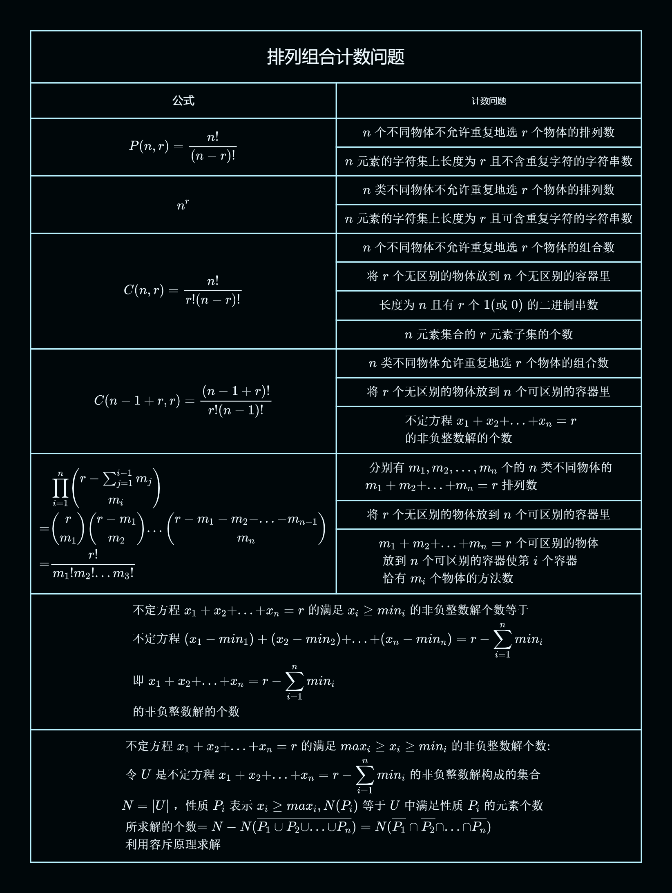

## 思维导图

##

$$
P(n,r)=\frac{n!}{(n-r)!}
$$

$$
n个不同物体不允许重复地选r个物体的排列数
$$

$$
n元素的字符集上长度为r且不含重复字符的字符串数
$$

##

$$
n^r
$$

$$
n类不同物体不允许重复地选r个物体的排列数
$$

$$
n元素的字符集上长度为r且可含重复字符的字符串数
$$

##

$$
C(n,r)=\frac{n!}{r!(n-r)!}
$$

$$
n个不同物体不允许重复地选r个物体的组合数
$$

$$
将r个无区别的物体放到n个无区别的容器里
$$

$$
长度为n且有r个1(或0)的二进制串数
$$

$$
n元素集合的r元素子集的个数
$$

##

$$
C(n-1+r,r)=\frac{(n-1+r)!}{r!(n-1)!}
$$

$$
n类不同物体允许重复地选r个物体的组合数
$$

$$
将r个无区别的物体放到n个可区别的容器里
$$

$$
\begin{aligned} &不定方程x_1 +x_2 +...+x_n =r\\
&的非负整数解的个数
\end{aligned}
$$

##

$$
\begin{aligned} &\prod_{i=1}^{n}
\begin{pmatrix}r-\sum_{j=1}^{i-1}m_j\\m_i\end{pmatrix}\\
=&
\begin{pmatrix}r\\m_1\end{pmatrix}
\begin{pmatrix}r-m_1\\m_2\end{pmatrix}
...
\begin{pmatrix}r-m_1-m_2-...-m_{n-1}\\m_n\end{pmatrix}
\\
=&\frac{r!}{m_1!m_2!...m_3!}
\end{aligned}
$$

$$
\begin{aligned} &分别有m_1,m_2,...,m_n个的n类不同物体的\\
&m_1+m_2+...+m_n=r排列数
\end{aligned}
$$

$$
将r个无区别的物体放到n个可区别的容器里
$$

$$
\begin{aligned} &m_1+m_2+...+m_n=r个可区别的物体\\
&放到n个可区别的容器使第i个容器\\
&恰有m_i个物体的方法数
\end{aligned}
$$

##

$$
\begin{aligned} &不定方程x_1 +x_2 +...+x_n =r的满足x_i\geq min_i的非负整数解个数等于\\
&不定方程(x_1-min_1)+(x_2-min_2)+...+(x_n-min_n)=r-
\sum_{i=1}^{n}min_i
\\
&即x_1 +x_2 +...+x_n =r-
\sum_{i=1}^{n}min_i
\\
&的非负整数解的个数
\end{aligned}
$$

##

$$
\begin{aligned} &不定方程x_1 +x_2 +...+x_n =r的满足max_i\geq x_i\geq min_i的非负整数解个数:\\
&令U是不定方程x_1 +x_2 +...+x_n =r-
\sum_{i=1}^{n}min_i
的非负整数解构成的集合\\
&N=|U|，性质P_i表示x_i\geq max_i,N(P_i)等于U中满足性质P_i的元素个数\\
&所求解的个数=
N-N(\overline{P_1\cup P_2\cup...\cup P_n})
=N(\overline{P_1}\cap\overline{P_2}\cap...\cap\overline{P_n})\\
&利用容斥原理求解
\end{aligned}
$$
