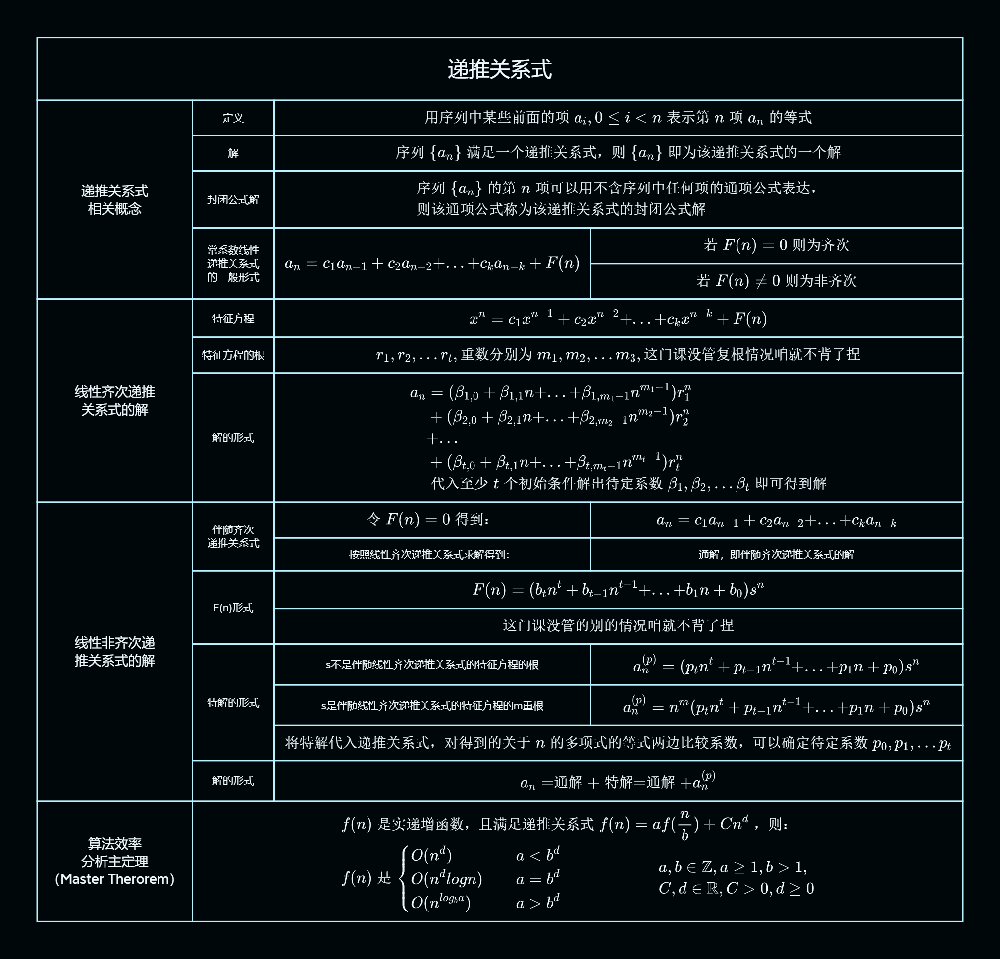

## 思维导图

## 递推关系式相关概念

### 定义

$$
\text{用序列中某些前面的项}a_i,0\leq i\lt n\text{表示第}n\text{项}a_n\text{的等式}
$$

### 解

$$
\text{序列}\{a_n\}\text{满足一个递推关系式，则}\{a_n\}\text{即为该递推关系式的一个解}
$$

### 封闭公式解

$$
\begin{aligned} &\text{序列}\{a_n\}\text{的第n项可以用不含序列中任何项的通项公式表达，}\\
&\text{则该通项公式称为该递推关系式的封闭公式解}
\end{aligned}
$$

### 常系数线性递推关系式的一般形式

$$
\begin{aligned} &a_n = c_1a_{n-1}+c_2a_{n-2}+...+c_ka_{n-k}+F(n)
\end{aligned}
$$

$$
\text{若}F(n)=0\text{则为齐次}
$$

$$
\text{若}F(n)\neq 0\text{则为非齐次}
$$

## 线性齐次递推关系式的解

### 特征方程

$$
\begin{aligned} &x^n = c_1x^{n-1}+c_2x^{n-2}+...+c_kx^{n-k}+F(n)
\end{aligned}
$$

### 特征方程的根

$$
\begin{aligned} r_1,r_2,...r_t,\text{重数分别为}m_1,m_2,...m_3,\text{这门课没管复根情况咱就不背了捏}
\end{aligned}
$$

### 解的形式

$$
\begin{aligned} a_n &= (\beta_{1,0}+\beta_{1,1}n+...+\beta_{1,m_1-1}n^{m_1-1})r_1^{n} \\&
+(\beta_{2,0}+\beta_{2,1}n+...+\beta_{2,m_2-1}n^{m_2-1})r_2^{n} \\&
+...\\&
+(\beta_{t,0}+\beta_{t,1}n+...+\beta_{t,m_t-1}n^{m_t-1})r_t^{n}\\&
\text{代入至少t个初始条件解出待定系数}\beta_1,\beta_2,...\beta_t\text{即可得到解}
\end{aligned}
$$

## 线性非齐次递推关系式的解

### 伴随齐次递推关系式

$$
\text{令}F(n)=0\text{得到：}
$$

$$
\begin{aligned} &a_n = c_1a_{n-1}+c_2a_{n-2}+...+c_ka_{n-k}
\end{aligned}
$$

- 按照线性齐次递推关系式求解得到：

  - 通解，即伴随齐次递推关系式的解

### F(n)形式

$$
\begin{aligned} F(n)=(b_tn^t+b_{t-1}n^{t-1}+...+b_1n+b_0)s^n
\end{aligned}
$$

!!! info rmation
这门课没管的别的情况咱就不背了捏

### 特解的形式

- s 不是伴随线性齐次递推关系式的特征方程的根

$$
\begin{aligned} a_n^{(p)} = (p_tn^t+p_{t-1}n^{t-1}+...+p_1n+p_0)s^n
\end{aligned}
$$

- s 是伴随线性齐次递推关系式的特征方程的 m 重根

$$
\begin{aligned} a_n^{(p)} = n^m(p_tn^t+p_{t-1}n^{t-1}+...+p_1n+p_0)s^n
\end{aligned}
$$

$$
\text{将特解代入递推关系式，对得到的关于n的多项式的等式两边比较系数，可以确定待定系数}p_0,p_1,...p_t
$$

### 解的形式

$$
\begin{aligned} a_n = \text{通解}+\text{特解}=\text{通解}+a_n^{(p)}
\end{aligned}
$$

## 算法效率

分析主定理
（Master Therorem）

###

$$
\begin{aligned} &f(n)\text{是实递增函数，且满足递推关系式}f(n)=af(\frac{n}{b})+Cn^d\text{，则：}\\&
    \begin{aligned}
    f(n)是\left\{\begin{aligned}
            &O(n^d) & a\lt b^d\\
            &O(n^dlogn) & a= b^d\\
            &O(n^{log_ba})& a\gt b^d
        \end{aligned}\right.
        &&&&&&
        \begin{aligned}
        &a,b\in\mathbb{Z},a\geq1,b\gt1,\\
        &C,d\in\mathbb{R},C\gt0,d\geq0
        \end{aligned}
    \end{aligned}
\end{aligned}
$$
