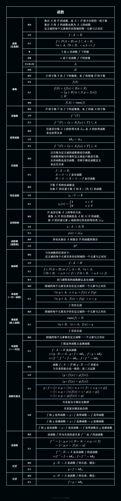

## 函数

(全函数)

### 描述

$$
\begin{aligned} &\text{集合A到B的函数，是}A\times \text{笛卡尔积的一类子集}\\
&\text{集合A到A的函数也称为A上的函数}\\
&\text{定义域的每个元素都存在陪域的唯一元素与之对应}
\end{aligned}
$$

### 记号

$$
\begin{aligned} f:A\to B
\end{aligned}
$$

### 定义

$$
\begin{aligned} &f\in P(A\times B) \ or\ f \subseteq A\times B ,\\ &\forall a\in A,\ \exists!b\in B,\ <a,b>\in f
\end{aligned}
$$

### 像

$$
\text{b是a在函数f下的像}
$$

### 原像

$$
\text{a是b在函数f下的原像}
$$

### 定义域 or 域

$$
A
$$

### 陪域

$$
B
$$

## 像集

### 描述

$$
\text{A的子集S在f下的像集，是f的陪域B的子集}
$$

### 记号

$$
\begin{aligned} f(S)
\end{aligned}
$$

### 定义

$$
\begin{aligned} f(S)&=\{f(x)\in B|x\in S\}\\
&=\{y\in B|\exists x\in S,y=f(x)\}\\
&\subseteq B
\end{aligned}
$$

### 值域

$$
\begin{aligned} f(A)=\boldsymbol{ran}(f)
\end{aligned}
$$

## 逆像集

### 描述

$$
\text{B的子集T在f下的逆像集，是f的域A的子集}
$$

### 记号

$$
\begin{aligned} f^{-1}(T)
\end{aligned}
$$

### 定义

$$
\begin{aligned} f^{-1}(T)=\{x\in A|f(x)\in T\}\subseteq A
\end{aligned}
$$

## 恒等函数

### 描述

$$
\begin{aligned}&\text{任意非空集A上的恒等关系}\Delta_A\text{是A的恒等函数}\\&
\text{来自恒等关系}
\end{aligned}
$$

### 记号

$$
\begin{aligned} \boldsymbol{id}_A=\Delta_A
\end{aligned}
$$

### 定义

$$
\begin{aligned} f^{-1}(T)=\{x\in A|f(x)\in T\}\subseteq A
\end{aligned}
$$

## 空函数

### 描述

$$
\begin{aligned}&
\text{以空集为定义域的函数都是空函数，}\\&
\text{当函数陪域为空集时定义域也只能是空集，}\\&
\text{从而函数也是空函数，否则不满足函数定义}\\&
\text{来自空关系}
\end{aligned}
$$

### 定义

$$
\begin{aligned} &f:A\to B,\\
&A=\varnothing\to f\text{是空函数}\\
&B=\varnothing\to A=\varnothing\to f\text{是空函数}
\end{aligned}
$$

## 特征函数

### 描述

$$
\begin{aligned} &\text{子集S的特征函数是}\\
&\text{全集U的任意子集S到}\boldsymbol{2}=\{\boldsymbol{0},\boldsymbol{1}\}\text{的函数}
\end{aligned}
$$

### 记号

$$
\begin{aligned} \chi_s :U\to \boldsymbol{2}
\end{aligned}
$$

### 定义

$$
\begin{aligned}     \chi_s (x)=\left\{\begin{aligned}
            \boldsymbol{1}\\
            \boldsymbol{0}
        \end{aligned}\right.
        &&&&
        \begin{aligned}
        x\in S\\
        x\not\in S
        \end{aligned}
\end{aligned}
$$

## 自然映射

### 描述

$$
\begin{aligned}
&R\text{是非空集A上的等价关系，}\\
&\text{商集A/R的自然映射是A到A/R的函数},\\
&\text{将A的任意元素a映射到它所在的等价类}[a]_R
\end{aligned}
$$

### 记号

$$
\begin{aligned} \rho :A\to A/R
\end{aligned}
$$

### 定义

$$
\begin{aligned} \rho(a)=[a]_R
\end{aligned}
$$

## 函数集

(函数族)

### 描述

$$
\text{所有从集合A到集合B的函数的集合}
$$

### 记号

$$
\begin{aligned} B^A
\end{aligned}
$$

## 偏函数

### 描述

$$
\begin{aligned} &与全函数的区别在于：\\
&定义域的每个元素至多存在陪域的一个元素与之对应
\end{aligned}
$$

### 记号

$$
\begin{aligned} f:A\rightharpoonup B
\end{aligned}
$$

### 定义

$$
\begin{aligned} &f\in P(A\times B) \ or\ f \subseteq A\times B ,\ \ \forall a\in A,\\&
(\exists!b\in B,\ <a,b>\in f)\lor(!\exists b\in B,\ <a,b>\in f)
\end{aligned}
$$

### 备注

$$
\text{本门课程里的函数默认是全函数}
$$

## 单函数

(一对一函数)

### 描述

$$
\begin{aligned}\text{陪域的每个元素至多存在定义域的一个元素与之对应}
\end{aligned}
$$

### 定义

$$
\begin{aligned} &\forall x,y\in A,\ \ x\neq y\to f(x)\neq f(y)
\end{aligned}
$$

$$
\begin{aligned} &\forall x,y\in A,\ \ f(x)=f(y)\to x=y
\end{aligned}
$$

$$
\begin{aligned} f\text{存在左逆}
\end{aligned}
$$

## 满函数

(映上函数)

### 描述

$$
\begin{aligned}\text{陪域的每个元素至少存在定义域的一个元素与之对应}
\end{aligned}
$$

### 定义

$$
\begin{aligned} \boldsymbol{ran}(f)=B
\end{aligned}
$$

$$
\begin{aligned} &\forall y\in B,\ \ \exists x\in A,\ \ f(x)=y
\end{aligned}
$$

$$
\begin{aligned} f\text{存在右逆}
\end{aligned}
$$

## 双函数

(一一对应)

### 描述

$$
\begin{aligned} \text{陪域的每个元素都有定义域唯一一个元素与之对应}
\end{aligned}
$$

### 定义

$$
\begin{aligned} f\text{既是单函数又是满函数}
\end{aligned}
$$

$$
\begin{aligned}& f:A\to B\text{是双函数}\\\Leftrightarrow&
\exists g:B\to A\ ,\ g\circ f=\boldsymbol{id}_A\ ,\ f\circ g=\boldsymbol{id}_B\\\Leftrightarrow&
\exists f^{-1},f^{-1}\circ f=\boldsymbol{id}_A\ ,\ f\circ f^{-1}=\boldsymbol{id}_B
\end{aligned}
$$

## 函数的复合

### 描述

$$
\begin{aligned} &\text{函数}f:A\to B\text{和}g:B\to C\text{的复合}\\&
\text{与关系的复合是一致的，是二元运算}
\end{aligned}
$$

### 记号

$$
\begin{aligned} (g\circ f)(x)=g(f(x))
\end{aligned}
$$

### 定义

$$
\begin{aligned} (g\circ f)(x)=g(f(x))
\end{aligned}
$$

$$
\begin{aligned} g\circ f&=\{<x,y>|\exists z(<x,z>\in f\land<z,y>\in g)\}\\
&=\{<x,y>|\exists z(f(x)=z\land g(z)=y)\}\\
&=\{<x,y>|g(f(x))=y\}
\end{aligned}
$$

### 性质

$$
\begin{aligned}& 关系复合不满足交换律
\end{aligned}
$$

$$
\begin{aligned}&\text{关系复合满足结合律}
\end{aligned}
$$

$$
\begin{aligned}& f\text{和}g\text{是单函数}\to g\circ f\text{是单函数}\to f\text{是单函数}
\end{aligned}
$$

$$
\begin{aligned}& f\text{和}g\text{是满函数}\to g\circ f\text{是满函数}\to g\text{是满函数}
\end{aligned}
$$

$$
\begin{aligned}& f\text{和}g\text{是双函数}\to g\circ f\text{是双函数}\to f\text{是单函数且}g\text{是满函数}
\end{aligned}
$$

## 逆函数

### 描述

$$
\begin{aligned}\text{双函数}f\text{作为关系的逆关系}f^{-1}\text{是}f\text{的逆函数}
\end{aligned}
$$

### 定义

$$
\begin{aligned} f^{-1}&
=\{<y,x>\in B\times A|<x,y>\in f\}\\&
=\{<y,x>|f(x)=y\}
\end{aligned}
$$

$$
\begin{aligned}& f^{-1}:B\to A\text{是双函数}f\text{的逆函数}\\\Leftrightarrow&
f^{-1}\circ f=\boldsymbol{id}_A\ ,\ f\circ f^{-1}=\boldsymbol{id}_B
\end{aligned}
$$

## 左逆

### 描述

$$
\begin{aligned} g:B\to A\text{是函数}f\text{的左逆，满足：}
\end{aligned}
$$

### 定义

$$
\begin{aligned} &g\circ f=\boldsymbol{id}_A
\end{aligned}
$$

## 左逆

### 描述

$$
\begin{aligned} g:B\to A\text{是函数}f\text{的右逆，满足：}
\end{aligned}
$$

### 定义

$$
\begin{aligned} &f\circ g=\boldsymbol{id}_B
\end{aligned}
$$
