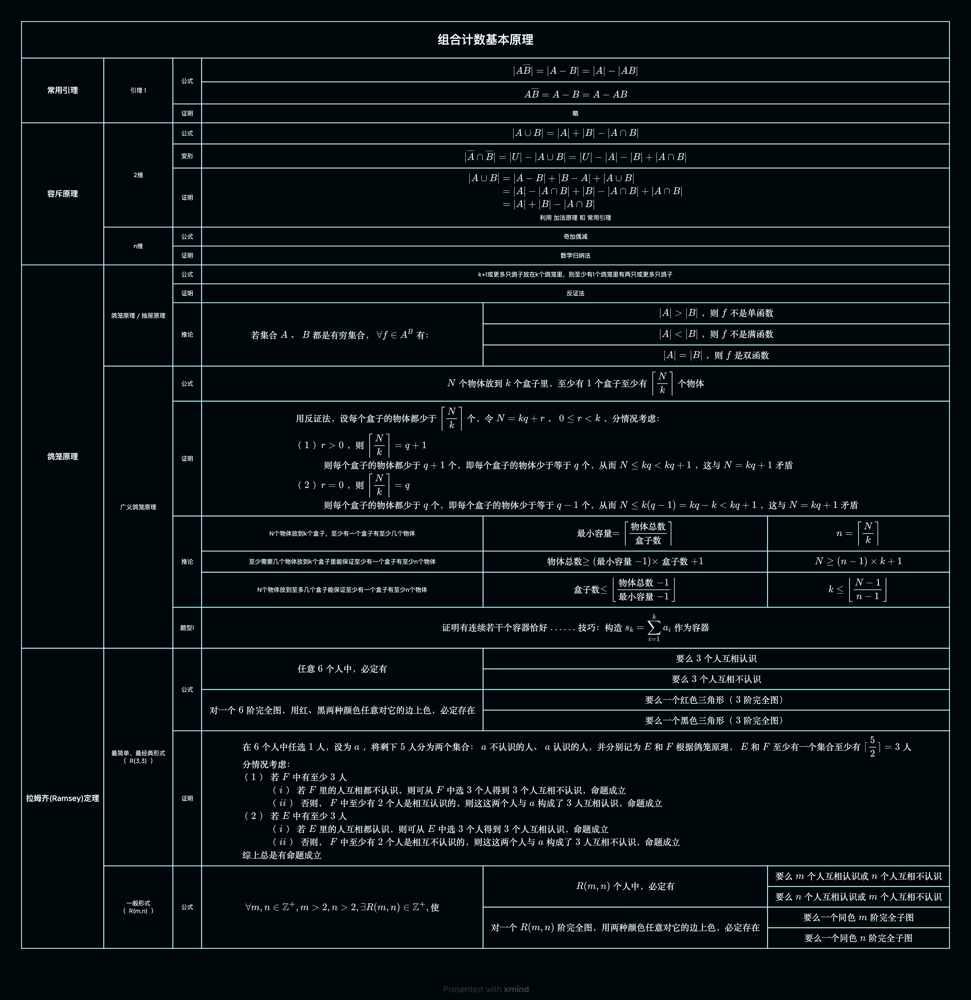

## 思维导图

## 常用引理

### 引理 1

#### 公式

$$
| A\overline{B} |=| A-B | = |A| -| A B|
$$

$$
A\overline{B} = A - B = A - A  B
$$

#### 证明

略

## 容斥原理

### 2 维

- 公式

  -

$$
| A \cup B | = |A|+|B|- |A \cap B|
$$

- 变形

  -

$$
| \overline{A} \cap \overline{B} | = |U|-|A\cup B| = |U|- |A| - |B| + |A \cap B|
$$

- 证明

  - 利用 加法原理 和 常用引理

$$
\begin{align} |A \cup B| &=  |A-B|+|B-A|+|A \cup B|\\
&= |A|-|A \cap B|+|B|-|A \cap B|+|A \cap B|\\
&= |A|+|B|- |A \cap B|\end{align}
$$

### n 维

- 公式

  - 奇加偶减

- 证明

  - 数学归纳法

## 鸽笼原理

### 鸽笼原理 / 抽屉原理

#### 公式

- k+1 或更多只鸽子放在 k 个鸽笼里，则至少有 1 个鸽笼里有两只或更多只鸽子

#### 证明

- 反证法

#### 推论

$$
若集合A、B都是有穷集合，\forall f\in A^B有：

$$

$$
|A|\gt|B|，则f不是单函数
$$

$$
|A|\lt|B|\text{，则}f\text{不是满函数}
$$

$$
|A|=|B|\text{，则}f\text{是双函数}
$$

### 广义鸽笼原理

#### 公式

$$
N\text{个物体放到}k\text{个盒子里，至少有}1\text{个盒子至少有}\left\lceil \frac{N}{k} \right\rceil\text{个物体}
$$

#### 证明

$$
\begin{aligned}&\text{用反证法，设每个盒子的物体都少于}\left\lceil \frac{N}{k} \right\rceil\text{个，令}N=kq+r，0 \le r\lt k\text{，分情况考虑：}\\&
\begin{aligned}
（1）&r\gt0\text{，则}\left\lceil \frac{N}{k} \right\rceil = q+1\\&
\text{则每个盒子的物体都少于}q+1\text{个，即每个盒子的物体少于等于}q\text{个，}
\text{从而}N\le kq\lt kq+1\text{，这与}N=kq+1\text{矛盾}
\end{aligned}\\&
\begin{aligned}
（2）&r=0，则 \left\lceil \frac{N}{k} \right\rceil = q\\&
\text{则每个盒子的物体都少于}q\text{个，即每个盒子的物体少于等于}q-1\text{个，从而}N\le k(q-1)=kq-k\lt kq+1\text{，这与}N=kq+1\text{矛盾}
\end{aligned}
\end{aligned}
$$

#### 推论

##### N 个物体放到 k 个盒子，至少有一个盒子有至少几个物体

$$
\text{最小容量}=\left\lceil \frac{\text{物体总数}}{\text{盒子数}} \right\rceil
$$

$$
n=\left\lceil \frac{N}{k} \right\rceil
$$

##### 至少需要几个物体放到 k 个盒子里能保证至少有一个盒子有至少 n 个物体

$$
\text{物体总数}\ge (\text{最小容量}-1)\times\text{盒子数}+1
$$

$$
N\ge (n-1)\times k+1
$$

##### N 个物体放到至多几个盒子能保证至少有一个盒子有至少 n 个物体

$$
盒子数\le \left\lfloor \frac{\text{物体总数}-1}{\text{最小容量}-1} \right\rfloor
$$

$$
k\le\left\lfloor \frac{N-1}{n-1} \right\rfloor
$$

#### 题型

$$
\text{证明有连续若干个容器恰好...... 技巧：构造}s_k=\sum^k_{i=1}{a_i}\text{作为容器}
$$

## 拉姆齐(Ramsey)定理

### 最简单、最经典形式

R(3,3)

#### 公式

##### 解释

$$
\text{任意}6\text{个人中，必定有}
$$

$$
\text{要么}3\text{个人互相认识}
$$

$$
\text{要么}3\text{个人互相不认识}
$$

##### 图论解释

$$
\text{对一个}6\text{阶完全图，用红、黑两种颜色任意对它的边上色，必定存在}
$$

$$
\text{要么一个红色三角形（}3\text{阶完全图）}
$$

$$
\text{要么一个黑色三角形（}3\text{阶完全图）}
$$

#### 证明

$$
\begin{aligned}&
\text{在6个人中任选1人，设为a，将剩下5人分为两个集合：a不认识的人、a认识的人，并分别记为E和F}
\text{根据鸽笼原理，E和F至少有一个集合至少有}\lceil \frac{5}{2}\rceil=3 \text{人}\\&
\text{分情况考虑：}\\&
    \begin{aligned}
    \text{（1）}&\text{若F中有至少3人}\\&
        \begin{aligned}
        \text{（i）}&\text{若F里的人互相都不认识，则可从F中选3个人得到3个人互相不认识，命题成立}
        \end{aligned}\\&
        \begin{aligned}
        \text{（ii）}&\text{否则，F中至少有2个人是相互认识的，则这这两个人与a构成了3人互相认识，命题成立}
        \end{aligned}
    \end{aligned}\\&
    \begin{aligned}
    \text{（2）}&\text{若E中有至少3人}\\&
        \begin{aligned}
        \text{（i）}&\text{若E里的人互相都认识，则可从E中选3个人得到3个人互相认识，命题成立}
        \end{aligned}\\&
        \begin{aligned}
        \text{（ii）}&\text{否则，F中至少有2个人是相互不认识的，则这这两个人与a构成了3人互相不认识，命题成立}
        \end{aligned}
    \end{aligned}\\&
\text{综上总是有命题成立}
\end{aligned}
$$

### 一般形式

R(m,n)

#### 公式

$$
\forall m,n\in\mathbb{Z^+},m\gt 2,n\gt 2,\exists R(m,n)\in \mathbb{Z^+},使
$$

##### 解释

$$
R(m,n)\text{个人中，必定有}
$$

$$
\text{要么m个人互相认识或n个人互相不认识}
$$

$$
\text{要么n个人互相认识或m个人互相不认识}
$$

##### 图论解释

$$
\text{对一个}R(m,n)\text{阶完全图，用两种颜色任意对它的边上色，必定存在}
$$

$$
\text{要么一个同色m阶完全子图}
$$

$$
\text{要么一个同色n阶完全子图}
$$
