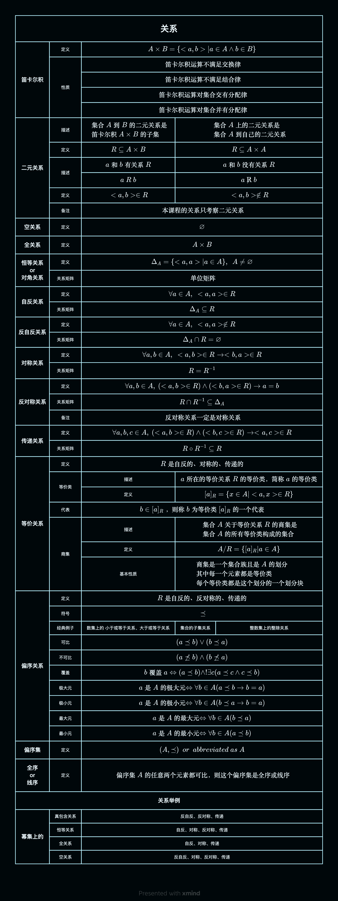

## 思维导图

## 笛卡尔积

### 定义

$$
\begin{aligned}& A\times B=\{\langle a,b\rangle|a\in A\land b\in B\}
\end{aligned}
$$

### 性质

$$
\begin{aligned}& \text{笛卡尔积运算不满足交换律}
\end{aligned}
$$

$$
\begin{aligned}& \text{笛卡尔积运算不满足结合律}
\end{aligned}
$$

$$
\begin{aligned}& \text{笛卡尔积运算对集合交有分配律}
\end{aligned}
$$

$$
\begin{aligned}& \text{笛卡尔积运算对集合并有分配律}
\end{aligned}
$$

## 二元关系

### 描述

$$
\begin{aligned}& \text{集合}A\text{到}B\text{的二元关系是}\\&
\text{笛卡尔积}A\times B\text{的子集}
\end{aligned}
$$

$$
\begin{aligned}& \text{集合}A\text{上的二元关系是}\\&
\text{集合A到自己的二元关系}
\end{aligned}
$$

### 定义

$$
\begin{aligned}& R\subseteq A\times B
\end{aligned}
$$

$$
\begin{aligned}& R\subseteq A\times A
\end{aligned}
$$

### 描述

$$
\begin{aligned}& a\text{和}b\text{有关系}R
\end{aligned}
$$

$$
\begin{aligned}& a\ R\ b
\end{aligned}
$$

$$
\begin{aligned}& \langle a,b\rangle\in R
\end{aligned}
$$

$$
\begin{aligned}& a\text{和}b\text{没有关系}R
\end{aligned}
$$

$$
\begin{aligned}& a\ \not R\ b
\end{aligned}
$$

$$
\begin{aligned}& \langle a,b\rangle\not\in R
\end{aligned}
$$

> 备注:本课程的关系只考察二元关系

## 空关系

### 定义

$$
\begin{aligned}& \varnothing
\end{aligned}
$$

## 全关系

### 定义

$$
\begin{aligned}& A\times B
\end{aligned}
$$

## 恒等关系

or
对角关系

### 定义

$$
\begin{aligned}& \Delta_A=\{<a,a>|a\in A\},\ \ A\neq \varnothing
\end{aligned}
$$

### 关系矩阵

$$
\begin{aligned}& 单位矩阵
\end{aligned}
$$

## 自反关系

### 定义

$$
\begin{aligned}& \forall a\in A,\ <a,a>\in R
\end{aligned}
$$

### 关系矩阵

$$
\begin{aligned}& \Delta_A\subseteq R
\end{aligned}
$$

## 反自反关系

### 定义

$$
\begin{aligned}& \forall a\in A,\ <a,a>\not\in R
\end{aligned}
$$

### 关系矩阵

$$
\begin{aligned}& \Delta_A \cap R=\varnothing
\end{aligned}
$$

## 对称关系

### 定义

$$
\begin{aligned}& \forall a,b\in A,\ \langle a,b\rangle\in R\to<b,a>\in R
\end{aligned}
$$

### 关系矩阵

$$
\begin{aligned}& R=R^{-1}
\end{aligned}
$$

## 反对称关系

### 定义

$$
\begin{aligned}& \forall a,b\in A,\ (\langle a,b\rangle\in R)\land(<b,a>\in R)\to a=b
\end{aligned}
$$

### 关系矩阵

$$
\begin{aligned}& R\cap R^{-1}\subseteq\Delta_A
\end{aligned}
$$

### 备注

$$
\begin{aligned}& 反对称关系一定是对称关系
\end{aligned}
$$

## 传递关系

### 定义

$$
\begin{aligned}& \forall a,b,c\in A,\ (\langle a,b\rangle\in R)\land(<b,c>\in R)\to <a,c>\in R
\end{aligned}
$$

### 关系矩阵

$$
\begin{aligned}& R\circ R^{-1}\subseteq R
\end{aligned}
$$

## 等价关系

### 定义

$$
\begin{aligned}& R\text{是自反的、对称的、传递的}
\end{aligned}
$$

### 等价类

- 描述

  -

$$
\begin{aligned}& a\text{所在的等价关系}R\text{的等价类，简称}a\text{的等价类}
\end{aligned}
$$

- 定义

  -

$$
\begin{aligned}& [a]_R=\{x\in A|<a,x>\in R\}
\end{aligned}
$$

### 代表

$$
\begin{aligned}& b\in [a]_R\text{，则称}b\text{为等价类}[a]_R\text{的一个代表}
\end{aligned}
$$

### 商集

- 描述

  -

$$
\begin{aligned}& \text{集合}A\text{关于等价关系R的商集是}\\&
\text{集合A的所有等价类构成的集合}
\end{aligned}
$$

- 定义

  -

$$
\begin{aligned}& A/R=\{[a]_R|a\in A\}
\end{aligned}
$$

- 基本性质

  -

$$
\begin{aligned}& \text{商集是一个集合族且是}A\text{的划分}\\&
\text{其中每一个元素都是等价类}\\&
\text{每个等价类都是这个划分的一个划分块}
\end{aligned}
$$

## 偏序关系

### 定义

$$
\begin{aligned}& R\text{是自反的、反对称的、传递的}
\end{aligned}
$$

### 符号

$$
\begin{aligned}& \preceq
\end{aligned}
$$

### 经典例子

- 数集上的 小于或等于关系、大于或等于关系

  - 集合的子集关系

    - 整数集上的整除关系

### 可比

$$
\begin{aligned}& (a\preceq b) \lor (b\preceq a)
\end{aligned}
$$

### 不可比

$$
\begin{aligned}& (a\not\preceq b) \land (b\not\preceq a)
\end{aligned}
$$

### 覆盖

$$
\begin{aligned}& b\text{覆盖}a\Leftrightarrow(a\preceq b)\land!\exists c(a\preceq c\land c\preceq b)
\end{aligned}
$$

### 极大元

$$
\begin{aligned}& a\text{是}A\text{的极大元}\Leftrightarrow
\forall b\in A(a\preceq b\to b=a)
\end{aligned}
$$

### 极小元

$$
\begin{aligned}& a\text{是}A\text{的极小元}\Leftrightarrow
\forall b\in A(b\preceq a\to b=a)
\end{aligned}
$$

### 最大元

$$
\begin{aligned}& a\text{是}A\text{的最大元}\Leftrightarrow
\forall b\in A(b\preceq a)
\end{aligned}
$$

### 最小元

$$
\begin{aligned}& a\text{是}A\text{的最小元}\Leftrightarrow
\forall b\in A(a\preceq b)
\end{aligned}
$$

## 偏序集

### 定义

$$
\begin{aligned}& (A,\preceq)\ \ or\ \ abbreviated\ as\ A
\end{aligned}
$$

## 全序

or
线序

### 定义

$$
\begin{aligned}&\text{偏序集A的任意两个元素都可比，则这个偏序集是全序或线序}
\end{aligned}
$$

## 关系举例-幂集上的:

### 真包含关系

- 反自反、反对称、传递

### 恒等关系

- 自反、对称、反对称、传递

### 全关系

- 自反、对称、传递

### 空关系

- 反自反、对称、反对称、传递
