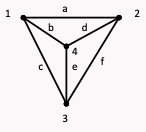
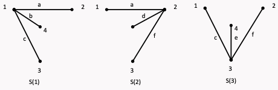

## 割边

### 严格定义

如果 $\omega(G-e)\gt\omega(G)$ ，则 $e$ 为 $G$ 的一条**割边**或**桥**。

### 充要条件

$e$ 是 $G$ 的割边当且仅当 $e$ 不在 $G$ 的任何圈中。

---

必要性：

假设 $e$ 是 $G$ 的割边且 $e$ 在 $G$ 的某圈中

---

充分性：

假设 $e$ 不在 $G$ 的任何圈中且 $e$ 不是 $G$ 的割边，则 $G-e$ 连通。

于是 $G-e$ 中存在一条 $(u,v)$ 路 $l$ ，显然 $l\cup e$ 就是 $G$ 的一个圈，与 $e$ 不在 $G$ 的任何圈中矛盾！

#### 推论 1

$e$ 为 $G$ 的一条边，若 $e$ 包含于 $G$ 的某圈中，则 $G-e$ 连通。

---

证明：若 $G-e$ 不连通，则 $e$ 就是割边，这就与割边的充要条件矛盾。

#### 推论 2

若 $G$ 的每个顶点的度数均为偶数，则 $G$ 没有割边;

---

若不然，设 $e=u$ 为 $G$ 的割边。则 $G-e$ 的含有顶点 $u$ (或$v$) 的那个分支中点 $u$ (或$v$) 的度数为奇数，而其余点的度数为偶数，与握手定理推论相矛盾!

#### 推论 3

若 $G$ 为 $k$ 正则二部图 $(k≥2)$ ，则 $G$ 无割边。

---

若不然，设 $e=u$ 为 $G$ 的割边。取 $G-e$ 的其中一个分支 $G_1$ ，显然 $G_1$ 中只有一个顶点的度数是 $k-1$ ，其余点的度数为 $k$ 。并且 $G_1$ 仍然为偶图
假若 $G$ 的两个顶点子集包含的顶点数分别为 $m$ 与 $n$ ，并且包含 $m$ 个顶点的顶点子集包含度为 $k-1$ 的那个点，那么有 $km-1= kn$ 。但是因 $k≥2$ ，所以等式不能成立！矛盾！

## 割边集

> 边割集跟回路、树等概念一样，是图论中重要概念。在应用上，它是电路网络图论的基本概念之一。

!!! abstract
    破坏连通性的极小边子集

### 秩

一个具有 $n$ 个顶点的连通图 $G$ ，定义 $n-1$ 为该连通图的秩；

具有 $p$ 个分支的图的秩定义为 $n-p$ ，记为 $R(G)$。

### 边割(集)

设 $S$ 是连通图 $G$ 的一个边子集，如果:

- $R(G-S)=n-2$；
- 对 $S$ 的任一真子集 $S$ ，有 $R(G-S)=n-1$；

称 $S$ 为 $G$ 的一个**边割集**，简称 $G$ 的一个**边割**。

### 关联集

在 $G$ 中，与顶点 $v$ 关联的边的集合，称为 $v$ 的**关联集**，记为：

$$
S(v)
$$

### 断集

在 $G$ 中，如果 $V=V_1∪V_2,V_1\cap V_2=\varnothing$ , $E_1$ 是 $G$ 中端点分属于 $V_1$ 与 $V_2$ 的 $G$ 的边子集，称 $E_1$ 是 $G$ 的一个断集。

### 断集与关联集的关系

任意一个断集均是若干关联集的**环和(对称差)**

!!! abstract
    $$
E_1\oplus E_2=(E_1-E_2)\cup(E_2-E_1)
$$

### 断集空间

连通图 $G$ 的断集的集合作成子图空间的一个子空间，其维数为 $n-1$ ，该空间称为图的断集空间。(其基为 $n-1$ 个线性无关的关联集)

$K_4$ 为例：

其断集空间的基为 3 个线性无关的关联集：

形成的断集空间为：

$$
\{\varnothing,S(1), S(2), S(3),\{a, c, d, e\},\{a, b, e, f\},\{b, c, d, f\},\{b, d, e\}\}
$$

### 基本(边)割集

设 $G$ 是连通图，$T$ 是 $G$ 的一棵生成树。如果 $G$ 的一个割集 $S$ 恰好包含 $T$ 的一条树枝，称 $S$ 是 $G$ 的对于 $T$ 的一个**基本(边)割集**。

连通图 $G$ 的断集均可表为 $G$ 的对应于某生成树 $T$ 的基本割集的**环和(对称差)**。

连通图 $G$ 对应于某生成树 $T$ 的基本割集的个数为 $n-1$ ，它们作成断集空间的一组基。

## 割点

### 严格定义

在 $G$ 中，如果 $E(G)$ 可以划分为两个非空子集 $E_1$ 与 $E_2$，使 $G[E_1]$ 和 $G[E_2]$ 以点 $v$ 为公共顶点，称 $v$ 为 $G$ 的一个**割点**。

### 充要条件

#### 无环非平凡图

> 无环且非平凡情形下，割点与割边的定义一致

$G$ 无环且非平凡，则 $v$ 是 $G$ 的割点，当且仅当 $\omega(G-v)\gt\omega(G)$。

---

必要性

设 $v$ 是 $G$ 的割点。则 $E(G)$ 可划分为两个非空边子集 $E_1$ 与 $E_2$ ，使 $G(E_1) , G(E_2)$ 恰好以 $v$ 为公共点。由于 $G$ 没有环，所以 $G(E_1) , G(E_2)$ 分别至少包含异于 $v$ 的 $G$ 的点，这样，$G-v$ 的分支数比 $G$ 的分支数至少多 1，所以：$\omega(G-v)>\omega(G)$

---

充分性

#### 树

$v$ 是树 $T$ 的顶点，则 $v$ 是割点，当且仅当 $v$ 是树的分支点（即不是叶子）

#### 无环连通图

设 $v$ 是无环连通图 $G$ 的一个顶点，则 $v$ 是 $G$ 的割点，当且仅当 $V(G-v)$ 可以划分为两个非空子集 $V_1$ 与 $V_2$ ，使得对任意 $x\in V_1, v\in V_2$ ， 点 $v$ 在每一条 $xy$ 路上

无环非平凡连通图至少有两个非割点。

证明：由于 $G$ 是无环非平凡连通图，所以存在非平凡生成树，而非平凡生成树至少两片树叶，它不能为割点，所以，它也不能为 $G$ 的割点。

恰有两个非割点的连通简单图是一条路。

证明：设 $T$ 是 $G$ 的一棵生成树。由于 $G$ 有 $n-2$ 个割点，所以，$T$ 有 $n-2$ 个割点，即 T 只有两片树叶，所以 $T$ 是一条路。这说明，$G$ 的任意生成树为路。

一个单图的任意生成树为路，则该图为圈或路，若为圈，则 $G$ 没有割点，矛盾，所以，$G$ 为路。

v 是单图 G 的割点，则它不是 G 的补图的割点。

证明：$v$ 是单图 $G$ 的割点，则 $G-v$ 至少两个连通分支。现任取 $x,y\in V(\overline{G}-v)$ ， 如果 $x,y$ 在 $G-v$ 的同一分支中，令 $u$ 是与 $x,y$ 处于不同分支的点，那么，通过 $u$ ，可说明，$x$ 与 $y$ 在 $G-v$ 的补图中连通。若 $x,y$ 在 $G-v$ 的不同分支中，则它们在 $G-v$ 的补图中邻接。所以，若 $v$ 是 $G$ 的割点，则 $v$ 不是其补图的割点。

## 块

### 块(图)定义

没有割点的连通图称为是一个**块图，简称块**；$G$ 的一个子图 $𝐵$ 如果：

- 它本身是块
- 若没有真包含 $𝐵$ 的 $G$ 的块存在（极大性 ）

称 $B$ 是 $G$ 的一个块

若 $|V(G)|\geq3$ 则 $G$ 是块，当且仅当 $G$ 无环且任意两顶点位于同一圈上。

点 $v$ 是图 $G$ 的割点当且仅当 $v$ 至少属于 $G$ 的两个不同的块

### 块割点树

设 $G$ 是非平凡连通图。$𝐵_1,𝐵_2,\cdots,𝐵_k$ 是 $G$ 的全部块，而 $v_1,v_2,\cdots,v_t$ 是 $G$ 的全部割点。构作 $G$ 的块割点树 $bc(G)$ : 它的顶点是 $G$ 的块和割点，连线只在块割点之间进行，一个块和一个割点连线，当且仅当该割点是该块的一个顶点。

## 连通度

### 点连通度

在 $G$ 中：

- 若 $G$ 连通：

  - 若存在顶点割，称 $G$ 的最小顶点割的顶点数称为 $G$ 的点连通度；
  - 否则称 n-1 为其点连通度. G 的点连通度记为 $\kappa(G)$，简记为 $\kappa$ ；

- 若 $G$ 不连通，$\kappa(G)=0$。

### 边连通度

在 $G$ 中，最小边割集所含边数称为 $G$ 的边连通度。边连通度记为 $\lambda(G)$ ；

若 $G$ 不连通或 $G$ 是平凡图，则定义 $\lambda(G)=0$。

### k-连通

- $\kappa(G)\geq k$ 则 $G$ 是 **k-连通**的。
- $\lambda(G)\geq k$ 则 $G$ 是 **k-边连通**的。

### 惠特尼连通度定理

$$
\kappa(G)\leq\lambda(G)\leq(G)
$$

$$
\forall a\leq b\leq c\ \ ,\ \ \exists G:\\
\kappa(G)=a,\ \ \lambda(G)=b,\ \ (G)=c
$$

$$
\kappa(G)\leq\lfloor\frac{2m}{n}\rfloor
$$

设 $G$ 是 $(n,m)$ 单图，若 $\delta(G)≥\lfloor\frac{n}{2}\rfloor$ ，则 $G$ 连通

### k-连通充分条件

设 $G$ 是 $n$ 阶简单图，若对任意正整数 $k＜n$ ，有：

$$
\delta(G)\geq\frac{n+k-2}{2}
$$

则 $G$ 是 $k$ 连通的。

### 哈拉里图

## 坚韧性

用 $C(G)$ 表示图 $G$ 的全体点割集构成的集合，非平凡非完全图的**坚韧度**，记作 $\tau(G)$ ，定义为：

$$
\tau(G)=\min\{
\frac{|S|}{\omega(G-S)}\big|S\in C(G)
\}
$$

设 $G$ 是一个非完全 $n(n≥3)$ 阶连通图，$S\in C(G)$ ，若 $S^*$ 满足：

$$
\tau(G)=\frac{|S^*|}{\omega(G-S^*)}
$$

称 $S^*$ 是 $G$ 的**坚韧集**

## 敏格尔定理

### 分离集

设 $u$ 与 $v$ 是图 $G$ 的两个不同顶点，$S$ 表示 $G$ 的一个顶点子集或边子集，如果 $u$ 与 $v$ 不在 $G-S$ 的同一分支上，称 $S$ **分离** $u$ 和 $v$ ，$S$ 是 $u$ 和 $v$ 的**分离(点/边)集**

### Menger

> n-弧定理

设 $x$ 与 $y$ 是图 $G$ 中的两个不相邻点，则$G$ 中分离点 $x$ 与 $y$ 的：

- **最少点数**等于 $G$ 中独立（内点不交）的 $(x,y)$ 路的最大数目；
- **最少边数**等于 $G$ 中边不重的 $(x,y)$ 路的最大数目；

### 惠特尼定理

一个非平凡的图 $G$ 是 $k$ 连通 $k\geq2$ 的，当且仅当 $G$ 的任意两个顶点间至少存在 $k$ 条：（以下两种条件之一）

- 独立（内点不交）的 $(u,v)$ 路；
- 边不重的 $(u,v)$ 路；

设 $G$ 是 $k$ 连通图，$S$ 是由 $G$ 中任意 $k$ 个顶点构成的集合。若图 $H$ 是由 $G$ 通过添加一个新点 $w$ 以及连接 $w$ 到 $S$ 中所有顶点得到的新图，求证：$H$ 是 $k$-连通的。

---

证明：

首先， $G$ 是 $k$ 连通图，所以分离 $G$ 中两个不相邻顶点至少要 $k$ 个点；

其次，分离 $w$ 与 $G$ 中不在 $S$ 中顶点需要 $k$ 个顶点；

因此 $H$ 是 $k$ 连通的。

设 $G$ 是 $k$-连通图，$u,v_1,v_2,\cdots,v_k$ 为 $G$ 中 $k+1$ 个不同顶点。求证：$G$ 中有 $k$ 条内点不交路 $(u,v_i)\ (1≤i≤k)$。

对于一个阶至少为 3 的无环图 $G$ ，下面三个命题等价。

- (1) $G$ 是 2-连通的；
- (2) $G$ 中任意两点位于同一个圈上；
- (3) $G$ 无孤立点，且任意两条边在同一个圈上；

## 图的宽直径

!!! abstract
    所有距离（distance）中最大的就是直径（diameter），这里都记为 $d(G)$。

$G$ 是强连通有向图，若其阶 $n\geq3$ 且最大度 $\Delta\geq2$ ，则：

$$
d(G)\geq\begin{cases}
\lfloor\frac{n}{2}\rfloor, & \Delta=2\\
\lceil\log_{(\Delta-1)}\frac{n(\Delta-2)+2}{\Delta}\rceil, & \Delta\geq3\\
\end{cases}
$$

### 路族/容器

设 $x,y\in V(G)$ , $C_w(x,y)$ 表示 $G$ 中 $w$ 条内点不交路的路族，$w$ 称为路族的宽度，$C_w(x,y)$ 中最长路的路长成为该路族的长度，记为：$l (C_w(x,y))$。

### w 宽距离和最优路族

设 $x,y\in V(G)$ , 定义 $x$ 与 $y$ 间所有宽度为 $w$ 的路族长度的最小值 $d_w(x,y)$ 为 $x$ 与 $y$ 间 $w$ 宽距离，$x$ 与 $y$ 间长度等于 $w$ 宽距离的路族称为 $x$ 与 $y$ 间最优路族。

所以，求 $w$ 宽距离，就是要找到最优路族。

### 宽直径

设 $G$ 是 $w$ 连通的，$G$ 的所有点对间的 $w$ 宽距离的最大值，称为 $G$ 的 $w$ 宽直径，记为 $d_w(G )$。

例如：:star:

- $n$ 点圈 $C_n$：（连通度 = 2）
  - $d_1(C_n)=\lfloor\frac{n}{2}\rfloor$；
  - $d_2(C_n)=n-1$；
- $k$ 阶完全图 $K_n$：（连通度 = $n-1$）
  - $d_1(K_n)=1$；
  - $d_w(K_n)=2$；（$2\leq w\leq n-1$）

容错直径（了解）
