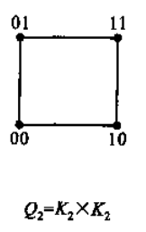
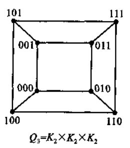
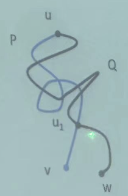

## 图的基础知识

### 图的定义

一 个 图 $G$ 定 义 为 一 个 有 序 对 ( V , E )， 记 为 G = ( V , E )， 其 中：

1. V 是一个非空集合，称为顶点集或边集，其元素称为项点或点
2. E 是由 V 中的点组成的无序点对构成的集合，称为边集，其元素称为边，且同一 点对在 E 中可出现多次。

图 $G$ 的**顶点集**也记为**V(G)**，**边集**也记为**E(G)**。

顶点集和边集都有限的图称为**有限图**。

只有一个项点而无边的图称为**平凡图**。其他所有的图都称为**非平凡图**。

!!! info 
    做题往往需要先排除平凡图

边集为空的图称为**空图**。

图 $G$ 的**顶点数** (或**阶数**) 和**边数**可分别用符号 **n(G)** 和 **m(G)** 表示。

连接两个相同顶点 的边的条数，叫做**边的重数**。重数大于 1 的边称为**重边**。

端点重合为一点的边称为**环**。

既没有环也没有重边的图称为**简单图**。其他所有的图都称为**复合图**。

边记为 uv，也可记 uv 为 e ，即 e = uv。此时称 u 和 v 是 e 的**端点**，并称 u 和 v **相邻**，u (或 v) 与 e 相**关联**。

若两条边有一个共同的端点，则称这两条边**相邻**。

若用小圆点代表点， 连线代表边，则可将一个图用“图形” 来表示。

### 图的同构

设 有 两 个 图 G~1~ = (V~1~ , E~1~ )和 G~2~ = (V~2~ , E~2~ )， 若 在 其 项 点 集 合 之 间 存 在 双 射 ， 即 存
在一一对应的关系，使得边之间有如下的关系:

$$
设 u_1 \Leftrightarrow u_2 , v_1 \Leftrightarrow v_2 ,\ \ \  u_1 ,v_1\in V_1 ,\ \ \  u_2 , v_2 \in V_2 \\
u_1 v_1 \in E_1 \Leftrightarrow u_2 v_2 \in E_2
$$

$$
 u_1 v_1 重数 = u_2 v_2 重数
$$

则称两图 G~1~ , G~2~ **同构** ， 记为：

$$
G_1 \cong G_2
$$

!!! abstract
    同构关系就是一种等价关系，形成等价类

### 完全图

每两个不同的顶点之问都有一条边相连的简单图称为**完全图**。

!!! abstract
    完全图是简单图的上限，空图则是下限

在同构意义下，n 个顶点的完全图只有一个，记为 K~n~ ，也叫 n 阶完全图。

所谓具有二分类 (X, Y) 的**偶图**(或**二部图**)是指：一个图，它的点集可以分解为两个(非空)子集 X 和 Y ，使得每条边的一个端点在 X 中，另一个端点在 Y 中。

**完全偶图**是指具有二分类 (X , Y) 的简单偶图 ， 其中 X 的每个项点与 Y 的每个项点相连，若 |X|=m ，|Y|=n ，则这样的偶图记为 K~m,n~。

### 补图

对于一个简单图 G= (V, E)，令集合

$$
E_1=\{uv|u\neq v ,\ \ u,v\in V\}
$$

则图 $H=(VE/E_1)$ 称为 $G$ 的**补图** ，记为：

$$
H=\overline G=(V,E/E_1)
$$

如果一个图和自己的补图是同构的，则称这个图是**自补**的，并记为：

$$
G\cong \overline G
$$

#### 自补图性质

若 n 阶 图 $G$ 是 自补 的 ( 即 $G\cong \overline G$ )， 则 $n=0,1(\mathrm{mod} 4)$。

### 正则图

G 的**顶点的度** d (v) 是指 $G$ 中与 v 关联的边的数目，每个环计算两次。

用 $\delta(G)$ 和 $\Delta(G)$ 分别表示 G 的项点的**最小度**和**最大度**。

为方便，奇数度的顶点称为**奇点**，偶数度的顶点称**偶点**。

设 G = (V，E) 为简单图，如果对所有 $v\in V$ ，有 d(v) = k ，称图 $G$ 为**k-正则图**。

完全图 K~n~ 和完全偶图 K~n,m~ 均是正则图。

### 握手定理:star:

图 G = (V , E ) 中 所 有 项 点 的 度 的 和 等 于 边 数 m 的 2 倍 ， 即

$$
\sum_{v\in V}d(v)=2m
$$

!!! abstract
    也叫：握手定理，图论第一定理

#### 推论 1

在任何图中，奇点个数为偶数。

#### 推论 2

正则图的阶数和度数不同时为奇数。

#### 推论 3:star:

由握手定理有：

$$
n\delta\lt\sum_{v\in V(G)}d(v)=2m\leq n\Delta\\
\delta\leq\frac{2m}{n}\leq\Delta
$$

### 可图数组

一个图 $G$ 的各个点的度 $d_1,d_2,\cdots,d_n$ 构 成 的 非 负 整 数 组 $(d_1,d_2,\cdots,d_n)$ 称为 $G$ 的 **度序列**。

> 度序列通常以度数非递增的顺序列出？

若对一个非负整数组 $(d_1,d_2,\cdots,d_n)$ 满足 $\exists m \in \mathbb Z,\sum_{i=1}^{n}d_i=2m$ (数组和为偶数)，存在一个简单图 $G$ 以该数组为度序列，则称这个数组是**可图**的，也叫这个数组为**图数组/图序列**。

!!! abstract
    关于图序列我们研究三个问题：

- 存在问题——什么样的数组是图序列
- 计数问题——一个图序列对应多少个不同构的图
- 唯一性问题——怎样的图序列对应唯一一个同构的图

#### 必要条件

非负整数组 $(d_1,d_2,\cdots,d_n)$ 是图序列的一个必要条件是：

$$
\sum_{i=1}^{n}d_i \text{是偶数，或者：} 2|\sum_{i=1}^{n}d_i
$$

另一个必要条件是：（可简单图化）

$$
d_i\leq n-1
$$

### 图序列相关定理

#### Havel-Hakimi :star:

设有非负整数组 $\Pi =(d_1 , d_2 , \cdots , d_n)$ ，且 $\sum_{i=1}^{n}d_i$ 是一个偶数，$n-1\geq d_1\geq d_2 \geq \cdots\geq d_n$ ，$\Pi$ 是可图（可简单图化）的充要条件为：

$$
\Pi'=(d_2-1,d_3-1,\cdots,d_{d_1+1}-1,d_{d_1+2},\cdots,d_n)
$$

是可图的（是图序列）。

---

对任意一个序列，判断是否可图的步骤如下：（当然先确保满足可图的必要条件）

1. 按递减排序
2. 去掉第一个元素 $d_1$ ，后面 $d_1$ 个元素依次减 1️⃣（$-1$）
3. 重复前面两个步骤 ，直到：
   - 只剩一个点，则该序列是**可图**的，即是图序列
   - 减 1️⃣ 后出现负数，则该序列是**不可图**的，即不是图序列

##### 中证明充分性：

###### 情形 1

点 $v_1$ 与点 $v_2,v_3,\cdots,v_{d+1}$ 邻接

则 $G-v_1$ 的度序列正好 $\Pi_1$

###### 情形 2

点 $v_1$ 与点 $v_2,v_3,\cdots,v_{d+1}$ 的某些顶点邻接

作如下假设：

- 设 $v_1$ 与 $v_{j_0}$ 邻接，但当 $k\gt j_0$ 时，$v_1$ 与 $v_k$ 不邻接；
- 设 $v_1$ 与 $v_{i_0}$ 不邻接，但当 $k\lt i_0$ 时，$v_1$ 与 $v_k$ 邻接；

进行这样的操作：

- 去掉边 $v_1 v_{j_0}$ 和 $v_{i_0}v_m$
- 加上边 $v_{j_0}v_m$ 和 $v_1v_{i_0}$

显然新图与原来的度序列相同，但是，但 $j_0$ 减小了， $i_0$ 增大了！

如此循环下去，$j_0=i_0$ 时 情形 2 就可以变成情形 1

#### 厄多斯定理

非负整数组：

$$
\pi = (d_1,d_2,\cdots,d_n),d_1\geq d_2 \geq d_n,\sum_{i=1}^{n}d_i=2m
$$

是图序列的充分必要条件是：

$$
\sum_{i=1}^{r}d_i\leq r(r-1)+\sum_{i=r+1}^{n}\text{min}\{r,d_i\},\ \ \ 1\leq r\leq n-1
$$

!!! warning
    证明非常困难捏

#### 定理？

一个满足 $d_2=d_{n-1}$ 的**图序列** $\pi=(d_1,d_2,\cdots,d_n)$ 是**唯一**图序列的**充分必要**条件时下列条件之一满足：

- $d_1=d_n,\ \ d_n\in \{ 1,n-1,n-2 \}$ ；
- $d_1=d_n=2,\ \ n=5$ ；
- $d_1\gt d_2=d_n=1$ ；
- $d_1\gt d_2=d_n=2,\ \ d_1\in\{n-1,n-2\}$ ；
- $n-2=d_1=d_{n-1}\gt d_n$ ；
- $n-3=d_1=d_{n-1}\gt d_n=1$ ；
- $n-1=d_1\gt d_2=d_{n}=3,\ \ n=6$ ；

### 定理-简单图度数不可能互不相同

一个简单图 $G$ 的 $n$ 个点的度不能互不相同

证明： 因为图 G 为简单图，所以：$\Delta(G)\leq n - 1$ 。

---

情形 1：若 $G$ 没有孤立点，则 $1 ≤ d(v)≤ n - 1,\ \ \ ∀v \in  V(G)$ , 由鸽笼原理：必有两顶点度数相同；

---

情形 2：若 $G$ 只有一个孤立点，设 $G_1$ 表示 G 去掉孤立点后的部分，则：

$$
1 ≤ d(v)≤ n - 2,\ \ \ ∀v \in  V(G_1)
$$

由鸽笼原理：在 $G_1$ 里必有两顶点度数相同；

---

情形 3：若 $G$ 只有两个以上的孤立点，则定理显然成立。

---

### 频序列

设 $n$ 阶图 $G$ 的各点的度取了 $s$ 个不同的非负整数 $d_1,d_2,\cdots,d_s$ 。 又 设 度 为 $d_i$ 的 点 有 $b_i$ 个 ($i=1,2,\cdots,s)$ , 则有 $\sum_{i=1}^{s}b_i =n$ 。故非负整数组 ($d_1,d_2,\cdots,d_s$) 是 $n$ 的一个划分，称为 $G$ 的**频序列**

#### 性质

一个 $n$ 阶图 $G$ 和它的补图有相同的频序列

### 拓扑不变量

图 $G$ 的**拓扑不变量**是指与图 $G$ 有关的一个数或数组(向量)。它对于与图 $G$ 同构的所有图来说，不会发生改变。

一个图 $G$ 可以对应很多拓扑不变量。如果某组不变量可完全决定一个图，称它为不变量的**完全集**。

## 图的运算

### 子图和真子图

如果 $V(H) \subseteq V(G),E(H)\subseteq E(G)$ ，且 $H$ 中边的重数不超过 $G$ 中对应边的重数 ， 则称 $H$ 是 $G$ 的**子图**，记为 $H \subseteq G$ 。有时又称 $G$ 是 $H$ 的**母图** 。

当 $H\subseteq G$ ，但 $H\neq G$ 时，则记为 $H\subset G$ ，且称 $H$ 为 $G$ 的**真子图**。

### 生成子图

$G$ 的**生成子图**是指满足 $V (H) = V (G )$ 的子图 $H$。也就是包含所有顶点但不包含所有边的子图。

#### 计数性质

简单图 $G=(n,m)$ 的所有不同的生成子图个数是 $2^m$ （包括 $G$ 本身和空图）。

### 导出子图

假设 $V'$ 是 $V$ 的一个非空子集。以 $V'$ 为顶点集，以两端点均在 $V'$ 中的边的全体为边集所组成的子图，称为 $G$ 的由 $V'$ 导出的子图，记为 $G[V']$，简称为 $G$ 的 **(点) 导出子图**。

假设 $E'$ 是 $E$ 的非空子集。以 $E'$ 为边集，以 $E'$ 中边的端点全体为顶点集所组成的子图称为 $G$ 的由 $E'$ 导出的子图，记为 $G[E']$，简称为 $G$ 的**边导出子图** 。

### 删点运算

(点) 导出子图 $G[V\backslash V']$ 记为 $G-V'$。它是 $G$ 中删除 $V'$ 中的项点以及与这些项点相关联的边所得到的子图。若 $V'=\{v\}$ ，则把 $G-\{v\}$ 简记为 $G-v$。

### 删边运算

边集为 $E\backslash E'$ 的 $G$ 的边导出子图简记为 $G-E'$ 。若 $E'=\{e\}$ ，则把 $G-{e}$ 简记为 $G-e$。

:warning:删边运算会删掉那些度数变为 0 的顶点:warning:

---

!!! abstract
    设 $G_1$ ，$G_2$ 是 $G$ 的子图。若 $G_1$ 和 $G_2$ 无公共顶点，则称它们是**不相交**的

若 $G_1$ 和 $G_2$ 无公共边，则称它们是**边不重**的

### 并运算

$G_1$ 和 $G_2$ 的**并图** $G_1UG_2$ 是指 $G$ 的一个子图：

- 其顶点集为 $V(G_1)\cup V(G_2)$；
- 其边集为 $E(G_1)\cup E(G_2)$；

如果 $G_1$ 和 $G_2$ 是不相交的，有时就记其并图为 $G_1+G_2$。

### 交运算

$G_1$ 和 $G_2$ 的**交图** $G_1\cap G_2$ ，是指 $G$ 的一个子图：

- 其顶点集为 $V(G_1)\cap V(G_2)$；
- 其边集为 $E(G_1)\cap E(G_2)$；

此时 $G_1$ 和 $G_2$ 至少要有一个公共顶点！

### 差运算

$G_1$ 和 $G_2$ 的**差** $G_1-G_2$ 是由 $G_1$ 中去掉 $G_2$ 中的边组成的图 。

!!! warning
    没有去掉那些边的**端点**！即使剩下 0 度数端点仍要保留！

### 对称差/环和差

$G_1$ 和 $G_2$ 的**对称差** $G_1 \Delta G_2$ 是 $G_1 \cup G_2$ 去掉 $G_1 \cap G_2$ 所得到的图，即 :

$$
G_1 \Delta G_2 = (G_1 \cup G_2)-(G_1 \cap G_2) = (G_1 - G_2) \cup (G_2-G_1)
$$

### 联运算

在不相交的 $G_1$ 和 $G_2$ 的并图 $G_1 \cup G_2$ 中，把 $G_1$ 的每个项点和 $G_2$ 的每个项点连接起来所得到的 图称为 $G_1$ 和 $G_2$ 的**联图**，记为 $G_1 \lor G_2$。

---

!!! abstract
    $u_i\ \mathrm{adj}\ v_i$ 表示 $u_i$ 和 $v_i$ **邻接**

### (笛卡尔)积运算

设 $G_1 =(V_1 , E_1),G_2 =(V_2 ,E_2)$，**对点集** $V=V_1 \times V_2$ （笛卡尔集）中任意两个点 $u=(u_1,u_2)$ 和 $v=(v_1,v_2)$ ，当以下式子成立时：

$$
(u_1 =v_1\land u_2\ \mathrm{adj}\ v_2)\lor(u_2=v_2\land u_1\ \mathrm{adj}\ v_1)
$$

就把 $u$ 和 $v$ 连接起来所得到的图 $G$ 称为 $G_1$ 和 $G_2$ 的**积图**，记为 $G=G_1 \times G_2$

### 合成运算

設 $G_i=(V_1,E_1)$ ，$G_2=(V_2,E_2)$ , 对点集 $V=V_1 \times V_2$ （笛卡尔集）中任意两个点 $u=(u_1,u_2)$ 和 $v=(v_1,v_2)$ ，当以下式子成立时：

$$
(u_1\ \mathrm{adj}\ v_1)\lor(u_1=v_1\land u_2\ \mathrm{adj}\ v_2)
$$

就把 $u$ 和 $v$ 连接起来所得到的图 $G$ 称为 $G_1$ 与 $G_2$ 的**合成图**，记为 $G=G_1[G_2]$

$G_1[G_2]$ 和 $G_2[G_1]$ 可能是同构的，也可能是不同构的

---

!!! abstract
    积运算和合成运算中，得到的点集 $V$ 的定义都是相同的，都是笛卡尔集 $V=V_1 \times V_2$ ；但是边集的定义有所不同

---

| 运算               | 点的数目    | 边的数目              |
| ------------------ | ----------- | --------------------- |
| 并 $G_1\cup G_2$   | $n_1 + n_2$ | $m_1 + m_2$           |
| 联 $G_1\lor G_2$   | $n_1 + n_2$ | $m_1 + m_2 +n_1 n_2$  |
| 积 $G_1\times G_2$ | $n_1 n_2$   | $n_1m_2 + n_2m_1$     |
| 合成 $G_1[G_2]$    | $n_1 n_2$   | $n_1m_2 + {n_2}^2m_1$ |

---

### 方体

一族特别重要的图称为方体，它用积来定义最为自然。

**$n$ 方体 $Q_n$** 递推地定义为：

- $Q_1=K_2$；
- $Q_n=K_2\times Q_{n-1}$；

$Q_n$ 有 $2^n$ 个点，它的点可以用二进制串 $a_1 a_2 \cdots a_n$ 来标定，其中 $a_i\in\{0,1\}$。

若 $Q_n$ 两个点的二进制表示式中只有一位不同，则它们邻接

## 路与图的连通性

### 途径、迹、路

一个有限非空序列:

$$
w=v_0\ e_1\ v_1\ e_2\ v_2\cdots e_k\ v_k
$$

它的项交替地为顶点和边，使得对 $1\leq i\leq k$ ，$e_i$ ，的端点是 $v_{i-1}$ 和 $v_i$、 称 $w$ 是从 $v_0$ 到 $v_k$ 的一条**途径**，或一条 **$(v_0,v_k)$ 途径**

途径中边数称为途径的**长度**

$v_0$，$v_k$ 分别称为途径的**起点**与**终点**，其余顶点称为途径的**内部点**

一条途径的起点与终点重合时叫做**闭途径**

**边不重复**的途径称为图的一条**迹**，起点与终点重合时叫做**闭迹**，也称为**回路**

**顶点不重复**的途径称为图的一条**路**，起点与终点重合时叫做**圈**。显然顶点不重复时边也不重复，所以迹是包含路的。

!!! success
    起点与终点重合的途径、迹、路分别称为图的闭途径、闭迹与圈。闭迹也称为**回路**

长度为 $k$ 的圈称为 $k$ 圈，$k$ 为奇数时称为**奇圈**，$k$ 为偶数时称为**偶圈**

#### 圈的充分条件

若 $\delta ≥2$，则 $G$ 中必然含有圈。

!!! abstract
    只就连通图证明即可！

设 $W=v_1 v_2\cdots v_{k-1}v_k$ 是 $G$ 中的一条最长路。由于 $\delta≥2$，所以 $v_k$ 必然有相异于 $v_{k-1}$ 的邻接顶点。

又 $W$ 是连通图 $G$ 中最长路，所以，这样的邻接点必然是 $v_1 v_2\cdots v_{k-2}$ 中之一。设该点为 $v_m$ ，则 $v_m v_{m+1}\cdots v_k v_m$ 为 $G$ 中圈。

#### 偶图的充要条件

一个图是二部图 (偶图) 当且当它不包含奇圈

---

证明必要性:

设 $G$ 是具有二分类 $(X,Y)$ 的偶图，并且 $C=v_0 v_1\cdots v_k v_0$ 是 $G$ 的一个圈

不失一般性，可假定 $v_0\in X$；

一般说来，$v_{2i}\in X,v_{2i+1}\in Y$；

又因为$v_0\in X$ ，所以 $v_k\in Y$，由此即得 $C$ 是偶圈

---

证明充分性:

在 $G$ 中任意选取点 $u$，定义 $V$ 的分类如下:

- $X=\{x|d(u,x)\text{是偶数},x\in V(G)\}$；
- $Y=\{y|d(u,y)\text{是奇数},y\in V(G)\}$；

（接下来证明 $X$ 中任意两点 $v,w$ 不邻接）

设 $v,w$ 是 $X$ 中任意两个顶点，$P$ 是一条最短 $(u,v)$ 路，而 $Q$ 是一条最短 $(u,w)$ 路，设 $u_1$ 是 $P$ 和 $Q$ 的最后一个交点：

由于 $P,Q$ 是最短路，所以，$P,Q$ 中 $u$ 到 $u_1$ 段长度相同，因此奇偶性相同

又 $P,Q$ 的长均是偶数，所以，$P,Q$ 中 $u_1 v$ 段和 $u_1 w$ 段奇偶性相同

如果 $v,w$ 邻接则可得到奇圈，矛盾！

### 两顶点的距离

图中顶点 $u$ 与 $v$ 的距离: $u$ 与 $v$ 间最短路的长度称为 $u$ 与 $v$ 间距离。记为：

$$
d(u,v)
$$

如果 $u$ 与 $v$ 间不存在路，定义：

$$
d(u,v)=0
$$

### 两顶点的连通性

图 $G$ 中点 $u$ 与 $v$ 说是**连通**的，如果 $u$ 与 $v$ 间**存在通路**。否则称 $u$ 与 $v$ **不连通**。

点的连通关系是**等价关系**

非连通图中每一个极大连通部分，称为 $G$ 的**连通分支**

$G$ 的连通分支的个数，称为 $G$ 的**分支数**，记为：

$$
\omega(G)
$$

### 图的连通性

如果图 $G$ 中任意两点是连通的，称 $G$ 是**连通图**，否则，称 $G$ 是**非连通图**

#### 连通图的性质

在 $n$ 阶连通图中：

1. **至少有 $n-1$ 条边**
2. 如果边数**大于** $n-1$，则至少有一条**闭迹**
3. 如果**恰有** $n-1$ 条边，则至少有一个**奇度点**

---

（2）证明:

若 $G$ 中没有 $1$ 度顶点，由握手定理:

$$
2m=\sum_{v\in V(G)}d(v)\geq 2n \Rightarrow m\geq n \Rightarrow m \gt n-1
$$

---

（3）证明：

若不然，$G$ 中顶点度数至少为 $2$，于是由握手定理：

$$
2m=\sum_{v\in(G)}d(v) \geq 2n \Rightarrow m ≥n \Rightarrow m > n-1
$$

这与 $G$ 中恰有 $n-1$ 条边矛盾！

#### 补图的连通性

若图 $G$ 是不连通的，则它的补图 $\overline G$ 是连通图.

---

证明：设 $u,v$ 是 $G$ 的任意两个顶点:

- 若 $u$ 和 $v$ 在 $G$ 中不邻接，则在 $\overline G$ 中它们邻接，从而 $\overline G$ 是连通的
- 若 $u$ 和 $v$ 在 $G$ 中邻接，它们属于 $G$ 的同一分支；在另一个分支中有一点 $w$，在 $\overline G$ 中 $u$ 和 $v$ 均与 w 邻接，即 $uwv$ 是一条通道，从而 $\overline G$ 是连通的

---

#### 连通图充分条件 1

设图 $G$ 为 $n$ 阶图，若 $G$ 中任意两个不相邻的点 $u$ 和 $v$，有：

$$
d(u)+d(v)\geq n-1
$$

则 $G$ 是连通的，且 $d(G)\leq 2$

---

证明：对 $G$ 中任意两点 $x$ 和 $y$，一定存在一条长度至多为 $2$ 的连接 $x$ 和 $y$ 的路

当 $xy\in E(G)$ 时上述论断显然成立；

当 $xy\notin E(G)$ 时：

可以证明，存在点 $w$，它与 $x$ 和 $y$ 同时邻接。反证法：

若不然，在 $G$ 的剩下 $n-2$ 个顶点中，假设：

- 有 $k$ 个与 $x$ 邻接，但与 $y$ 不邻接；
- 有 $l$ 个与 $y$ 邻接，但与 $x$ 不邻接；
- 有 $m$ 个顶点和 $x,y$ 均不邻接。

则：$d(x)=k$，$d(y)=l$

由于 $k+l+m=n-2$

所以 $d(x)+d(y)=n-m-2\leq n-2$ ，矛盾！

---

#### 连通图充分条件 2

图 $G$ 为 $n$ 阶图，若 $\delta≥\frac{n-1}{2}$ ，则 $G$ 连通

---

证明:

对 G 中任意两个不相邻顶点 u 与 v，有:

$$
d(u)+d(v)\geq\frac{n-1}{2}+\frac{n-1}{2}=n-1
$$

所以，G 是连通的。

!!! warning
    该定理的界是紧的 (Sharpness)。即不能再修改!

例如: 设 G 由两个分支作成的图，两个分支均为 $K_m$ ，则 G 中不相邻顶点度数之和恰为 n-2 . ( n=2m )

### 图的直径

**连通**图 G 的**直径**定义为

$$
d(G) = \text{max}\{d(u,v)|u,v \in V(G)\}
$$

如果 G **不连通**，图 G 的直径定义为 $d(G) = \infty$

#### 直径相关性质

设 G 是具有 m 条边的 n 阶单图，若 G 的直径为 2 且 $\delta=n-2$ ，则 $m≥2n-4$

---

证明：

设 $d(v)=\Delta=n-2$ ，设 v 的邻接点为 $v_1,v_2,\cdots,v_{n-2}$ ，u 是剩下的一个项点。

由于 $d(G)=2$ 且 u 不能和 v 邻接，所以 u 至少和 $v_1,v_2,\cdots,v_{n-2}$ 中的一个顶点邻接。否则有 $d(G)>2$ ; 不妨假设 u 和 $v_1,v_2,\cdots,v_{k}$ 邻接。

为了保证 u 到各点距离不超过 2 , $v_{k+1},\cdots,v_{n-2}$ 这些頂点的每一个必须和前面 $v_1,v_2,\cdots,v_{k}$ 中某点邻接，这样，图中至少又有 n-2 条边。总共至少有 2n-4 条边。
