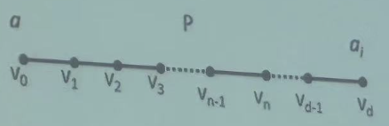

!!! abstract
    This article ism't finished yet...

## 顶点标号法

Dantzig 算法，1959 年，旦捷希(Dantzig)发现了在赋权图中求由点 a 到点 b 的最短路好算法，称为顶点标号法。

和弗洛伊德算法非常非常像... ，在这里补充一下 Floyid 算法对邻接矩阵求最短距离矩阵过程，这个过程和 Dantzig 几乎一致（完全一致好吧，考试可能会考？）：

- 按顺序一列一列看，看第 $i$ 列时：
  - 按顺序一行一行看，看第 $j$ 行时，若 $a_{ji}\neq\infty$ 则：
    - 看第 $j$ 列，看 $a_{ji}+a_{kj}$ 是否是新的 $i$ 到 $k$ 的最短距离

### 数据结构

- $t(a_n)$ :点 $a_n$ 的标号值, 表示点 $a_1=a$ 到 $a_n$ 的最短路长度
- $A_i =\{a_1,a_2,\cdots,a_i\}$ : 已经标号的顶点集合
- $T_i$ : $a$ 到 $a_i$ 的最短路上的边集合

### 算法步骤

1. 记：

   - $a=a_1$ ,
   - $t(a_1)=0$ ,
   - $A_1=\{a_1\}$ ,
   - $T=\varnothing$ ;

2. 若已经得到 $A_i=\{a,a_2,\cdots,a_i\}$ , 且对于 $1≤n\leq i$ , 已知 $t(a_n)$ 对**每一个** $a_n\in A_i$ , 求一点:

   $$
   b_n^{(i)}\in N(a_n)-A_i=B_n^{(i)}
   $$

   使得:

   $$
   l(a_n b_n^{(i)})=\min_{v\in B_n^{(i)}}l(a_n v)
   $$

   !!! abstract
       这里 $i$ 表示第 $i$ 轮，$N(a_n)$ 表示与 $a_n$ 邻接的点组成的集合，N 表示 Neighbour

   :::

3. 设有 $j$ , $1≤j\leq i$ , 而 $b_{j}^{(i)}$ 是使 $t(a_{j})+l(a_{j}b_{j}^{(i)})$ 取最小值 , 令:

   - $a_{i+1}=b_{j}^{(i)}$ ；
   - $t(a_{i+1})= t(a_{j})+l(a_{j}a_{i+1})$；
   - $T_{i+1}=T_i\cup\{a_{j}a_{i+1}\}$；

4. - 若 $a_{i+1}=b$ , 停止 ;
   - 否则，记 $A_{i+1}=A_i\cup\{a_{i+1}\}$， 转(2)

### 时间复杂度

对第 $i$ 次循环:

- 步骤 (2) 要进行 $i$ 次比较运算
- 步骤 (3) 要进行 $i$ 次加法与 $i$ 次比较运算

所以，该次循环运算量为 $3i$。

所以，在最坏的情况下，运算量为 $n^2$ 级，是好算法

### 完备性证明

定理 1：算法中的函数 $t(a_n)$ 给出了 $a$ 与 $a_i$ 的距离
证明：对 $i$ 作数学归纳法

1. $i=1$ 时结论显然成立；
2. 设对所有的 $j$ ，$1\leq j\leq i$ 时，$t(a_j)= d(a,a_j)$；
3. 考虑 $j=i+1$：

于是 $d=d(a,a_{i+1})$

又令 $v_n$ 是 P 中第一个不在 $A_{i}$ 中的点。由于 $a_{i+1} \notin A_{i}$ , 所以这样的点存在

因为 $v_0\in A_{i}$ ，所以 $n\geq 1$；

记 P 中 $a$ 到 $v_{n+1}$ 一段长为 $l$ , 而 $a$ 到 $v_{n}$ 的一段长为 $l_1$；

由归纳假设有: $l_1\geq t(v_{n})$ ，进而有：

$$
d=d(a,a_{i+1})\geq l=l_1+l(v_{n}v_{n+1})\geq t(v_{n})+l(v_{n}v_{n+1})
$$

算法中，当第 $i$ 轮中已知 $A_{i}=\{a_1,a_2,\cdots,a_{i}\}$ 要给 $a_{i+1}$ 标号时，其中要选择 $b_{n}^{(i)}$ ，满足：

$$
l(v_{n}b_{n}^{(i)})\leq l(v_{n}v_{n+1})
$$

だから：

$$
d\geq t(v_{n})+l(v_{n}v_{n+1})\geq t(v_{n})+l(v_{n}b_{n}^{(i)})
$$

又由算法最终对点 $a_i$ 的标号值的选择方法知；

$$
d\geq t(v_{n})+l(v_{n}b_{n}^{(i)})\geq t(a_{j})+l(a_{j}a_{i+1})\geq t(a_{i+1})
$$

另一方面，由算法可知存在一条长度为 $t(a_i)$ 的联结 $a$ 与 $a_i$ 的路，所以：

$$
t(a_{i+1})\geq d(a,a_{i+1})
$$

从而得到 $t(a_{i+1})\geq d(a,a_{i+1})\geq t(a_{i+1})$ ，即得到：$t(a_{i+1})=d(a,a_{i+1})$

### 应用举例

#### 分酒

某两人有一只 8 升的酒壶装满了酒，还有两只空酒壶，分别为 5 升和 3 升，求最少的操作次数能均分酒

解:设 $x_1,x_2,x_3$ 分别表示 8,5,3 升酒壶中的酒量。则

$$
x_1+x_2+x_3=8,\ \ \ x_1≤8,x_2≤5,x_3≤3
$$

容易算出 $(x_1,x_2,x_3)$ 的组合形式共 24 种

每种组合用一个点表示，两点连线，当且仅当可通过倒酒的方式相互变换。若各边赋权为 1，则问题转化为在该图中求 $(8,0,0)$ 到 $(4,4,0)$ 的一条最短路。结果如下:

$$
(8,0,0)\to(3,5,0)\to(3,2,3)\to(6,2,0)\to(6,0,2)\to(1,5,2)\to(1,4,3)\to(4,4,0)
$$

!!! abstract
    这个问题给定了初始状态和目标状态，也可以转化为人工智能中的智能规划问题

#### 狼羊过河

在一河岸有狼，羊和卷心菜。摆渡人要将它们渡过河去，由于船太小，每次只能载一样东西。由于狼羊，羊卷心菜不能单独相处。问摆渡人至少要多少次才能将其渡过河?

人，狼，羊，菜所有组合形式为:

$$
C_4^0+C_4^1+C_4^2+C_4^3+C_4^4=2^4=16
$$

但是以下组合不能允许出现: 狼羊菜，羊菜，狼羊，人，人狼，人菜，共 6 种；

岸上只能允许出现 10 种组合: 人狼羊菜，人狼羊，人狼菜，人羊，空，菜，羊，狼，狼菜，人羊菜；

每种情况用点表示，两点连线，当且仅当两种情况可用载人(或加一物) 的渡船相互转变，每条边赋权为 1 。于是，问题转化为求由顶点 “人狼羊菜” 到顶点 “空” 的一条最短路问题。结果为:

$$
\text{人狼羊菜}\to\text{狼菜}\to\text{人狼菜}\to\text{狼}\to\text{人狼羊}\to\text{羊}\to\text{人羊}\to\text{空}
$$
