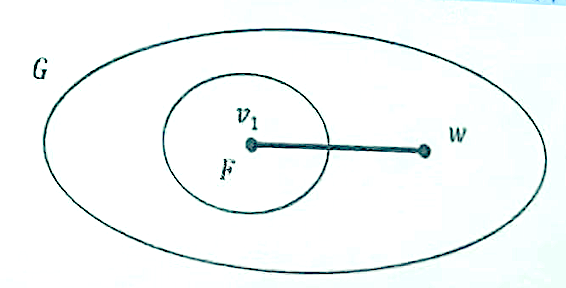

## 树的基本性质

### 树的叶子数

设 $T$ 为 $(n,m)$ 树，$T$ 中有 $n_i$ 个度为 $i,(1\leq i\leq k)$ 的点，且有 $\sum n_i=n$ ，则有：$n_1=2+n_3+2n_4+\cdots+(k-2)n_k$。

证明: 由 $m=n-1$ 得:

$$
m=(n_1+n_2+\cdots+n_p)-1
$$

又由握手定理得:

$$
2m=n+2n_2+\cdots+kn_k
$$

由上面两等式得:

$$
n_1=2+n_3+2n_4+\cdots+(k-2)n_k
$$

### 森林的分支数

具有 $k$ 个分支的森林有 $n-k$ 条边。

---

证明:

设森林 $G$ 的 $k$ 个分支为 $T_i(1≤i\leq k)$ ，对每个分支，使用定理 3 得

$$
m(T_i)=n_i-1(n_i=|V(T_i)|)
$$

所以：

$$
m(G)=\sum_{i=1}^{k}m(T_i)=n-k
$$

### 图的边数下限

每个 $n$ 阶连通图的边数至少为 $n-1$.

证明:

(1) 如果 $n$ 阶连通图 $G$ 没有一度顶点，那么由握手定理有:

$$
m(G)=\frac{1}{2}\sum_{v\in V(G)}d(v)\geq n
$$

---

(2) 如果 $G$ 有一度顶点:

对顶点数作数学归纳。

当 $n=1$ 时，结论显然

设当 $n=k$ 时，结论成立。

当 $n=k+1$ 时，设 $u$ 是 $G$ 的一度顶点，则 $G-u$ 为具有 $k$ 个顶点的连通图

(2.1) 若 $G-u$ 有一度顶点，则由归纳假设，其边数至少 $k-1$ ，于是 $G$ 的边数至少有 $k$ 条;

(2.2) 如果 $G-u$ 没有一度顶点，由握手定理有：

$$
m(G-u)=\frac{1}{2}\sum_{v\in V(G-u)}d(v)\geq k
$$

所以，$G$ 至少有 $k+1$ 条边。

而当 $G$ 是树时，边数恰为 $n-1$ .

所以 n 阶连通图 G 至少有 n-1 条边。

所以，树也被称为最小连通图。

任意树 $T$ 的两个不邻接顶点之间添加一条边后，可以得到唯一圈

---

证明:

设 $u$ 与 $v$ 是树 $T$ 的任意两个不邻接顶点，由定理 2 知:有唯一路 $P$ 连接 $u$ 与 $v$ ；于是 $P\cup\{uv\}$ 是一圈。

显然，由 $P$ 的唯一性也就决定了 $P\cup\{uv\}$的唯一性。

### 树的叶子数下限

设 $G$ 是树且 $\Delta≥k$ ，则 $G$ 至少有 $k$ 个一度顶点（叶子顶点）

---

证明：反证法，假设 $G$ 有至多 $k-1$ 个叶子顶点

$$
2m(G)=\sum_{v\in V(G)}d(v)\geq k-1+k+2(n-k)=2n-1\gt 2n-2
$$

所以 $m(G)\gt n-1$ ，与 $G$ 是树矛盾！

### 森林的路分解

设 $G$ 是森林且恰有 $2k$ 个**奇度**顶点，则在 $G$ 中有 $k$ 条边不重合的路 $P_1,P_2,\cdots,P_k$ 使得:

$$
E(G)=E(P_1)\cup E(P_2)\cup\cdots\cup E(P_k)
$$

证明: 对 $k$ 作数学归纳。

当 $k=1$ 时，$G$ 只有两个奇数度顶点，此时，容易证明，$G$ 是一条路;

设当 $k=t$ 时，结论成立。令 $k=t+1$：

在 $G$ 中一个分支中取两个一度项点 $u$ 与 $v$ ，令 $P$ 是连接该两个项点的唯一路，则 $G-P$ 是有 $2t$ 个奇数顶点的森林，由归纳假设，它可以分解 $t$ 条边不重合的路之并，所以 $G$ 可以分解为 $t+1$ 条边不重合的路之并。

!!! info 
    对图作**某种形式的分解**，是图论的一个研究对象，它在网络结构分析中具有重要作用。

### 树的同构子图

设 $T$ 是 $k$ 阶树。若图 $G$ 满足 $\delta≥k-1$ ，则 $T$ 同构于 $G$ 的某个子图。

证明: 对 $k$ 作数学归纳

当 $k=1$ 时，结论显然。

假设对 $k-1,(k ≥3)$ 的每颗树 $T$ ，以及最小度至少为 $k-2$ 的每个图 $H$ ，$T_1$ 同构于 $H$ 的某个子图 $F$ ；

现在设 $T$ 是 $k$ 阶树，且图 $G$ 满足 $\delta≥k-1$ ，证明 $T$ 同构于 $G$ 的某个子图：

设 $u$ 是 $T$ 的树叶，$v$ 是 $u$ 的邻接顶点。则 $T-u$ 是 $k-1$ 阶树。

由于 $\delta(G)≥k-1>k-2$ ，由归纳假设，$T-u$ 同构于 $G$ 的某个子图 $F$ ；

设 $v$ 是与 $T$ 中 $v$ 相对应的 $F$ 中的点，由于 $d_{G(v_1)}\geq k-1$ ，所以 $v$ 在 $G$ 中一定有相异于 $F$ 中的邻点 $w$ ，作 $F\cup\{u_1w\}$ ，则该子图和 $T$ 同构。

## 树的度序列问题

在第一章中，介绍了判定一个非增非负序列是否为简单图的度序列定理。下面介绍一个判定非增非负序列是否为树的度序列的简单方法。

设 $S=\{d_1,d_2,\cdots,d_n\}$ 是 $n$ 个正整数序列，它们满足:

- $d_1\geq d_2\geq\cdots\geq d_n$ ；
- $\sum di=2(n-1)$ ；

则存在一颗树 $T$ ，其度序列为 $S$ 。

---

证明: 对 $n$ 作数学归纳。

当 $n=1,2$ 时，结论显然。

假设对 $n=k$ 时结论成立。设 $n=k+1$,

首先,序列中至少一个数为 1，否则，序列和大于 $2k$ ，与条件相矛盾!

所以，$d_{k+1}=1$ 。

我们从序列中删掉 $d_1$ 和 $d_{k+1}$ ，增加数 $d^*=d_i-1$ 放在它应该在的位置。得到序列 $S$ ，该序列含 $k$ 个数，序列和为 $2(k-1)$ ；

由归纳假设，存在树 $T$ ，它的度序列为 $S_i$；

现在，增加结点 $v$ ，把它和 $T_1$ 中点 $d^*$ 相连得到树 $T$ 为所求

## 树的中心与形心

### 中心

1. 图的顶点的**离心率** $e(v)=\max\{d(u,v)|u\in V(G)\}$；
   - 图的**直径**：**最大离心率**
2. 图的**半径** $r(G)=\min\{e(v)|v\in V(G)\}$；
3. 图的**中心点**：**离心率等于半径**的点
4. 图的**中心**：全体中心点的**集合**

对树 $T$ 的阶数 $n$ 作归纳证明。

当 $n=1,2$ 时，结论显然成立

设对 $n<k,(k≥3)$ 的树结论成立，设 $T$ 是 $k$ 阶树

容易知道，删掉 $T$ 的所有叶，得到的树 $T$ ，的每个点的离心率比它们在 $T$ 中离心率减少 1

又因 $T$ 的叶不能是中心点，所以 $T$ 的中心点在 $T_1$ 中

这样，若点 $u$ 的离心率在 $T$ 中最小，则在 $T_1$ 中依然最小，即说明 $T$ 的中心点是 $T_1$ 的中心点，反之亦然。

### 形心

设 $u$ 是树 $T$ 的任意一个顶点，树 $T$ 在顶点 $u$ 的分支是指包含 $u$ 作为一个叶点的极大子树，其分支数为顶点 $u$ 的度数;

1. 点 $u$ 的**权**：树 $T$ 在 $u$ 点的分支中边的最大数目称为；
2. 树 $T$ 的**形心点**：树 $T$ 中**权值最小**的点
3. 树 $T$ 的**形心**：全体形心点的**集合**

每一棵树有一个由**一个点**或**两个邻接的点**组成的形心。

## 生成树

### 生成树的性质

每个连通图至少包含一棵生成树

---

证明:

如果连通图 $G$ 是树，则其本身是一棵生成树;

若连通图 $G$ 中有圈 $C$ ，则去掉 $C$ 中一条边后得到的图仍然是连通的，这样不断去掉 $G$ 中圈，最后得到一个 $G$ 的无圈连通子图 $T$ ，它为 $G$ 的一棵生成树。

!!! abstract
    定理 1 的证明实际上给出了连通图 $G$ 的生成树的求法，该方法称为**破圈法**。

推论

若 $G$ 是 $(n,m)$ 连通图，则 $m≥n-1$。

连通图 $G$ 的生成树一般不唯一:warning:

### 生成树的计数

#### 凯莱递推计数法

> 凯莱(Cayley 1821-1895): 剑桥大学数学教授，著名代数学家，发表论文数仅次于 Erdos,Euler，Cauchy. 著名成果是 1854 年定义了抽象群，并且得到著名定理:任意一个群都和一个变换群同构。同时，他也是一名出色的律师，作律师 14 年期间，发表 200 多篇数学论文，著名定理也是在该期间发表的。

图 $G$ 的边 $e$ 称为被收缩，是指删掉 $e$ 后，把 $e$ 的两个端点重合，如此得到的图记为$G\cdote$；

用 $\tau(G)$ 表示 $G$ 的生成树颗数。

$$
\tau(G)=\tau(G-e)+\tau(G\cdot e)
$$

---

证明：对于 $G$ 的一条边 $e$ 来说，$G$ 的生成树中包含边 $e$ 的棵数为 $G\cdot e$ ，而不包含 $e$ 的棵数为 $G-e$。

凯莱公式的缺点是：

- 计算量很大
- 不能具体指出每棵生成树

#### 关联矩阵计数法

n×m 矩阵的一个阶数为 $\min\{n,m\}$ 的子方阵，称为它的一个**主子阵**；主子阵的行列式称为**主子行列式**。

> 显然，当 $n<m$ 时，n×m 矩阵 $C_m^n$ 个主子阵。

设 $A_m$ 是连通图 $G$ 的基本关联矩阵的主子阵，则 $A_m$ 非奇异的充分必要条件是相应于 $A_m$ 的列的那些边构成 $G$ 的一棵生成树。

- 该方法的优点是不仅指出生成树棵数，而且能绘出所有不同生成树；
- 缺点是找所有非奇异主子阵计算量太大！

#### 矩阵树定理

> 该定理是由物理学家克希荷夫提出的。他于 1824 年出生于普鲁士的哥尼斯堡。1845 年因宣布著名的克希荷夫电流电压定律而闻名，1847 年大学毕业时发表了生成树计数文章，给出了矩阵树定理。他的一生主要花在实验物理上。担任过德国柏林数学物理会主席职务

$G$ 的生成树棵数为拉普拉斯矩阵 $L$ 的任意一个元素的代数余子式。

### 最小生成树

#### Kruskal 算法

> 克鲁斯克尔(Kruskal):1928 年生，一家 3 弟兄都是数学家 1954 年在普林斯顿大学获博士学位，导师是 ErdÖs,他大部分研究工作数学和语言学，主要在贝尔实验室工作。1956 年发表包含克鲁斯克尔算论文，使他名声大振

!!! abstract
    从 $G$ 中的最小边开始，进行避圈式扩张。

##### 算法流程

1. 选择边 $e_1$ ,使得其权值最小；
2. 若已经选定边 $e_1,e_2,\cdots,e_k$ ，则从 $E-\{e_1,e_2,\cdots,e_k\}$ 中选择边 $e_{k+1}$ , 使得：
   - $[e_1,e_2,\cdots,e_{k+1}]$ 为无圈图
   - $e_{k+1}$ 的权值 $w(e_{k+1})$ 尽可能小。
3. 当 (2) 不能进行时，停止。

##### 完备性证明

克鲁斯克尔算法得到的任何生成树一定是最小生成树。证明：

设 $G$ 是一个 $n$ 阶连通赋权图，用 $T^*=G[\{e_1,e_2,\cdots,e_{n-1}\}]$（导出子图）表示由克鲁斯克尔算法得到的一棵生成树，我们证明：它是最小生成树

设 $T$ 是 $G$ 的一棵最小生成树。若 $T^*≠T$.

由克鲁斯克尔算法容易知道：$T\cap T^*≠\varnothing$.

于是令 $f(T)=k$ 表示 $T^*$ 中的边 $e_i$ 不在 $T$ 中的最小 $i$ 值。即可令 $T=G[\{e_1,e_2,\cdots,e_{k-1},e'_k,\cdots,e'_{n-1}\}]$（导出子图）

考虑：$T∪e_k$ , 则由树的性质，它必然为 $G$ 中圈 $C$ .

作 $T_1=T∪e_k-e$ , 容易知道：$T_1$ 还为 $G$ 的一棵生成树。

设 $e$ 是圈 $C$ 的在 $T$ 中，但不在 $T^*$ 中的边。

由克鲁斯克尔算法知道：$w(e)≥w(e_k)$ .

所以：$w(T)≥w(T_1)$ .

这说明 $T_1$ 是最小树，但这与 $f(T)$ 的选取假设矛盾！所以：$T=T^*$

#### 算法案例

1. 选一条边 $e_1$ , 使得 $w(e_1)$ 尽可能小；
2. 若边 $e_1,e_2,\cdots,e_i$ 已经选定，则用下述方法从 $E\backslash\{e_1,e_2,\cdots,e_i\}$ 中选取边 $e_{i+1}$
   - (a) $G[\{e_1,e_2,\cdots,e_{i+1}\}]$ 为不相交路之并；
   - (b) $w(e_{i+1})$ 是满足 (a) 的尽可能小的权。
3. 当 (2) 不能继续执行时停止。

!!! abstract
    该方法不能得到一条最小生成路

#### 管梅谷的破圈法

> 在克鲁斯克尔算法基础上，我国著名数学家管梅谷教授于 1975 年提出了最小生成树的破圈法。

从赋权图 $G$ 的任意圈开始，去掉该圈中权值最大的一条边，称为破圈。

不断破圈，直到 $G$ 中没有圈为止，最后剩下的 $G$ 的子图为 $G$ 的最小生成树

#### Prim 算法

> Prim 算法是由 Prim 在 1957 年提出的一个著名算法。作者因此而出名。Prim(1921---) 1949 年在普林斯顿大学获博士学位，是 Sandia 公司副总裁。

!!! abstract
    Kruskal 关注边，Prim 关注点

对于连通赋权图 $G$ 的任意一个顶点 $u$ ，选择与点 $u$ 关联的且权值最小的边作为最小生成树的第一条边 $e_1$ ;

在接下来的边 $e_2,e_3,\cdots,e_{n-1},$ 在与一条已经选取的边只有一个公共端点的的所有边中，选取权值最小的边。

### 树图

连通图 $G$ 的树图是指这样的图，它的顶点是 $G$ 的生成树 $T_1,T_2,\cdots,T_\tau$ ； $T_i$ 与 $T_j$ 相连当且仅当它们恰有 $n-2$ 条公共边。

#### 连通性

任何连通图的树图是连通图。

---

证明：只需证明，对任意 $T_i$ 与 $T_j$ ，在树图中存在连接它们的路即可！

对任意 $T_i$ 与 $T_j$ , 设 $e_1,e_2,\cdots,e_k\ (k<n-2)$ 是它们的公共边。

由树的性质：$∃e'_{k+1}\in E(T_i)$ , 但 $e'_{k+1}\not\in E(T_j)$ , 使得：$T_j +e'_{k+1}$ 有唯一圈。

该圈中: $∃e_{k+1}\in E(T_j)$ , 但 $e_{k+1}\not\in E(T_i)$；

作： $T_{i+1}=T_i-e'_{k+1}+e_{k+1}$ ，则 $T_i$ 与 $T_{i+1}$ 有 $n-2$ 条边相同，于是，它们邻接。

此时，$T_{i+1}$ 与 $T_j$ 有 $k+1$ 条边相同。

如此这样作下去，可以得到连接 $T_i$ 与 $T_j$ 的一条路为：$T_i, T_{i+1},\cdots,T_j$。

所以，连通图 $G$ 的树图是连通的。
