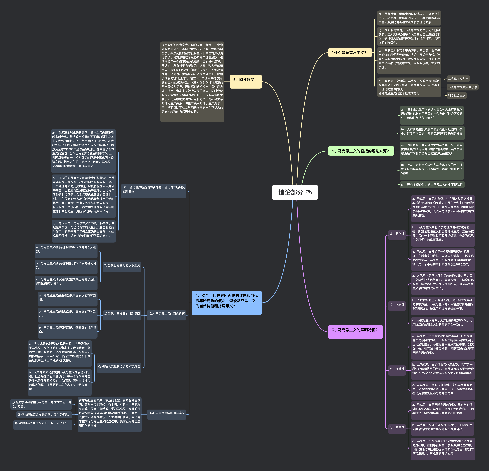
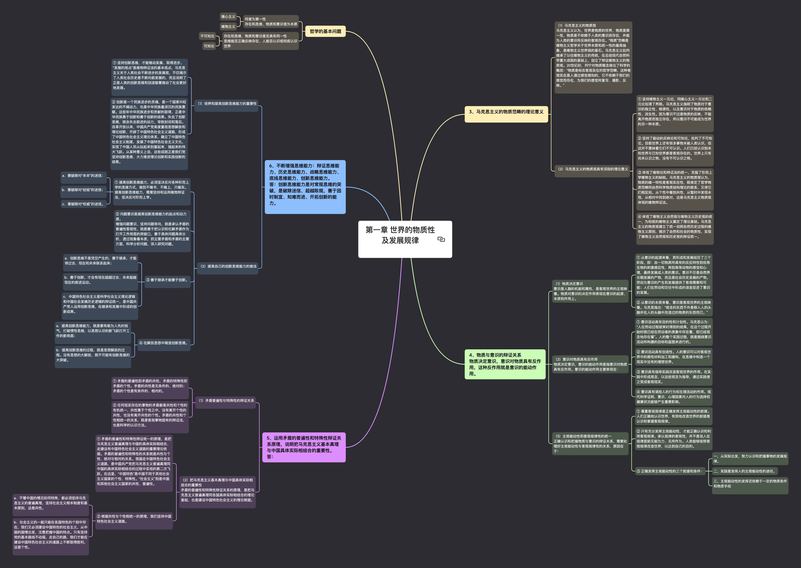
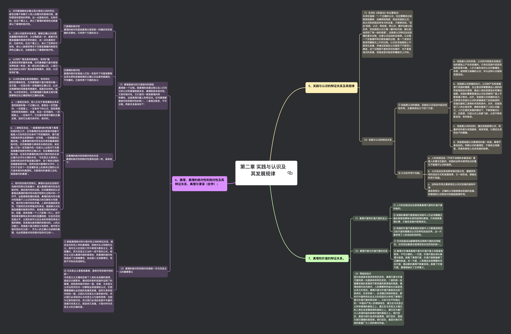
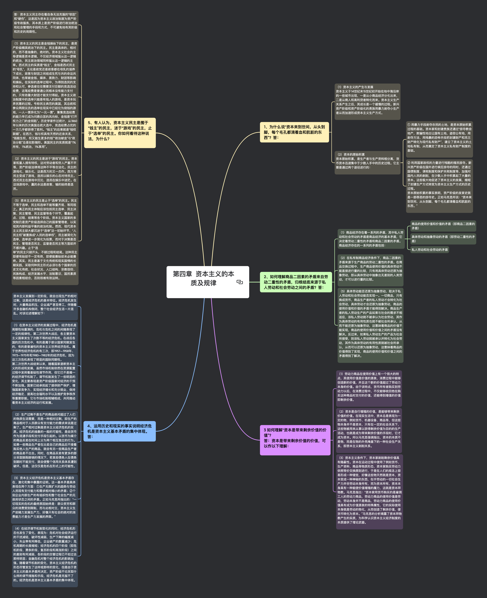
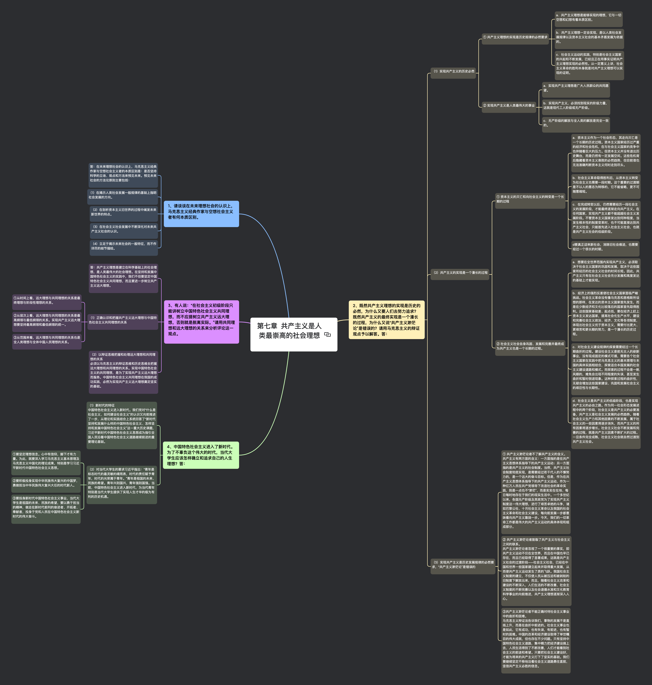

## 思维导图

### 绪论部分

### 第一章 世界的物质性及发展规律

### 第二章 实践与认识及其发展规律

### 第三章 人类社会及其发展规律

### 第四章 资本主义的本质及规律

### 第五章 资本主义的发展及其趋势

### 第六章社会主义的发展及其规律（本章仅供学习参考，不作考试要求）

### 第七章 共产主义是人类最崇高的社会理想

## 大纲

### 绪论部分

#### 什么是马克思主义？

- a) 从创造者、继承者的认识成果讲，马克思主义是由马克思、恩格斯创立的，由其后继者不断丰富和发展的观点和学说的科学理论体系。

- b) 从阶级属性讲，马克思主义是关于无产阶级解放、全人类解放和每个人自由而全面发展的学说，是指引人民创造美好生活的行动指南，具有鲜明的阶级性。

- c) 从研究对象和主要内容讲，马克思主义是无产阶级的科学世界观和方法论，是关于自然、社会和人类思维发展的一般规律的学说，是关于社会主义必然代替资本主义、最终实现共产主义的学说。

- d) 马克思主义哲学、马克思主义政治经济学和科学社会主义的有机统一并共同构成了马克思主义理论的主体内容。

#### 马克思主义的直接的理论来源？

- a) 资本主义生产方式造成社会化大生产迅猛发展的同时也带来了严重的社会灾难（社会两极分化；周期性经济危机频发）

- b) 无产阶级在反抗资产阶级剥削和压迫的斗争中，逐步走向自觉，并迫切渴望科学的理论指导

- c) 19C 西欧三大先进思潮为马克思主义的创立提供直接的理论来源（德国古典哲学、英国古典政治经济学和英法两国的空想社会主义）

- d) 19C 三大科学发现也为马克思主义的产生提供了自然科学前提（细胞学说、能量守恒和转化定律）

- e) 还有主观条件，结合马恩二人的生平谈就行

#### 马克思主义的鲜明特征？

- a) 科学性

  - a．马克思主义是对自然、社会和人类思维发展本质和规律的正确反映。它是在社会实践和科学发展的基础上产生的，并在自身发展过程中不断总结实践经验，吸取自然科学和社会科学发展的最新成就。

  - b．马克思主义具有科学的世界观和方法论基础，即辩证唯物主义和历史唯物主义，这是马克思主义的一个突出特征和理论优势，也是马克思主义科学性的重要体现。

  - c．马克思主义理论是一个逻辑严密的有机整体，它以事实为依据、以规律为对象，并以实践为检验标准。马克思主义的发展具有科学探索性，是一个不断探索和掌握客观规律的过程。

- b) 人民性

  - a．人民至上是马克思主义的政治立场。马克思主义政党把人民放在心中最高位置，一切奋斗都致力于实现最广大人民的根本利益，这是马克思主义最鲜明的政治立场。

  - b．人民群众是历史的创造者，是社会主义事业的依靠力量，马克思主义的人民性是以阶级性为深刻基础的，是无产阶级先进性的体现。

  - c．马克思主义是关于无产阶级解放的学说。无产阶级解放和全人类解放是完全一致的。

- c) 实践性

  - a．马克思主义具有突出的实践精神，它始终强调理论与实践的统一，始终坚持与社会主义实际运动紧密结合。马克思主义是从实践中来，到实践中去，在实践中接受检验，并随实践的发展而不断发展的学说。

  - b．从马克思主义的使命和作用来说，它不是一种纯粹解释世界的学说，而是直接服务于无产阶级和人民群众改造世界的实践活动的科学理论。

  - c．从马克思主义的内容来看，实践观点是马克思主义首要的和基本的观点，这一基本观点体现在马克思主义全部思想内容之中。

- d) 发展性

  - a．马克思主义是不断发展的学说，具有与时俱进的理论品质。马克思主义是时代的产物，并随着时代、实践和科学的发展而不断发展。

  - b．马克思主义理论体系是开放的，它不断吸取人类最新的文明成果来充实和发展自己。

  - c．马克思主义在指导人们认识世界和改造世界的过程中，在指导社会主义事业发展的过程中，不断与时代特征和各国具体实际相结合，得到丰富和发展，并形成新的理论成果。

#### 结合当代世界所面临的课题和当代青年所肩负的使命，谈谈马克思主义的当代价值和指导意义？

- （1）当代世界所面临的新课题和当代青年所肩负的新使命

  - a) 在经济全球化的背景下，资本主义内部矛盾越来越突出，经济政治发展的不平衡加剧了资本主义世界的两极分化，贫富差距日益扩大。20 世纪 90 年代末的东南亚金融危机以及由华盛顿开始波及全球的 2008 年全球金融危机，都暴露了资本主义的缺陷。当代世界的新课题是和平与发展，各国都希望在一个相对稳定的环境中谋求国内经济发展，提高人们的生活水平。因此，马克思主义思想对现代社会仍有指导意义。

  - b) 不同的时代有不同的历史责任与使命，当代青年是在中国改革开放新时期成长起来的，处在一个继往开来的历史时期，肩负着祖国人民更多的期望，也应肩负起民族复兴的重任。当代青年所处的时代正是社会主义现代化建设的关键时刻，中华民族的伟大复兴对当代青年提出了新的挑战，我们有责任也有义务来维护祖国的统一，保卫祖国，建设祖国。而大学生作为当代青年的主体和中坚力量，更应该发挥引领带头作用。

  - c) 总而言之，马克思主义作为具有科学性、真理性的学说，对当代青年的人生发展有重要的指引作用，有助于青年们树立正确的世界观、人生观和价值观，提高其应对和处理问题的能力。

- （2）马克思主义的当代价值

  - ① 当代世界变化的认识工具

    - a．马克思主义给予我们观察当代世界的宏大视野。

    - b．马克思主义给予我们透视时代风云的锐利目光。

    - c．马克思主义给予我们展望未来世界的长远眼光和战略定力指引。

  - ② 当代中国发展的行动指南

    - a．马克思主义是指引当代中国发展的精神旗帜。

    - b．马克思主义是推动当代中国发展的精神动力。

    - c．马克思主义是引领当代中国实践的行动指南。

  - ③ 引领人类社会进步的科学真理

    - a．从人类历史发展的大视野来看，世界仍然处于马克思主义所指明的从资本主义走向社会主义的大时代。马克思主义所揭示的资本主义基本矛盾仍然存在，而且在近年来西方的金融危机和社会危机中呈现出某种激化的趋势。

    - b．人类的未来仍然需要马克思主义的启迪和指引。社会是在矛盾中进步的，每一个时代的社会进步总是伴随着相应的社会问题，面对当今社会的重大问题，还是需要从马克思主义中寻找智慧。

- （3）对当代青年的指导意义

  - 青年是祖国的未来、事业的希望。青年强则国家强，青年一代有理想、有本领、有担当，国家就有前途，民族就有希望。学习马克思主义理论可以帮助青年提高分析和解决问题的能力，有助于其树立正确的世界观、人生观和价值观。当代青年在学习马克思主义的过程中，要有正确的态度和科学的方法：

    - ① 努力学习和掌握马克思主义的基本立场、观点、方法。
    - ② 坚持理论联系实际的马克思主义学风。
    - ③ 自觉将马克思主义内化于心、外化于行。

#### 阅读感受：

- 《资本论》内容宏大，理论深奥，创造了一个崭新的思想体系。其研究世界的方法源于德国古典哲学、英法两国的空想社会主义和英国古典政治经济学。马克思吸收了黑格尔的辩证法思想，相信能够用一个辩证法公式概括人类的进化历程。他认为，所有哲学家所做的一切都在致力于解释世界，但他同时认为，问题的关键在于如何改造世界。马克思在黑格尔辩证法的基础之上，颠覆了传统的“形而上学”，建立了一个现实中得以实践的最大的思想体系。《资本论》以唯物史观的基本思想为指导，通过深刻分析资本主义生产方式，揭示了资本主义社会发展的规律，同时也使唯物史观得到了科学的验证和进一步的丰富和发展。它运用唯物史观的观点和方法，将社会关系归结为生产关系，将生产关系归结于生产力水平，从而证明了社会形态的发展是一个不以人的意志为转移的自然历史过程。

### 第一章 世界的物质性及发展规律

#### 马克思主义的物质范畴的理论意义

- （1）马克思主义的物质观
  马克思主义认为，世界是物质的世界，物质是第一性，物质是不依赖于人类的意识而存在，并能为人类的意识所反映的客观存在。“物质”范畴是唯物主义哲学关于世界本原和统一性的最高抽象，是唯物主义世界观的基石。马克思主义批判继承了以往唯物主义的传统，在总结现代自然科学重大成就的基础上，创立了辩证唯物主义的物质观。20 世纪初，列宁对物质概念做出了科学的概括：“物质是标志客观实在的哲学范畴，这种客观实在是人通过感觉感知的，它不依赖于我们的感觉而存在，为我们的感觉所复写、摄影、反映。”

- （2）马克思主义的物质观具有深刻的理论意义

  - ① 坚持唯物主义一元论，同唯心主义一元论和二元论划清了界限。马克思主义指明了物质对于意识的独立性、根源性，以及意识对于物质的依赖性、派生性。因为意识不过是物质的反映，不能离开物质而独立存在，所以意识不可能成为世界的另一种本原。

  - ② 坚持了能动的反映论和可知论，批判了不可知论。目前世界上还有很多事物未被人类认识，但这并不意味着它们不可认识。人们已经认识到未知世界与已知世界都是客观存在的。世界上只有尚未认识之物，没有不可认识之物。

  - ③ 体现了唯物论和辩证法的统一，克服了形而上学唯物主义的缺陷。马克思主义的物质观认为，物质的唯一特性是客观实在性，既肯定了哲学物质范畴同自然科学物质结构理论的联系，又将它们相区别。从个性中看到共性，从暂时中发现永恒，从相对中找到绝对，这是马克思主义物质观体现的唯物辩证法。

  - ④ 体现了唯物主义自然观与唯物主义历史观的统一，为彻底的唯物主义奠定了理论基础。马克思主义的物质观建立了统一说明自然历史过程的唯物主义原则，揭示了自然和社会的物质性，实现了唯物主义自然观和历史观的辩证统一。

#### 物质与意识的辩证关系

物质决定意识，意识对物质具有反作用，这种反作用就是意识的能动作用。

- （1）物质决定意识
  意识是人脑的机能和属性，是客观世界的主观映像。物质对意识的决定作用表现在意识的起源、本质和作用上。

  - ① 从意识的起源来看，其形成和发展经历了三个阶段，即：由一切物质所具有的反应特性到低等生物的刺激感应性，再到高等动物的感觉和心理，最终发展成人类的意识。意识不仅是自然界长期发展的产物，而且是社会历史发展的产物。劳动为意识的产生和发展提供了客观需要和可能；人们在劳动和交往中形成的语言促进了意识的发展。

  - ② 从意识的本质来看，意识是客观世界的主观映像。马克思指出：“观念的东西不外是移入人的头脑并在人的头脑中改造过的物质的东西而已。”

- （2）意识对物质具有反作用
  物质决定意识，意识的能动作用是指意识对物质具有反作用。意识的能动作用主要表现在：

  - ① 意识活动具有目的性和计划性。马克思认为：“人在劳动过程结束时得到的结果，在这个过程开始时就已经在劳动者的表象中存在着，即已经观念地存在着”。人的整个实践过程，就是围绕意识活动所构建的目标和蓝图来进行的。

  - ② 意识活动具有创造性。人的意识可以对客观世界中的感性材料加工和建构，在思维中构造一个现实中没有的理想世界。

  - ③ 意识具有指导实践改造客观世界的作用。在实践中形成观念，以这些观念为指导，通过实践使之变成客观现实。④ 意识具有调控人的行为和生理活动的作用。现代科学证明，意识、心理因素对人的行为选择和健康状况能够产生重要影响。

- （3）主观能动性和客观规律性的统一
  正确认识和把握物质与意识的辩证关系，需要处理好主观能动性与客观规律性的关系，原因在于：

  - ① 尊重客观规律是正确发挥主观能动性的前提。人们正确地认识世界，有效地改造世界的前提是认识和掌握客观规律。

  - ② 只有充分发挥主观能动性，才能正确认识和利用客观规律。承认规律的客观性，并不是说人在规律面前无能为力、无所作为。人类能够按照客观规律改造世界，以达到自己的目的。

#### 运用矛盾的普遍性和特殊性辩证关系原理，说明把马克思主义基本真理与中国具体实际相结合的重要性。答：

- （1）矛盾普遍性与特殊性的辩证关系

  - ① 矛盾的普遍性即矛盾的共性，矛盾的特殊性即矛盾的个性。矛盾的共性是无条件的、绝对的；矛盾的个性是有条件的、相对的。

  - ② 任何现实存在的事物的矛盾都是共性和个性的有机统一，共性寓于个性之中，没有离开个性的共性，也没有离开共性的个性。矛盾的共性和个性相统一的关系，既是客观事物固有的辩证法，也是科学的认识方法。

- （2）把马克思主义基本真理与中国具体实际相结合的重要性
  矛盾的普遍性和特殊性辩证关系的原理，是把马克思主义普遍真理同各国具体实际相结合的理论基础，也是建设中国特色社会主义的理论根据。

  - ① 矛盾的普遍性和特殊性辩证统一的原理，是把马克思主义普遍真理与中国的具体实际相结合，走建设有中国特色社会主义道路的重要理论依据。矛盾的普遍性和特殊性的关系就是共性与个性、绝对与相对的关系。我国走中国特色社会主义道路，是中国共产党把马克思主义普遍真理同中国的具体实际相结合的过程中实现的第二次飞跃。在这里，“中国特色”是中国不同于其他社会主义国家的个性、特殊性。“社会主义”则是中国和其他社会主义国家的共性、普遍性。

  - ② 根据共性与个性相统一的原理，我们坚持中国特色社会主义道路。

    - a．不管中国的情况如何特殊，都必须坚持马克思主义的普遍真理，坚持社会主义根本制度和基本原则，这是共性。

    - b．社会主义的一般只能在各国特色的个别中存在，我们又必须建设中国特色的社会主义，从中国的国情出发，注意把握中国的特点。只有坚持党的基本路线不动摇，走自己的路，我们才能在建设中国特色社会主义的道路上不断取得胜利，这是个性。

#### 不断增强思维能力：辩证思维能力、历史思维能力、战略思维能力、底线思维能力、创新思维能力。

答：创新思维能力是对常规思维的突破，是破除迷信、超越陈规，善于因时制宜、知难而进、开拓创新的能力。

- （1）培养和提高创新思维能力的重要性

  - ① 坚持创新思维，才能推动发展、取得进步。“发展的观点”是唯物辩证法的基本观点，马克思主义关于人类社会不断进步的发展观，不仅揭示了人类社会历史是不断向前发展的，而且说明了正是人类的创新思维和创造智慧推动了社会更好地发展。

  - ② 创新是一个民族进步的灵魂，是一个国家兴旺发达的不竭动力，也是中华民族最深沉的民族禀赋。这些年中华民族进步和贡献的取得，正是中华民族勇于创新和善于创新的结果。失去了创新思维，就会失去前进的动力，导致封闭和落后。

  改革开放以来，中国共产党高度重视思想解放和理论创新，开辟了中国特色社会主义道路，形成了中国特色社会主义理论体系，确立了中国特色社会主义制度，发展了中国特色社会主义文化，实现了中国人民从站起来到富起来、强起来的伟大飞跃。从某种意义上说，这些成就正是我们党坚持创新思维、大力推进理论创新和实践创新的结果。

- （2）提高自己的创新思维能力的做法

  - ① 提高创新思维能力，必须坚决反对各种形而上学的思维方式，做到不唯书、不唯上，只唯实。提高创新思维能力，需要坚持和运用唯物辩证法，坚决反对形而上学。

    - a．要破除对“本本”的迷信；

    - b．要破除对“经验”的迷信；

    - c．要破除对“权威”的迷信。

  - ② 问题意识是提高创新思维能力的起点和动力源。

  增强问题意识、坚持问题导向，就是承认矛盾的普遍性客观性，就是善于把认识和化解矛盾作为打开工作局面的突破口，善于具体问题具体分析，透过现象看本质，抓主要矛盾和矛盾的主要方面，科学分析问题，深入研究问题。

  - ③ 善于继承才能善于创新。

    - a．创新思维不是凭空产生的，善于继承，才能将过去、现在和未来联系起来；

    - b．善于创新，才会有现在超越过去、未来超越现在的前进运动。

    - c．中国特色社会主义是科学社会主义理论逻辑和中国社会发展历史逻辑的辩证统一，是中国共产党人运用创新思维，在继承和发展中形成的创新成果。

  - ④ 在解放思想中锻造创新思维。

    - a．提高创新思维能力，就是要有敢为人先的锐气，打破惯性思维，以思想认识的新飞跃打开工作的新局面；

    - b．提高创新思维的过程，就是思想解放的过程。没有思想的大解放，就不可能有创新思维的大突破。

### 第二章 实践与认识及其发展规律

#### 实践与认识的辩证关系及其规律

- （1）毛泽东《实践论》的主要观点：
  毛泽东强调：“一个正确的认识，往往需要经过由物质到精神，由精神到物质，即由实践到认识，由认识到实践这样多次的反复，才能够完成。”如此“实践、认识、再实践、再认识，循环往复以至无穷，而实践和认识之每一循环的内容，都比较地进到了高一级的程度”。这就是认识辩证运动发展的基本过程，也是认识运动的总规律。认识是一个反复循环和无限发展的过程，是一个波浪式前进和螺旋式上升的过程。认识在实践基础上不断深化发展，并推动实践在认识指导下不断深入推进。这个过程既不是封闭式的循环，也不是直线式的发展，而是波浪式前进和螺旋式上升的。

- （2）实践与认识的辩证关系

  - ① 实践是认识的基础，实践在认识活动中起决定性作用。主要表现在以下四个方面：

    - a．实践是认识的来源。认识的内容是在实践活动的基础上产生和发展的。只有在实践中实际改造和变革对象，人们才能形成对认识对象属性、本质、规律更为准确的认识，并以这种认识指导实践活动。

    - b．实践是认识发展的动力。认识的产生和发展源于实践的需要，也正是这种需要推动人类的科学发现和技术发明，推动人类的思想进步和理论创新。实践的需要是推动认识在深度和广度上不断发展之根本。此外，实践是认识发展的动力，还表现为实践为认识的发展提供了如经验资料、实验仪器和工具等的手段和条件。另外，实践改造了人的主观世界，锻炼和提高了人的认识能力。人们正是在实践的推动下，不断突破旧认识、旧思想，引起认识上的新飞跃，从而不断有新发现、有所前进。

    - c．实践是认识的目的。通过实践获得认识，其最终目的是为实践服务，指导实践，以满足生活和生产的需要。

    - d．实践是检验认识真理性的唯一标准。真理不是自封的。判断认识的真理性，不是依主观感觉，而是依客观上社会实践的结果。

  - ② 认识反作用于实践。

    - a．人的实践活动是受人的意识支配的，实践的这种本质特性决定着它不能离开认识的指导。

    - b．认识活动及其成果有相对独立性，遵循其特有的活动方式和发展规律，它一经形成，便能反作用于实践。

    - c．认识对实践的指导作用表现在：正确的认识能够推动实践的发展，而错误的认识则会对实践起阻碍作用。

#### 真理、真理的绝对性和相对性及其辩证关系、真理与谬误（自学）；

- （1）真理是绝对的又是相对的原因
  真理是一个过程。就真理的发展过程以及人们对它的认识和掌握程度来说，真理既具有绝对性，又具有相对性，它们是同一客观真理的两
  种属性，这是真理问题上的辩证法。任何真理都是绝对性和相对性的统一，二者相互联系、不可分割。两者关系具体如下：

  - ① 真理的绝对性

    真理的绝对性是指真理主客观统一的确定性和发展的无限性。它有两个方面的含义：

    - a．任何真理都标志着主观与客观之间的符合，都包含着不依赖于人和人的意识的客观内容，都同谬误有原则的界限。这一点是绝对的、无条件的。在这个意义上，承认了真理的客观性也就是承认了真理的绝对性。

    - b．人类认识按其本性来说，能够正确认识无限发展着的物质世界，认识每前进一步，都是对无限发展着的物质世界的接近，这一点也是绝对的、无条件的。在这个意义上，承认了世界的可知性，承认人能够获得关于无限发展着的物质世界的正确认识，也就是承认了真理的绝对性。

  - ② 真理的相对性

    真理的相对性是指人们在一定条件下对客观事物及其本质和发展规律的正确认识总是有限度的、不完善的。它具有两个方面的含义：

    - a．从客观世界的整体来看，任何真理都只是对客观世界的某一阶段、某一部分的正确认识，人类已经达到的认识的广度总是有限度的，因而，认识有待扩展。

    - b．就特定事物而言，任何真理都只是对客观对象一定方面、一定层次和一定程度的正确认识，认识反映事物的深度是有限度的，或是近似性的。因而，认识有待深化。任何真理都只能是主观对客观事物近似正确即相对正确的反映。

  - ③ 真理的绝对性和相对性的关系

    真理的绝对性和相对性是辩证统一的，具体如下：

    - a．二者相互依存。即人们对于客观事物及其本质和规律的每一个正确认识，都是在一定范围内、一定程度上、一定条件下的认识，因而是相对的和有局限的；但是，在这一定范围内、一定程度上、一定条件下，它也是对客观对象的正确反映，因而它也是无条件的、绝对的。

    - b．二者相互包含。一是真理的绝对性寓于真理的相对性之中。任何真理所包含的客观内容都只能是人们在特定历史条件下所把握到的，都只是对客观世界及其事物的一定范围、一定程度的正确反映。二是真理的相对性包含并表现着真理的绝对性。任何真理都与谬误有本质的区别，标志着人们在一定范围内和一定层次上达到对于无限发展着的物质世界的正确认识，包含着确定的客观内容。毛泽东把真理的绝对性与相对性的关系比喻为长河与水滴的关系，“马克思主义者承认，在绝对的总的宇宙发展过程中，各个具体过程的发展都是相对的，因而在绝对真理的长河中，人们对于在各个一定发展阶段上的具体过程的认识只具有相对的真理性。无数相对的真理之总和，就是绝对的真理”。

    - c．相对性向绝对性转化。真理永远处在由相对向绝对的转化和发展中，是从真理的相对性走向绝对性、接近绝对性的过程。任何真理性的认识都是由真理的相对性向绝对性转化过程中的一个环节，这是真理发展的规律。真理的绝对性与相对性根源于人认识世界的能力的无限性与有限性、绝对性与相对性的矛盾。人类的思维按其本性、可能和历史的终极目的来说，是能够认识无限发展着的物质世界的，思维是无限的和绝对的。但是，具体到每一个人乃至每一代人，由于受到客观事物及其本质的显露程度、社会历史的实践水平、主观的条件以及生命的有限性等各方面的限制，其思维也是有限的和相对的。人的认识能力、思维能力是无限性与有限性、绝对性与相对性的对立统一，作为人的正确认识成果的真理，也必然是绝对性和相对性的对立统一。

- （2）真理的绝对性和相对性相统一对马克思主义的重要意义

  - ① 割裂真理绝对性与相对性之间的辩证关系，就会走向形而上学的真理观，即绝对主义和相对主义。绝对主义在实际工作中表现为教条主义、思想僵化，把马克思主义当作一成不变的公式。相对主义否认真理内容的客观性，把真理的相对性歪曲成了主观随意性，由此陷入主观真理论，导致不可知论和诡辩论。

  - ② 马克思主义是客观真理，是绝对性和相对性的统一

    马克思主义正确地反映了人类社会发展的规律，是经过长期革命、建设和改革的实践所证明了的真理，因而具有绝对性的一面。但是，马克思主义并没有穷尽对一切事物及其规律的认识，仍然需要随着社会实践的发展而发展，因而又具有相对性的一面。正因为马克思主义具有绝对性，所以我们必须坚持以马克思主义为指导思想；也因为它具有相对性，所以我们必须在实践中丰富和发展马克思主义。既坚持又发展，才是对待马克思主义的正确态度。

#### 真理和价值的辩证关系。

- （1）真理尺度和价值尺度的含义

  - ① 人们的实践活动总是受着真理尺度和价值尺度的制约。

  - ② 实践的真理尺度是指在实践中人们必须遵循正确反映客观事物本质和规律的真理。只有按照真理办事，才能在实践中取得成功。

  - ③ 实践的价值尺度是指在实践中人们都是按照自己的尺度和需要去认识世界和改造世界。这一尺度体现了人的活动的目的性。

- （2）真理尺度与价值尺度的关系

  - ① 任何实践活动都要受到这两种尺度的共同制约，任何活动都是合规律性和合目的性的统一。

  - ② 真理与价值或真理尺度与价值尺度之间是紧密联系、不可分割的。一方面，价值尺度必须以真理为前提。脱离了真理尺度，价值尺度就偏离了正确的轨道。另一方面，人类满足自身需要的内在尺度，推动新的真理不断被发现。脱离了价值尺度，真理就缺失了主体意义。

- （3）帮助和启示
  因为实践具有具体性和历史性，真理尺度与价值尺度的统一也是具体的和历史的，二者的统一会随着实践的发展而不断发展到更高级的程度，真理由相对走向绝对，人的需要和利益也日益呈现出多元化特征。真理尺度与价值尺度是否达到了具体的、历史的统一，必须通过实践来验证。新时代中国特色社会主义的实践充分体现了真理尺度与价值尺度的辩证统一。正如习近平所指出的：“中国共产党人的理想信念，建立在马克思主义科学真理的基础之上，建立在马克思主义揭示的人类社会发展规律的基础之上，建立在为最广大人民谋利益的崇高价值的基础之上。我们坚定，是因为我们追求的是真理。我们坚定，是因为我们遵循的是规律。我们坚定，是因为我们代表的是最广大人民的根本利益。”

### 第三章 人类社会及其发展规律

#### 为什么说物质资料的生产方式是社会发展的决定性力量？

答：物质资料的生产方式是社会发展的决定性力量，主要是基于以下原因：

- （1）物质资料的生产方式是人类其他一切活动的首要前提，是人类社会赖以存在和发展的物质基础。人们为了能够创造历史，必须能够生活，为了生活，首先就需要衣、食、住及其他东西。因此，人类历史的第一个历史活动就是生产满足这些需要的物质资料本身。这是一个简单的事实和起码的真理。发现并承认这一真理，是历史观的一个伟大革命。

- （2）物质资料的生产方式决定着社会的结构、性质和面貌。有什么样的生产方式便有什么样的社会形态。正如马克思所说：“手推磨产生的是封建主为首的社会，蒸汽磨产生的是工业资本家为首的社会。”

- （3）生产方式的发展变化决定着社会历史的发展变化和形态更替。在物质资料的生产方式中，生产力是最活跃、最能动的因素，它总是要向前发展的，而生产关系则是相对稳定的。随着生产力的发展，原有的生产关系便由生产力发展的形式变成生产力发展的桎梏，由适合生产力的发展变成阻碍生产力的发展。只有变革生产关系，才能解放和发展生产力。随着生产关系（即经济基础）的变革，全部的、庞大的上层建筑也会或迟或早地发展变革，从而引起社会形态的更替。

- 总之，人类社会的历史就是物质资料生产的历史，是劳动发展史。马克思正是从劳动发展史中找到了理解人类社会发展史的“钥匙”。

#### 运用社会基本矛盾运动的原理分析深化改革的客观依据与重要意义。答：

- 与深化改革最相近的是生产力与生产关系的矛盾运动。

  - 社会基本矛盾运动包括

    - 生产力与生产关系之间的矛盾

    - 经济基础与上层建筑之间的矛盾

  - 它们是贯穿社会发展过程始终，规定社会发展过程的基本性质和基本趋势，并对社会历史发展起根本推动作用的矛盾。

  - 因此，社会基本矛盾的解决对历史发展具有重要作用。

  - 而要解决社会基本矛盾，改革是一种重要的方式和途径。

- （1）客观依据
  社会基本矛盾，特别是生产力与生产关系的矛盾在历史发展中起根本的推动作用，为了推动社会发展，必须解决好社会基本矛盾，改革就是其中一种重要方式。深化改革的客观依据就在于社会基本矛盾在历史发展过程中的重要作用，主要表现在：

  - ① 生产力是社会基本矛盾运动中最基本的动力因素，是人类社会发展和进步的最终决定力量。

  - ② 社会基本矛盾特别是生产力和生产关系的矛盾，是“一切历史冲突的根源”，决定着社会中其他矛盾的存在和发展。

  - ③ 社会基本矛盾有不同的表现形式和解决方式，并从根本上影响和促进社会形态的变化和发展。

  - 因此，当两者不能够及时适应时，就需要改革来调整两者的关系，因而改革也是必不可少的。

- （2）重要意义
  改革的成功，是对社会基本矛盾的某一方面或某种程度的解决，从而促进社会发展。社会生活的基础是物质生产，推动社会进步的最活跃、最革命的要素是生产力，社会主义的根本任务是解放和发展社会生产力。全面深化改革中，要把坚持发展作为解决我国所有问题的关键，推动我国社会生产力不断发展前进，进而推动人的全面发展和社会的全面进步。同时，还应通过改革，使生产关系适应生产力的发展、上层建筑适应经济基础的发展，从而顺利解决社会基本矛盾，促进社会的进一步发展。

#### 结合我国科学技术的重大成就，如高铁、大飞机以及“天宫”“蛟龙”“天眼”“悟空”“墨子”等，谈谈对科学技术在社会发展中的作用的认识。答：

- （1）科学技术是先进生产力的重要标志，对于推动社会发展有非常重要的作用。科技革命是推动经济和社会发展的强大杠杆，近代以来，科技革命极大地推动了社会历史的进步，其主要是通过促进人们的生产方式、生活方式和思维方式的深刻变化来推动社会发展：

  - ① 对生产方式产生了深刻影响：

    - a．改变了社会生产力的构成要素。科技发展使生产自动化程度提高，大大地改变了体力劳动与脑力劳动的比例，使劳动力结构向着智能化趋势发展。

    - b．改变了人们的劳动形式。科技发展使人们的劳动方式经历了由机械自动化走向智能自动化、由局部自动化走向大系统管理和控制自动化的根本性变革。

    - c．改变了社会经济结构，特别是导致产业结构发生变革。科技的发展使第三产业在国民经济中所占的比重日益提高。

  - ② 对生活方式产生了巨大影响：

    - a．现代科技革命把人们带入了信息时代，要求人们不断更新和充实知识，以适应时代发展的需要。

    - b．现代信息技术为人们提供了处理、存储和传递信息的手段，给学习、工作带来了极大便利。

    - c．现代化的交通、通信等手段，为人们的交往提供了方便。

    - d．劳动生产率的提高，使人们自由支配的闲暇时间增多，为人的自由而全面的发展创造了更多条件。

  - ③ 促进了思维方式的变革。主要表现在新的科学理论和技术手段通过影响思维主体、思维客体和思维工具，引起了思维方式的变革正确把握科学技术的社会作用科学技术社会作用的两重性：

    - a．科学技术能够通过促进经济和社会发展造福于人类，科学技术的作用既受到一定客观条件的影响，也受到一定主观条件的影响。

    - b．科学技术的发展标志着人类改造自然能力的增强，意味着人们能够创造出更多的物质财富，对社会发展有巨大的推动作用。

- （2）科学技术是社会发展的重要动力。近代中国落后于西方国家主要原因是科学技术水平低。习近平总书记提出“科技兴则民族兴，科技强则国家强”。

- （3）新时期我国的科学技术发展取得重大成就：2016 年 6 月 20 日，使用中国自主芯片制造的超级计算机“神威-太湖之光”登上全球超级计算机 500 强榜首。2016 年 8 月 16 日，长征二号运载火箭成功将世界首颗量子科学实验卫星“墨子号”发射升空。2016 年 8 月 25 日，我国研发的自主遥控水下机器人“海斗”号潜深达到 10767 米，首次进入万米时代。2016 年 9 月 15 日，“天宫二号”顺利升空。2016 年 9 月 25 日，被誉为“中国天眼”的 FAST 射电望远镜落成启用。
  这些科学技术的发展不仅提高了我国的综合国力和国际地位，而且对我们的生产生活产生巨大影响。比如我国研制的全球超级计算机将对我们所进行的科学实验起到促进作用；“墨子号”的发射升空将促进我国科研事业的发展，从而改善普通群众的生活。

#### 请结合人民群众是历史创造者的原理，谈谈对坚持以人民为中心重要性的认识。答：

- （1）人民群众的含义
  人民群众是社会历史的主体，是历史的创造者，这是马克思主义最基本的观点之一。人民群众是一个历史范畴。从质上看，人民群众是指一切对社会历史发展起推动作用的人；从量上看，人民群众是指社会人口中的绝大多数。在不同的历史时期，人民群众有着不同的内容，包含着不同的阶级、阶层和集团，但其中最稳定的主体部分始终是从事物质资料生产的劳动群众。

- （2）对坚持以人民为中心重要性的认识
  在实际生活中，我们必须坚持以人民为中心的思想，这是因为人民群众在创造历史过程中的决定作用。

  - ① 人民群众是社会物质财富的创造者。人类社会赖以存在和发展的基础是物质资料的生产方式。人民群众创造的社会物质财富，是社会得以存在和发展的物质保障。人民群众的这一创造作用同生产力是社会发展的最终决定力量这一原理具有逻辑上的一致性，因为作为人民群众主体的劳动群众，乃是生产力的体现者。

  - ② 人民群众是社会精神财富的创造者。首先，人民群众的社会实践活动是科学、文化、艺术的唯一源泉；其次，劳动群众为人们从事精神文化活动提供了一切物质手段和物质条件；再次，劳动知识分子在精神财富的创造过程中起着极其重要的作用。

  - ③ 人民群众是社会变革的决定力量。人民群众在创造社会财富的同时，也创造并改造着社会关系。人民群众既是社会革命的决定力量，又是社会改革的决定力量。社会变革、社会改革根源于社会基本矛盾，但生产关系一定要适合生产力发展状况的规律、上层建筑一定要适合经济基础发展状况的规律不可能自发地起作用，必须通过人民群众这一社会变革的主体才能实现其作用。

#### 习近平指出：“我们既要绿水青山，也要金山银山。宁要绿水青山，不要金山银山，而且绿水青山就是金山银山。”请结合自然地理环境在社会生存和发展中的作用，谈谈应怎样认识和处理经济发展与环境保护的关系。答：

- 自然地理环境是人类赖以存在和发展的必要前提，是社会存在的组成部分。没有自然界，没有感性的外部世界，工人什么也不能创造。没有地理环境，就不会有人和人类社会。可以看出，自然环境对人类的生存发展具有重要意义，因此，我们在发展经济的同时，不能忽略自然环境，不能以牺牲环境为代价来取得
  经济发展。我们必须坚持可持续的绿色发展理念，在发展经济的同时保护环境，“既要金山银山，也要绿水青山”。为此，我们必须做到以下四点：

- （1）强化环境意识，树立生态理念要树立“绿水青山就是金山银山”的环境价值理念，实现以环境换取经济增长向以环境优化经济增长转变。绿水青山意味着优美的人居环境、清洁的水源和清新的空气，可以大大减少因环境污染和生态破坏造成的直接和间接损失，大大减轻因污染治理和生态恢复所需付出的巨大代价，大大缓解生态环境问题引发的各种社会矛盾，有利于维护社会稳定。

- （2）把环境保护作为决策的重要环节，从源头落实环保基本国策
  环保从源头抓起，最重要的是各级政府、各级管理部门、各级领导要依法承担起改善环境质量和环境管理的责任，牢牢树立科学发展观念，转变把环境因素置于决策之外的决策模式，实行环境与发展综合决策。同时，必须树立正确的政绩观。

- （3）把环境保护作为生产和消费过程中的重要环节，大力发展循环经济解决经济高速增长与生态环境日益恶化这一矛盾的根本出路是转变经济增长方式，用绿色核算体系来重新审视和把握经济发展的途径，走新型工业化道路，积极推动发展循环经济，实现经济与环境“双赢”。

- （4）把环境保护作为改善人居环境的重要环节，集中精力解决突出的环境问题
  改善人居环境不仅仅是改善市民的住房条件，要充分发挥环境保护的文明发展与协调稳定功能，以人为本，下决心解决老百姓广泛关注的影响环境质量和日常环境生活质量的突出问题。强化饮用水源的环保严管措施，保证饮用水安全。采取有效措施保护水源地，确保生态环境改善。大力改善区域环境，创建绿色环保文明社区，提高人民生活质量。

- （5）正确认识和利用科学技术
  科学技术是把双刃剑，既能通过促进经济和社会发展造福于人类，也能在一定条件下对人类的生存和发展带来消极后果。

### 第四章 资本主义的本质及规律

#### 为什么说“资本来到世间，从头到脚，每个毛孔都滴着血和肮脏的东西”？答：

- （1）资本主义的产生与发展
  资本主义于 14 世纪末 15 世纪初开始在地中海沿岸的一些城市出现，一是从小商品经济分化出来，二是从商人和高利贷者转化而来。资本主义生产关系产生之后，其成长是一个缓慢的过程。新兴资产阶级和资产阶级化的贵族用暴力剥夺小生产者从而加速形成资本主义生产方式。

- （2）资本的原始积累
  资本原始积累，是生产者与生产资料相分离，货币资本迅速集中于少数人手中的历史过程。它主要是通过两个途径进行的：

  - ① 用暴力手段剥夺农民的土地，是资本原始积累过程的基础。资本家和封建贵族还通过“掠夺教会地产，欺骗性地出让国有土地，盗窃公有地，用剥夺方法、用残暴的恐怖手段把封建财产和克兰财产转化为现代私有财产”，建立了资本主义的土地私有制，从而奠定了资本主义私有财产制度的基础。

  - ② 利用国家政权的力量进行残酷的殖民掠夺。新兴资产阶级在国外进行疯狂掠夺的同时，还通过国债制度、课税制度和保护关税制度等，加强对国内人民的剥削，在少数人手中积累起了大量的资本。这些极大地促进了资本主义的发展，缩短了封建生产方式转变为资本主义生产方式的历史过程。

资本原始积累的事实表明，资产阶级的发家史就是一部罪恶的掠夺史。正如马克思所说：“资本来到世间，从头到脚，每个毛孔都滴着血和肮脏的东西。”

#### 如何理解商品二因素的矛盾来自劳动二重性的矛盾，归根结底来源于私人劳动和社会劳动之间的矛盾？答：

- （1）商品经济存在着一系列的矛盾，其中私人劳动和社会劳动的矛盾是商品经济的基本矛盾，它决定着劳动二重性的矛盾和商品二因素的矛盾。
  商品经济存在的一系列的矛盾包括：

  - 商品的使用价值和价值的矛盾（即商品二因素的矛盾）

  - 具体劳动和抽象劳动的矛盾（即劳动二重性的矛盾）

  - 私人劳动和社会劳动的矛盾

- （2）在私有制商品经济条件下，商品二因素的矛盾来源于生产商品的劳动二重性的矛盾。在商品交换过程中，生产商品使用价值的具体劳动不能直接进行量的比较，只有将具体劳动还原为抽象劳动，即从具体劳动中抽象出无差别的人类劳动，才可以进行量的比较。

- （3）具体劳动能否还原为抽象劳动，取决于私人劳动和社会劳动能否实现一。一切商品，只有换成货币，商品生产者的私人劳动才会转化为社会劳动，具体劳动才会还原为抽象劳动，商品的使用价值和价值的矛盾才能得到解决。商品生产者的私人劳动生产的产品如果与社会的需求不相适应，该私人劳动就不被承认为社会劳动，其作为具体劳动的有用性质也就不被社会所承认，从而不能还原为抽象劳动，这意味着商品的价值不能实现，商品的使用价值和价值之间的矛盾没有解决。反过来，如果私人劳动生产的产品为社会所接受，则该私人劳动就被承认并转化为社会劳动，其作为具体劳动的有用性质就被社会所承认，从而可以还原为抽象劳动，这意味着商品的价值得到了实现，商品的使用价值和价值之间的矛盾得到了解决。

#### 如何理解“资本是带来剩余价值的价值”？

答：资本是带来剩余价值的价值，可以作以下理解：

- （1）劳动力商品在使用价值上有一个很大的特点，其使用价值是价值的源泉，消费过程中能够创造新的价值，并且这个新的价值超过了劳动力本身的价值。由于该特点，货币所有者购买到劳动力以后，在消费过程中，不仅能够收回他在购买这种商品时支付的价值，还能得到增值的价值即剩余价值。

- （2）资本是自行增殖的价值，是能够带来剩余价值的价值。在现实生活中，资本总是表现为一定的物，例如货币、机器设备、商品等，但这些物本身并不是资本，只有在一定的社会关系下，这些物被用来从事以获得剩余价值为目的的生产活动，也就是成为带来剩余价值的手段时，它才成为资本。所以马克思强调指出，资本的本质不是物，而是在物的外壳掩盖下的一种社会生产关系，即资本主义剥削关系。

- （3）资本主义条件下，资本家剥削剩余价值具有隐蔽性。资本在运动过程中使用了例如货币、生产资料、商品等物质形态，资本家购买劳动力依照等价交换原则进行，于是在人们的观念上容易形成一种错觉，好像这些物天然就是资本，资本变成一种神秘的东西，似乎劳动的一切社会生产力并非劳动本身所有，而为资本所有，资本本身具有一种能使价值增殖的魔力，这就是资本拜物教。马克思指出：“资本家用货币购买的是雇佣工人的劳动力商品，劳动力商品的使用价值是劳动，劳动本身并不是商品，劳动力商品的使用价值具有成为价值源泉的特殊属性，它的实际使用本身就是劳动的物化，从而创造了剩余价值，使货币转化为资本。”马克思的分析揭露了资本拜物教产生的实质，为科学认识资本主义经济制度的本质提供了理论武器。

#### 运用历史和现实的事实说明经济危机是资本主义基本矛盾的集中体现。答：

- 资本主义发展到一定阶段，就会出现生产的相对过剩，这是经济危机的基本特征。经济危机发生时，大量商品积压，企业减产甚至停工，伴随着许多金融机构倒闭，整个社会经济生活一片混乱。对该论述理解如下：

- （1）在资本主义经济的发展过程中，经济危机是周期性地重演的，危机与危机之间的间隔表现了一定的规律性。第二次世界大战后，各主要资本主义国家发生了次数不等的经济危机。在战后各国的历次危机中，有的是属于部分国家同期发生的，有的是普遍性的资本主义世界经济危机。属于世界性经济危机的有三次，即 1957—1958 年、1973—1975 年和 1980—1982 年的经济危机，因为这三次危机表现了明显的国际同期性。
  第二次世界大战结束以来，随着国家垄断资本主义的形成和发展，虽然市场机制依然在资源配置过程中发挥着基础性调节作用，但它已不是唯一的经济调节机制了。调节机制发生了一些明显的变化，其主要表现是资产阶级国家对经济的干预不断加强。国家已经承担起了提供财产保护、增强国家竞争力、实现经济增长和充分就业、保持经济稳定、提高社会福利水平以及维护竞争秩序等重要职能。它与市场机制相辅相成，共同推动着资本主义经济的运行和发展。

- （2）生产过剩不是生产的商品绝对超过了人们的物质生活需要，而是一种相对过剩，即生产的商品相对于人民群众有支付能力的需求来说是过剩了。生产相对过剩是资本主义经济危机的实质。经济危机的抽象的一般的可能性，是由货币作为流通手段和支付手段引起的。以货币为媒介的商品买卖在时间上分为两个相互独立的行为。如果一些商品生产者在出卖自己的商品后不接着购买他人生产的商品，就会有另一些商品生产者的商品卖不出去。同时，在商品买卖有更多的部分采取赊购赊销的情况下，若某些债务人在债务到期时不能支付，就会使整个信用关系体系遭到破坏。但是，这仅仅是危机在形式上的可能性。

- （3）资本主义经济危机是资本主义基本矛盾存在、激化和集中暴露的证明。这一基本矛盾具体表现在两个方面：① 生产无限扩大的趋势与劳动人民现有支付能力和需求相对缩小的矛盾；② 个别企业内部生产的有组织性和整个社会生产的无政府状态之间的矛盾。正如马克思所指出的：“一切现实的危机的最终原因始终是：群众贫穷和群众的消费受到限制，而与此相对立，资本主义生产却竭力发展生产力，好像只有社会的绝对的消费能力才是生产力发展的界限。”

- （4）在经济调节机制变化的同时，经济危机形态也发生了变化，表现为：危机对社会经济运行的干扰减轻，破坏性减弱，生产下降的幅度减小，失业率有所降低，企业破产的数量减少；危机周期的长度缩短；经济危机的四个阶段（即危机阶段、萧条阶段、复苏阶段和高涨阶段）之间的差别有所减弱，各阶段的交替过程已不如过去那样明显；金融危机对整个经济危机的影响加强。随着调节机制的变化，资本主义经济危机的形态尽管发生了这样或那样的变化，但是由于资本主义的基本矛盾所决定，资产阶级不论采取什么样的调节措施和手段，经济危机是克服不了的。经济危机是资本主义基本矛盾的集中体现。

#### 有人认为，资本主义民主是囿于“钱主”的民主，迷于“游戏”的民主，止于“选举”的民主。你如何看待这种说法，为什么？

- 答：资本主义民主存在着自身无法克服的“软肋”和“硬伤”，这是因为资本主义政治制度为资产阶级专政服务，其本质上是资产阶级进行政治统治和社会管理的手段和方式，不可避免地有其阶级和历史的局限性。

- （1）资本主义的民主是金钱操纵下的民主，是资产阶级精英统治下的民主。民主是具体的、相对的，而不是抽象的、绝对的。资本主义社会的主导逻辑是资本逻辑，不仅经济领域服从这一逻辑的统治，民主政治领域同样服从这一逻辑的主宰。西式民主的实质是“钱主”，金钱是西式民主的“母乳”，无论是政党还是政客都在母乳的滋养下成长，政客与财团之间结成生死与共的命运共同体，也常被金钱、媒体、黑势力、财团等影响和操纵。在实际的选举过程中，为得到选民的支持和认可，参选者往往需要支付巨额的竞选活动经费，这笔经费是普通公民根本没有能力支付的，只有依靠大财团才能支付得起。资本主义政治制度中的选举只能是有钱人的游戏，是资本玩弄民意的过程。号称民主典范的美国，其总统和参众两院议员的选举在现实中已经沦为烧钱的游戏，一人一票异化为“一元一票”，筹集竞选经费的能力早已成为问鼎白宫的风向标，金钱是“打开权力之门的金钥匙”。历史学家作过统计，从 1860 年以来的历次美国总统大选中，竞选经费占优的一方几乎都获得了胜利。“钱主”的后果就是“钱权联姻”。在西方，钱与权具有天然的近亲关系，“钱能生权，权又能生更多的钱”“政治献金”与“政治分赃”总是如影随形。美国民主的实质就是“1%所有，1%统治，1%享用”。

- （2）资本主义的民主是迷于“游戏”的民主。资本家和富人拥有特权，这对劳动者和穷人严重不平等，资产阶级法律将这种不平等合法化。民主的游戏化、娱乐化，这是西方的又一杰作。西方将民主变成了游戏，选民以娱乐的心态对待民主。西式民主在游戏中沉沦，选民在娱乐中迷茫。在这场游戏中，赢的永远是政客，输的始终是选民。

- （3）资本主义的民主是止于“选举”的民主。民主不等于选举，民主和选举不能等量齐观、等同视之。真正的民主体制应该包括民主选举、民主决策、民主管理、民主监督等各个环节，覆盖起点、过程、结果等各个阶段。资本主义国家的多党制仍是资产阶级选择自己的国家管理者，以实现其内部利益平衡的政治机制。然而，现代资本主义民主却大都沉迷于“选举”这一初始环节，“人民主权”被置换成“人民的选举权”，民主被简化为选举，选举进一步简化为投票，而对于决策是否民主、管理是否民主、监督是否民主等方面却并不感兴趣。止于“选
  举”的民主只顾开头，不顾过程和结尾。这种民主即便有始却不一定有终，即便能善始却未必能善终。其实，民主是基于文化传统和现实国情的长期实践，采取何种民主形式必须与各个国家的历史文化传统、社会状况、人口结构、宗教信仰、民族构成、经济发展水平、法制意识、国民素质等因素相结合，否则很难有效运转。

### 第五章 资本主义的发展及其趋势

#### 垄断是怎样产生的？为什么说垄断并没有消除竞争？答：

- （1）垄断产生的原因

  - ① 当生产集中发展到相当高的程度，极少数企业就会联合起来，操纵和控制本部门的生产和销售，实行垄断，以获得高额利润。

  - ② 企业规模巨大，形成对竞争的限制，也会产生垄断。

  - ③ 激烈的竞争给竞争各方带来的损失越来越严重，为了避免两败俱伤，企业之间会达成妥协，联合起来，实行垄断垄断组织垄断是通过一定的垄断组织形式实现的。垄断组织是指在一个或几个经济部门中，占据垄断地位的大企业联合。垄断组织的形式多种多样，如初级的短期价格协定。但本质上都是通过联合达到独占和瓜分商品生产和销售市场，操纵垄断价格，以攫取高额垄断利润。

- （2）垄断没有消除竞争的原因

  - ① 垄断没有消除产生竞争的经济根源。

  - ② 垄断必须通过竞争来维持。

  - ③ 社会生产是复杂多样的，任何垄断组织都不可能把包罗万象的社会生产都包下来。

- 为什么说国家垄断资本主义体现了资本主义生产关系的部分质变？
  答：国家垄断资本主义是垄断资本和国家政权密切结合的垄断资本主义。国家垄断资本主义的产生，标志着资本主义发展进入了新的阶段。国家垄断资本主义体现了资本主义生产关系的部分质变的原因是：

  - （1）国家垄断资本主义是垄断资本主义的新发展，它对资本主义经济的发展产生了积极的作用。

    - ① 国家垄断资本主义的出现在一定程度上有利于社会生产力的发展，资本主义国家的政府通过公共投资和支出，开办大型新兴工业企业，部分克服了社会化大生产与私人垄断资本之间的矛盾。
    - ② 私人垄断统治扩大了资本主义生产与消费的矛盾，资产阶级国家采取一定手段干预国民经济，减轻经济危机的程度，缓和了社会各阶级的利益矛盾，有利于社会稳定，促进经济较为协调地发展。
    - ③ 宏观调控的发展，使国家对经济的干预和调节与市场机制日益有机结合起来，自由放任的市场经济逐渐演变成为由国家干预的现代市场经济，一定程度上弥补了自由市场经济的缺陷，对于国家的经济运行和社会发展产生了积极作用。
    - ④ 资产阶级国家通过税收和收入再分配手段，提高了劳动人民的生活水平。

  - （2）国家垄断资本主义的出现并没有根本改变垄断资本主义的性质。
    - ① 国家垄断资本主义仍然是以资本主义私有制为基础，维护资产阶级利益和资本主义制度。
    - ② 国家垄断资本主义没有从根本上消除资本主义的基本矛盾，它代表的是资产阶级的总利益。

#### 如何认识和把握经济全球化及其影响？

- 答：经济全球化是指在生产不断发展、科技加速进步、社会分工和国际分工不断深化、生产的社会化和国际化程度不断提高的情况下，世界各国、各地区的经济活动越来越超出某一国家和地区的范围而相互联系、相互依赖的过程。

- （1）经济全球化的表现

  - ① 国际分工进一步深化。

  - ② 贸易全球化。

  - ③ 金融全球化。

  - ④ 企业生产经营全球化。

- （2）经济全球化的动因从本质上讲，经济全球化是生产力发展和社会化大生产的必然要求。导致经济全球化迅猛发展的因素主要有三点：

  - ① 科学技术的进步和生产力的发展提供了坚实的物质基础和根本的推动力。

  - ② 跨国公司的发展提供了适宜的企业组织形式。

  - ③ 各国经济体制的变革是经济全球化的体制保障。

- （3）经济全球化的影响

  - ① 积极影响

    - a．社会分工得以在更大的范围内进行，资金、技术等生产要素可以在国际社会流动和优化配置，由此带来巨大的分工利益，推动世界生产力的发展。

    - b．体现了社会化生产的要求，不仅发达国家从中受益，一些发展中国家在参与经济全球化进程中也得到了快速发展。全球化为发展中国家提供先进技术和管理经验、就业机会，推动发展中国家国际贸易和跨国公司发展。

  - ② 消极影响

    - a．发达国家与发展中国家在经济全球化过程中的地位和收益不平等、不平衡。

    - b．加剧了发展中国家资源短缺和环境污染恶化。

    - c．一定程度上增加经济风险。

  - ③ 正确看待经济全球化

    - a．“把困扰世界的问题简单归咎于经济全球化，既不符合事实，也无助于问题解决。”国际金融危机不是经济全球化发展的必然产物，而是金融资本过度逐利、金融监管严重缺失的结果。

    - b．经济全球化不是一部分国家的独角戏，而是世界各国、各民族共同实现发展的大舞台。

    - c．面对不同国家在生产方式、发展水平、文化背景等方面的差异，要以共同构建人类命运共同体的理念引领经济全球化。

#### 近年来资本主义社会发生了哪些新变化？试分析其原因及影响。答：

- （1）资本主义社会的新变化

  - ① 生产资料所有制的变化：

    - a．国家资本所有制是指生产资料由国家占有并服务于垄断资本的所有制形式。国家资本所有制主要存在于基础设施和公共事业部门，所以对整个社会经济的发展有着重要的影响。但就其性质而言，仍然是资本主义形式，体现着总资本家剥削雇佣劳动者的关系。

    - b．法人资本所有制是资本主义生产资料所有制发展的新形式，是法人股东化的产物。法人资本所有制有两种形式：一种是企业法人资本所有制，另一种是机构法人资本所有制，但其在性质上是一种基于资本雇佣劳动的垄断资本。

  - ② 集体所有制劳资关系和分配关系的变化

    - a．职工参与决策。这一制度旨在协调劳资关系，缓和阶级矛盾。

    - b．终身雇佣。目的是增强工人对企业的归属意识，从而更加自觉地服从资本家的统治。

    - c．职工持股。旨在通过使职工持有一部分本公司的股份来调动工人的生产积极性，使工人产生归属感，在生产中努力提高劳动生产率，增加剩余价值生产。

    - d．普及化、全民化的社会福利制度。在一定程度上满足劳动者的安全和保障需求，保证劳动者维持最低生活水平，改善劳动者的社会状况。

  - ③ 社会阶层和阶级结构的变化

    - a．资本家的地位和作用已经发生很大变化。

    - b．高级职业经理成为大公司经营活动的实际控制者。

    - c．知识型和服务型劳动者的数量不断增加，劳动方式发生了新变化。

  - ④ 经济调节机制的变化 a．去工业化和产业空心化日趋严重，产业竞争力下降。

    - b．经济高度金融化，虚拟经济与实体经济严重脱节。

    - c．财政严重债务化，债务危机频繁爆发。

    - d．两极分化和社会对立加剧。

    - e．经济增长乏力，发展活力不足，周期性危机与结构性危机交织在一起。

    - f．金融危机频发，全球经济屡受打击。

  - ⑤ 政治制度的变化

    - a．政治制度出现多元化的趋势，公民权利有所扩大。

    - b．重视并加强法制建设。

    - c．改良主义政党在政治舞台上的影响日益扩大。

- （2）资本主义社会的新变化的原因

  - ① 科学技术革命和生产力的发展，是当代资本主义发生新变化的根本推动力量。

  - ② 工人阶级争取自身权利和利益的斗争，是推动当代资本主义发生新变化的重要力量。

  - ③ 社会主义制度初步显示的优越性对当代资本主义产生了重要影响。

  - ④ 主张改良主义的政党对资本主义制度的改革，也对当代资本主义新变化发挥了重要作用。

- （3）资本主义社会的新变化的影响

  - ① 当代资本主义发生的变化从根本上说是人类社会发展一般规律和资本主义经济规律作用的结果。

  - ② 当代资本主义发生的变化是在资本主义制度基本框架内的变化，并不意味着资本主义生产关系的根本性质发生了变化。

  - ③ 没有改变其为资产阶级利益服务，仍然是服从于资产阶级进行统治和压迫需要的政治工具的本质属性，没有改变马克思主义关于资本主义的基本论断的科学性。

#### 如何理解资本主义的历史地位及其为社会主义所代替的历史必然性？

- 答：从人类社会发展的长河看，社会主义取代资本主义，即社会主义公有制取代资本主义私有制，这是历史发展的基本趋势。

- （1）资本主义的内在矛盾决定了资本主义必然被社会主义所代替

  - ① 资本主义基本矛盾“包含着现代的一切冲突的萌芽”。

    - a．资本主义基本矛盾表现在阶级关系上，是无产阶级和资产阶级的对立。

    - b．资本主义基本矛盾表现在经济关系上，是个别工厂中生产的组织性和整个社会中生产的无政府状态之间的对立。

    - c．资本主义经济危机的爆发正是这个基本矛盾发展的结果。

  - ② 资本积累推动资本主义基本矛盾不断激化并最终否定资本主义自身。

    - a．从资本主义积累过程来看，资本主义基本矛盾在资本积累过程中不断发展。

    - b．资本的不断积累必然提高生产的社会化程度，这在客观上势必导致生产的集中和资本的集中，使资本的社会化占有成为可能。

    - c．资本的不断积累使对生产过程的管理社会化，相应地派生出管理社会化大生产的管理人员和专业的管理机构，而这些都弱化甚至排斥资本家个人在管理中的地位和作用。

    当资本主义基本矛盾及其派生的各种矛盾在资本积累中不断发展、激化到资本主义制度自身无法使之释放时，社会主义取代资本主义就将成为不可避免的结果。这是资本主义积累过程所具有的客观历史趋势。

  - ③ 国家垄断资本主义中孕育着某些社会主义的因素，将成为社会主义的前奏。

  - ④ 资本主义社会中存在着资产阶级和无产阶级两大阶级之间的矛盾和斗争。无产阶级和资产阶级之间不可调和的矛盾、对立和斗争，必然导致资本主义政治危机。资产阶级的灭亡和无产阶级的胜利是不可避免的。通过无产阶级革命推翻资本主义制度，用社会主义公有制代替资本主义私有制，成为人类社会由低级向高级发展的客观规律的必然要求。

- （2）社会主义代替资本主义是一个复杂的、长期的历史过程。其原因在于：

  - ① 社会主义自身的巩固、发展和完善是一个长期的历史过程。

    - a．经济上的强烈反差使社会主义国家面临严峻挑战。

    - b．西方敌对势力的颠覆、破坏与和平演变活动，加重了社会主义建设的曲折性、复杂性和长期性。

    - c．对社会主义建设规律的探索需要经过一个长期曲折的过程。

  - ② 社会主义在世界范围代替资本主义是一个长期的历史过程。

    - a．社会主义的本质决定了它在全世界取代资本主义的长期性、曲折性与艰巨性。

    - b．资本主义的暂时强大决定了它在全世界被社会主义所代替的长期性、曲折性与艰巨性。

    - c．20 世纪末世界社会主义运动遭受了重大挫折，导致社会主义顺利发展、再造辉煌需要较长的时间。

### 第六章 社会主义的发展及其规律（本章仅供学习参考，不作考试要求）

#### 如何认识世界社会主义五百年的发展历程？

- 答：世界社会主义五百年的发展过程实际上经历了四个阶段，分别是社会主义从空想到科学、社会主义从理论到实践、社会主义从一国到多国、在中国焕发强大生机活力。

- （1）社会主义从空想到科学

  - ① 空想社会主义

  空想社会主义产生于 16 世纪初期，到 19 世纪上半叶达到顶峰。这 300 多年正是欧洲从封建主义生产方式向资本主义生产方式转变的时期。其发展大致分为三个阶段：16 世纪和 17 世纪的早期空想社会主义，有理想社会制度的空想的描写，代表著作是英国人莫尔的《乌托邦》和意大利人康帕内拉的《太阳城》；18 世纪的空想平均共产主义；19 世纪初期出现了批判空想社会主义。主要代表是法国的圣西门、傅立叶和英国的欧文，以三大空想社会主义者为代表的空想社会主义学说，它对资本主义的揭露和批判，提供了启发工人觉悟的极为宝贵的材料。空想社会主义是早期无产阶级意识和利益的先声，反映了早期无产阶级迫切要求改造现存社会、建立理想的新社会的愿望。但其没有能够指出真正的出路。空想社会主义看不到无产阶级负有的历史使命，反对政治斗争，幻想依靠统治阶级的帮助，通过和平的方式来实现社会主义。

  - ② 科学社会主义

  19 世纪 40 年代，资本主义生产方式在西欧先进国家已占统治地位，随着资本主义的发展，资本主义内部矛盾日益尖锐，无产阶级反对资产阶级的斗争日益高涨。马克思和恩格斯参加了当时阶级斗争的实践。在此基础上，周密地研究了资本主义生产方式的矛盾，批判地继承了 19 世纪三大空想社会主义者法国的圣西门、傅立叶和英国的欧文的思想成果，创立了唯物史观和剩余价值论，为实现社会主义从空想到科学的飞跃奠定了坚实的理论基础。他们阐明了生产社会性和生产资料资本主义私人占有形式之间的矛盾的发展，必然导致社会主义取代资本主义，以生产资料的公有制取代生产资料私有制，科学地论述了资本主义必然灭亡、社会主义必然胜利的客观规律，从根本上超越了空想社会主义，实现了社会主义从空想到科学的伟大飞跃。

- （2）社会主义从理论到现实

  - ① 第一国际与巴黎公社

  1848 年欧洲革命后，资本主义在各国飞速发展，无产阶级力量不断壮大。到 19 世纪 50 年代末 60 年代初，反压迫反剥削的斗争实践使各国无产阶级认识到，他们有着共同的利益和共同的敌人，而以往分散的斗争常常使他们遭到同样的失败，无产阶级必须在国际范围内联合起来。1864 年，国际工人协会（第一国际）应运而生。马克思是第一国际的真正领袖，在他指导下，第一国际把无产阶级先进分子团结在自己周围，率领各国工人群众向资产阶级和压迫者进行坚决斗争，促进了马克思主义的传播和与国际工人运动的结合，初步确立了马克思主义在工人运动中的指导地位。1871 年爆发的巴黎公社革命，深受第一国际精神的影响，是建立无产阶级专政的第一次伟大尝试。公社在经济方面采取了措施，对资本主义企业进行了一定程度的限制和剥夺；成立了管理经济工作的最高权力机构——粮食委员会、财政委员会和劳动、就业及交换委员会；对工人群众的生活状况和劳动条件尽可能加以改善，提出了劳动者八小时工作制的原则。巴黎公社是世界上无产阶级武装暴力直接夺取城市政权的第一次尝试。它丰富和发展了马克思主义关于阶级斗争和社会主义的学说，在国际共产主义运动上写下了光辉、伟大而悲壮的一页。

  - ② 十月革命与第一个社会主义国家的建立

  1917 年 11 月 7 日（俄历 10 月 25 日）作为伟大的十月社会主义革命胜利日载入史册。俄国十月社会主义革命是人类历史上第一次获得胜利的社会主义革命，世界上第一个社会主义国家由此诞生。十月革命的胜利沉重打击了帝国主义的统治，推动了国际社会主义运动的发展，鼓舞了殖民地半殖民地人民的解放斗争。它改变了俄国历史的发展方向，用社会主义方式改造俄国的道路，对整个人类社会的发展都产生了巨大的影响。十月革命是二十世纪国际共产主义运动的序幕，触发了此后各国社会主义运动在全球范围的扩张，许多殖民地或半殖民地的解放运动也因此得到了更多支持，加速了世界范围内帝国主义殖民体系的整体瓦解，深刻改变了国际力量对比和世界格局。

- （3）社会主义从一国到多国

  - ① 社会主义在苏联一国的实践

  苏维埃俄国是世界上第一个社会主义国家。年轻的苏维埃政权建立之后，既面临着巩固政权的任务，又面临着在经济文化相对落后的条件下建设社会主义的任务。列宁对苏维埃俄国社会主义的探索大体经历了巩固苏维埃政权时期、战时共产主义时期和新经济政策时期。

  - ② 社会主义发展到多个国家俄国十月革命的胜利后，第一个社会主义国家诞生，开辟了人类历史新纪元，极大地鼓舞了世界各国人民，促进了世界社会主义运动的发展。二战以后，社会主义在世界范围内获得大发展，在欧洲、亚洲、拉丁美洲，先后有 15 个国家建立社会主义制度，在国家数量上，占世界的 1/14，在领土上，占世界的 1/4，在人口上，占总人口的 1/3。社会主义国家相继开展了大规模的社会主义建设，推动了国家经济、政治、文化和社会各项事业的发展，世界形成了社会主义和资本主义两种制度共处的新格局。

- （4）社会主义在中国焕发出强大生机活力
  俄国十月革命的胜利，给中国人民送来了马克思列宁主义。1921 年 7 月，中国共产党成立并成为中国社会主义运动的领导力量。中国共产党率领中国人民进行的社会主义事业经历了从新民主主义革命到社会主义革命、建设、改革的发展过程，中国共产党在近百年的奋斗中不断发展壮大，在 21 世纪焕发出强大的生机活力。习近平总书记在十九大报告中指出：“中国特色社会主义进入新时代，意味着近代以来久经磨难的中华民族迎来了从站起来、富起来到强起来的伟大飞跃，迎来了实现中华民族伟大复兴的光明前景；意味着科学社会主义在 21 世纪的中国焕发出强大生机活力，在世界上高高举起了中国特色社会主义伟大旗帜；意味着中国特色社会主义道路、理论、制度、文化不断发展，拓展了发展中国家走向现代化的途径，给世界上那些既希望加快发展又希望保持自身独立性的国家和民族提供了全新选择，为解决人类问题贡献了中国智慧和中国方案。”总之，
  中国特色社会主义是科学社会主义“中国化”的伟大成果，是在当代中国的成功实践，充分表明了社会主义在世界上人口最多的国家成功开辟出了通向繁荣富强的正确道路，显著地展现了社会主义制度的优越性，标志着社会主义在世界范围内正在开拓新的历史征程。

#### 如何认识和把握科学社会主义一般原则？答：

- （1）科学社会主义一般原则的主要内容
  科学社会主义一般原则是社会主义事业发展规律的集中体现，是马克思主义政党领导人民进行社会主义革命、建设、改革的基本遵循。

  - ① 人类社会发展规律和资本主义基本矛盾是“资本主义必然灭亡、社会主义必然胜利”的根本依据。

  - ② 无产阶级是最先进最革命的阶级，肩负着推翻资本主义旧世界、建立社会主义和共产主义新世界的历史使命。

  - ③ 无产阶级革命是无产阶级进行斗争的最高形式，以建立无产阶级专政的国家为目的。

  - ④ 社会主义社会要在生产资料公有制基础上组织生产，以满足全体社会成员的需要为生产的根本目的。

  - ⑤ 社会主义社会要对社会生产进行有计划的指导和调节，实行按劳分配原则。

  - ⑥ 社会主义社会要合乎自然规律地改造和利用自然，努力实现人与自然的和谐共生。

  - ⑦ 社会主义社会必须坚持科学的理论指导，大力发展社会主义先进文化。

  - ⑧ 无产阶级政党是无产阶级的先锋队，社会主义事业必须始终坚持无产阶级政党的领导。

  - ⑨ 社会主义社会要大力解放和发展生产力，逐步消灭剥削和消除两极分化，实现共同富裕和社会全面进步，并最终向共产主义社会过渡。

- （2）正确对待科学社会主义一般原则的科学态度

  - ① 必须始终坚持社会主义一般原则，反对任何背离科学社会主义一般原则的错误倾向。

  - ② 要善于把科学社会主义一般原则与本国实际相结合，创造性地回答和解决革命、建设、改革中的重大问题。

  - ③ 紧跟时代和实践的发展，在不断总结新鲜经验中进一步丰富和发展科学社会主义一般原则。

#### 请结合科学社会主义一般原则，谈谈为什么说中国特色社会主义是科学社会主义，而不是其他什么主义。答：

- （1）科学社会主义一般原则
  科学社会主义一般原则是社会主义事业发展规律的集中体现，是马克思主义政党领导人民进行社会主义革命、建设、改革的基本遵循。马克思、恩格斯在深刻揭示人类社会发展一般规律的基础上，深入阐发资本主义基本矛盾及其发展趋势，并在指导国际工人运动的过程中不断总结经验，逐步形成了科学社会主义一般原则。这些原则在后来的社会主义革命和建设中得到了证实、丰富和发展。这些原则具体如下：

  - ① 人类社会发展规律和资本主义基本矛盾是“资本主义必然灭亡、社会主义必然胜利”的根本依据。

  - ② 无产阶级是最先进最革命的阶级，肩负着推翻资本主义旧世界、建立社会主义和共产主义新世界的历史使命。

  - ③ 无产阶级革命是无产阶级进行斗争的最高形式，以建立无产阶级专政的国家为目的。

  - ④ 社会主义社会要在生产资料公有制基础上组织生产，以满足全体社会成员的需要为生产的根本目的。

  - ⑤ 社会主义社会要对社会生产进行有计划的指导和调节，实行按劳分配原则。

  - ⑥ 社会主义社会要合乎自然规律地改造和利用自然，努力实现人与自然的和谐共生。

  - ⑦ 社会主义社会必须坚持科学的理论指导，大力发展社会主义先进文化。

  - ⑧ 无产阶级政党是无产阶级的先锋队，社会主义事业必须始终坚持无产阶级政党的领导。

  - ⑨ 社会主义社会要大力解放和发展生产力，逐步消灭剥削和消除两极分化，实现共同富裕和社会全面进步，并最终向共产主义社会过渡。

- （2）中国特色社会主义是科学的社会主义的原因
  中国特色社会主义，是科学社会主义理论逻辑和中国社会发展历史逻辑的辩证统一。中国特色社会主义既坚持了科学社会主义的基本原则，又根据时代条件赋予其鲜明的中国特色，是一百多年来科学社会主义理论与实践发展的结晶，是当代中国的科学社会主义。

  - ① 新中国成立后，中国共产党领导人民开始社会主义革命和建设的伟大实践。在只有苏联模式可学的情况下，在开始进行社会主义建设时我们走了照搬苏联经验的路子。但是，我们党很快就觉察到苏联模式的种种弊端，果断决定独立探索适合中国国情的社会主义建设道路。这一探索尽管曾出现过脱离实际的严重失误，却还是取得了巨大的成绩，形成了关于社会主义建设的许多独创性的理论成果和实践成果。在新的历史时期，我们党坚持解放思想、实事求是，深刻总结历史经验教训，正确判断时代主题和基本国情，经过 30 多年的努力，形成了中国特色社会主义道路、中国特色社会主义理论体系、中国特色社会主义制度三位一体的伟大成果，取得了中国特色社会主义建设的巨大成就。

  - ② 中国特色社会主义之所以是社会主义而不是别的什么主义，就在于它始终坚持以科学社会主义的基本原则为理论源泉和理论核心。科学社会主义创始人对社会主义的设想和他们提出的科学社会主义基本原则的最终实现，需要一个过程。我们党始终将其作为核心价值追求，始终将其作为进行改革开放和实践创新、理论创新、制度创新的“魂”。这样一种追求，这样的“魂”，鲜明地体现在改革开放新时期我们党所制定的路线、方针、政策中。

  - ③ 科学社会主义包含极其丰富的内容，集中到一点，就是科学地论证了社会主义必然代替资本主义的历史趋势，论证了无产阶级取代资本主义、建设社会主义和共产主义的伟大历史使命。科学社会主义理论创立以来的历史证明它的理论是正确的，社会主义具有强大的生命力。同时，它又不是一成不变的教条。它在指导实践的过程中，又要接受实践的检验，随着实践的发展而不断扩展、不断深化、不断丰富、不断完善。中国特色社会主义理论体系，就是科学社会主义在当代中国的新发展。

  - ④ 当前，资本主义现实和社会主义实践同马克思、恩格斯两位伟大思想家所处的历史环境相比，都发生了巨大的变化，但从世界社会主义发展的五百年大视野来看，目前依然处在马克思主义所指明的历史时代，处在资本主义向社会主义转变的历史进程之中，科学社会主义从没有过时，仍然有强大的生命力，必须始终坚持、不动摇。正如习近平指出：“中国特色社会主义是社会主义而不是其他什么主义，科学社会主义基本原则不能丢，丢了就不是社会主义。”

#### 请谈谈中国特色社会主义的成功实践对世界社会主义发展的贡献。答：

- 党的十九大报告作出了“中国特色社会主义进入新时代”的重大政治论断。习近平总书记在报告中指出：“中国特色社会主义进入新时代，意味着近代以来久经磨难的中华民族迎来了从站起来、富起来到强起来的伟大飞跃，迎来了实现中华民族伟大复兴的光明前景；意味着科学社会主义在二十一世纪的中国焕发出强大生机活力，在世界上高高举起了中国特色社会主义伟大旗帜；意味着中国特色社会主义道路、理论、制度、文化不断发展，拓展了发展中国家走向现代化的途径，给世界上那些既希望加快发展又希望保持自身独立性的国家和民族提供了全新选择，为解决人类问题贡献了中国智慧和中国方案。”这一重大政治论断给我们许多启示，增加了我们对中国特色社会主义的自信，也使我们充分认识到中国特色社会主义不仅在 21 世纪的中国充分显现出生机与活力，取得伟大成功，使科学社会主义理论在中国实践中获得巨大发展，也使得中国特色社会主义超越了国界，具有世界性的意义，为发展中国家走向现代化提供了新的路径选择，也为世界发展和人类问题的解决贡献了中国智慧和中国方案。

- （1）中国特色社会主义为世界贡献了中国智慧
  中国走上中国特色社会主义道路，是几代中国共产党人带领全国人民在艰难曲折中艰辛探索、不断实践创新的结果，体现了中国共产党人的不屈不挠，也体现了中国共产党人的卓越智慧，其中最核心的就是党的实事求是的思想路线，一切从实际出发，把马克思主义基本原理与中国客观实际相结合，走适合中国国情的社会主义道路。改革开放以来，我们党坚持实事求是的思想路线，在实践中不断探索和回答了什么是社会主义、怎样建设社会主义，建设什么样的党、怎样建设党，实现什么样的发展、怎样发展，并继续探索和回答新时代坚持和发展什么样的中国特色社会主义、怎样坚持和发展中国特色社会主义这些基本问题。党的思想路线体现的是马克思主义的世界观、方法论。因此，中国特色社会主义的成功，是马克思主义世界观和方法论的成功，是马克思主义中国化、时代化的成功。中国特色社会主义贡献给世界的智慧，最为根本的是实事求是，国家建设一定要从自己的国情出发，探索适合自己国情的建设道路，任何脱离实际、不符合国情的道路、方法、模式都是不可能取得成功的。

- （2）中国特色社会主义为世界贡献了中国方案
  中国特色社会主义不仅为世界贡献了指导国家建设的正确的思想方法，还为世界贡献了国家建设的具体方案和治国理政的基本方略。中国特色社会主义治国方案既包括总目标、总任务、总体布局、战略布局和发展方向、发展方式、发展动力、战略步骤、外部条件、政治保证等基本方面的总体设计，也包括经济、政治、科技、文化、教育、民生、民族、宗教、社会、生态、国家安全、国防和军队、国家统一、统一战线、外交、党的建设等各方面的基本规定。还有就是，坚持党对一切工作的领导，坚持以人民为中心，坚持全面深化改革，坚持新发展理念，坚持人民当家作主，坚持全面依法治国，坚持社会主义核心价值体系，坚持在发展中保障和改善民生，坚持人与自然和谐共生，坚持总体国家安全观，坚持党对人民军队的绝对领导，坚持“一国两制”和推进祖国统一，坚持推动构建人类命运共同体，坚持全面从严治党等基本方略。这些既是新时代坚持和发展中国特色社会主义的基本方略，也是中国特色社会主义为解决人类问题向世界贡献的中国方案，给世界上那些既希望加快发展又希望保持自身独立性的国家和民族提供了全新选择。

#### 如何正确认识和把握共产党执政规律？

答：可以从以下几个方面正确认识和把握共产党执政规律：

- （1）共产党执政规律，最根本的是人心向背定理。习近平总书记指出：“一个政党，一个政权，其前途和命运最终取决于人心向背。”“人心是最大的政治。”要始终把人民放在心中最高位置。坚持一切为了人民、一切依靠人民。

- （2）共产党执政首要的是坚持党中央权威和集中统一领导，党是最高政治领导力量，党的领导是全面领导。党的十九大报告指明“坚持党中央权威和集中统一领导，是党的政治建设的首要任务”，揭示了保证党的团结和集中统一的根本性问题，阐明了进行伟大斗争、建设伟大工程、推进伟大事业、实现伟大梦想的根本保证，意义重大而深远。

- （3）共产党在执政过程中，要把党的政治建设摆在首位。要坚持党要管党、全面从严治党，以应对各种考验，坚定不移地惩治和预防腐败，勇于自我革命。只有全面从严治党，才能顺利实现中华民族伟大复兴的中国梦。

- （4）要始终抓住科学执政、民主执政、依法执政这个要律，为实现国家治理现代化指明方向路径。

### 第七章 共产主义是人类最崇高的社会理想

#### 请谈谈在未来理想社会的认识上，马克思主义经典作家与空想社会主义者有何本质区别。

- 答：在未来理想社会的认识上，马克思主义经典作家与空想社会主义者的本质区别是：是否坚持科学的立场、观点和方法来预见未来。预见未来社会的方法论原则主要包括：

- （1）在揭示人类社会发展一般规律的基础上指明社会发展的方向。

- （2）在剖析资本主义旧世界的过程中阐发未来新世界的特点。

- （3）在社会主义社会发展中不断深化对未来共产主义社会的认识。

- （4）立足于揭示未来社会的一般特征，而不作详尽的细节描绘。

#### 既然共产主义理想的实现是历史的必然，为什么又要人们去努力追求？既然共产主义的最终实现是一个漫长的过程，为什么又说“共产主义渺茫论”是错误的？请用马克思主义的辩证观点予以解答。答：

- （1）实现共产主义的历史必然

  - ① 共产主义理想的实现是历史规律的必然要求

    - a．共产主义理想是能够实现的理想，它与一切空想和幻想有着本质区别。

    - b．共产主义理想一定会实现，是以人类社会发展规律以及资本主义社会的基本矛盾发展为依据的。

    - c．社会主义运动的实践，特别是社会主义国家的兴起和不断发展，已经且正在用事实证明共产主义理想实现的必然性。从一定意义上讲，社会主义革命的胜利本身就是对共产主义理想可以实现的证明。

  - ② 实现共产主义是人类最伟大的事业

    - a．实现共产主义理想是广大人民群众的共同愿望。

    - b．实现共产主义，必须找到现实的阶级力量，这就是现代工人阶级或无产阶级。

    - c．无产阶级的解放与全人类的解放是完全一致的。

- （2）共产主义的实现是一个漫长的过程

  - ① 资本主义的灭亡和向社会主义的转变是一个长期的过程

    - a．资本主义作为一个社会形态，其走向灭亡是一个长期的历史过程。资本主义国家经历过严重的经济和社会危机，在与社会主义国家的竞争中也伴随着巨大的压力。但资本主义并没有退出历史舞台，而是仍然有一定发展空间。这些危机背后隐藏着资本主义衰败的必然趋势，但目前谁也无法准确判断资本主义何时走到尽头。

    - b．社会主义革命取得胜利后，从资本主义转变为社会主义也需要一段时期。这个重要的过渡期是不以人的意志为转移的，它不能省略，更不可随意缩短。

    - c．在完成转变以后，仍然需要经历一段社会主义的发展阶段，才能最终逐渐走向共产主义。在任何国家，实现共产主义都不能超越社会主义发展阶段。不管资本主义国家发达到何种程度，当发生根本性的制度变革时，也不可能直接达到共产主义社会，只能首先进入社会主义社会，也就是共产主义社会的低级阶段。

    - d 要真正迎来新社会，消除旧社会痕迹，也需要经过一个很长的时期。

  - ② 社会主义社会自身巩固、发展和完善并最终成为共产主义也是一个长期的过程。

    - a．想要在全世界范围内实现共产主义，必须取决于社会主义国家的巩固和发展，取决于这些国家所经历的社会主义社会的时间长短。因此，共产主义只有在社会主义社会充分发展和高度发达的基础上才能实现。

    - b．经济上的强烈反差使社会主义国家面临严峻挑战。社会主义革命没有像马克思和恩格斯所设想的那样，在发达的资本主义国家首先发生，而是在少数经济和文化比较落后的国家首先取得胜利。这些国家基础差、起点低，要在经济上赶上资本主义发达国家，提高社会化生产水平，建设和完善社会主义政治、经济、文化等各项制度，体现出社会主义优于资本主义，需要付出更大、更艰苦和更长期的努力，是一个漫长的历史过程。

    - c．对社会主义建设规律的探索需要经过一个长期曲折的过程。建设社会主义是前无古人的崭新事业，没有现成固定的模式可循，需要各个社会主义国家在实践中把马克思主义的基本原理与本国的具体实践相结合，探索适合本国发展的社会主义建设道路和模式。而探索的过程不会是一帆风顺的，难免会出现不同程度的失误，甚至发生曲折和暂时倒退现象。这种探索过程的曲折性，无疑会增加这些国家建设、巩固和发展社会主义的艰巨性与长期性。

    - d．社会主义是共产主义的低级阶段，也是实现共产主义的必由之路。作为同一社会形态发展进程中的两个阶段，社会主义是共产主义的必要准备，共产主义是社会主义发展的必然趋势。随着社会主义生产力和其他因素的不断发展，属于社会主义的一些因素将逐步消失，而共产主义的所有因素将逐步增长。社会主义社会不断发展和完善的过程，就是共产主义因素不断扩大的过程。一旦条件完全成熟，社会主义社会就自然过渡到共产主义社会。

- （3）实现共产主义是历史发展规律的必然要求，“共产主义渺茫论”是错误的

  - ① 共产主义渺茫论者不了解共产主义的含义。

  共产主义有两方面的含义：一方面指的是在共产主义思想体系指导下的共产主义运动；另一方面指的是共产主义的社会制度。当然，共产主义社会制度彻底实现，是需要经过若干代人的不懈努力的，是一个远大的奋斗目标。但是，作为在共产主义思想体系指导下的共产主义运动，作为一种亿万人民在共产党领导下改造社会的革命实践，则是一点也不“渺茫”，而是实实在在地、每日每时地存在于我们的现实生活中。一个多世纪以来，各国无产阶级及其政党为了实现共产主义制度这一伟大理想，进行了艰苦卓绝的斗争，诸如巴黎公社、十月社会主义革命以及我国的社会主义革命和社会主义建设，每向前发展一步都意味着向共产主义靠拢一步。今天，我们的一切革命工作都是伟大的共产主义运动的具体体现和组成部分。

  - ② 共产主义渺茫论者割裂了共产主义与社会主义之间的联系。

  共产主义渺茫论者忽视了一个很重要的事实，即共产主义运动不仅在全世界，而且在中国也早已存在，而且已经取得了显著成果，这就是共产主义社会的过渡阶段——社会主义社会，已经在中国和世界一些国家建立起来并取得重大发展，从而使共产主义运动发生了质的飞跃。我国社会主义制度的建立，不仅使人民从被压迫和被剥削的旧制度下解放出来，而且，随着社会主义改革和建设的不断深入，人们生活的不断改善，社会主义制度的不断完善以及社会道德水准和文化教育科学事业的向前推进，共产主义理想逐渐深入人心。

  - ③ 共产主义渺茫论者不能正确对待社会主义事业中的曲折和困难。

  马克思主义辩证法告诉我们，事物的发展不是直线上升，而是在曲折中前进的。社会主义事业也是如此，它有成功，也有失误，有前进，也有暂时的困难。中国的改革和经济建设取得了举世瞩目的伟大成就，但也存在不少问题。只有坚持中国特色社会主义道路，集中精力把经济建设搞上去，人民生活得到了不断改善，人们才能看到社会主义的前途和希望。只要把社会主义建设好，才能为将来的共产主义打下了坚实的基础。我们要继续坚定不移地沿着社会主义道路勇往直前，坚信共产主义必胜的信念。

#### 有人说：“在社会主义初级阶段只能讲树立中国特色社会主义共同理想，而不应提树立共产主义远大理想，否则就是脱离实际。”请用共同理想和远大理想的关系来分析评论这一观点。

- 答：共产主义理想是建立在科学基础上的社会理想，是人类最伟大的社会理想。在坚持和发展中国特色社会主义的实践中，我们不但要坚定中国特色社会主义共同理想，而且要进一步树立共产主义远大理想。

- （1）正确认识和把握共产主义远大理想与中国特色社会主义共同理想的关系

  - ① 从时间上看，远大理想与共同理想的关系是最终理想与阶段性理想的关系。

  - ② 从层次上看，远大理想与共同理想的关系是最高纲领与最低纲领的关系。实现共产主义远大理想要坚持最高纲领和最低纲领的统一。

  - ③ 从范围来看，远大理想与共同理想的关系也是全人类理想与全体中国人民理想的关系。

- （2）以辩证思维把握和处理远大理想和共同理想的关系
  必须以马克思主义的辩证思维和历史思维去把握远大理想和共同理想的关系。实现中国特色社会主义的共同理想，是为了实现共产主义远大理想而服务。中国特色社会主义共同理想在我国的成功实践，必然为实现共产主义远大理想奠定坚实的基础。

#### 中国特色社会主义进入了新时代。为了不辜负这个伟大的时代，当代大学生应该怎样确立和追求自己的人生理想？答：

- （1）新时代的特征
  中国特色社会主义进入新时代。我们党对“什么是社会主义、如何建设社会主义”的认识又向前推进了一步，从理论和实践结合上系统回答了“新时代坚持和发展什么样的中国特色社会主义、怎样坚持和发展中国特色社会主义”这一重大历史课题，习近平新时代中国特色社会主义思想成为指引全国人民沿着中国特色社会主义道路继续前进的重要理论基础。

- （2）对当代大学生的要求习近平指出：“青年是标志时代的最灵敏的晴雨表，时代的责任赋予青年，时代的光荣属于青年。”青年是祖国的未来、民族的希望。青年兴则国兴，青年强则国强。当前，中国特色社会主义进入新时代，为当代青年特别是当代大学生提供了实现人生才华的极为有利的历史机遇。

  - ① 要坚定理想信念。心中有信仰，脚下才有力量。为此，就要深入学习马克思主义基本原理及马克思主义中国化的理论成果，特别是学习习近平新时代中国特色社会主义思想。

  - ② 要积极投身实现中华民族伟大复兴的中国梦，勇做担当中华民族伟大复兴大任的时代新人。

  - ③ 要投身新时代中国特色社会主义事业，当代大学生是祖国的未来、民族的希望，要以勇于担当的精神，做走在新时代前列的奋进者、开拓者、奉献者，投身于党和人民在中国特色社会主义新时代的伟大奋斗。
