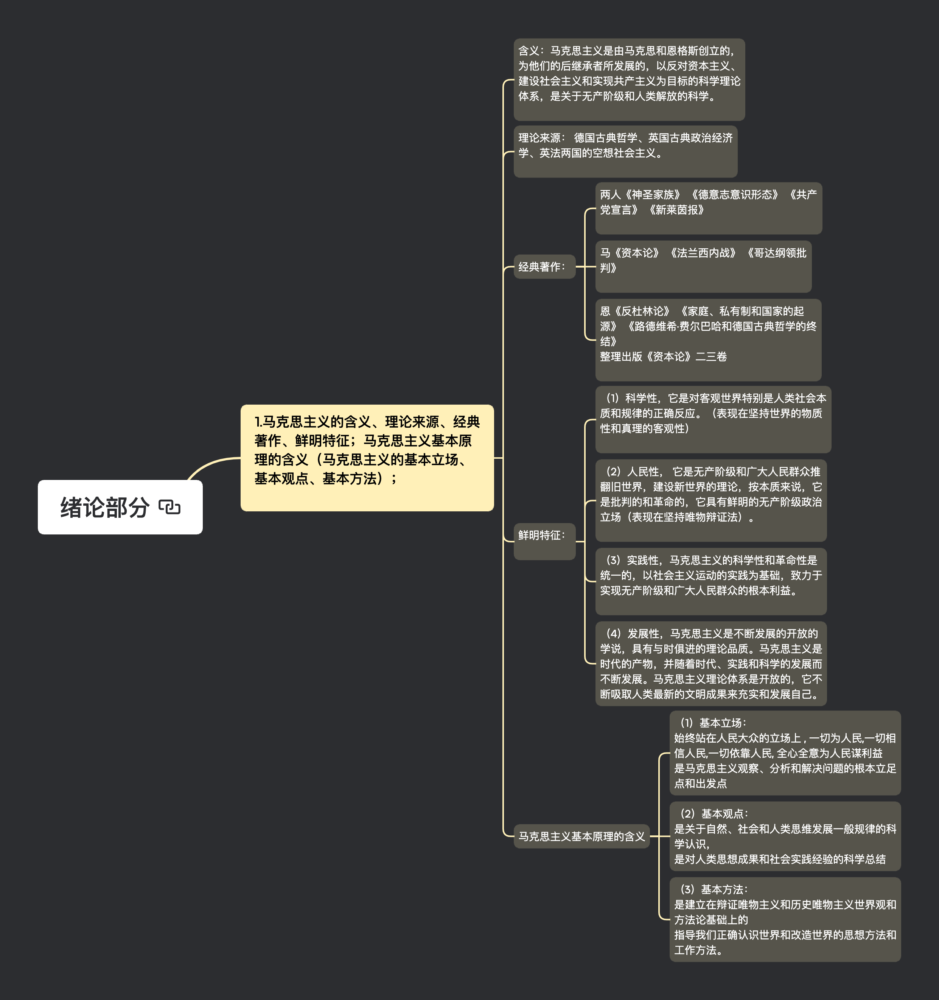
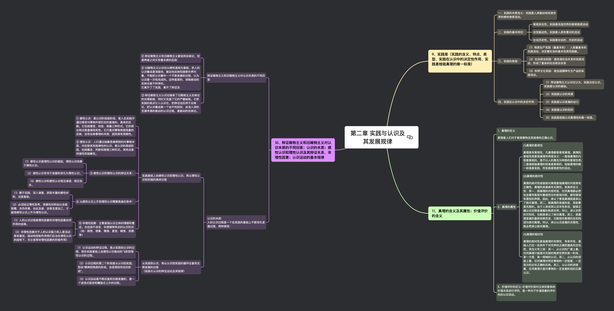
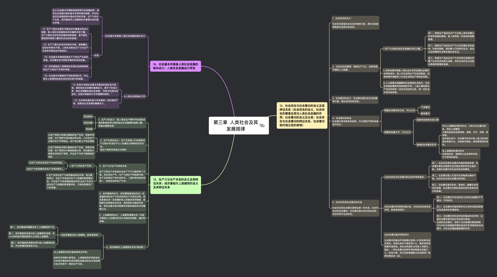
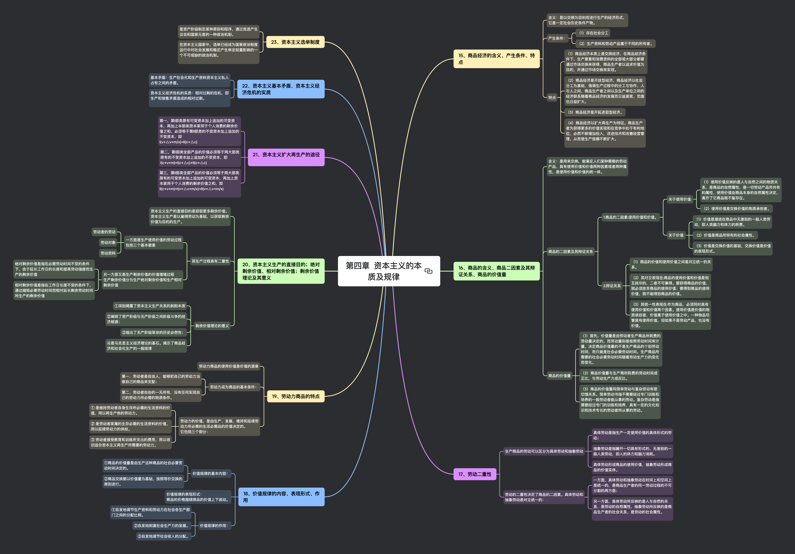
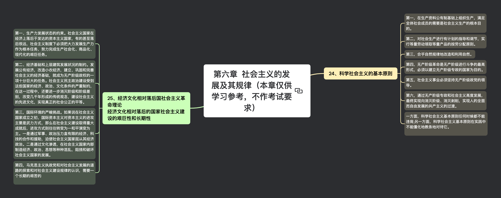
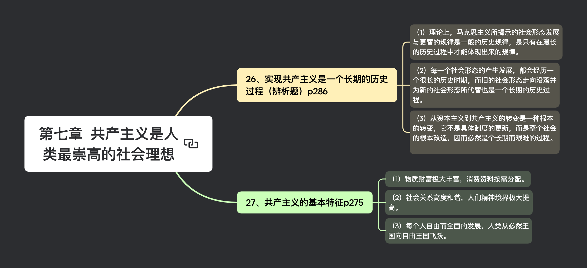

## 思维导图

### 绪论部分

### 第一章 世界的物质性及发展规律

### 第二章 实践与认识及其发展规律

### 第三章 人类社会及其发展规律

### 第四章 资本主义的本质及规律

### 第六章社会主义的发展及其规律（本章仅供学习参考，不作考试要求）

### 第七章 共产主义是人类最崇高的社会理想

## 大纲

### 绪论部分

#### 马克思主义的含义、理论来源、经典著作、鲜明特征；马克思主义基本原理的含义（马克思主义的基本立场、基本观点、基本方法）；

- 含义：马克思主义是由马克思和恩格斯创立的，为他们的后继承者所发展的，以反对资本主义、建设社会主义和实现共产主义为目标的科学理论体系，是关于无产阶级和人类解放的科学。

- 理论来源： 德国古典哲学、英国古典政治经济学、英法两国的空想社会主义。

- 经典著作：

  - 两人《神圣家族》 《德意志意识形态》 《共产党宣言》 《新莱茵报》

  - 马《资本论》 《法兰西内战》 《哥达纲领批判》

  - 恩《反杜林论》 《家庭、私有制和国家的起源》 《路德维希·费尔巴哈和德国古典哲学的终结》

整理出版《资本论》二三卷

- 鲜明特征：

  - （1）科学性，它是对客观世界特别是人类社会本质和规律的正确反应。（表现在坚持世界的物质性和真理的客观性）

  - （2）革命性， 它是无产阶级和广大人民群众推翻旧世界，建设新世界的理论，按本质来说，它是批判的和革命的，它具有鲜明的无产阶级政治立场（表现在坚持唯物辩证法）。

  - （3）实践性，马克思主义的科学性和革命性是统一的，以社会主义运动的实践为基础，致力于实现无产阶级和广大人民群众的根本利益。

- 马克思主义基本原理的含义

  - （1）基本立场：是马克思主义观察、分析和解决问题的根本立足点和出发点

  - （2）基本观点：是关于自然、社会和人类思维发展一般规律的科学认识，是对人类思想成果和社会实践经验的科学总结

  - （3）基本方法：是建立在辩证唯物主义和历史唯物主义世界观和方法论基础上的指导我们正确认识世界和改造世界的思想方法和工作方法。

### 第一章 世界的物质性及发展规律

#### 哲学的基本问题、哲学派别的划分及各派别的基本思想和代表人物（唯物主义 VS 唯心主义；可知论 VS 不可知论；唯物史观 VS 唯心史观；辩证法 VS 形而上学）

- 哲学的基本问题：存在和思维、物质和精神的关系问题

  - 存在和思维、物质和精神何者是第一性

  - 存在和思维、物质和精神是否具有同一性

- 哲学派别的划分及各派别的基本思想和代表人物

  - 存在和思维究竟谁是世界的本原，即物质和精神何者是第一性、何者是第二性的问题

    - 唯物主义

      存在决定思维

    - 唯心主义

      思维决定存在

  - 存在和思维是否具有同一性？我们关于我们周围世界的思想对这个世界本身的关系是怎样的？我们的思维能不能认识现实世界？我们能不能在我们关于现实世界的表象和概念中正确的反映现实?

    - 可知论

      认为思维和存在有同一性，人的意识能够认识客观世界及其规律

    - 不可知论

      认为思维和存在没有同一性，人的意识不能或不能彻底认识客观世界及其规律
      古希腊怀疑论者 皮浪，

  - 社会意识和社会存在的关系

    - 唯物史观

      社会存在决定社会意识

    - 唯心史观

      社会意识决定社会存在

  - 是否承认事物的内部矛盾是事物发展的根本动力

    - 辩证法

      承认事物的内部矛盾是事物发展的根本动力

    - 形而上学

      否认事物的内部矛盾是事物发展的根本动力

#### 物质观（物质的含义、意识的含义；物质与意识的辩证关系；主观能动性与客观规律性的统一）、运动观（运动的含义、运动与静止、运动与物质的关系）、时空观（时间的含义及其特点、空间的含义及其特点、时空与物质运动的关系）

- （一）物质观

  - 物质的含义：物质就是不依赖于人类意识而存在并能为人类的意识所反映的客观存在

  - 意识的含义：意识是人脑的机能和属性，是客观世界的主观映像

  - 物质与意识的辩证关系：

    - （一） 物质决定意识。物质对意识的决定作用表现在意识的起源、本质和作用上。

    - （二） 意识对物质具有反作用。

      - 1.意识活动具有目的性和计划性；

      - 2.意识活动具有创造性；

      - 3.意识具有指导实践改造客观世界的作用；

      - 4.意识具有控制人的行为和生理活动的作用。

    - （三） 主观能动性和客观规律性的统一

  - 主观能动性与客观规律性的统一：

    - 首先，尊重客观规律是正确发挥主观能动性的前提

    - 其次，只有充分发挥主观能动性，才能正确认识和利用客观规律。

    - 要正确发挥主观能动性，应注意：

      - 一，从实际出发，努力认识和把握事物的发展规律。

      - 二，实践是发挥人的主观能动性的途径。

      - 三，主观能动性的发挥还依赖于一定的物质条件和物质手段

- （二）运动观

  - 运动的含义：运动是标志一切事物和现象的变化及其过程的哲学范畴

  - 运动与静止：物质世界的运动是绝对的，而物质在运动的过程中又有某种相对的静止。相对静止是物质运动在一定条件下的稳定状态，包括空间的相对位置和事物的根本性质暂时未变这样两种运动的特殊状态。

    - 运动的绝对性体现了物质运动的变动性、无条件性，静止的相对性体现了物质运动的稳定性，有条件性。

    - 运动和静止相互依赖、相互渗透、相互包含，“静中有动，动中有静”。

    - 无条件的绝对运动和有条件的相对静止构成对立统一关系

  - 运动与物质的关系：物质和运动是不可分割的，运动是物质的运动，物质是运动着的物质，离开物质的运动和离开运动的物质都是不可想象的。

- （三）时空观

  - 时间的含义：是指物质运动的持续性、顺序性

    特点：一维性，即一去不复返

  - 空间的含义:是指物质运动的广延性、伸张性

    特点:三维性

  - 时空与物质运动的关系：

物质运动总是在一定的时间和空间中进行的，没有离开物质运动的“纯粹”时间和空间，也没有离开时间和空间的物质运动。

#### 世界的物质统一性原理

- （一）意识统一于物质。

- （二）人类社会也统一于物质。

  - 1.人类社会依赖于自然界，是整个物质世界的组成部分。

  - 2.人类谋取物资生活资料的实践活动虽然有意识作指导，但仍然是以物质力量改造物质力量的活动，仍然是物质活动。

  - 3.物质资料的生产方式是人类社会存在和发展的基础，集中体现着人类社会的物质性。

#### 唯物辩证法的总特征：联系与发展的观点（联系的含义、特点；发展的含义、实质等）

- 联系的含义：作为一个普遍的哲学范畴，联系是指事物内部各要素之间和事物之间相互影响、相互制约、相互作用的关系。

- 联系的特点：客观性、普遍性、多样性、条件性

- 发展的含义：变化的基本趋势是发展，发展是前进的上升的运动

- 发展的实质：

  - 新事物的产生和旧事物的灭亡。

  - 新事物是指合乎历史前进方向，具有远大前途的东西

  - 旧事物是指丧失历史必然性、日趋灭亡的东西

#### 唯物辩证法的五对范畴（原因与结果、现象与本质、内容与形式、必然性与偶然性、现实性与可能性）

- 原因与结果：这是揭示事物引起和被引起的一对范畴。

  原因是引起某种现象的现象，结果是被某种现象引起的现象。

  因果关系就是包括时间先后顺序在内的一种现象必然引起另一种现象的普遍联系

- 现象与本质：这是揭示事物外在联系和内在联系的一对范畴。

  现象是事物的外部联系和表面特征，本质是事物的根本性质和构成要素的内在联系。

  本质是现象的根据，现象是本质的表现

- 内容与形式：这是从构成要素和表现方式两个方面反映事物的一对范畴。

  内容是指构成事物的一切要素总和，形式是指把内容诸要素统一起来的结构或表现内容的方式

- 必然性与偶然性：这是揭示事物发生、发展和灭亡的不同趋势的一对范畴。

  必然性是事物联系和发展过程中合乎规律的确定不移的趋势，

  偶然性是联系和发展过程中并非必定如此的、不确定的趋势。

- 现实性与可能性:这是反映事物过去、现在和将来关系的一对范畴。

  现实性包括内在根据的、合乎必然性的存在，

  可能性是指包含在现实事物中、预示着事物发展前途的种种趋势。

#### 唯物辩证法的三大规律：对立统一规律（矛盾的同一性与斗争性的辩证关系；矛盾的普遍性与特殊性的辩证关系）、质量互变规律（质、量、度等范畴的含义；量变与质变的辩证关系）、否定之否定规律；对立统一规律是唯物辩证法的实质与核心

- 一、对立统一规律：是事物发展的根本规律，是唯物辩证法的实质与核心。

  ① 矛盾是反应事物内部和事物之间对立统一关系的哲学范畴。

  矛盾的同一性和斗争性是相互联结，相辅相成的，没有斗争性就没有同一性，没有同一性也没有斗争性，斗争性寓于同一性之中。

  ② 矛盾的普遍性与特殊性是辩证统一的关系，任何现实存在的事物的矛盾都是共性和个性的有机统一，共性寓于个性之中，没有离开个性的共性，也没有离开共性的个性。

- 二、质量互变规律：

  - ① 事物的联系和发展都采取量变和质变两种状态和形式。

  - ② 质是一事物区别于其他事物的内在规定，量是事物的规模、程度、速度等可以用数量关系表示的规定性。

    度是保持事物质的稳定性的数量界限，即事物的限度、幅度和范围。

    度的两端叫关节点或临界点，超出度的范围，此物就转化为他物。

    “度”启示我们，在认识和处理问题时要掌握适度的原则。

  - ③ 辩证关系：

    - （1）量变是质变的必要准备

    - （2）质变是量变的必然结果

    - （3）量变和质变是相互渗透的。

- 三、否定之否定规律：

  - ① 辩证否定观

    - （1）否定是事物的自我否定，是事物内部矛盾运动的结果

    - （2）否定是事物发展的环节，是新事物向旧事物的转变，是旧质到新质的飞跃

    - （3）否定是新旧事物联系的环节

    - （4）辩证否定的实质是“扬弃”即新事物对旧事物既批判又继承，既克服其消极因素又保留其积极因素。

  - ② 否定之否定规律揭示了事物发展的前进性与曲折性的统一。

  - ③ 按照否定之否定规律办事，要求我们对待一切事物都要采取科学分析的态度，反对肯定一切和否定一切的形而上学否定观。

#### 如何理解“以唯物辩证法为指导，不断增强思维能力”P53（五大思维）

- 一、思维能力包括：战略思维能力、历史思维能力、辩证思维能力、创新思维能力、底线思维能力

//战历辩创底

- 二、战略思维能力，就是高瞻远瞩、统揽全局，善于把握事物发展总体趋势和方向的能力。（树立大局意识，放眼未来。善于观大势，把握工作主权。开阔视野，紧跟时代步伐。）

- 三、历史思维能力就是以史为鉴、知古鉴今，善于运用历史眼光认识发展规律、把握前进方向、知道现实工作的能力。（善于运用历史智慧推进\*\*的思想观点。加强对中国历史，世界历史的学习，总结历史经验，把握认清规律，更好的走向未来。)

- 四、辩证思维能力就是承认矛盾，分析矛盾、解决矛盾，善于抓住关键，找准重点，洞察事物发展规律的能力。（坚持“两点论”,一分为二的看问题。要勇于进取，稳扎稳打。发展的眼光，全面，普遍联系）

- 五、创新思维能力就是破除迷信、超越过时的陈规，善于因时制宜、知难而进、开拓创新的能力。（勇于创新，不因循守旧，满足现状。有探索真知、求真务实的态度。百折不挠、勇往直前，不断积累经验。）

- 六、底线思维能力就是客观地设定最低目标，立足最低点，争取最大期望值的一种积极的思维能力.（基点放在出现较大的锋线上，做好对策，争取最好结果。要居安思危，增强忧患意识。）

### 第二章 实践与认识及其发展规律

#### 实践观（实践的含义、特点、类型、实践在认识中的决定性作用、实践是检验真理的唯一标准）

- 一、实践的本质含义：实践是人类能动地改造世界的感性物质活动。

- 二、实践的基本特征：

  - 第一，实践是改造世界的客观物质活动，具有直接现实性。

  - 第二，实践是人类有意识的活动，体现了自觉能动性。

  - 第三，实践是社会的、历史的活动，具有社会历史性。

- 三、实践的类型：

  - （1）物质生产实践（最基本的）：人类最基本的实践活动，决定着社会的基本性质和面貌。

  - （2）社会政治实践：是改造社会关系的实践活动，形成了复杂的社会政治关系

  - （3）科学文化实践：是创造精神文化产品的实践活动。

- 四、实践在认识中的决定作用：

  - （1）辩证唯物主义认识论认为，实践决定认识，实践是认识的基础。

  - （2）实践是认识的来源

  - （3）实践是认识发展的动力

  - （4）实践是认识的目的

  - （5）实践是检验认识真理性的唯一标准。

#### 辩证唯物主义和旧唯物主义对认识本质的不同回答；感性认识和理性认识及其辩证关系、非理性因素；认识运动的基本规律

- Ⅰ.辩证唯物主义和旧唯物主义对认识本质的不同回答：

  - ② 辩证唯物主义和旧唯物主义都坚持反映论，但是两者之间又有着本质的区别

  - ② 旧唯物主义认识论以感性直观为基础，把人的认识看成是消极地、被动地反映和接受外界对象，不能把认识看作一个不断发展的过程，认为认识是一次性完成的。这种直观的，消极被动的反映论是不科学的

  - ③ 辩证唯物主义认识论继承了旧唯物主义反映论的合理前提，同时又克服了它的严重缺陷。它把实践的观点引入认识论，把辩证法应用于反映论，把认识看成是一个由不知到知、由浅入深的充满矛盾的能动的认识过程，是能动的反映论。

- Ⅱ.感性认识和理性认识及其辩证关系、非理性因素：

  - ① 感性认识：是认识的低级阶段，是人在实践中通过感官对事物外部形态的直接的、具体的反映。它包括感觉、知觉、表象三种形式。它的突出特点是直接现实性。它只是对事物表面现象的反映，没有反映事物的本质，因而具体局限性。

  - ② 理性认识：人们通过抽象思维得到的对事物本质、内在联系和规律性的认识，是认识的高级阶段，包括概念、判断和推理三种形式。其特点是间接性和抽象性。

  - ③ 感性认识和理性认识的辩证关系：

    - （1）感性认识是理性认识的基础，理性认识依赖于感性认识。

    - （2）感性认识有待于发展和深化为理性认识。

    - （3）感性认识和感性认识相互渗透、相互包含。

  - ④ 从感性认识上升到理性认识需要具备的条件：

    - （1）勇于实践、深入调查，获取丰富的感性材料，这是基础。

    - （2）必须经过理性思考，将感性材料加以去粗取精、去伪存真、由此及彼、由表及里加工，才能将感性认识上升为理性认识。

  - ⑤ 非理性因素：主要是指认识主体的情感和意志。也包括不自觉、非逻辑等特点的认识形式（如：联想、想象、猜测、直觉、顿悟、灵感等）

    - （1）人的认识过程是理性因素和非理性因素协同作用的结果。

    - （2）非理性因素对于人的认识能力和人是活动具有激活，驱动和控制作用我们应当在理性认识的指导下，充分发挥非理性因素的积极作用）

- Ⅲ.认识运动的基本规律：

  - （1）认识运动的辩证过程，是从实践到认识的过程，即在实践基础上由感性认识能动的飞跃到理性认识的过程。

  - （2）认识过程的第二个阶段是从认识到实践，即由“精神到物质的阶段，由思想到存在的阶段”。

  - （3）认识运动是不断反复和无限发展的，是一个波浪式前进和螺旋式上升的过程。

#### 真理的含义及其属性；价值评价的含义

- 真理的定义

真理是人们对于客观事物及其规律的正确认识。

- 真理的属性

  - (1)真理的客观性

    真理具有客观性，凡真理都是客观真理。真理的客观性或客观真理有两层含义：一是指真理的内容是客观的，是不以人的意志为转移的客观世界;二是指检验真理的标准是客观的。检验真理的唯一标准是实践，而实践是物质性的活动。

  - (2)真理的绝对性

    真理的绝对性或者绝对真理是指真理的内容具有正确性，真理的发展具有无限性。其具体含义有：其一，就真理的内容而言，任何真理都必然包含着同客观对象相符合的客观内容，都同谬误有原则的界限。因此，承认了客观真理就是承认了绝对真理。其二，就真理的发展而言，其前景是无限的。由于人类依其认识本性来说，能够正确认识无限发展着的物质世界。所以，承认世界的可知性，也就是承认了绝对真理。其三，就真理发展的最终结果而言，无数相对真理的总和构成为绝对真理。所以，承认认识发展的无限性，就必然承认绝对真理。

  - (3)真理的相对性

    真理的相对性是指真理的有限性、有条件性，是指人们在一定条件下对世界的正确把握具有近似性。其含义有三层：其一，从认识的广度上看，任何真理只能是对无限的物质世界的某一阶段、某一方面、某一领域的认识。其二，从认识的深度上看，任何真理对特定事物的一定程度、一定层次的近似正确的反映。其三，从认识的进程看，任何真理只是对事物的一定发展阶段的正确认识。

- 价值评价的定义: 价值评价即对主体和客体的价值关系进行评判，是一种关于价值现象的评价性的认识活动。

### 第三章 人类社会及其发展规律

#### 社会存在与社会意识的含义及其辩证关系（社会存在的含义，社会存在的要素及其对人类社会发展的作用；社会意识的含义及分类；社会存在与社会意识的辩证关系、社会意识相对独立性的表现）

- 社会存在的含义：

社会存在是指社会生活的物质方面，是社会实践和物质生活条件的总和。

- 社会存在的要素：物质生产方式、自然地理环境和人口因素。

  - Ⅰ. 生产方式是社会历史发展的决定力量。

    - 其一，物质生产活动及生产方式是人类社会赖以存在和发展的基础，是人类其他一切活动的首要前提。

    - 其二，物质生产活动及生产方式决定着社会的结构、性质和面貌，制约着人们的经济生活、政治生活和精神生活等全部社会生活。

    - 其三，物质生产活动及生产方式的变化发展决定整个社会历史的变化发展，决定社会形态从低级向高级的更替和发展。

  - Ⅱ. 自然地理环境是人类社会生存和发展的必要和永恒的条件。是人们生活和生产的自然基础。自然地理环境提供了社会生活和生产资料的来源。

  - Ⅲ. 人口因素也是重要的社会物质生活条件，对社会发展起着制约和影响的作用。人是从事物质生产活动和其他一切社会活动的主体，是一切社会关系的承担者。

- 社会意识的含义：社会意识是社会生活的精神方面，是社会存在的反映。

- 社会意识的构成
  社会意识具有复杂的结构，可以按照不同的标准进行划分。

  - 根据社会意识的主体，可以分为个体意识、群体意识;

  - 根据其发展水平，可以分为

    - 低级的自发的社会心理

    - 高级的社会意识形式

      - 作为上层建筑的意识形式，又称为社会意识形态、观念上层建筑
        主要包括政治法律思想、道德、艺术、宗教、哲学等。
        在阶级社会中，社会意识形态本质上是占统治阶级的思想文化，反映经济基础，具有鲜明的阶级性。

      - 非上层建筑的意识形式
        包括语言学、逻辑学以及自然科学等。
        它不具有阶级性。

- 社会存在和社会意识的关系

  社会存在和社会意识是辩证统一的关系。社会存在决定社会意识，社会意识是社会存在的反映，并反作用于社会存在。

  - (1)社会存在对社会意识的决定作用表现在：

    - 其一，社会存在是社会意识内容的客观来源，社会意识是社会物质生活过程及其条件的主观反映。这是社会意识对社会存在的依赖性。

    - 其二，社会存在决定社会意识的性质。

    - 其三，随着社会存在的发展，社会意识也相应地或迟或早地发生变化和发展。

  - (2)社会意识有其相对独立性，对社会存在具有反作用。其具体表现有：

    - 其一，社会意识具有相对独立性，它与社会存在之间存在发展的不平衡性、不同步性。

    - 其二，社会意识内部各种形式之间的相互影响及各自具有的历史继承性。

    - 其三，社会意识对社会存在的能动的反作用。这是社会意识相对独立性的突出表现。先进的社会意识，反映了社会发展的客观规律，可以对社会发展起积极的促进作用;而落后的社会意识，对社会发展起着阻碍的作用。

  - (3)社会意识起作用的形式

社会意识的能动作用是通过指导人们的实践活动实现的。思想本身并不能实现什么，要实现思想就要诉诸实践。而社会实践的主体是人民群众。因此，一种社会意识发挥作用的程度及范围大小、时间久暂，同它实际掌握群众的深度和广度密切联系在一起。

#### 生产力与生产关系的含义及其辩证关系；经济基础与上层建筑的含义及其辩证关系

- 生产力的含义：是人类在生产事件中形成的改造和影响自然以使其适合社会需要的物质力量。

- 生产关系的含义：生产关系是人们在物质生产过程中形成的不以人的意志为转移的经济关系。

- 生产力与生产关系的关系

  生产力和生产关系是社会生产不可分割的两个方面。在社会生产中，生产力是生产的物质内容，生产关系是生产的社会形式，二者的有机结合和统一，构成社会的生产方式。

  - Ⅰ. 生产力决定生产关系：

    - (1)生产力状况决定生产关系的性质。

    - (2)生产力的发展决定生产关系的变化。

  - Ⅱ. 生产关系对生产力具有能动的反作用。其主要表现为：当生产关系适合生产力发展的客观要求时，它对生产力的发展起推动作用;当生产关系不适合生产力发展的客观要求时，它就会阻碍生产力的发展。

- 经济基础的含义：经济基础是指由社会一定发展阶段的生产力所决定的生产关系的总和。其实质是社会一定发展阶段上的基本经济制度，是制度化的物质社会关系。其表现形式是经济体制，即社会基本经济制度所采取的组织形式和管理方式。

- 上层建筑的含义：上层建筑是建立在一定经济基础之上的意识形态以及相应的制度、组织和设施。

- 经济基础与上层建筑的关系 辩证统一

  - (1)经济基础决定上层建筑。具体表现有：

    - 第一，经济基础的需要决定了上层建筑的产生;

    - 第二，经济基础的性质决定上层建筑的性质，有什么样的经济基础就有什么样的上层建筑;

    - 第三，经济基础的变更必然引起上层建筑的变革，并决定着其变革的方向。

  - (2)上层建筑对经济基础具有反作用。

这种反作用集中表现在，上层建筑保护和促进自己的经济基础的形成巩固和发展;同时反对和排除与自己性质不一致的生产关系。

#### 社会基本矛盾是人类社会发展的根本动力；人类社会发展动力学说

- Ⅰ.社会基本矛盾是人类社会发展的根本动力

  - 含义:社会基本矛盾就是指贯穿社会发展始终，规定社会发展过程的基本性质和基本趋势，并对社会历史发展起根本推动作用的矛盾。生产力和生产关系、经济基础和上层建筑的矛盾是社会的基本矛盾。

  - 作用:

    - （1）生产力是社会基本矛盾运动中最基本的动力因素，是人类社会发展和进步的最终决定力量。生产力是社会存在和发展的物质基础，是不能任意选择的物质力量和历史活动的前提。

    - （2）生产力是社会进步的根本内容，是衡量社会进步的根本尺度。人类社会是在生产力与生产关系的矛盾运动中前进的。

    - （3）社会基本矛盾特别是生产力和生产关系的矛盾，决定着社会中其他矛盾的存在和发展。

    - （4）经济基础和上层建筑的矛盾也会影响和制约生产力和生产关系的矛盾。

    - （5）社会基本矛盾具有不同的表现形式，并从根本上影响和促进社会形态的变化和发展。

- Ⅱ.人类社会发展动力学

  - （1）阶级斗争是社会基本矛盾在阶级社会中表现，是阶级社会发展的直接动力。离开了阶级斗争，就无法理解阶级社会发展。“没有对抗就没有进步。这是文明直到今天所遵循的规律。”

  - （2）社会革命是阶级斗争发展到一定阶级的产物，是推动社会发展的重要动力。

### 第四章 资本主义的本质及规律

#### 商品经济的含义、产生条件、特点

- 含义：是以交换为目的而进行生产的经济形式，它是一定社会历史条件产物。

- 产生条件：

  - （1）存在社会分工

  - （2）生产资料和劳动产品属于不同的所有者。

- 特点

  - （1）商品经济本质上是交换经济，在商品经济条件下，生产要素和消费资料的全部或大部分都要通过市场交换来获得，商品生产者以追求价值为目的，并通过市场交换来实现。

  - （2）商品经济是开放型经济，商品经济以社会分工为基础，强调生产过程中的分工与协作，人与人之间，商品生产者之间以及生产单位之间的经济联系随着商品经济的发展而日益紧密，范围也日益扩大。

  - （3）商品经济是开拓进取型经济。

  - （4）商品经济以扩大再生产为特征。商品生产者为获得更多的价值实现和在竞争中处于有利地位，必然不断增加投入，改进技术和改善经营管理，从而使生产规模不断扩大。

#### 商品的含义、商品二因素及其辩证关系、商品的价值量

- 含义：是用来交换，能满足人们某种需要的劳动产品，具有使用价值和价值两种因素或者两种属性，是使用价值和价值的统一体。

- 商品的二因素及其辩证关系

  - 1.商品的二因素:使用价值和价值。

    - 关于使用价值:

      - （1）使用价值反映的是人与自然之间的物质关系，是商品的自然属性，是一切劳动产品所共有的属性，使用价值由商品本身的自然属性决定，离开了商品它就不复存在。

      - （2）使用价值是交换价值的物质承担者。

    - 关于价值:

      - （1）价值是凝结在商品中无差别的一般人类劳动，即人类脑力和体力的耗费。

      - （2）价值是商品所特有地位社会属性。

      - （3）价值是交换价值的基础，交换价值是价值的表现形式。

  - 2.辩证关系

    - （1）商品的价值和使用价值之间是对立统一的关系。

    - （2）其对立表现在:商品的使用价值和价值是相互排斥的，二者不可兼得。要获得商品的价值，就必须放弃商品的使用价值；要得到商品的使用价值，就不能得到商品的价值。

    - （3）其统一性表现在:作为商品，必须同时具有使用价值和价值两个因素。使用价值是价值的物质承担者，价值寓于使用价值之中。一种物品尽管具有使用价值，但如果不是劳动产品，也没有价值。

- 商品的价值量

  - （1）首先，价值量是由劳动者生产商品所耗费的劳动量决定的，而劳动量则是按照劳动时间来计量。决定商品价值量的不是生产商品的个别劳动时间，而只能是社会必要劳动时间。生产商品所需要的社会必要劳动时间随着劳动生产力的变化而变化。

  - （2）商品价值量与生产商所耗费的劳动时间成正比，与劳动生产力成反比。

  - （3）商品的价值量同简单劳动与复杂劳动有密切饿关系。简单劳动书指不需要经过专门训练和培养的一般劳动者能从事的劳动。复杂劳动是指需要经过专门的训练和培养，具有一定的文化知识和技术专长的劳动者所从事的劳动。

#### 劳动二重性

- 生产商品的劳动可以区分为具体劳动和抽象劳动

  - 具体劳动是指生产一定使用价值的具体形式的劳动；

  - 抽象劳动是指撇开一切具有形式的、无差别的一般人类劳动，即人的体力和脑力消耗。

  - 具体劳动形成商品的使用价值，抽象劳动形成商品的价值实体。

- 劳动的二重性决定了商品的二因素。具体劳动和抽象劳动是对立统一的：

  - 一方面，具体劳动和抽象劳动在时间上和空间上是统一的，是商品生产者的同一劳动过程的不可分割的两方面；

  - 另一方面，具体劳动所反映的是人与自然的关系，是劳动的自然属性，抽象劳动所反映的是商品生产者的社会关系，是劳动的社会属性。

#### 价值规律的内容、表现形式、作用

- 价值规律的基本内容：

- ① 商品的价值量是由生产这种商品的社会必要劳动时间决定的。

- ② 商品交换要以价值量为基础，按照等价交换的原则进行。

- 价值规律的表现形式：
  商品的价格围绕商品的价值上下波动。

- 价值规律的作用：

  - ① 自发地调节生产资料和劳动力在社会各生产部门之间的分配比例。

  - ② 自发地刺激社会生产力的发展。

  - ③ 自发地调节社会收入的分配。

#### 劳动力商品的特点

- 劳动力商品的使用价值是价值的源泉

- 劳动力成为商品的基本条件：

  - 第一、劳动者是自由人，能够把自己的劳动力当做自己的商品来支配；

  - 第二、劳动者自由的一无所有，没有任何实现自己的劳动力所必需的物质条件。

- 劳动力的价值，是由生产、发展、维持和延续劳动力所必需的生活必需品的价值决定的。
  它包括三个部分：

  - ① 是维持劳动者自身生存所必需的生活资料的价值，用以再生产他的劳动力。

  - ② 是劳动者家属的生存必需的生活资料的价值，用以延续劳动力的供给。

  - ③ 劳动者接受教育和训练所支出的费用，用以培训适合资本主义再生产所需要的劳动力。

#### 资本主义生产的直接目的；绝对剩余价值、相对剩余价值

- 资本主义生产的直接目的是获取更多剩余价值。

- 资本主义生产是以雇佣劳动为基础，以获取剩余价值为目的的生产。

- 其生产过程具有二重性：一方面是生产使用价值的劳动过程；另一方面又是生产剩余价值的价值增殖过程。

- 绝对剩余价值是指在必要劳动时间不变的条件下，由于延长工作日的长度和提高劳动强度而生产的剩余价值。

- 相对剩余价值是指在工作日长度不变的条件下，通过缩短必要劳动时间而相对延长剩余劳动时间所生产的剩余价值

#### 资本主义扩大再生产的途径

- 第一，第 Ⅰ 部类原有可变资本加上追加的可变资本，再加上本部类资本家用于个人消费的剩余价值之和，必须等于第 Ⅱ 部类的不变资本加上追加的不变资本，即
  Ⅰ(v+△v+m/x)=Ⅱ(c+△c)

- 第二，第 Ⅰ 部类全部产品的价值必须等于两大部类原有的不变资本加上追加的不变资本，即
  Ⅰ(c+v+m)=Ⅰ(c+△c)+Ⅱ(c+△c)

- 第三，第 Ⅱ 部类全部产品的价值必须等于两大部类原有的可变资本加上追加的可变资本，再加上资本家用于个人消费的剩余价值之和，即
  Ⅱ(c+v+m)=Ⅰ(v+△v+m/x)+Ⅱ(v+△v+m/x)

#### 资本主义基本矛盾、资本主义经济危机的实质

- 基本矛盾：生产社会化和生产资料资本主义私人占有之间的矛盾。

- 资本主义经济危机的实质：相对过剩的危机，即生产和销售矛盾造成的相对过剩。

#### 资本主义选举制度

- 是资产阶级制定某种原则和程序，通过竞选产生议会和国家元首的一种政治机制。

- 在资本主义国家中，选举已经成为国家政治制度运行中对社会发展和稳定产生举足轻重影响的一个不可或缺的政治机制。

### 第五章 资本主义的发展及其趋势

### 第六章 社会主义的发展及其规律（本章仅供学习参考，不作考试要求）

#### 科学社会主义的基本原则

- 第一，在生产资料公有制基础上组织生产，满足全体社会成员的需要是社会主义生产的根本目的。

- 第二，对社会生产进行有计划的指导和调节，实行等量劳动领取等量产品的按劳分配原则。

- 第三，合乎自然规律地改造和利用自然。

- 第四，无产阶级革命是无产阶级进行斗争的最高形式，必须以建立无产阶级专政的国家为目的。

- 第五，社会主义事业必须坚持无产阶级政党的领导。

- 第六，通过无产阶级专政和社会主义高度发展，最终实现向消灭阶级、消灭剥削，实现人的全面而自由发展的共产主义的过渡。

- 一方面，科学社会主义基本原则任何时候都不能违背;另一方面，科学社会主义基本原则在实践中不能僵化地教条地对待它。

#### 经济文化相对落后国社会主义革命理论

经济文化相对落后的国家社会主义建设的艰巨性和长期性

- 第一、生产力发展状态的约束。社会主义国家在经济上落后于发达的资本主义国家，有的甚至落后很远，社会主义制度下必须把大力发展生产力作为根本任务，努力完成生产社会化、商品化、现代化的艰巨任务。

- 第二、经济基础和上层建筑发展状况的制约。发展公有经济，改造小农经济，建立、巩固和完善社会主义的经济基础，就成为无产阶级政权的一项十分巨大的任务。社会主义民主政治建设受到这些国家的经济、政治、文化条件的严重制约，在这一过程中，还要进一步消灭阶级和阶级差别，改变几千年形成的传统观念，建设社会主义的先进文化，实现真正的社会公正的平等。

- 第三，国际环境的严峻挑战。如果说在社会主义国家成立之初，国际资本主义对资本主义的进攻主要是武力方式，那么在社会主义建设取得重大成就后，进攻方式则往往转变为一和平演变为主。一是通过军事、政治压力盒有限的经济、科技的合作和援助，迫使社会主义国家屈从其经济政治。二是通过文化渗透，在社会主义国家内部制造经济、政治、思想等种种混乱，阻挠和破坏社会主义国家的发展。

- 第四，马克思主义执政党和对社会主义发展的道路的探索和对社会主义建设规律的认识，需要一个长期的艰苦的

### 第七章 共产主义是人类最崇高的社会理想

#### 实现共产主义是一个长期的历史过程（辨析题）p286

- （1）理论上，马克思主义所揭示的社会形态发展与更替的规律是一般的历史规律，是只有在漫长的历史过程中才能体现出来的规律。

- （2）每一个社会形态的产生发展，都会经历一个很长的历史时期，而旧的社会形态走向没落并为新的社会形态所代替也是一个长期的历史过程。

- （3）从资本主义到共产主义的转变是一种根本的转变，它不是具体制度的更新，而是整个社会的根本改造，因而必然是个长期而艰难的过程。

#### 共产主义的基本特征 p275

- （1）物质财富极大丰富，消费资料按需分配。

- （2）社会关系高度和谐，人们精神境界极大提高。

- （3）每个人自由而全面的发展，人类从必然王国向自由王国飞跃。
